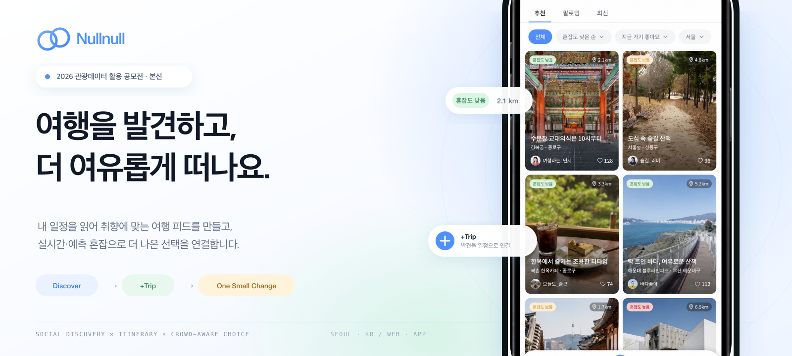
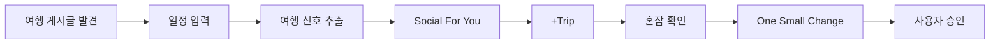
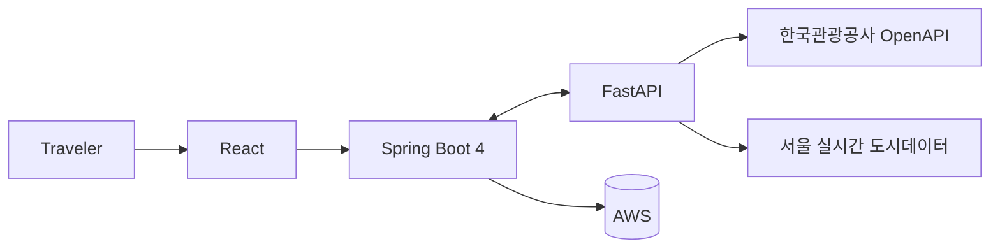

<p align="center">
  
</p>

<p align="center">
  
  
  
</p>

<p align="center">
  <strong>내 일정을 읽고, 취향으로 이어지는 여행 SNS.</strong><br>
  여행 피드에서 발견한 장소를 일정과 연결하고,<br>
  실시간·예측 혼잡 데이터로 더 여유로운 선택을 돕습니다.
</p>

---

## Nullnull

> [!NOTE]
> 한국관광공사 관광콘텐츠랩을 통해 출품하는 **2026 관광데이터 활용 공모전 ②-2 웹·앱 구현 부문 본선 작품**입니다.

Nullnull은 **방한 외국인 자유여행객의 특정 관광지 집중과 오버투어리즘 완화**를 주제로 하는 일정 연동형 Social Travel Platform입니다.

비슷한 SNS 콘텐츠가 여행자를 같은 장소와 날짜로 이끄는 문제에 주목했습니다. Nullnull은 여행지를 발견하는 피드, 이미 만들어 둔 일정, 실시간·예측 혼잡 정보를 연결해 사용자가 직접 더 여유로운 시간과 장소를 선택하게 합니다.

> ### 가고 싶은 곳은 그대로, 붐비는 순간만 비껴가세요.

## From discovery to action



| Experience | What it does |
|---|---|
| **Social For You** | 일정에서 확인한 관심사·방문 예정지·빈 시간을 바탕으로 여행 Feed를 개인화합니다. |
| **Trip Signal Extraction** | 붙여 넣은 일정에서 장소·날짜·시간·Must Visit·변경 가능한 구간을 추출합니다. |
| **+Trip** | Feed에서 발견한 관광지를 별도 검색 없이 기존 일정에 연결합니다. |
| **Live & Forecast** | 혼잡·날씨·거리·다음 일정까지 남은 시간과 데이터 상태를 함께 보여줍니다. |
| **One Small Change** | 여행 전체를 다시 짜지 않고, 사용자가 승인할 수 있는 최소 변경안을 제안합니다. |

## Time × Space distribution

| 시간 분산 | 공간 분산 |
|---|---|
| 동일 관광지의 날짜별 상대 혼잡을 비교합니다. | 같은 비교 범위에서 검수된 더 여유로운 관광지를 탐색합니다. |
| Must Visit을 유지한 최소 날짜 변경을 제안합니다. | Feed 또는 Live에서 사용자가 직접 후보를 선택합니다. |
| 전후 Crowd Level을 비교하고 승인 후에만 반영합니다. | `+Trip` 또는 명시적 교체로 최종 결정권을 보존합니다. |

## Planned architecture

<p>
  
  
  
  
</p>



| Layer | Technology | Responsibility |
|---|---|---|
| **Frontend** | React | 소셜 Feed, 일정 편집, 혼잡 Context와 반응형 사용자 경험 |
| **Core Backend** | Spring Boot 4 | 사용자·여행·콘텐츠 도메인, 인증, 핵심 API와 비즈니스 규칙 |
| **Intelligence API** | FastAPI | 일정 파싱, 추천 근거 생성, 혼잡 비교와 제안 로직 |
| **Cloud** | AWS | 애플리케이션 배포, 데이터·파일 저장, 캐시, 모니터링과 확장 |

> 기술 구성과 AWS 세부 서비스는 첫 실행 버전의 요구사항과 트래픽 검증 후 확정합니다.

## External APIs

| Phase | API | Use |
|---|---|---|
| **P0** | 한국관광공사 **KorService2** | 관광지 검색·상세·이미지, 위치기반 후보와 공식 관광정보 Feed |
| **P0** | **관광지 집중률 방문자 추이 예측 정보** | 동일 관광지의 날짜별 상대 혼잡과 변경 전후 Crowd Level 비교 |
| **P0** | **TarRlteTarService1** 연관 관광지 정보 | 사전 검수된 주변·연관 관광지 후보 생성 |
| **P0** | **서울 실시간 도시데이터** | 지원 권역의 관측 혼잡·날씨 Context와 더 여유로운 동일 그룹 후보 탐색 |
| **P1** | 한국관광공사 **EngService2** | 영문 관광정보와 한영 Canonical POI 연결 |
| **P1** | 기상청 단기·중기예보 | 유효 예보 구간의 시간 변경과 실내·야외 제안 |

> 실제 Endpoint·쿼터·응답 필드는 최신 공식 명세와 계약 테스트로 확정하며, 저장소에는 인증키를 커밋하지 않습니다.

## Core algorithms

| Algorithm | How it works |
|---|---|
| **Itinerary Understanding** | 한국어 날짜·시간·장소 표현을 정규화하고 일정 항목, 관심사, Must Visit, 예약 잠금과 빈 시간을 추출합니다. P0는 외부 LLM 없이 결정적 규칙과 장소 사전을 사용하며 결과는 사용자가 확정합니다. |
| **Canonical POI Resolver** | 공식 ID·좌표·정규화 명칭·주소를 이용해 관광공사 POI와 서울 Live 권역을 내부 UUID에 연결하고 매핑 신뢰도를 저장합니다. |
| **Feed Ranking** | 후보를 수집한 뒤 중복·닫힘·숨김·범위 밖 항목을 제거하고 `Interest + TripFit + DateFit + DiscoveryBonus + DistributionBonus - CrowdPenalty - RepetitionPenalty`로 점수화합니다. |
| **Diversity Reranker** | 상위 점수만 나열하지 않고 MMR 또는 권역·카테고리 슬롯 믹싱으로 같은 장소와 지역의 연속 노출을 줄입니다. |
| **Crowd Normalizer** | 각 출처의 값을 Crowd Level 1–5와 신뢰도로 정규화합니다. 비교는 동일 POI 또는 동일 source·scope·normalization group 안에서만 허용합니다. |
| **Live Detour Selector** | 같은 비교그룹·관측시각 안에서 더 낮은 Crowd Level 후보만 hard filter로 선별하며, 유효 후보가 없으면 추천을 만들지 않습니다. |
| **One Small Change** | 여행 기간·잠금·운영·이동 제약을 통과하면서 Crowd Level이 개선되는 동일 POI 날짜 변경을 탐색합니다. 사용자가 승인한 경우에만 원자적으로 반영합니다. |

```text
Candidate Sources → Eligibility Filter → Rule-based Scoring
                  → Diversity Reranking → Explainable Reasons
```

> [!NOTE]
> **Recommendation design reference**  
> Nullnull의 추천 파이프라인은 Twitter가 2023년 공개한 [`twitter/the-algorithm`](https://github.com/twitter/the-algorithm)의 **후보 생성 → 필터링 → 점수화 → 재정렬** 구조를 설계 기반으로 활용합니다. 다만 소셜 그래프와 트윗을 전제로 한 원본 구현을 그대로 이식하지 않고, 관광 POI·여행 일정·혼잡 분산에 필요한 신호와 규칙으로 독립 구현합니다. X의 사용자 데이터, 학습 모델, 가중치 및 소스 코드는 사용하지 않습니다.

| Original concept | Nullnull implementation |
|---|---|
| Candidate Sources | 관광정보·일정·관심사·위치·연관 POI로 후보를 구성합니다. |
| Eligibility Filters | 운영 여부·거리·일정 제약·숨김·중복·데이터 신뢰도를 검사합니다. |
| Ranking | 취향 적합도·일정 적합도·혼잡도·발견성과 분산 효과를 함께 점수화합니다. |
| Reranking | MMR과 카테고리·권역 믹싱으로 반복 노출을 줄이고 선택지를 다양화합니다. |
| Feedback Signals | 클릭·저장·`+Trip`·사용자 승인 신호를 이후 추천 개선에 반영합니다. |

> 원본 저장소의 코드를 직접 도입하는 경우에는 해당 저장소의 **AGPL-3.0 라이선스**와 고지 의무를 별도로 검토합니다.

## Data principles

- 추천에는 **근거·출처·기준시각·데이터 범위**를 함께 표시합니다.
- `실시간 관측`, `과거 관측 재생`, `공식 예측`, `장기 참고`를 구분합니다.
- 서로 다른 데이터를 하나의 관측 혼잡값처럼 합치지 않습니다.
- 사용자가 승인하기 전에는 일정을 자동으로 변경하지 않습니다.
- 검증 없이 실제 관광객 분산 성과를 주장하지 않습니다.

## Scope

| Phase | Focus |
|---|---|
| **Competition P0** | 한국어 핵심 흐름, Social For You, `+Trip`, 서울 Live, 혼잡 예보, One Small Change |
| **Next** | 영어 UI, 영문 관광정보 검수, UGC 경험 공유, 지원 지역·데이터 확대 |

> [!IMPORTANT]
> 이 저장소는 **공모전 본선 제출 버전을 위한 재구축 단계**입니다. 첫 실행 버전과 함께 설치, 환경 변수, API 설정, 테스트 및 배포 방법을 업데이트합니다.

---

<p align="center">
  <strong>Nullnull</strong><br>
  Discover → Connect → Understand → Act<br><br>
  Maintained by <a href="https://github.com/yutakdv">@yutakdv</a>
</p>
