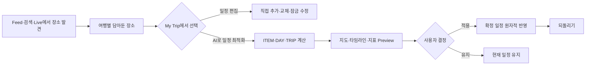
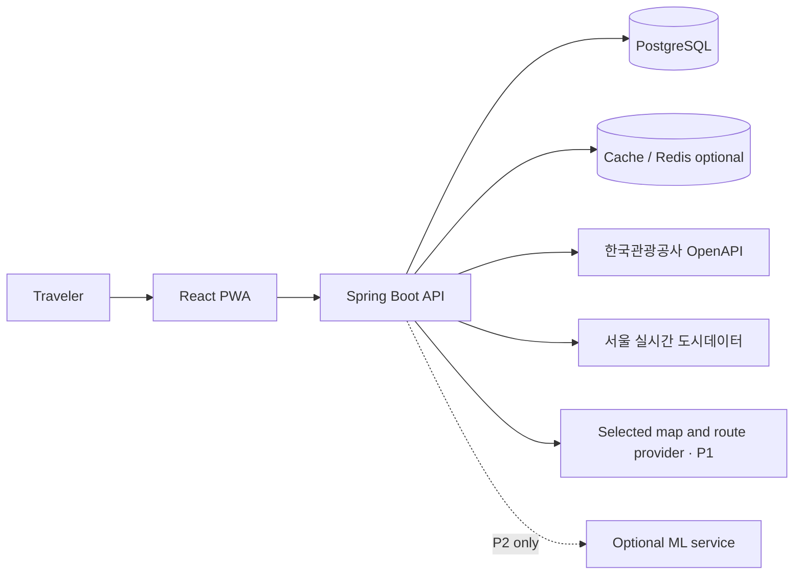

  

  
  
  

  <strong>내 일정을 읽고, 취향으로 이어지는 여행 SNS.</strong> 
  발견한 장소는 가볍게 담아두고, 
  직접 편집하거나 검증된 AI 최적화안을 승인해 더 여유로운 여행을 만듭니다.

---

## Nullnull

> [!NOTE]
> 한국관광공사 관광콘텐츠랩을 통해 출품하는 **2026 관광데이터 활용 공모전 ②-2 웹·앱 구현 부문 본선 작품**입니다.

Nullnull은 방한 외국인 자유여행객의 특정 관광지 집중과 오버투어리즘 완화를 주제로 하는 **일정 연동형 Social Travel Platform**입니다.

여행 Feed에서 발견한 장소, 이미 만들어 둔 일정, 실시간·예측 혼잡 정보와 이동 조건을 하나의 흐름으로 연결합니다. Feed의 `+`는 일정을 즉시 바꾸지 않고 선택한 여행의 `담아둔 장소`에 후보를 저장합니다. 사용자는 My Trip에서 직접 편집하거나, AI가 제시한 변경 전·후 지도·타임라인·지표를 확인하고 승인합니다.

> ### 가고 싶은 곳은 지키고, 날짜·시간·동선은 더 여유롭게.

## Core flow

일정이 없어도 일반 여행 Feed를 먼저 둘러볼 수 있습니다. 기존 일정은 텍스트 붙여넣기, `.txt`·`.csv`·`.xlsx` 파일 또는 직접 입력으로 가져옵니다. 일정이 없다면 지역·날짜·관심사·선택적 Must Visit만 입력해 Feed를 시작하고, P1에서 전체 일정 생성으로 이어집니다.

## Product states

| State | Meaning |
|---|---|
| **Saved Post** | 여행과 무관한 게시글 북마크입니다. |
| **Trip Candidate · 담아둔 장소** | 특정 여행에 담았지만 날짜·시간이 정해지지 않은 후보입니다. 저장만으로 일정은 바뀌지 않습니다. |
| **Trip Item · 내 일정** | 날짜·시간·순서가 확정된 일정 항목입니다. 수동 저장 또는 최적화 승인으로만 변경됩니다. |

## Main experiences

| Experience | What it does |
|---|---|
| **Social For You** | 사용자가 확인한 관심사·방문 예정지·빈 시간을 바탕으로 여행 Feed를 개인화합니다. |
| **Trip Signal Extraction** | 텍스트·TXT·CSV·XLSX·직접 입력에서 장소·날짜·시간·Must Visit·잠금·빈 시간을 정리하고 사용자가 확정합니다. |
| **Trip Candidate** | Feed·검색·Live의 장소를 여행별 후보 보관함에 저장합니다. 북마크와 확정 일정은 별도 상태입니다. |
| **Manual Trip Edit** | 후보 추가·유사 장소 교체·순서·날짜·시간과 Must Visit·날짜 고정·시간 고정을 직접 수정합니다. |
| **AI Itinerary Optimization** | 현재 ITEM·DAY·TRIP 범위를 계산하고 변경 전·후 지도·타임라인·거리·시간·혼잡 지표를 보여준 뒤 승인을 받습니다. |
| **Live & Forecast** | 혼잡·날씨·거리·다음 일정까지 남은 시간과 데이터 상태를 분리해 보여주고 DAY Preview로 연결합니다. |

## Editing and optimization rules

- `♥ Must Visit`, `날짜 고정`, `시간 고정`, `예약 고정`은 서로 독립된 제약입니다.
- 담아둔 장소는 현재 일정과 `EXACT / SIMILAR / NONE`으로 비교됩니다.
- SIMILAR 후보는 자동 교체하지 않고 `교체 / 둘 다 유지`를 묻습니다.
- AI 최적화는 현재 보이는 일정 범위를 기본 입력으로 사용합니다.
- `담아둔 대안도 포함`은 기본 OFF이며, 사용자가 켠 경우에만 목적지 교체를 탐색합니다.
- 승인 전에는 확정 일정이 바뀌지 않습니다.
- 적용은 change set 전체가 검증됐을 때만 원자적으로 처리되며 되돌릴 수 있습니다.
- LLM은 선호 해석과 근거 설명을 돕고, POI·영업·혼잡·경로·도착 가능성은 서버 규칙과 출처가 있는 데이터가 검증합니다.

## Time × space distribution

| 시간 분산 | 공간·동선 분산 |
|---|---|
| 동일 관광지의 같은 예측 발행 회차에서 날짜별 상대 혼잡을 비교합니다. | 같은 비교그룹·관측 배치에서 검수된 더 여유로운 관광지를 탐색합니다. |
| P0 ITEM은 Must Visit을 유지한 날짜 변경을 완결합니다. | Live 후보는 먼저 여행에 담고 사용자가 편집·최적화에서 반영 여부를 결정합니다. |
| P1은 시간창과 순서를 실제 경로 정보로 검증합니다. | P1 DAY/TRIP은 이동시간·거리·혼잡을 함께 최적화하고 지도에서 전후를 비교합니다. |

## Delivery scope

P0와 P1은 공모전 포함 여부가 아니라 구현 순서입니다. **공모전 최종 범위는 P0+P1**이며 P0 회귀 Gate를 먼저 닫은 뒤 P1을 Feature Flag 뒤에서 이어서 구현합니다.

| Phase | Focus |
|---|---|
| **P0 MVP** | 한국어 핵심 흐름, 일정 입력·확인, Social For You, TripCandidate, My Trip 수동 편집, 독립 잠금, ITEM Preview·승인·되돌리기, 서울 Live·REPLAY |
| **P1 Competition Extension** | 실제 route matrix 기반 DAY/TRIP 지도·타임라인 최적화, opt-in 후보 교체, 전체 일정 생성, Live Re-plan, 검색·알림·UGC·영어 중 E2E 통과 기능 |
| **P2** | 전국·일본어·중국어, 학습형 랭킹, RTO·DMO 연계와 동의 기반 현장 효과 검증 |

## Planned architecture

| Layer | Responsibility |
|---|---|
| **React PWA** | Social Feed, 일정 보기·편집, 후보 Drawer, Optimization Preview, 반응형·접근성 UI |
| **Spring Boot API** | 인증, TripCandidate·TripItem, 잠금·version, 외부 API orchestration, 결정적 제약·경로 최적화, 원자적 Decision |
| **PostgreSQL** | 여행·후보·확정 일정, 매핑, 최적화 실행·결정·되돌리기 이력 |
| **Scheduler / Worker** | 혼잡·예측 후보은행, REPLAY readiness, 캐시·쿼터·Source Registry 갱신 |
| **Optional ML service** | 충분한 데이터와 검증 Gate를 통과한 P2 학습 랭킹만 담당 |

## External data

| Phase | API | Use |
|---|---|---|
| **P0** | 한국관광공사 **KorService2** | 관광지 상세·이미지·검색·공식 관광정보 Feed와 검수 후보 |
| **P0** | **관광지 집중률 방문자 추이 예측 정보** | 동일 POI의 날짜별 상대 혼잡과 ITEM Preview |
| **P0** | **TarRlteTarService1** | 사전 검수된 주변·연관 관광지 후보 |
| **P0** | **서울 실시간 도시데이터** | 지원 권역의 현재 관측·REPLAY와 같은 비교그룹의 공간 후보 |
| **P1** | 확정할 **지도·경로 API 1종** | 보행·대중교통 route matrix, 거리·ETA, DAY/TRIP 지도 Preview |
| **P1** | 한국관광공사 **EngService2** | 검수된 영문 관광정보와 한영 Canonical POI |
| **P1** | 기상청 단기·중기예보 | 유효 구간의 시간·실내외 변경 보조 근거 |

실제 Endpoint·쿼터·응답 필드는 최신 공식 명세와 계약 테스트로 확정합니다. 배포 버전에서 실제 호출한 API만 제출물에 기재하며 인증키는 저장소에 커밋하지 않습니다.

## Core algorithms

| Algorithm | How it works |
|---|---|
| **Itinerary Understanding** | 한국어 텍스트·TXT·CSV·XLSX를 공통 일정 형식으로 정규화하고 항목·관심사·Must Visit·예약 잠금·빈 시간을 사용자가 확인하게 합니다. P0는 외부 LLM 없이 결정적 규칙을 사용합니다. |
| **Canonical POI Resolver** | 공식 ID·좌표·명칭·주소로 관광공사 POI와 서울 Live 권역을 내부 UUID에 연결하고 매핑 신뢰도를 보존합니다. |
| **Feed Ranking & Diversity** | 자격 필터 후 관심사·일정 적합·발견성·분산 가치를 점수화하고 동일 POI·권역의 반복 노출을 제한합니다. |
| **Candidate Match Engine** | 담아둔 장소와 현재 일정을 Canonical ID와 검수된 관계로 `EXACT / SIMILAR / NONE` 판정하고 이유를 제공합니다. |
| **Live Detour Selector** | 같은 source·scope·comparison group·snapshot 안에서 더 낮은 원천 서수와 CandidateRelation Gate를 통과한 후보만 제공합니다. |
| **Optimization Engine** | P0 ITEM 날짜 변경에서 시작해 P1 DAY/TRIP의 시간·순서·경로·opt-in 후보 교체를 탐색합니다. 잠금과 운영·접근성·혼잡·route matrix를 hard constraint로 검증합니다. |
| **Decision & Rollback** | 최신 Trip version과 데이터를 재검증한 뒤 change set 전체를 한 트랜잭션으로 적용하거나 전혀 적용하지 않고, append-only 이력으로 되돌립니다. |

## Data principles

- 추천과 변경안에는 **근거·출처·기준시각·데이터 범위**를 함께 표시합니다.
- `실시간 관측`, `과거 관측 재생`, `공식 예측`, `범위 밖 정성 Context`를 구분합니다.
- 서로 다른 제공처·범위의 값을 하나의 절대 혼잡 순위로 섞지 않습니다.
- Feed의 후보 저장과 확정 일정 변경을 분리합니다.
- 사용자가 승인하기 전에는 AI가 일정을 자동으로 변경하지 않습니다.
- 검증 없이 실제 관광객 분산 성과를 주장하지 않습니다.

## Documentation

- [통합 개발기획안 v6.0](./관광객_분산형_SNS_여행플래너_통합_개발기획안_v6_0.md)
- [Figma 화면 수정 명세 v6.0](./docs/design/피그마_디자인_틀_수정.md)
- [Nullnull — Wireframes](https://www.figma.com/design/C3tTNClo9JH8tb4qpQgP61/Nullnull-%E2%80%94-Wireframes?node-id=72-243&p=f)

> [!IMPORTANT]
> 이 저장소는 공모전 본선 제출 버전을 위한 재구축 단계입니다. 화면이 확정되면 최종 Figma와 기획안을 다시 대조하고, 실제 구현 범위에 맞춰 설치·환경 변수·테스트·배포 방법을 추가합니다.

---

  <strong>Nullnull</strong> 
  Discover → Save → Edit or Optimize → Review → Approve  
  Maintained by <a href="https://github.com/yutakdv">@yutakdv</a>

