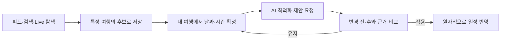

# 널널 Nullnull

> 혼잡한 명소를 그대로 따라가는 대신, 발견한 장소를 여행별 후보로 모으고 검증된 혼잡·경로 근거로 더 나은 일정을 선택하는 모바일 여행 플래너

[Figma UI](https://www.figma.com/design/C3tTNClo9JH8tb4qpQgP61/Nullnull-UI-Design?node-id=386-257&p=f&t=S1EgamFkCak0FCZy-0) · [GitHub](https://github.com/yutakdv/Nullnull) · [통합 기획안](과제2_널널_웹앱구현_기획서_Final.md)


## 현재 단계

지금은 **기능 코드 착수 전 제품·계약·운영 기준을 동결하는 단계**다. Figma의 3개
페이지, `02 UI Design`의 현재 구현 화면 52개, `01 Components`의 최상위 컴포넌트
49개를 개발 문서에 연결했다. 다만 2026-09-05 PM 감사에서 P0 디자인 불일치 9건이
확인되어 [Figma 수정 요청](docs/design/FIGMA_CHANGE_REQUESTS.md)이 닫히기 전 전체
디자인을 구현 승인 상태로 보지 않는다. 화면 수치는 Figma, 동작과 데이터 의미는
OpenAPI·이벤트 스키마·제품 문서를 기준으로 구현한다.

현재 저장소는 과거 prototype을 제외한 **목표 서비스의 문서·계약 기준선**이다. 운영 구현은 `apps/web`, `apps/api`, `packages/api-client`, `infra` 구조를 M0 scaffold PR에서 만들고, 계약이 확정된 vertical slice부터 구현한다. `.nullnull-target-stack`이 추가되기 전 통합 검사는 문서 기준선만 검증하며, 그 뒤에는 Docker 통합 검사를 생략할 수 없다.

## 2026 관광데이터 활용 공모전 ②-2 웹·앱 구현 부문 릴리스

- 공식 1차 자료 제출 마감은 **2026-09-21 16:00(KST)**이다. 팀 내부 제출 목표는 2026-09-20 16:00, code freeze는 2026-09-19이다.
- 웹 URL은 외부망·익명창에서 열려야 하며 제출 선택은 `로그인 불필요`다. P0 핵심 흐름은 별도 계정 없이 완결한다.
- 한국관광공사 OpenAPI를 최종 서비스에서 실제로 호출한다. 파일 데이터나 전체 로컬 복제만으로 필수 활용을 대체하지 않는다.
- 브라우저에 서비스 키를 노출하지 않고 Backend gateway가 호출한다. 비밀값 없는 call-audit와 화면의 `출처: ⓒ한국관광공사` 문구를 제출 증거로 남긴다.
- 공식 기능설명서 양식을 바꾸지 않고, 배포 URL에서 실제 동작하는 기능과 실제 호출 API만 PDF에 기재한다.
- 공모전 profile에서는 위치 capability를 OFF로 두며 browser geolocation을 요청하거나 개인 위치를 서버로 전송하지 않는다.

공식 사실과 팀 내부 결정은 [공지·심사 기준](docs/contest/2026-관광데이터-활용-공모전-공지-심사기준.md), 요구사항별 구현·증거는 [준수 매트릭스](docs/contest/COMPETITION_COMPLIANCE_MATRIX.md), 상태 기록 형식은 [evidence ledger template](docs/contest/EVIDENCE_LEDGER_TEMPLATE.md), 제출 당일 절차는 [제출 runbook](docs/contest/SUBMISSION_RUNBOOK.md)이 정본이다.

## 사용자가 경험하는 핵심 흐름



- 게시물 저장(`SavedPost`), 여행 후보(`TripCandidate`), 확정 일정(`TripItem`)은 서로 다른 상태다.
- `+`는 후보만 저장하며 날짜·시간이 있는 일정으로 즉시 바꾸지 않는다.
- AI/optimizer는 변경안을 먼저 보여 주고 사용자의 `APPLY` 전에는 일정을 수정하지 않는다.
- 관광지 사실, 영업 여부, 혼잡도, 경로 가능성은 서버가 출처와 기준 시각을 포함해 검증한다.
- 실시간·예보·재현·정성·지연·데이터 없음 상태를 API와 화면에서 숨기지 않는다.
- P0은 정밀 위치와 붙여넣은 원문 일정을 서버에 보관하지 않는다.

## 출시 범위

| 범위 | 포함 |
| --- | --- |
| P0 | 익명 세션, 한국어·영어 선택, 온보딩, 여행 생성/가져오기, 피드·게시물, 여행 후보, 일정 편집과 독립 잠금, 승인형 항목 최적화, Live·대안, 프로필·데이터 안내, 삭제 추적 |
| P1 | 계정 로그인, 독립 검색 탭, 알림과 모두 읽음, 주변 추천, 게시물 작성, DAY/TRIP 최적화, 지도·경로 고도화 |
| 비활성 예정 UI | P0 프로필의 로그인 CTA는 `준비 중` 상태로 제공한다. 일본어·중국어도 선택 불가 `준비 중`으로 표시한다. |

세부 범위와 모든 화면 상태는 [제품 요구사항](docs/product/PRODUCT_SPEC.md), [기능 인벤토리](docs/product/FUNCTIONAL_INVENTORY.md), [Figma 핸드오프](docs/design/FIGMA_HANDOFF.md)가 정본이다.

## 목표 기술 구성

| 영역 | 선택 | 운영 원칙 |
| --- | --- | --- |
| Frontend | React + TypeScript + Vite PWA | 모바일 360px 우선, 접근성, OpenAPI 생성 client |
| Backend/AI | Java 21 + Spring Boot 모듈형 모놀리스 | 결정적 검증, PostgreSQL transaction, 비동기 persistent job |
| Contract | OpenAPI 3.1 + JSON Schema | 구현보다 계약을 먼저 변경 |
| Database | PostgreSQL + Flyway | 낙관적 잠금, 감사 이력, 삭제 tombstone |
| Cache/Job | DB 우선, 필요 시 Redis 도입 | 측정 전 인프라 복잡도 추가 금지 |
| AWS | CloudFront/S3 + ECS Fargate/ALB + RDS | CDK, OIDC 배포, dev/staging/prod 분리 |

선정 근거는 [ADR-0001](docs/decisions/ADR-0001-target-stack.md)에 있다. 정확한 patch version은 첫 scaffold PR의 lockfile과 도구 버전 catalog에서 고정한다.

## 2인 팀 역할

| 담당 | 단독 책임 | 공동 handshake |
| --- | --- | --- |
| Frontend | route/screen, 디자인 시스템, 접근성, 클라이언트 상태, 생성 API client 소비, Playwright | Figma 상태를 기능 ID와 operationId에 연결하고 mock/실서버 contract를 확인 |
| Backend/AI | OpenAPI 제안, 도메인/DB, 세션·권한, 외부 데이터, 최적화·AI 경계, AWS/관측 | FE가 필요한 응답·오류·capability를 example로 제공하고 staging 흐름을 함께 승인 |

한 사람이 자기 영역을 구현하고 다른 한 사람이 **계약·보안·사용자 동작을 검토**한다. 계약 변경은 BE/AI가 일방적으로 확정하지 않으며 FE 확인 뒤 병합한다. 전체 RACI, 병렬 작업 규칙과 인수인계 형식은 [역할 매트릭스](docs/engineering/OWNERSHIP_MATRIX.md)와 [협업 방식](docs/engineering/WORKFLOW.md)를 따른다.

총괄 PM은 두 개발 담당자와 별도의 구현 seat가 아니라 governance 역할이다. 범위,
우선순위, 사용자 문구, 공모전 claim과 최종 go/no-go를 승인하되 FE의 접근성·시각 품질
review나 BE/AI의 보안·데이터 무결성 review를 대신하지 않는다.

Frontend 담당은 장기 `frontend`, Backend/AI 담당은 장기 `backend` 브랜치에서 작업하고 각각 `main`에 PR을 만든다. 상대 담당자 1명의 승인과 `docs-contract`·`docker-integration` 통과 뒤 merge commit하며, 병합 후 두 역할 브랜치를 최신 `main`으로 동기화한다. 구체 절차는 [브랜치·Docker 통합 계약](docs/engineering/BRANCH_AND_INTEGRATION.md)을 따른다.

## 문서 시작점

- [전체 문서 지도와 정본 우선순위](docs/README.md)
- [통합 기획안](과제2_널널_웹앱구현_기획서_Final.md)
- [저장소 현재 상태와 안전한 이관](docs/project/REPOSITORY_BASELINE.md)
- [PM 정합성·완성도 감사](docs/project/PM_CONSISTENCY_AUDIT.md)
- [제품 요구사항](docs/product/PRODUCT_SPEC.md) · [기능 추적성](docs/product/FUNCTIONAL_INVENTORY.md)
- [Figma 화면 핸드오프](docs/design/FIGMA_HANDOFF.md) · [Figma 수정 요청](docs/design/FIGMA_CHANGE_REQUESTS.md) · [컴포넌트 카탈로그](docs/design/COMPONENT_CATALOG.md)
- [시스템 아키텍처](docs/architecture/SYSTEM_ARCHITECTURE.md) · [ERD](docs/architecture/ERD.md)
- [OpenAPI](docs/api/openapi.yaml) · [API 규칙](docs/api/README.md) · [이벤트 계약](docs/contracts/events.schema.json)
- [구현 계획](docs/engineering/IMPLEMENTATION_PLAN.md) · [로컬 개발](docs/engineering/LOCAL_DEVELOPMENT.md) · [테스트 전략](docs/engineering/TEST_STRATEGY.md)
- [Frontend 실행서](docs/roles/FRONTEND_PLAYBOOK.md) · [Backend/AI 실행서](docs/roles/BACKEND_AI_PLAYBOOK.md) · [브랜치·Docker 통합](docs/engineering/BRANCH_AND_INTEGRATION.md)
- [공모전 준수 매트릭스](docs/contest/COMPETITION_COMPLIANCE_MATRIX.md) · [증거 원장 template](docs/contest/EVIDENCE_LEDGER_TEMPLATE.md) · [제출 runbook](docs/contest/SUBMISSION_RUNBOOK.md)
- [외부 데이터 카탈로그](docs/data/SOURCE_CATALOG.md) · [개인정보](docs/security/PRIVACY_REQUIREMENTS.md) · [위협 모델](docs/security/THREAT_MODEL.md)
- [AWS 배포](docs/operations/AWS_DEPLOYMENT.md) · [릴리스 운영](docs/operations/GITHUB_RELEASE_OPERATIONS.md) · [사고 대응](docs/operations/INCIDENT_RESPONSE.md)
- [Claude Code 지침](CLAUDE.md) · [기여 안내](CONTRIBUTING.md)

Claude Code에서는 저장소 루트에서 시작한 뒤 한 기능을 다음처럼 전달할 수 있다.

```text
/nullnull-slice FR-CAN-02
```

이 project skill은 기능 ID에서 Figma, 계약, 구현, 검증과 상대 담당자 handoff까지 같은 흐름으로 확인한다. 공식 FAQ상 AI 코딩 도구 사용은 허용되지만 평가는 완제품의 안정성이 핵심이므로, Claude Code 결과도 사람의 상대 검토와 실제 test를 통과해야 한다. 배포·commit·push 권한은 자동으로 넓히지 않는다.

## 착수 게이트

문서 기준선은 작성됐지만, 아래 두 종류를 구분한다.

### 기능 개발을 시작할 수 있는 기준선

- [x] Figma P0/P1 화면·상태·컴포넌트 추적성
- [x] 도메인 불변식, API, 이벤트, ERD 기준선
- [x] FE와 BE/AI의 책임·handoff·review 규칙
- [x] 테스트, 개인정보, 보안, AWS/릴리스 runbook
- [x] Claude Code와 PR/issue 작업 규칙
- [ ] `FCR-001~007` P0 디자인 blocker 수정과 node/screenshot 증거
- [ ] `apps/web`, `apps/api` M0 scaffold와 full Docker hello gate

### staging/production 전에 닫아야 하는 외부 결정

- [ ] 실제 팀원 GitHub handle로 CODEOWNERS와 `frontend`/`backend`/`main` ruleset 적용
- [ ] AWS 계정·도메인·예산·OIDC role 확정
- [ ] 지도·경로 및 관광 데이터 provider의 키·쿼터·약관·출처 문구 승인
- [ ] 이미지/콘텐츠 asset ledger와 라이선스 검토
- [ ] 저장소/서비스 라이선스 확정 후 `LICENSE` 추가

열린 항목 때문에 mock 기반 M0/M1 구현을 막지는 않되, 관련 capability는 승인 전 기본 OFF다. 담당자·마감 조건은 [결정·위험 대장](docs/project/DECISIONS_AND_RISKS.md)에서 관리한다.

## 문서와 통합 검증

```bash
# 문서·OpenAPI·이벤트 계약
python3 scripts/validate_docs.py
npx --yes markdownlint-cli2@0.23.2
npx --yes @redocly/cli@2.51.1 lint docs/api/openapi.yaml
npx --yes --package ajv-cli@5.0.0 --package ajv-formats@3.0.1 \
  ajv validate --spec=draft2020 -c ajv-formats \
  -s docs/contracts/events.schema.json -d docs/contracts/events.example.json

# main PR 공통 gate
bash scripts/integration-test.sh
```

M0 전 wrapper는 `integration_mode=baseline-only`를 출력하며 full Docker 통과를 뜻하지 않는다. M0가 `.nullnull-target-stack`과 앱 Dockerfile을 함께 추가한 뒤에는 `scripts/verify_target_stack.py`가 image digest·stage·task·internal network 계약을 먼저 검사하고 PostgreSQL·API·web·Playwright를 실제 container로 검증한다. 새 앱의 정확한 명령은 [로컬 개발 문서](docs/engineering/LOCAL_DEVELOPMENT.md), app README와 CI에 동시에 고정한다. 실제 API 키·토큰·사용자 데이터는 저장소, fixture, 이슈, 프롬프트에 넣지 않는다.
