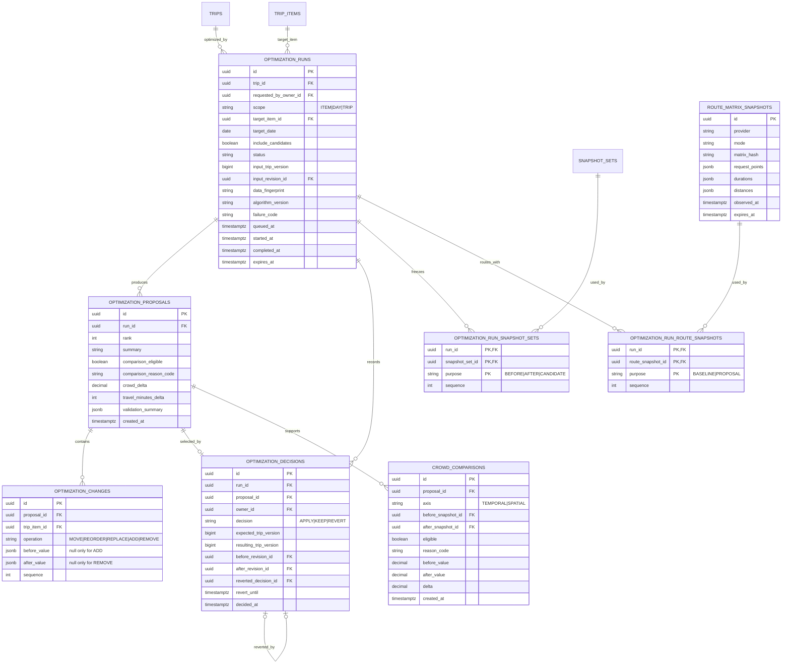

# ERD와 데이터 사전

- 상태: Accepted for P0 implementation
- DB: PostgreSQL
- ID: UUID v7 권장(애플리케이션 생성), 외부 ID는 별도 column
- 시간: `timestamptz` UTC 저장, 사용자 표시 시 timezone 변환
- Migration: Flyway, 변경마다 forward migration과 rollback/runbook 검토

## 1. 핵심 여행·소셜 모델

```mermaid
erDiagram
    OWNERS ||--o{ DEMO_SESSIONS : has
    OWNERS ||--o{ TRIPS : owns
    OWNERS ||--o{ SAVED_POSTS : saves
    OWNERS ||--o{ FEED_FEEDBACK : reacts
    OWNERS ||--o{ ANALYTICS_EVENTS : emits
    OWNERS ||--o{ NOTIFICATIONS : receives
    OWNERS }o--o| TRIPS : selects_active
    DEMO_SESSIONS ||--o{ DEMO_SESSION_CSRF_TOKENS : authorizes

    POSTS ||--o{ POST_PLACES : mentions
    PLACES ||--o{ POST_PLACES : appears_in
    POSTS ||--o{ SAVED_POSTS : saved_as
    POSTS ||--o{ FEED_FEEDBACK : receives

    PLACES ||--o{ PLACE_LOCALIZATIONS : localized_as
    PLACES ||--o{ PLACE_EXTERNAL_REFS : identified_by

    TRIPS ||--o{ TRIP_INTERESTS : has
    TRIPS ||--o{ TRIP_CANDIDATES : considers
    TRIPS ||--o{ TRIP_ITEMS : schedules
    TRIPS ||--o{ TRIP_REVISIONS : versions
    TRIPS ||--o{ ITINERARY_IMPORT_DRAFTS : imports

    PLACES ||--o{ TRIP_CANDIDATES : candidate
    POSTS ||--o{ CANDIDATE_SOURCES : source_post
    TRIP_CANDIDATES ||--o{ CANDIDATE_SOURCES : sourced_from
    TRIP_CANDIDATES ||--o| TRIP_ITEMS : scheduled_as
    PLACES ||--o{ TRIP_ITEMS : scheduled_place
    TRIP_ITEMS ||--o{ TRIP_CONSTRAINTS : protected_by
    TRIP_REVISIONS ||--o{ TRIP_REVISION_ITEMS : snapshots

    OWNERS {
      uuid id PK
      string kind "ANONYMOUS|ACCOUNT"
      uuid account_id UK "nullable, future"
      string locale
      string timezone
      boolean onboarding_completed
      uuid active_trip_id FK "nullable; same owner"
      timestamptz created_at
      timestamptz deleted_at
    }

    DEMO_SESSIONS {
      uuid id PK
      uuid owner_id FK
      bytes token_hash UK
      timestamptz last_seen_at
      timestamptz expires_at
      timestamptz revoked_at
      timestamptz created_at
    }

    DEMO_SESSION_CSRF_TOKENS {
      uuid id PK
      uuid demo_session_id FK
      bytes token_hash UK
      timestamptz expires_at
      timestamptz last_used_at
      timestamptz created_at
    }

    PLACES {
      uuid id PK
      string canonical_name
      string category_code
      decimal latitude
      decimal longitude
      string region_code
      string status
      timestamptz created_at
      timestamptz updated_at
    }

    PLACE_LOCALIZATIONS {
      uuid id PK
      uuid place_id FK
      string locale
      string name
      string short_description
      string address
      jsonb search_tokens
      timestamptz updated_at
    }

    PLACE_EXTERNAL_REFS {
      uuid id PK
      uuid place_id FK
      string source_code
      string external_id
      string external_type
      timestamptz verified_at
    }

    POSTS {
      uuid id PK
      uuid author_owner_id FK "nullable for curated"
      string status
      string title
      string body
      string cover_url
      timestamptz published_at
      timestamptz created_at
      timestamptz updated_at
    }

    POST_PLACES {
      uuid post_id PK,FK
      uuid place_id PK,FK
      int position
      string mention_type
    }

    SAVED_POSTS {
      uuid owner_id PK,FK
      uuid post_id PK,FK
      timestamptz created_at
    }

    FEED_FEEDBACK {
      uuid id PK
      uuid owner_id FK
      uuid post_id FK
      string action "IMPRESSION|OPEN|HIDE|LIKE|DISLIKE"
      timestamptz occurred_at
      timestamptz received_at
    }

    NOTIFICATIONS {
      uuid id PK
      uuid owner_id FK
      string type
      string title
      string body
      string deep_link
      timestamptz created_at
      timestamptz read_at
      timestamptz expires_at
    }

    TRIPS {
      uuid id PK
      uuid owner_id FK
      string title
      date start_date
      date end_date
      string timezone
      string planning_level
      string status
      bigint version
      timestamptz created_at
      timestamptz updated_at
      timestamptz archived_at
    }

    TRIP_INTERESTS {
      uuid trip_id PK,FK
      string interest_code PK
      int weight
      timestamptz created_at
    }

    TRIP_CANDIDATES {
      uuid id PK
      uuid trip_id FK
      uuid place_id FK
      string status "ACTIVE|SCHEDULED|DISMISSED"
      uuid scheduled_trip_item_id FK
      string note
      timestamptz created_at
      timestamptz updated_at
    }

    CANDIDATE_SOURCES {
      uuid id PK
      uuid candidate_id FK
      string source_type "POST|SEARCH|LIVE|IMPORT"
      uuid post_id FK
      jsonb context
      timestamptz created_at
    }

    TRIP_ITEMS {
      uuid id PK
      uuid trip_id FK
      uuid place_id FK
      date trip_date
      int position
      time start_time
      int duration_minutes
      string note
      timestamptz created_at
      timestamptz updated_at
    }

    TRIP_CONSTRAINTS {
      uuid id PK
      uuid trip_id FK
      uuid trip_item_id FK
      string type "MUST_VISIT|DATE|TIME|RESERVATION"
      boolean locked
      string source "USER|IMPORT"
      date date_value
      time start_time_value
      time end_time_value
      int tolerance_minutes
      timestamptz created_at
      timestamptz updated_at
    }

    TRIP_REVISIONS {
      uuid id PK
      uuid trip_id FK
      bigint version
      string reason
      uuid actor_owner_id FK
      uuid optimization_decision_id FK
      string snapshot_schema_version
      jsonb aggregate_snapshot
      string snapshot_hash
      timestamptz created_at
    }

    TRIP_REVISION_ITEMS {
      uuid revision_id PK,FK
      uuid trip_item_id PK
      uuid place_id FK
      date trip_date
      int position
      time start_time
      int duration_minutes
      jsonb constraints
    }

    ITINERARY_IMPORT_DRAFTS {
      uuid id PK
      uuid trip_id FK "nullable before create"
      uuid owner_id FK
      string status
      bigint version
      jsonb structured_draft
      jsonb unresolved_tokens
      uuid confirmed_trip_id FK
      timestamptz confirmed_at
      timestamptz expires_at
      timestamptz created_at
    }
```



## 2. 최적화 모델



`OPTIMIZATION_PROPOSALS`과 `OPTIMIZATION_CHANGES`는 생성 후 수정하지 않는다. 상태 변화는 run/decision에 기록한다. `KEEP`도 분석과 감사 목적의 decision row를 만든다.

## 3. 외부 데이터·Live·운영 모델

```mermaid
erDiagram
    SOURCE_REGISTRY ||--o{ COLLECTOR_RUNS : collected_by
    SOURCE_REGISTRY ||--o{ SOURCE_REGISTRY_REVISIONS : versioned_as
    SOURCE_REGISTRY ||--o{ SOURCE_QUALITY_INCIDENTS : reports
    SOURCE_REGISTRY ||--o{ CROWD_SNAPSHOTS : provides
    COLLECTOR_RUNS ||--o{ API_INGEST_LOGS : logs
    COLLECTOR_RUNS ||--o{ SNAPSHOT_SETS : creates
    SNAPSHOT_SETS ||--o{ CROWD_SNAPSHOTS : groups
    CROWD_SNAPSHOTS ||--o{ CROWD_COMPARISONS : before_or_after
    REPLAY_MANIFESTS ||--o{ REPLAY_MANIFEST_ENTRIES : lists
    CROWD_SNAPSHOTS ||--o{ REPLAY_MANIFEST_ENTRIES : replays
    PLACES ||--o{ CROWD_SNAPSHOTS : measured_at
    LIVE_AREAS ||--o{ CROWD_SNAPSHOTS : measured_for
    LIVE_AREAS ||--o{ SEOUL_LIVE_AREA_MAPS : maps
    PLACES ||--o{ SEOUL_LIVE_AREA_MAPS : linked_to
    PLACES ||--o{ PLACE_RELATIONS : source_place
    PLACES ||--o{ PLACE_RELATIONS : target_place
    OWNERS ||--o{ IDEMPOTENCY_RECORDS : owns
    SOURCE_REGISTRY ||--o{ ASSET_LICENSES : governs
    ASSET_LICENSES ||--o{ MEDIA_ASSETS : licenses
    POSTS ||--o{ POST_MEDIA_ASSETS : displays
    MEDIA_ASSETS ||--o{ POST_MEDIA_ASSETS : attached_to
    PLACES ||--o{ PLACE_MEDIA_ASSETS : displays
    MEDIA_ASSETS ||--o{ PLACE_MEDIA_ASSETS : attached_to
    OWNERS ||--o{ DELETION_REQUESTS : requests
    DELETION_REQUESTS ||--o{ DELETION_TOMBSTONES : protects_restore
    BACKGROUND_JOBS }o--o| DELETION_REQUESTS : executes

    SOURCE_REGISTRY {
      string code PK
      string display_name
      string license_name
      string license_url
      string official_url
      string terms_url
      string default_scope
      string metric_definition
      string approval_state
      jsonb quota_policy
      string attribution_template
      string retention_policy
      string provider_schema_version
      bigint current_revision
      int stale_after_seconds
      boolean enabled
      timestamptz reviewed_at
      timestamptz updated_at
    }

    SOURCE_REGISTRY_REVISIONS {
      string source_code PK,FK
      bigint version PK
      jsonb canonical_contract
      string contract_hash
      uuid reviewed_by_owner_id FK
      timestamptz reviewed_at
      timestamptz created_at
    }

    SOURCE_QUALITY_INCIDENTS {
      uuid id PK
      string source_code FK
      string incident_code
      timestamptz affected_from
      timestamptz affected_to
      string scope
      string official_notice_url
      string disposition
      timestamptz reviewed_at
    }

    COLLECTOR_RUNS {
      uuid id PK
      string source_code FK
      string status
      string trigger_type
      int records_received
      int records_accepted
      int records_rejected
      string schema_version
      string error_code
      timestamptz started_at
      timestamptz finished_at
    }

    API_INGEST_LOGS {
      uuid id PK
      uuid collector_run_id FK
      string endpoint_key
      string outcome
      int http_status
      int duration_ms
      int response_count
      string release_version
      uuid request_id
      string payload_hash
      string validation_result
      timestamptz created_at
    }

    SNAPSHOT_SETS {
      uuid id PK
      uuid collector_run_id FK
      string source_code FK
      bigint source_registry_version FK
      string scope
      string comparison_group_id
      timestamptz observed_at_min
      timestamptz observed_at_max
      int skew_seconds
      timestamptz created_at
    }

    CROWD_SNAPSHOTS {
      uuid id PK
      string source_code FK
      bigint source_registry_version FK
      uuid snapshot_set_id FK
      uuid place_id FK
      uuid live_area_id FK
      string source_state
      decimal value
      string unit
      string ordinal_level
      string scope
      string comparison_group_id
      boolean comparison_eligible
      string comparison_reason_code
      decimal confidence
      string normalization_version
      jsonb quality_flags
      string forecast_issue_id
      timestamptz observed_at
      timestamptz target_at
      timestamptz fetched_at
      timestamptz stale_at
      jsonb evidence
    }

    REPLAY_MANIFESTS {
      uuid id PK
      string name
      string schema_version
      string checksum
      string source_license_snapshot
      string scrub_method
      timestamptz captured_from
      timestamptz captured_to
      timestamptz approved_at
      timestamptz created_at
    }

    REPLAY_MANIFEST_ENTRIES {
      uuid manifest_id PK,FK
      uuid crowd_snapshot_id PK,FK
      int sequence
    }

    LIVE_AREAS {
      uuid id PK
      string source_code FK
      string external_id
      string name
      geometry boundary
      string status
      timestamptz updated_at
    }

    SEOUL_LIVE_AREA_MAPS {
      uuid id PK
      uuid place_id FK
      uuid live_area_id FK
      string mapping_type
      decimal confidence
      boolean fallback_used
      timestamptz verified_at
    }

    PLACE_RELATIONS {
      uuid id PK
      uuid source_place_id FK
      uuid target_place_id FK
      string relation "EXACT|SIMILAR"
      string source_code FK
      decimal confidence
      jsonb evidence
      timestamptz effective_at
      timestamptz expires_at
    }

    IDEMPOTENCY_RECORDS {
      uuid id PK
      uuid owner_id FK "non-null; bootstrap excluded"
      string route_key
      string idempotency_key
      string request_hash
      int response_status
      jsonb response_body
      timestamptz created_at
      timestamptz expires_at
    }

    ASSET_LICENSES {
      uuid id PK
      string source_code FK
      string external_license_code
      string license_name
      string license_url
      string attribution_template
      boolean redistribution_allowed
      boolean derivative_allowed
      timestamptz reviewed_at
    }

    MEDIA_ASSETS {
      uuid id PK
      uuid asset_license_id FK
      string source_external_id
      string origin_url
      string served_url
      string checksum
      string media_type
      string alt_text
      timestamptz license_checked_at
      timestamptz expires_at
    }

    POST_MEDIA_ASSETS {
      uuid post_id PK,FK
      uuid media_asset_id PK,FK
      int position
    }

    PLACE_MEDIA_ASSETS {
      uuid place_id PK,FK
      uuid media_asset_id PK,FK
      int position
    }

    DELETION_REQUESTS {
      uuid id PK
      uuid owner_id FK
      bytes status_token_hash UK
      string status
      int attempt_count
      string failure_code
      timestamptz status_token_expires_at
      timestamptz requested_at
      timestamptz started_at
      timestamptz completed_at
      timestamptz updated_at
    }

    DELETION_TOMBSTONES {
      uuid id PK
      uuid deletion_request_id FK
      uuid owner_id UK
      timestamptz delete_before
      timestamptz retain_until
      string scope_hash
      timestamptz created_at
    }

    BACKGROUND_JOBS {
      uuid id PK
      string type
      string deduplication_key UK
      string status
      jsonb payload_reference
      int attempt_count
      int max_attempts
      timestamptz next_attempt_at
      string locked_by
      timestamptz lease_until
      timestamptz heartbeat_at
      string last_error_code
      timestamptz created_at
      timestamptz completed_at
    }

    ANALYTICS_EVENTS {
      uuid event_id PK
      uuid owner_id FK
      uuid session_id FK "server-bound from cookie"
      string event_name
      string schema_version
      uuid trip_id FK
      uuid place_id FK
      uuid run_id FK
      jsonb properties
      timestamptz occurred_at
      timestamptz received_at
    }
```



## 4. Table별 핵심 제약

### Identity

- `owners.account_id`: null이 아닐 때 unique.
- `owners.onboarding_completed` 기본값은 false다. `active_trip_id`는 null이거나 같은 owner의 삭제되지 않은 trip이어야 하며 trip 삭제 시 null로 바꾼다.
- `demo_sessions.token_hash`: 원문 token 저장 금지, unique index.
- session 조회 index: `(token_hash) WHERE revoked_at IS NULL`.
- `demo_session_csrf_tokens`에는 token hash만 저장하고 token별 독립 만료를 둔다. session당 미만료 token은 최대 5개이며 새 tab 발급이 다른 tab token을 무효화하지 않는다.
- `POST /demo/sessions`는 owner가 생기기 전이므로 일반 idempotency table을 사용하지 않는다. cookie를 받은 retry는 기존 owner로 수렴하고 cookie 이전에 남은 bootstrap owner/session은 15분 후 삭제한다.
- owner 삭제 시 session 즉시 revoke. 도메인 data 삭제는 짧은 background job으로 cascade하되 상태를 추적한다.

### Catalog/Social

- `place_localizations`: unique `(place_id, locale)`.
- `place_external_refs`: unique `(source_code, external_id, external_type)`.
- 위경도는 허용 범위를 check하고 PostGIS 도입 전에는 numeric(9,6)을 사용한다. P0 nearby를 브라우저에서 처리하면 PostGIS는 보류 가능하다.
- `post_places`: unique `(post_id, place_id)` 및 `(post_id, position)`.
- `saved_posts`: primary key `(owner_id, post_id)`로 중복 저장 방지.
- `feed_feedback`: 같은 owner/post/action의 impression 폭주를 `(owner_id, post_id, action, occurred_at minute bucket)` unique 또는 동등한 ingest dedup으로 제한한다. HIDE/LIKE/DISLIKE의 최신 유효 상태는 query에서 결정하고 원문 자유 텍스트는 두지 않는다.
- `notifications.deep_link`는 API에 선언한 상대경로 allowlist만 허용하고 scheme/host/query/fragment를 DB check와 application parser 양쪽에서 거부한다.

### Trip

- `trips`: `start_date <= end_date`, `version >= 1`.
- `trips.owner_id`를 포함하는 index를 모든 owner query에 둔다.
- `trip_candidates`: partial unique `(trip_id, place_id) WHERE status <> 'DISMISSED'`.
- `trip_candidates.scheduled_trip_item_id`는 status가 `SCHEDULED`일 때만 존재.
- 후보 전이는 `ACTIVE→SCHEDULED`, `SCHEDULED→ACTIVE`, `ACTIVE→DISMISSED`만 허용한다. DISMISSED는 terminal이고 재저장은 새 row다. SCHEDULED 후보 직접 삭제는 거부한다.
- `trip_items`: unique `(trip_id, trip_date, position)`; 날짜는 trip 범위 안이어야 한다. application validation과 DB trigger/constraint test 중 scaffold 시 구현 방식을 확정한다.
- `trip_constraints`: unique `(trip_item_id, type)`; `trip_id`는 같은 item의 trip과 일치해야 한다.
- `trip_constraints` typed check: `MUST_VISIT`는 값 column 모두 null, `DATE`는 `date_value`만 필수, `TIME`은 `start_time_value`와 `tolerance_minutes(0..180)` 필수, `RESERVATION`은 `date_value/start_time_value` 필수다. `locked=true` row만 저장하고 해제는 row 삭제로 표현한다.
- import가 만든 lock은 `source=IMPORT`, 직접 조작은 `source=USER`다. 네 type은 서로 독립이며 한 type 변경이 다른 row를 제거하지 않는다.
- `trip_revisions`: unique `(trip_id, version)`; `aggregate_snapshot`은 metadata, interest, item, constraint, candidate linkage를 포함하는 canonical JSON이며 schema version/hash를 고정한다. 한 번 기록한 revision/item은 수정하지 않는다.
- trip 기간 축소 시 범위 밖 item 또는 DATE/RESERVATION lock이 하나라도 있으면 전체 요청을 거부한다. 자동 이동/삭제는 하지 않는다.
- `itinerary_import_drafts.version >= 1`; remap마다 증가하고 API ETag/If-Match와 일치해야 한다. 상태 전이는 `NEEDS_REVIEW ↔ READY → CONFIRMED`, 모든 비terminal 상태에서 `→ EXPIRED`만 허용한다. CONFIRMED/EXPIRED draft는 수정할 수 없다.
- trip 상태는 `DRAFT→ACTIVE→ARCHIVED`를 기본으로 하고 명시적 복원에서만 `ARCHIVED→ACTIVE`를 허용한다. 삭제는 상태값이 아니라 owned aggregate hard-delete workflow다.
- trip aggregate를 바꾸는 transaction은 `SELECT ... FOR UPDATE` 또는 JPA optimistic version 중 하나로 단일화한다. API version과 DB lock strategy를 혼합해 race를 만들지 않는다.

### Optimization

- 한 run에 proposal은 최대 3개이며 rank별 unique `(run_id, rank)`다.
- 한 run의 최초 decision(APPLY 또는 KEEP)은 정확히 최대 하나다: partial unique `(run_id) WHERE reverted_decision_id IS NULL`. 선택 proposal은 같은 run 소속이어야 한다.
- revert decision은 APPLY 하나만 참조하고 원 decision당 최대 하나다: unique `(reverted_decision_id) WHERE reverted_decision_id IS NOT NULL`. KEEP/revert를 다시 revert할 수 없다.
- APPLY는 before/after revision을 모두 기록하고 24시간 `revert_until`을 둔다. KEEP은 version/revision을 만들지 않는다. REVERT는 immutable before snapshot을 새 trip revision으로 복원하며 현재 trip version이 APPLY 결과와 다르면 거부한다.
- `optimization_changes`: ADD는 `before_value IS NULL AND after_value IS NOT NULL`, REMOVE는 반대, MOVE/REORDER/REPLACE는 둘 다 필수다.
- run은 하나 이상의 `optimization_run_snapshot_sets` row로 실제 사용한 BEFORE/AFTER/CANDIDATE snapshot을 모두 고정한다. route matrix도 junction으로 고정하며 run row의 단일 snapshot FK로 축약하지 않는다.
- S14 P0 이력은 기존 run/decision의 상태·시각·trip 연결만 조회한다. 이력 화면을 위해 일정/proposal snapshot을 복제하거나 보존 기간을 늘리는 별도 table을 만들지 않는다.
- `crowd_comparisons`는 before/after snapshot pair 자체를 저장한다. `eligible=false`이면 `delta IS NULL`; true이면 두 snapshot의 metric/source/scope/issue 조건을 정책이 재검증한다.
- apply 시 `expected_trip_version == trips.version`, `expires_at > now()`, data fingerprint 유효를 모두 검증한다.
- run 상태 전이는 `QUEUED → RUNNING → READY → APPLIED|KEPT`, 그리고 `APPLIED → REVERTED`다. 각 비terminal 상태에서 `FAILED|EXPIRED`만 추가 허용하며 그 외 terminal 상태에서 역행하지 않는다.

### Snapshot/Source

- `crowd_snapshots`는 `place_id`와 `live_area_id` 중 정확히 하나를 요구한다.
- `LIVE`는 `observed_at` 필수다. `FORECAST`는 `target_at`과 `forecast_issue_id`가 필수지만 provider가 발표 시각을 주지 않으면 `observed_at`은 null이어야 하며 `fetched_at`으로 대체하지 않는다.
- 모든 snapshot은 수집 시점의 `(source_code, source_registry_version)`을 참조한다. registry revision은 immutable canonical contract/metric/license/attribution/schema hash다.
- `source_quality_incidents`의 affected window/scope에 걸린 row는 `PROVIDER_INCIDENT` flag와 `comparison_eligible=false`가 강제된다.
- `REPLAY`는 `replay_manifest_entries`를 통해 checksum·capture window·scrub·license 승인이 끝난 manifest에 속해야 하며 API에서 현재값으로 반환하지 않는다.
- 정확한 비교 delta는 `comparison_eligible=true`인 row에만 계산/저장한다.
- `api_ingest_logs`는 KTO 실제 호출을 source operation(`endpoint_key`), 시각, outcome/status class, duration, response count, collector/request, release와 연결한다. response body, 전체 URL/query, API key, 사용자 입력은 저장하지 않는다. `payload_hash`가 필요하면 비밀·개인정보를 제거한 canonical validation payload의 단방향 hash만 허용한다.
- 공모전 evidence는 `api_ingest_logs → collector_runs → snapshot_sets/snapshot provenance → 공개 API response의 provenanceId → Figma 화면`으로 연결한다. replay/mock run은 별도 trigger/source namespace이며 실제 KTO 호출로 집계하지 않는다.
- media asset은 검토된 `asset_licenses`를 반드시 참조한다. `redistribution_allowed=false`이면 origin URL proxy/mirror를 금지하고, attribution이 필요한 asset은 API `MediaAsset`에 문구를 제공한다.

### Idempotency/Analytics

- `idempotency_records`: unique `(owner_id, route_key, idempotency_key)`; owner 생성 이후 mutation만 저장하고 24시간 TTL cleanup한다. bootstrap은 이 table의 nullable owner 예외를 만들지 않는다.
- `analytics_events.event_id`: client retry dedup key.
- `analytics_events.owner_id/session_id`는 request body가 아니라 인증 cookie에서 server가 bind한다. session hard delete 시 `session_id ON DELETE SET NULL`; owner 삭제 job은 raw event도 삭제한다.
- event name과 property는 JSON Schema allowlist를 통과한 것만 저장한다.
- 자유 텍스트, 좌표, 붙여넣기 원문, cookie/token을 event property에 넣지 않는다.

### Deletion/background jobs

- session 삭제 transaction은 session/CSRF token을 먼저 revoke하고 `deletion_requests`, `deletion_tombstones`, `background_jobs`를 함께 만든 뒤 202를 반환한다.
- 같은 transaction에 DELETE `/session` idempotency receipt를 먼저 기록한다. 24시간 동안 revoked cookie hash와 동일 key/body만 receipt를 재생할 수 있고, status token은 request ID/expiry를 서명해 결정적으로 재생하므로 plaintext를 저장하지 않는다.
- 삭제 상태 token은 hash만 저장하고 7일 뒤 만료한다. 상태 전이는 `ACCEPTED → RUNNING → COMPLETED|PARTIAL_FAILED|FAILED`이며 retry는 attempt와 error code를 남긴다.
- tombstone은 최대 backup 보존 기간보다 길게 유지한다. restore 직후 traffic을 열기 전에 tombstone의 `delete_before`를 재적용한다.
- job claim은 `FOR UPDATE SKIP LOCKED` 또는 동등한 원자 연산으로 `locked_by/lease_until`을 쓴다. worker는 heartbeat하고, lease 만료 뒤에만 다른 worker가 재수행한다.
- handler는 deduplication key에 대해 멱등이어야 하며 max attempt 초과 시 FAILED와 운영 alert를 만든다. payload에는 원문/secret 대신 domain ID만 둔다.

## 5. Enum 초안

DB native enum 대신 check constraint 또는 lookup/value converter를 사용해 migration을 단순화한다.

| Enum | 값 |
| --- | --- |
| OwnerKind | `ANONYMOUS`, `ACCOUNT` |
| TripStatus | `DRAFT`, `ACTIVE`, `ARCHIVED` |
| PlanningLevel | `NOTHING`, `MUST_VISIT_ONLY`, `MOSTLY_PLANNED` |
| CandidateStatus | `ACTIVE`, `SCHEDULED`, `DISMISSED` |
| ConstraintType | `MUST_VISIT`, `DATE`, `TIME`, `RESERVATION` |
| OptimizationScope | `ITEM`, `DAY`, `TRIP` |
| RunStatus | `QUEUED`, `RUNNING`, `READY`, `APPLIED`, `KEPT`, `REVERTED`, `FAILED`, `EXPIRED` |
| DecisionType | `APPLY`, `KEEP`, `REVERT` |
| SourceState | `LIVE`, `FORECAST`, `REPLAY`, `QUALITATIVE`, `STALE`, `UNAVAILABLE` |
| RelationType | `EXACT`, `SIMILAR` (없음/확인 중/불명은 API 상태) |
| ImportStatus | `NEEDS_REVIEW`, `READY`, `CONFIRMED`, `EXPIRED` |
| DeletionStatus | `ACCEPTED`, `RUNNING`, `COMPLETED`, `PARTIAL_FAILED`, `FAILED` |
| NotificationType | `OPTIMIZATION_READY`, `OPTIMIZATION_FAILED`, `CROWD_ALERT`, `TRIP_REMINDER`, `TRIP_CONFLICT`, `SOURCE_DEGRADED` |

## 6. 삭제·보존·백업

| 데이터 | Online retention | 삭제 방식 |
| --- | --- | --- |
| revoked session | 30일 | scheduled hard delete |
| CSRF token | session/개별 token 만료 중 이른 시점 | hash hard delete |
| import draft | 최대 24시간 | TTL hard delete; raw text column 자체를 만들지 않음 |
| idempotency record | 24시간 | scheduled hard delete |
| analytics raw event | 90일 | 집계 후 hard delete |
| feed feedback | 90일 | 개인 raw action 삭제/집계; owner 삭제 시 즉시 대상 |
| notification | 90일 또는 read 후 30일 중 이른 시점 | hard delete; owner 삭제 cascade |
| deletion status token | 7일 | token hash 삭제; 최소 tombstone은 유지 |
| deletion tombstone | backup 최대 보존 + 7일 이상 | restore 재삭제 검증 후 hard delete |
| ingest log | 90일 | body 없이 운영 지표만 보존 |
| optimization proposal/decision | trip 존재 기간 | trip 삭제 시 cascade; 감사 요구 재검토 |
| crowd snapshot | source 약관·용량에 따름 | partition TTL, 승인 없는 원본 mirror 금지 |
| application log | 30일 기본 | CloudWatch retention policy |

RDS automated backup 보존은 production 14일 이상을 시작점으로 하고 point-in-time restore rehearsal 후 확정한다. 사용자 삭제 직후 backup까지 물리 삭제할 수 없다는 점과 backup 만료 기간은 개인정보 처리방침에 명시한다.

## 7. Migration 원칙

1. 확장(additive) → backfill → read switch → write switch → 제거 순서로 진행한다.
2. production에서 긴 table rewrite를 유발하는 DDL을 바로 실행하지 않는다.
3. 새로운 non-null column은 nullable/add default/backfill/constraint validate 단계로 나눈다.
4. index는 가능한 경우 concurrently 생성하고 transaction 제약을 migration에 명시한다.
5. Flyway checksum을 사후 수정하지 않고 새 migration으로 보정한다.
6. CI에서 빈 DB migration과 production-like snapshot migration을 모두 검증한다.
7. destructive migration은 backup/restore와 application rollback 호환 기간을 문서화한다.

## 8. 초기 index 목록

```sql
-- 실제 migration에서는 naming convention과 CONCURRENTLY 정책을 적용한다.
CREATE INDEX ON trips (owner_id, status, start_date DESC);
CREATE INDEX ON trip_items (trip_id, trip_date, position);
CREATE INDEX ON trip_candidates (trip_id, status, created_at DESC);
CREATE INDEX ON optimization_runs (trip_id, queued_at DESC);
CREATE INDEX ON optimization_runs (status, queued_at) WHERE status IN ('QUEUED', 'RUNNING');
CREATE INDEX ON notifications (owner_id, read_at, created_at DESC);
CREATE INDEX ON feed_feedback (owner_id, post_id, occurred_at DESC);
CREATE INDEX ON crowd_snapshots (place_id, target_at DESC, source_code);
CREATE INDEX ON crowd_snapshots (live_area_id, observed_at DESC, source_code);
CREATE INDEX ON analytics_events (occurred_at);
CREATE INDEX ON background_jobs (status, next_attempt_at) WHERE status IN ('READY', 'RETRY');
CREATE INDEX ON deletion_requests (status, requested_at) WHERE status IN ('ACCEPTED', 'RUNNING', 'PARTIAL_FAILED');
```

index는 추측으로 계속 추가하지 않는다. staging query plan과 slow query 지표를 근거로 유지·제거한다.
