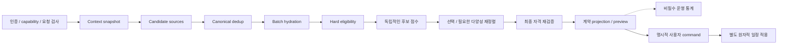

---
aliases:
  - "추천 알고리즘 상세 설계"
doc_type: design
status: draft
area: architecture
tags:
  - nullnull/design
  - nullnull/architecture
---

# 추천 알고리즘 상세 설계

- 상태: Draft — 구현용 제안. 공개 API와 제품 우선순위의 변경은 별도 계약 검토 대상이다.
- 작성일: 2026-09-06
- DRI: Backend/AI, 검토자: Frontend
- 연결: [Backend 전체 설계](SYSTEM_ARCHITECTURE.md), [X 공개 코드 참조](RECOMMENDATION_ALGORITHM.md#13-x-공개-코드와-참조-버전), [추천 CI 명세](../engineering/TEST_STRATEGY.md#12-추천-핵심-ci-상세)
- 실행 위치: 계산은 Python 서비스 `apps/ai`, hydration·재검증·저장은 Spring `apps/api`([ADR-0006](../decisions/ARCHITECTURE_DECISIONS.md#adr-0006)). 구현 순서는 [추천 서비스 구현 계획](../superpowers/plans/2026-09-07-recommendation-python-service.md)이다.
- 기준: [OpenAPI](../api/openapi.yaml), [ERD](ERD.md), [Source catalog](../data/SOURCE_CATALOG.md), [개인정보](../security/PRIVACY_REQUIREMENTS.md)

## 1. 추천의 목표와 적용 순서

널널의 추천은 **사용자가 고려할 만하고 실제 제약에 맞는 여행 선택지를 제시하는 것**이다. 점수가 높아도 권한·데이터 신뢰성·영업·이동·잠금을 통과하지 못하면 제안할 수 없다. 최종 여행 변경은 사용자의 APPLY 또는 직접 편집 command만 수행한다.

X의 후보 수집·보강·필터·점수화·선택 구조를 참고하되 목적함수와 데이터는 널널에 맞게 설계한다. 최신 참조 버전, 확인한 소스와 채택하지 않는 부분은 [X 참조 기록](RECOMMENDATION_ALGORITHM.md#13-x-공개-코드와-참조-버전)에 고정했다.

| 단계 | 구현할 추천 | 사용 신호 | 전제 |
| --- | --- | --- | --- |
| P0 | 고정 순서 feed, 근거 기반 관련 장소, 후보 slot, ITEM 시간·날짜 개선 | canonical POI, 검증된 관계, trip 제약, 비교 가능한 snapshot | 학습 모델 없이 재현 가능 |
| P1 | 이동을 포함한 DAY/TRIP, 장소 교체·경로 조합 | 승인된 route matrix와 시간창 | provider·Figma·계약·경로 검증 완료 |
| P2 | 개인화 retrieval/ranking, 제한적 탐색 | 검증된 노출·선택 이력, 동의·보존 정책, 평가 데이터 | FR-ML-01/02 gate와 별도 계약 |

P0 feed의 `tripId`는 candidate/scheduled 상태를 덧붙이는 용도이며 **ranking 의미를 바꾸지 않는다**. 관심사 기반 feed 개인화나 최신/팔로잉 filter를 이 parameter에 숨겨 넣지 않는다. `listRelatedPlaces`도 현재 tripId를 받지 않으므로 active trip을 몰래 읽어 여행별 순위를 만들지 않는다.

## 2. 사용자 기능과 추적성

node는 기존 Figma 핸드오프 기준이다. 추천용 내부 test ID는 이 문서와 CI 명세의 설계 ID이며 현재 실행된 테스트를 뜻하지 않는다.

| 기능 ID | Figma node/state | operationId/schema | entity/transition | 필수 test | 담당/검토 |
| --- | --- | --- | --- | --- | --- |
| FR-FED-01~03 | `391:310`, `396:2926`, empty/cursor | `listFeed` / FeedPage | post read, 저장 상태 projection | REC-FEED-01~04 | BE/AI → FE |
| FR-FED-04 | feed interaction, FCR-002 확인 | `recordFeedFeedback` / FeedFeedbackRequest | feedback dedup, HIDE | REC-FBK-01~04 | BE/AI → FE |
| FR-CAN-02~04 | `399:843`, `399:1011`, `399:1179` | `addTripCandidate` | ACTIVE 생성/duplicate, 일정 미변경 | REC-INT-01 | BE/AI → FE |
| FR-CAN-07 | `412:1912`, NONE/CHECKING/UNKNOWN | `getCandidateTripMatches` / CandidateMatchResult | query only | REC-SLOT-01~03 | BE/AI → FE |
| FR-LIV-04~06 | `420:2821`, `420:2950` | `listRelatedPlaces` / RelatedPlaceResult | relation query only | REC-REL-01~03 | BE/AI → FE |
| FR-DAT-02~04 | 공통 provenance/비교 불가 | DataProvenance / CrowdComparison | snapshot pair eligibility | REC-DATA-01~06 | BE/AI → FE |
| FR-OPT-01,03~06 | `415:2268`, `415:2413`, FCR-004 미해결 preview | `createOptimization`, `getOptimization` | QUEUED→RUNNING→READY | REC-OPT-01~05 | BE/AI → FE |
| FR-OPT-07~16 | `417:2412`, `417:2567`, `485:3517` | `decideOptimization`, `revertOptimizationDecision` | APPLY/KEEP/REVERT 또는 실패 | REC-INT-02~06 | BE/AI → FE |
| FR-ML-01 | P2 node 미정 | 새 ranking/노출 계약 필요 | 학습·실험, 일정 변경 권한 없음 | REC-ML-01~04 | BE/AI → FE |

FCR 미해결은 domain/fixture 설계를 막지 않지만 영향 UI를 승인된 화면으로 간주할 수 없다. 특히 ITEM preview는 FCR-004의 실제 node와 상태를 연결한 뒤 FE 구현한다.

## 3. 공통 pipeline



### 3.1 단계별 책임

| 단계 | 입력 → 출력 | 실패 정책 |
| --- | --- | --- |
| Context | owner, 요청 → 고정 now, locale, 필요한 trip/version, policy | 소유권·필수 context 실패는 중단 |
| Source | 범위·snapshot → ID 후보와 채널 근거 | 선택 채널 장애는 나머지 사용, 필수 채널 전부 실패는 UNKNOWN/실패 |
| Dedup | provider ID/내부 ID → canonical ID 후보 | 매핑 충돌·저신뢰 동명이인은 격리 |
| Hydration | 후보 IDs → category, 관계, source, 제한된 일정·영업·route facts | batch 조회, 필수 fact 결측은 eligibility UNKNOWN |
| Eligibility | immutable 후보 → ELIGIBLE/INELIGIBLE/UNKNOWN + 내부 사유 | UNKNOWN을 적격으로 승격하지 않음 |
| Score | 적격 후보·고정 정책 → score + contribution | NaN/Infinity/단위 오류는 해당 계산 실패 |
| Selector | scored candidates → bounded ordered list | 안전 필터는 완화하지 않음, 부족하면 적게 반환 |
| Final check | 선택 결과 + 최신 visibility/incident/owner 상태 | 철회된 항목 제거·실패, 새 후보를 임의 생성하지 않음 |
| Projection | 내부 결과 → 기존 공개 DTO | 없는 field/enum을 임의 추가하지 않음 |

외부 fact 조회는 caller가 수행한다. 순수 계산 중 추가 HTTP·DB 조회를 하지 않는다. 단계별 거절 수를 기록하되 원문·장소명·owner ID를 metric label로 사용하지 않는다.

### 3.2 내부 타입 제안

아래는 Java 형태의 설계 스케치이며 생성된 API DTO나 즉시 컴파일 가능한 전체 코드가 아니다. 실행 구현은 `apps/ai`의 Python(`domain/types.py`, `pipeline/`)에 같은 이름·의미로 존재하고, Spring은 내부 계약 DTO만 가진다.

```java
record RecommendationContext(
    Instant evaluatedAt,
    String policyVersion,
    String policyHash,
    String catalogVersion,
    Optional<TripSnapshot> trip,
    SourceSnapshotBundle sources
) {}

record CandidateKey(UUID placeId, Optional<LocalDate> date,
                    Optional<LocalTime> time) {}
record Eligibility(EligibilityState state, List<Reason> reasons) {}
record ScoreBreakdown(BigDecimal score,
                      Map<String, BigDecimal> contributions) {}

interface CandidateFilter<C> {
    Eligibility evaluate(RecommendationContext context, C candidate);
}
interface CandidateScorer<C> {
    ScoreBreakdown score(RecommendationContext context, C eligible);
}
interface CandidateSelector<C> {
    List<C> select(List<C> scored, SelectionPolicy policy);
}
```

`CandidateKey`는 관련 장소에서는 placeId, 시간 제안에서는 placeId/date/time 조합이다. feed는 게시물 ID가 주 identity이고 primaryPlace 중복 처리는 별도 정책이다. 내부 `Reason`과 공개 `OptimizationFailure.code`를 같은 enum으로 취급하지 않는다.

## 4. 후보 수집과 cold start

### 4.1 P0 source별 입력

| 대상 | 후보 source | 초기 상한 제안 | 빈 결과의 의미 |
| --- | --- | --- | --- |
| feed | 공개 가능 curated post + canonical primary place | snapshot 최대 300개 | 공개 가능한 콘텐츠 없음 |
| related | 검증된 `place_relations` | 채널당 100, 병합 최대 300 | 조회 성공·전수 검토 결과가 비었을 때 NONE |
| slot | 해당 trip 날짜 범위와 검증 가능한 시간창 | 날짜 최대 30, detailed slot 최대 100 | 가능한 slot 없음 또는 정보 부족 |
| ITEM preview | 같은 POI의 동일 issue 예측이 존재하는 날짜/시간 | 상세 점수 최대 100, proposal 최대 3 | 개선 없음 또는 필수 사실 미확보 |

source별 cap은 정해진 순서로 적용한다. 비동기 응답 도착 순서가 후보 포함 여부를 바꾸면 안 된다. 여러 채널의 100개가 같은 장소여도 3개 근거를 보존한 canonical 후보 하나로 합친다. 공급자 내부 점수는 공통 척도라는 근거가 없으면 채널 간 직접 비교하지 않는다.

cold start에서 여행·관심사·feedback가 없어도 고정 feed와 검증된 관련 장소를 제공한다. 값 없는 관심사·평점·인기도를 0점 또는 가짜 평균으로 만들지 않는다. 새로운 장소는 verified relation/catalog에 포함되면 규칙에 따라 노출할 수 있으며 행동 데이터 부족만으로 영구 배제하지 않는다.

### 4.2 P2 채널 제안

개인화 계약을 추가한 뒤 `명시적 관심사 기반 검색 + 콘텐츠 유사도 검색 + 검증된 관계 + 최소 품질을 통과한 탐색`을 결합한다. 별도 embedding 검색은 P0 의존성이 아니다. 각 채널의 recall, canonical dedup 후 기여율, 실패율을 먼저 측정한다.

채널 점수의 척도가 다르면 raw score 가중합 대신 rank 기반 결합을 평가할 수 있다. 채널 상한·결합 상수·후보 누락을 평가 데이터로 비교한 후 선택한다. 이 선택은 현재 활성 정책이 아니다.

## 5. P0별 알고리즘

### 5.1 고정 feed와 페이지 순서

초기 제안 순서는 공개 가능한 post의 `(publishedAt DESC, postId ASC)`다. 사용자가 선택하는 `최신` 정렬 기능을 추가하는 것은 아니다. HIDE·삭제·공개 자격은 필터이며 LIKE/DISLIKE는 P0 순위 학습에 사용하지 않는다. `tripId`·SavedPost·candidateState는 이미 정한 순서에 표시만 덧붙인다.

페이지 도중 데이터가 바뀌어도 중복·순서 변동을 막기 위해 첫 조회에서 **ID 순서 snapshot**을 고정한다. body·여행 내용·원문은 복제하지 않는다. 내부 feed snapshot 저장은 §10의 schema 제안을 함께 검토한다.

cursor는 `snapshotId, nextOrdinal, owner binding, selectedTrip binding, sortVersion, expiresAt, keyId`를 서명한 opaque 값이다. 원문 owner ID나 사용자 입력이 cursor에 드러나지 않도록 서버 row 참조와 MAC을 사용한다. 초기 TTL 제안은 15분, page 크기는 기존 Limit 계약 이내다.

1. page는 ordinal부터 순서대로 최대 limit개를 반환한다. skip된 항목을 포함한 마지막 검사 ordinal 뒤를 다음 cursor로 둔다.
2. 이후 추가된 게시물·변경된 점수는 새 snapshot부터 반영한다.
3. HIDE·삭제·권리 철회·owner revoke는 순서 고정보다 먼저 적용한다. 같은 snapshot에 숨겨진 콘텐츠를 되살리지 않는다.
4. 반환 가능한 나머지 항목이 있는지 lookahead해 hasMore를 계산한다. 더 없으면 nextCursor=null이다.
5. `tripId`를 바꾸면 첫 page부터 다시 요청한다. 순위 규칙은 같고 저장 상태 scope만 바뀐다.
6. 서명/owner/context 불일치는 `CURSOR_INVALID`, 만료·snapshot 제거는 `CURSOR_EXPIRED`다.

정상 데이터에서 모든 snapshot ID가 한 번씩 나온다는 조건과, 삭제·숨김 때문에 의도적으로 제외되는 조건을 별도 검증한다. snapshot 저장 실패를 성공한 빈 feed로 표시하지 않는다.

### 5.2 관련 장소 순위

`listRelatedPlaces`는 대체 후보를 소개하며 이동 가능성·더 한적함을 보증하지 않는다. relation의 출처·scope·매핑을 먼저 검증한다. EXACT와 SIMILAR는 relation의 의미이며 confidence 숫자만으로 EXACT를 합성하지 않는다.

초기 정렬은 `(relation tier, categoryMatch DESC, placeId ASC)`다. tier는 검증된 EXACT가 SIMILAR보다 앞선다. categoryMatch는 동일 canonical category면 1, 검토된 상위 category가 같으면 0.5, 다르면 0이다. taxonomyVersion을 고정하며 category 결측은 별도 missing 상태로 같은 tier의 known 후보 뒤에 둔다.

출처가 다른 혼잡값·provider 인기도·단순 노출량은 이 정렬에 넣지 않는다. crowd가 있으면 provenance와 함께 부가 표시한다. 검증된 관련성만 있을 때는 관련 이유만 설명한다. `SIMILAR` 항목을 자동 교체하거나 `NONE`을 가짜 관광지로 채우지 않는다.

| 조회 결과 | 공개 state |
| --- | --- |
| 유효 EXACT가 하나 이상 | EXACT; 각 item은 자기 relation 유지 |
| EXACT 없이 유효 SIMILAR만 존재 | SIMILAR |
| 필요한 source 조회·검증 완료, 후보 0 | NONE |
| 실제 검증 job이 진행 중 | CHECKING |
| source 장애·매핑/권리/근거 부족으로 판단 불가 | UNKNOWN |

### 5.3 후보의 일정 slot

`getCandidateTripMatches`는 해당 owner/trip/candidate를 검증한 후 각 날짜에 대해 시간창과 잠금을 계산한다. 응답은 기존 `CandidateMatchResult`의 `date`, `suggestedTime`, `eligible`, `reasonCode`에 매핑한다. 확정 방문 시각이 없는 날짜만의 후보는 suggestedTime=null이며 검증하지 않은 시각을 만들어 넣지 않는다.

- hard check: trip 날짜 범위, 존속하는 canonical POI, 기존 item과 중복 정책, 영업·휴무, duration, 앞뒤 일정, 독립 lock.
- time 계산: trip timezone의 날짜·시간을 Instant로 바꾼다. 존재하지 않거나 중의적인 지역 시각은 명시적으로 거절/확인 처리하며 서버 timezone에 기대지 않는다.
- eligibility: 모든 필요한 fact를 검증하면 true. 정보가 부족하면 false와 내부 사유를 공개 reasonCode로 매핑한다.
- aggregate state: 확인된 적격 slot이 있으면 EXACT, 계산 중인 실제 job은 CHECKING, 판정 자료 부족만 남으면 UNKNOWN, 모두 확정 불가이면 NONE이다. P0는 검증 기준을 완화한 SIMILAR slot을 자동으로 만들지 않는다.
- 우선순위: 검증 가능한 날짜·시간의 오름차순. 비교 가능한 동일 POI forecast가 완비된 후보 집합에 한해 별도 temporal 순위를 제안할 수 있으며 이 의미 변경은 계약 검토 후 활성화한다.

조회가 성공해도 후보는 ACTIVE이고 trip version은 그대로다. 일정화 command는 최신 trip·제약을 다시 검증한다.

### 5.4 ITEM 최적화의 hard constraints

P0의 첫 개선안은 **같은 POI 방문 날짜/시간의 변경**으로 제한한다. `scope=ITEM`, targetItemId 필수, `includeCandidates=false`다. 자동 ADD/REMOVE/REPLACE, DAY/TRIP, 여러 장소의 경로 재배치는 P1 capability 전까지 꺼 둔다.

| 조건 | 판정 |
| --- | --- |
| MUST_VISIT | 장소를 제거·교체하지 않음 |
| DATE | 잠긴 날짜 유지 |
| TIME | 지정 시각과 tolerance 범위 유지 |
| RESERVATION | 예약 날짜·시간 범위 유지 |
| trip 범위 | 이동 후 날짜도 여행 기간 내 |
| 영업·duration | 체류 전체가 확인된 시간창 안에 있고 휴무/예외일이 아님 |
| 이웃 일정 | 겹침 없음; 변경으로 영향을 받는 이동 구간의 근거 필요 |
| source | 동일 POI·issue·metric·정규화·유효 기간의 비교 가능 데이터 |
| 개선 | 최소 개선 폭과 점수 조건 모두 충족 |

영업 여부를 알 수 없으면 일반 장소 소개는 가능하지만 `검증 완료`인 자동 시간 변경안은 만들지 않는다. 공급자가 하루 단위 예측만 제공하면 하루 안의 시간별 차이를 추정·보간하지 않는다.

경로 provider 없는 P0에서 앞뒤 이동이 달라지는 proposal은 기본 차단한다. 단일 item이고 연결 이동 구간이 없는 등 **이동 제약 자체가 없는 경우**에는 날짜·시간·영업 검증으로 계산할 수 있다. 기존 순서가 같다는 이유만으로 이동 시간 검증을 생략하지 않는다. route fact가 필요한데 없으면 `ROUTE_UNAVAILABLE`이며 수동 편집은 유지한다.

### 5.5 ITEM 목적함수와 계산 예시

모든 hard check를 통과한 같은 POI의 temporal 후보끼리 다음 제안 수식을 사용한다. 이는 X 가중치를 복사한 것이 아니며 초기 튜닝값이다.

```text
improvement = beforeValue - afterValue
relief = improvement / metricScale
changeCost = min(1, abs(afterInstant - beforeInstant).minutes / 240)
score = 0.80 × relief - 0.20 × changeCost

admit only if:
  comparisonEligible == true
  improvement >= minimumImprovement
  score > 0
```

KTO 상대 집중률의 synthetic 기준은 metricScale=100, minimumImprovement=5 index point로 시작한다. 실제 provider 오차·분해능이 확인되면 source registry에 최소 개선 폭을 설정하고 검토한다. 다른 metric에 100이나 5를 재사용하지 않는다. **5 point 감소는 방문자 5% 감소라는 뜻이 아니다.**

| 후보 | before → after | 변경 시각 차이 | relief | changeCost | score | 결과 |
| --- | --- | --- | --- | --- | --- | --- |
| A | 80 → 60 | 60분 | 0.20 | 0.25 | 0.11 | 적격 |
| B | 80 → 50 | 120분 | 0.30 | 0.50 | 0.14 | A보다 우선 |
| C | 80 → 77 | 15분 | 0.03 | 0.0625 | 0.0115 | 최소 개선 5 미달로 제외 |
| D | 80 → 20 | 60분 | 계산 금지 | 계산 금지 | 없음 | 다른 issue이면 제외 |
| E | 80 → 10 | 60분 | 계산 금지 | 계산 금지 | 없음 | 예약 잠금 위반이면 제외 |

이 표는 산식 검증용 synthetic 예시이며 실제 공급자가 시간별 데이터를 제공한다는 주장이 아니다. 각 fixture는 metric 시간 해상도와 지원 시각을 명시해야 한다.

점수는 고정 소수점 정밀도와 rounding mode를 정책에 넣는다. 비교는 중간 표시용 반올림 전에 수행한다. tie-break는 `score DESC → changeCost ASC → date ASC → time ASC → placeId ASC`로 고정한다. 동일 date/time proposal을 합치고 최대 3개를 반환한다. score가 낮은 후보를 quota 때문에 강제 삽입하지 않는다.

### 5.6 결측과 비교 불가

| 데이터 상황 | 일반 추천/상세 | 수치 최적화 |
| --- | --- | --- |
| 같은 POI·동일 issue의 유효 FORECAST | 예측으로 표시 | temporal 비교 가능 여부 추가 검증 |
| 다른 POI의 KTO 상대 집중률 | 각각의 예측만 표시 | 장소 간 순위·delta 금지 |
| 서울 AREA 실측과 KTO PLACE 예측 | scope·state 별도 표시 | 공통 0–100 환산·합산 금지 |
| REPLAY | replay namespace와 고정 시각 표시 | 공개 proposal의 수치 비교 금지; 별도 오프라인 synthetic 산식 평가만 |
| STALE/incident/schema drift | 명확한 stale 또는 unavailable | 새 수치 proposal·apply 차단 |
| confidence 없음 | null 유지 | source별 필수 요건 부족이면 비교 차단 |
| 영업/route 결측 | 확인 불가 표시 | 필요한 제약이면 UNKNOWN으로 차단 |

점수에서 빠진 필수 crowd feature의 가중치를 다른 항목으로 재분배하지 않는다. `REDUCE_CROWD` 목적이 선호 최적화로 변하면 안 된다. 비교 불가이면 공개 comparison before/after/delta를 null로 만들고 reason을 제공한다. 개별 CrowdMetric의 독립 표시와 pair 비교는 분리한다.

## 6. 결정성과 목록 다양성

P0 계산 재현 단위는 `input snapshot + evaluatedAt + catalog/taxonomy version + source snapshot IDs + policy hash`다. tie-break에 난수·현재 clock·unordered map 순회·HTTP 도착 순서를 쓰지 않는다. 같은 candidate의 기본 점수는 다른 후보 추가·순서 변경·batch 분할로 변하지 않아야 한다.

P0 feed의 기존 고정 순서를 다양성 명목으로 뒤섞지 않는다. P2에서만 다음 재정렬을 평가한다.

```text
adjusted(c, selected) = baseUtility(c)
                       - lambdaCategory × categoryRedundancy(c, selected)
                       - lambdaPlace × samePlaceRedundancy(c, selected)
                       - lambdaExposure × cappedExposurePenalty(c)
```

이 단계는 선택 집합에 의존하므로 candidate isolation test의 대상은 `baseUtility`다. 재정렬은 동일 전체 입력·seed에서 결정적인지 따로 본다. 낮은 추천 노출은 실제로 덜 붐빈다는 뜻이 아니며 노출 페널티를 CrowdMetric에 기록하지 않는다. 신규 장소는 노출 prior와 최소 품질 기준을 적용하고, 조작된 client impression만으로 전역 노출 부담을 바꾸지 않는다.

## 7. 피드백 수집과 무결성

P0 public allowlist는 `IMPRESSION`, `OPEN`, `HIDE`, `LIKE`, `DISLIKE`다. feed feedback는 `recordFeedFeedback`로 받고 analytics의 `events.schema.json`에 없는 새 이벤트를 보내지 않는다. candidate_saved/optimization_applied 같은 client 분석 이벤트는 집계 편의용이며 DB transaction 성공을 대체하지 않는다.

### 7.1 서버 검증 순서

1. session owner, CSRF/Origin, body/allowlist, post 존재·공개 상태를 확인한다.
2. idempotency key와 canonical request hash로 같은 요청을 수렴시킨다.
3. occurredAt는 UTC로 파싱하고 receivedAt를 서버에서 별도 기록한다. 미래 5분 초과·과거 24시간 초과를 거절하는 초기 한도를 contract example과 함께 검토한다.
4. 같은 owner/post/action의 minute bucket 중복을 unique 또는 동등한 ingest 정책으로 막는다. 서버 rate limit도 적용해 occurredAt를 바꾼 폭주를 제한한다.
5. LIKE와 DISLIKE는 최신 **서버 수신 순서**로 유효 상태를 정한다. HIDE는 P0에 해제 action이 없으므로 raw feedback 보존 범위에서 숨김을 우선하며 LIKE로 해제하지 않는다.
6. HIDE 후 이어지는 page도 최신 숨김을 반영한다. 어떤 feedback도 SavedPost·TripCandidate·TripItem을 변경하지 않는다.

raw feedback 90일 만료 후에도 영구 숨김을 지원하려면 별도 preference table·해제 API·보존 계약이 필요하다. 현재 계약으로 영구 숨김을 약속하지 않는다.

### 7.2 아직 가능한 것과 불가능한 것

현재 request에는 impressionId, recommendationId, rank, policyVersion, 노출 확률이 없다. 따라서 클라이언트가 보낸 IMPRESSION을 **실제 노출이 인증된 학습 표본**으로 사용할 수 없다. P0에서는 owner별 기능 상태·품질 진단에 제한하고, 행동 기반 전역 ranking·혼잡 보정은 하지 않는다.

P2 계약 제안은 서버의 served 기록, browser의 실제 노출 확인, domain mutation 성공을 구분하고 `impressionId → post/place → policy/model/snapshot → action`을 연결하는 것이다. 임의 ID 재사용·다른 owner의 impression·노출 이전 action·늦게 도착한 label을 검증해야 한다. served는 viewed가 아니고 candidate 저장은 방문 증명이 아니다.

노출 확인 방식(예: 화면 50% 이상 1초), attribution window, label 정정/중복 정책은 수집 전에 FE/BE가 계약으로 확정한다. 계측이 없는데 클릭률·인과 개선을 계산하지 않는다.

## 8. preview 생성과 APPLY 분리

```text
createOptimization:
  validate owner, ITEM capability, target, inputTripVersion
  transaction: create run + persistent job
  return QUEUED

worker:
  read consistent trip snapshot
  fetch and pin facts outside write transaction
  generate supported temporal candidates
  filter constraints and comparability
  score -> select -> validate full resulting trip
  transaction: verify owner/run lease/trip version, save immutable proposal
  transition to READY; never mutate trip items

decide APPLY:
  authenticate -> replay completed idempotency result when applicable
  transaction: lock trip/run, verify version, expiry, policy and data validity
  apply through TripCommand, save new revision + decision + response
  commit once
```

fingerprint에는 입력 trip revision/hash, 모든 crowd/route snapshot 참조, source registry·normalization·policy version, 적용 유효 기한을 포함한다. 단일 최신 snapshot ID 하나로 축약하지 않는다. immutable snapshot ID가 존재한다는 사실만으로 최신 적격성은 보장되지 않으므로 apply 때 freshness·incident·정책 철회를 다시 검사한다.

최신 source 변경을 감지하는 registry/incident generation과 apply transaction 사이의 race를 막도록 version 확인 또는 DB 잠금을 적용한다. 새 사건 등록과 동시에 진행된 apply의 순서를 DB integration test로 검증한다. 이를 외부 HTTP 호출을 transaction 안에 넣는 방식으로 해결하지 않는다.

오류는 기존 plane을 따른다. source 부족/철회는 async `DATA_CHANGED`, 실제 경로 근거 부족은 `ROUTE_UNAVAILABLE`, 유효 후보를 모두 계산했지만 개선이 없으면 `NO_IMPROVEMENT`다. 데이터 부족을 `NO_IMPROVEMENT`로 숨기지 않는다. 새 오류 세분화가 필요하면 OpenAPI·example·FE mapping을 먼저 제안한다.

## 9. LLM과 P2 모델의 경계

### 9.1 LLM 설명

공통 relation/forecast는 B03, 후보/점수 구현은 B06, Live 소비는 B10 순서다.

P0 설명은 검증된 contribution과 source state로 만든 KO/EN template을 기본으로 한다. LLM 설명은 선택 capability이며 실패·timeout 시 같은 template로 돌아간다.

LLM에 전달할 수 있는 값은 검증된 place ID/이름, approved summary, supported reason, 공개 가능한 비교 수치·단위·시각이다. raw 일정·메모·정밀 위치를 보내지 않는다. 생성 결과의 ID·숫자·영업/경로 단정을 validator가 검사하며 새로운 사실이 추가되면 template로 교체한다. LLM에 DB mutation·APPLY tool을 주지 않는다.

`80 → 60`은 해당 지표가 20 point 낮다는 설명까지만 허용한다. 실제 방문자 감소·이동 절약·현재 한적함은 각각의 근거 없이는 문장에 넣지 않는다. schema에 없는 이유 chip은 FE와 계약하기 전 반환하지 않는다.

### 9.2 개인화 학습 제안

먼저 P0 규칙, 검증된 집계 baseline, 단순 선형/트리 모델을 같은 고정 평가셋에서 비교한다. 충분한 개선이 없으면 transformer를 도입하지 않는다.

```text
utility = wSave × P(candidate save | valid impression, context)
          + wSchedule × P(schedule | valid impression, context)
          - wHide × P(hide | valid impression, context)
          - wDislike × P(dislike | valid impression, context)
```

모든 계수는 널널 평가로 정한다. action count에 그대로 곱하지 않고 label 정의가 다른 action을 같은 성공으로 합치지 않는다. 혼잡 개선은 별도 비교 적격성 guardrail이며 feed utility에 무단 합산하지 않는다.

학습 데이터는 event-time으로 split하고 serving 당시 이용 가능했던 feature만 join한다. 동일 owner/session의 근접 행동 누수, 미래 snapshot, label window 미종료, 삭제 대상 owner를 제외한다. 미노출 항목을 부정 label로 만들지 않는다. 실제 노출 확률을 기록한 탐색 표본이 없으면 IPS 등 편향 보정·인과 추정을 했다고 주장하지 않는다.

온라인 도입은 shadow → 승인된 소규모 실험 → 확대 순서다. owner 단위 assignment를 고정하고 사전 정의한 샘플 수·기간·중단 기준을 사용한다. 일정 침해·권한 오류·허위 비교 1건은 즉시 중단 사유다. CTR만 좋아져도 숨김률·사용자 완료율·지연이 나빠지면 자동 승격하지 않는다.

## 10. 저장·캐시·관측 설계

| 정보 | P0 저장 제안 | 수명/삭제 | 상태 |
| --- | --- | --- | --- |
| 추천 정책 | versioned YAML, 코드 SHA/hash | 배포 artifact와 이력 | 구현 시 추가 |
| feed ID 순서 | social 소유 `feed_snapshots` + `feed_snapshot_entries` | 최대 15분, owner 삭제 시 제거 | ERD/Flyway 제안 필요 |
| ITEM 근거 | 기존 optimization proposal/change/snapshot junction | 기존 trip/run 보존·삭제 정책 | 기존 ERD 활용 |
| raw feedback | 기존 feed_feedback | 90일 상한, owner 삭제 대상 | 기존 계약 활용 |
| score contribution | 기본 request memory, synthetic eval report | 요청 종료; 실제 raw feature 로그 금지 | 영속 필요 시 별도 검토 |
| 모델 학습 export | P0 생성 안 함 | P2 동의·TTL·삭제 lineage 먼저 | 미승인 |

feed table 초안: `feed_snapshots(id, owner_id, selected_trip_id nullable, sort_version, created_at, expires_at)`, `feed_snapshot_entries(snapshot_id, ordinal, post_id)`. `(snapshot_id, ordinal)`과 `(snapshot_id, post_id)` unique, owner/expiresAt index, selected trip owner 일치, post 삭제 시 skip/cascade를 검증한다. snapshot당 300개, owner당 동시 5개를 초기 상한으로 제안하며 한도 도달은 429로 처리하고 기존 tab의 snapshot을 임의 폐기하지 않는다. 이는 외부 콘텐츠 전체 mirror가 아니다.

공유 cache에는 공개 catalog/source fact만 넣는다. owner별 HIDE/SavedPost/candidateState가 들어간 feed response는 공유하지 않는다. 캐시 key는 필요한 owner·selected trip·policy·snapshot scope에 결합한다. 권한/삭제/incident 확인을 cache hit로 생략하지 않는다.

관측 항목은 단계별 latency, candidate count, reject reason, UNKNOWN 비율, 비교 적격률, cold-start coverage, source 장애, cursor 만료, idempotency replay/conflict, preview/apply/keep/fail 비율이다. `modelVersion` 등 낮은 cardinality label과 sampled trace를 사용하고 UUID 전체를 metric dimension으로 넣지 않는다.

## 11. 평가와 출시 판단

정확성 검증과 추천 품질 평가를 나눈다. synthetic fixture는 규칙·경합·안전성을 검증하며 실제 선호 품질을 입증하지 않는다.

- 모든 PR: 결정성, hard constraint, mixed-source 차단, owner 격리, null semantics, 무승인 미변경, 동시성·멱등성, LLM fallback.
- 추천 정책 변경: 같은 고정 corpus에서 후보 recall·NDCG@10·slot 유효율·coverage·다양성·p95·UNKNOWN율을 이전 정책과 비교한다.
- P2 학습 변경: 시간 분리 holdout, label/window 검사, calibration, segment별 성능과 삭제 lineage를 추가한다.
- staging/release: 외부망 익명 flow, 실제 KTO 호출·화면 출처, provider 장애 시 축소 동작, rollback을 검증한다.

구체 fixture·테스트 이름·실패 조건·실행 시점·artifact는 [추천 CI 명세](../engineering/TEST_STRATEGY.md#12-추천-핵심-ci-상세)가 정한다. 숫자는 초기 실험 기준이며 통과한 실험 결과와 구분한다.

## 12. 계약 차이와 구현 전 해결 항목

이번 문서 작성에서는 OpenAPI·이벤트 schema를 변경하지 않는다. 아래 항목은 기존 shape에 숨어 들어가면 안 되는 구체적인 후속 계약 작업이다.

| ID | 현재 계약과 차이 | 제안 산출물 | 담당/검토 | 그전 기본값 |
| --- | --- | --- | --- | --- |
| REC-CON-01 | feed는 ranking score/reason/snapshot field가 없음 | P0 opaque cursor 내부 저장만 ERD/Flyway 제안; public reason은 별도 OpenAPI/example/Figma | BE/AI → FE | 현재 FeedCard 유지 |
| REC-CON-02 | feed tripId는 순위 불변, P2 개인화 미정 | 개인화 목적·context/filter/cursor·기능 ID·generated client | BE/AI → FE | 고정 feed |
| REC-CON-03 | feedback에 verified impression/모델/노출 확률 없음 | 노출 ID·action attribution·이벤트·보존·DB 검증 계약 | BE/AI → FE | 전역 학습 OFF |
| REC-CON-04 | FR-TRC-10의 추천 draft read operation/seed 근거가 충분하지 않음 | draft preview/read와 create confirm 연결, schema/example·node·테스트 | BE/AI → FE | 임의 endpoint/묵시적 일정 생성 없음 |
| REC-CON-05 | 영업 예외일·route 근거·오차 한계가 source별 미확정 | source registry 필수 field·TTL·최소 개선 폭·fixture | BE/AI → FE | 검증 불가 자동 제안 차단 |
| REC-CON-06 | ITEM preview FCR-004 실제 node 미해결 | before/after, state, reason, APPLY/KEEP fixture와 node | FE → BE/AI | 영향 UI 구현 보류 |
| REC-CON-07 | 순서 snapshot table, 정책 hash 저장 위치 미정 | ERD·migration·TTL·삭제·run fingerprint canonical schema | BE/AI → FE | 메모리 값으로 확장 기능을 운영했다고 주장하지 않음 |
| REC-CON-08 | 피드백 시각 한도·최신 상태 세부 규칙 미정 | validation/error example·정정 순서·HIDE 보존 안내 | BE/AI → FE | 허용된 action만 수집, 모델 투입 안 함 |

계약을 바꾸는 구현은 `기능 ID/Figma → OpenAPI·event example → ERD/transition → FE client 생성 → BE contract test → E2E` 순서를 따른다. 이 문서의 proposed 내부 타입을 FE가 수동 응답 타입으로 복제하지 않는다.

## 13. X 공개 코드와 참조 버전

### X1 · 참조 저장소와 버전

주 참조는 [xai-org/x-algorithm](https://github.com/xai-org/x-algorithm)이다. 조사 시 GitHub API의 `commits/main`으로 확인한 커밋은 `902a06fd616ed815f660e5546d16d492fa1ca825`, 커미터 시각은 `2026-09-04T21:03:46Z`다. 아래 코드 링크는 모두 이 커밋에 고정했다.

[twitter/the-algorithm](https://github.com/twitter/the-algorithm)은 과거 공개 구현을 구분하기 위한 보조 참조다. 같은 방법으로 확인한 `main`은 `c54bec0d4e029fe34926ef3258a86ccacc0d0182`, 커미터 시각은 `2025-09-03T20:46:53Z`다. 두 저장소의 구조·가중치·파일명을 하나의 버전처럼 섞지 않는다.

이 문서는 공개 코드에 대한 조사이며 X 운영 환경 전체를 재현했다는 주장이 아니다. 아래의 인터페이스 스케치, 점수식, TTL, 후보 수, 품질 기준은 **널널을 위한 제안**이다. X 코드·모델 가중치는 재사용하지 않고 stage 구조만 `apps/ai/src/nullnull_ai/pipeline/`에 반영한다.

### X2 · 확인된 구조와 적용 판단

| 참조 | 공개 구현에서 확인한 사실 | 널널 적용 |
| --- | --- | --- |
| [CandidatePipeline](https://github.com/xai-org/x-algorithm/blob/902a06fd616ed815f660e5546d16d492fa1ca825/candidate-pipeline/candidate_pipeline.rs#L67) | query 보강, 후보 수집, 후보 보강, 필터, 점수화, 선택, 선택 후 보강·필터, 부수 작업을 분리한다. | `apps/ai`의 `pipeline/` stage protocol과 순수 정책 객체(`policy-v1.yaml`)로 구현한다. |
| [후보 수집](https://github.com/xai-org/x-algorithm/blob/902a06fd616ed815f660e5546d16d492fa1ca825/candidate-pipeline/candidate_pipeline.rs#L257) | 활성 source를 병렬 실행하고 성공 결과를 모은다. | 선택 source 장애는 격리하되 owner·권리·안전 검증 실패는 결과를 차단한다. |
| [Phoenix 호출](https://github.com/xai-org/x-algorithm/blob/902a06fd616ed815f660e5546d16d492fa1ca825/home-mixer/scorers/phoenix_scorer.rs) | 모델 호출을 별도 scorer로 캡슐화한다. | P0 결정적 scorer를 유지하고 P2 모델은 같은 내부 경계 뒤에 둔다. |
| [RankingScorer](https://github.com/xai-org/x-algorithm/blob/902a06fd616ed815f660e5546d16d492fa1ca825/home-mixer/scorers/ranking_scorer.rs#L640) | weighted와 dwell-regret 계열의 분기가 있고 작성자 다양성 등 후처리가 있다. | 하나의 가중합이 공개 구현 전체라고 단순화하지 않는다. 널널은 목적에 맞는 자체 수식을 사용한다. |
| [설계 결정](https://github.com/xai-org/x-algorithm/blob/902a06fd616ed815f660e5546d16d492fa1ca825/README.md#L448) | 다중 행동 예측, 후보 간 attention 차단, 순위와 노출 자격의 분리, 조립 가능한 pipeline을 설명한다. | 후보 자체 점수의 독립성과 목록 재정렬의 집합 의존성을 따로 테스트한다. |

### X3 · 잘못 옮기기 쉬운 부분

공개 설명의 행동 가중치는 예측 확률 또는 예측 연속값에 적용된다. 단순 좋아요·신고 횟수에 배수를 곱하는 규칙으로 해석하면 안 된다. 공개 설정은 변할 수 있으며 일부 prompt·규칙·배포 관련 파일은 공개 범위에서 제외된다. 근거: [README의 점수 설명](https://github.com/xai-org/x-algorithm/blob/902a06fd616ed815f660e5546d16d492fa1ca825/README.md#L323), [설정·공개 범위](https://github.com/xai-org/x-algorithm/blob/902a06fd616ed815f660e5546d16d492fa1ca825/README.md#L400).

널널의 해석과 선택:

- 소셜 반응 최적화 가중치를 여행 만족·혼잡 완화 가중치로 복사하지 않는다.
- P0 익명 서비스에는 follow graph가 없다. in-network 비율이나 작성자 팔로잉을 만들지 않는다.
- 후보 자체 점수가 독립적이어도 다양성 재정렬 결과는 후보 집합에 따라 달라질 수 있다.
- source 병렬 호출 성공률과 후보의 사실 검증 성공률은 별개다. 일부 결과가 왔다고 영업·경로를 검증한 것은 아니다.
- 대규모 신경망·벡터 검색·분산 큐는 충분한 데이터와 운영 근거가 생긴 뒤 검토한다.
- 오버투어리즘 완화는 낮은 노출량만으로 증명하지 않는다. 추천 노출, 일정 선택, 실제 방문·현장 혼잡은 서로 다른 지표다.

### X4 · 재사용과 업데이트 정책

이번 설계는 구조를 참고해 새로 작성한다. 외부 코드·모델을 저장소에 복사하거나 런타임 의존성으로 추가하지 않는다. 직접 코드 재사용을 시작하는 PR에서는 참조 파일·커밋·변경 내용을 기록하고 해당 파일과 [LICENSE](https://github.com/xai-org/x-algorithm/blob/902a06fd616ed815f660e5546d16d492fa1ca825/LICENSE)의 고지·재배포 조건을 확인한다. 이 확인은 개별 데이터·이미지·모델의 사용 권한까지 대신하지 않는다.

참조 갱신은 자동 배포하지 않고 Backend/AI 담당이 다음 절차로 검토한다.

1. 기존 커밋과 새 커밋 사이에서 사용 중인 pipeline·scorer·filter 의미 변경을 확인한다.
2. 공개 코드에서 확인한 사실과 널널에서 채택할 변경을 별도로 적는다.
3. 추천 정책 버전·fixture·품질 보고서를 같은 PR에서 갱신한다.
4. Frontend가 노출 순서·이유·오류 영향과 기존 계약 호환성을 검토한다.
5. [추천 CI 기준](../engineering/TEST_STRATEGY.md#12-추천-핵심-ci-상세)을 통과한 변경만 배포 후보로 만든다.

공개 저장소를 PR CI에서 clone하거나 X 실서비스를 호출할 필요는 없다. 고정된 참조와 널널 자체 synthetic fixture로 검증한다.

## 14. API 0.2.0 적용 체크

- 생성 요청은 scope 판별 union이다. ITEM은 targetItemId만, DAY는 targetDate만 요구하고 TRIP은 target 필드를 받지 않는다. P0는 ITEM·includeCandidates=false다.
- APPLY만 beforeRevisionId/afterRevisionId/resultingTripVersion/revertUntil을 제공한다. revertUntil은 decidedAt+24시간이고 KEEP에는 revision/revert 필드가 없다. REVERT에는 revertedDecisionId와 전후 revision이 있다.
- REVERT 24시간 만료는 410 REVERT_WINDOW_EXPIRED다. preview expiry와 구분한다. 환경의 APP_REVERT_WINDOW도 PT24H로 고정한다.
- DataProvenance의 officialUrl/licenseUrl은 필수 키지만 값은 null일 수 있다. null을 가짜 URL로 채우지 않는다.
- 공개 REPLAY pair는 comparisonEligible=false다. 합성 산식 golden test를 현재값 기반 개선 proposal 또는 실제 관광 효과로 표현하지 않는다.
- 이 문서의 feed snapshot 저장·품질 임계치·feedback 시각 한도는 초안이다. 현재 OpenAPI/ERD 변경 완료로 간주하지 않는다. 후속 작업은 [BA-000](../roles/BACKEND_AI_PLAYBOOK.md#ba-000), BA-023/032/033/051에서 계약 검토한다.
