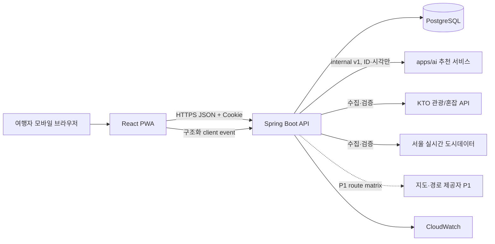
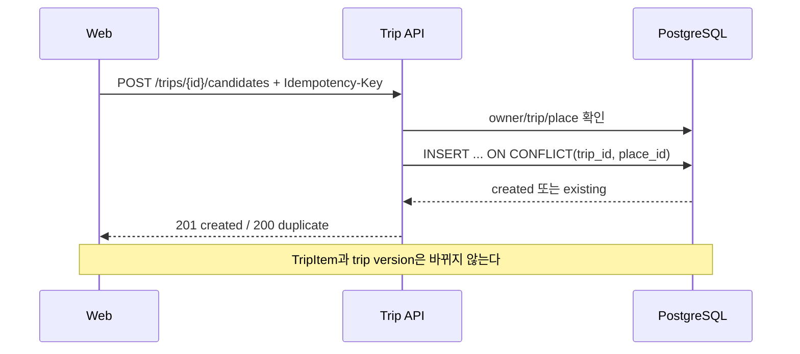
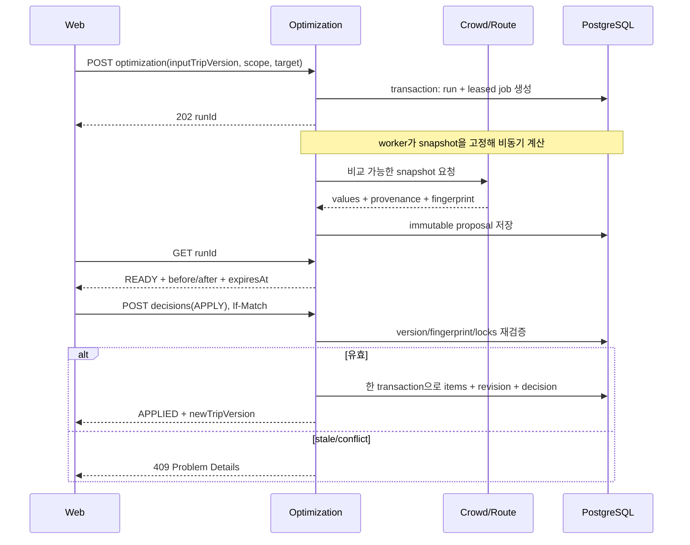
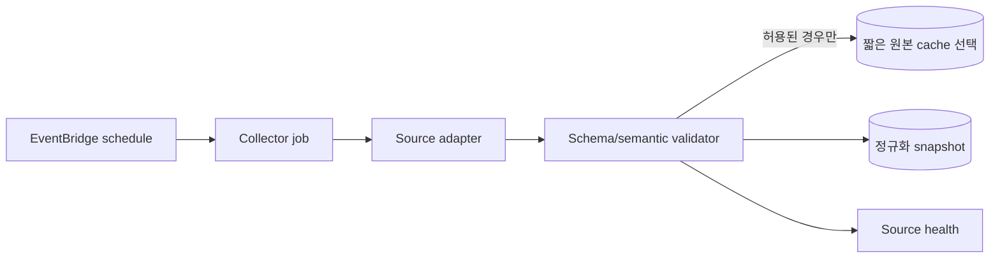
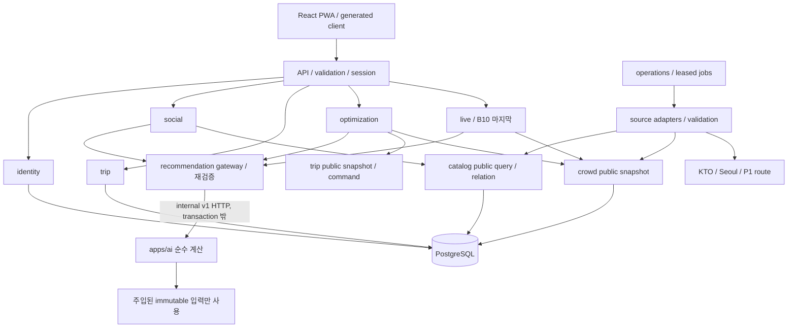

---
aliases:
  - "시스템 아키텍처"
doc_type: reference
status: baseline
area: architecture
tags:
  - nullnull/reference
  - nullnull/architecture
---

# 시스템 아키텍처

- 상태: Accepted for P0 implementation
- 형태: React PWA + Spring Boot 모듈형 모놀리스 + PostgreSQL + 추천 계산 서비스 `apps/ai`(Python, [ADR-0006](../decisions/ARCHITECTURE_DECISIONS.md#adr-0006))
- 배포 목표: AWS, 서울 리전 우선

## 1. 설계 목표

1. 2인 팀이 한 저장소, 한 API 배포 단위로 운영할 수 있어야 한다.
2. FE/BE는 OpenAPI 계약으로 병렬 개발하고 mock/contract test로 조기에 통합한다.
3. 추천·혼잡 결과는 출처와 시각을 잃지 않아야 한다.
4. 일정 적용은 stale preview, 중복 요청, 부분 실패에 안전해야 한다.
5. 외부 관광 API 장애가 여행 조회·편집까지 전파되지 않아야 한다.
6. P0 비용과 운영 복잡도를 낮추되 P1 worker/Redis/ML 분리가 가능해야 한다.

## 2. Context



브라우저가 외부 데이터 API를 직접 호출하지 않는다. API key 보호, 캐시, 쿼터, schema 변화, provenance 보존을 backend adapter가 담당한다. 추천 서비스 `apps/ai`는 내부 network에서만 Spring이 호출하며 DB·외부 API를 읽지 않는다.

## 3. 목표 저장소 구조

B01 scaffold PR에서 아래 구조와 `.nullnull-target-stack`을 함께 생성한다. 과거 prototype은 현재 목표 저장소 밖의 Git 이력/별도 작업공간에만 두며 새 구조에 복사하지 않는다.

```text
apps/
  web/                      React + TypeScript + Vite PWA
  api/                      Java 21 + Spring Boot
  ai/                       Python 3.13 + FastAPI 추천 계산 서비스(내부 계약 v1)
packages/
  api-client/               OpenAPI로 생성, 직접 수정 금지
  design-tokens/            Figma variable export
docs/
  api/openapi.yaml
  contracts/events.schema.json
infra/                      AWS CDK(TypeScript)
scripts/                    계약 생성·검증·로컬 bootstrap
```

## 4. Backend module 경계

모듈은 같은 process와 DB를 사용하지만 다른 모듈의 table/repository를 직접 조작하지 않는다. 공개 application service 또는 domain event를 통한다.

| Module | 책임 | 소유 table |
| --- | --- | --- |
| `identity` | 익명 session, multi-tab CSRF, owner preference, 삭제 receipt | `owners`, `demo_sessions`, `demo_session_csrf_tokens`, `deletion_*` |
| `catalog` | canonical/localized POI, 검색, 외부 ID, 검증된 relation | `places`, `place_localizations`, `place_external_refs`, `place_relations` |
| `social` | post, saved post, feed/feedback, P1 notification | `posts`, `post_places`, `saved_posts`, `feed_feedback`, `notifications` |
| `trip` | 여행, 관심사, 후보, 일정, 제약, revision | `trips`, `trip_*` |
| `optimization` | run, proposal, decision, revert | `optimization_*`, `route_matrix_snapshots` |
| `crowd` | live/forecast/replay snapshot와 비교 가능성 | `crowd_snapshots`, `source_registry`, `snapshot_sets` |
| `live` | Live area mapping, coverage, P1 nearby projection | `live_areas` |
| `importer` | 일정 원문의 일시적 parsing, draft | `itinerary_import_drafts`(구조화 값만) |
| `analytics` | 허용 목록 기반 event 수집 | `analytics_events` 또는 외부 sink |
| `operations` | readiness, source health, ingest audit, leased job | `collector_runs`, `api_ingest_logs`, `background_jobs` |

권장 package 예:

```text
io.nullnull.trip
  api/             controller, API DTO mapping
  application/     command/query handlers, transaction boundary
  domain/          aggregate, policy, value object, domain event
  infrastructure/  JPA repository, external adapter
```

Controller는 JPA entity를 반환하지 않는다. API DTO와 domain type을 분리하고, 외부 응답 DTO는 adapter 밖으로 노출하지 않는다.

### 2인 팀 ownership

| 계약/구현 | Frontend 담당 | Backend/AI 담당 | merge 조건 |
| --- | --- | --- | --- |
| Figma route/state | 화면, 접근성, URL 복구, loading/empty/error | 필요한 read model·상태 enum 검토 | screen-state/API matrix 공동 승인 |
| OpenAPI | 생성 client 소비성·mock example 검토 | spec/Problem/validation·controller 구현 | lint + generated diff + contract test |
| session/CSRF | bootstrap coordinator, memory token, 401 UX | cookie/token 발급·rotation·Origin 검증 | refresh/new-tab/two-tab E2E |
| trip concurrency | ETag 보관, conflict 비교 UI | aggregate lock/version/transaction | two-tab E2E + DB integration |
| optimizer/AI | preview/차이/승인/복구 UI | deterministic validation, snapshot, ranking, LLM 격리 | golden fixture + no-mutation test |
| source truth | provenance badge/delta 차단 | registry/adapter/incident/comparison policy | mixed-source contract/E2E |
| privacy | URL/body/telemetry 최소화, 위치 local-only | owner scope, retention, deletion worker | canary와 restore-delete test |

각 vertical slice의 DRI는 한 명이지만 contract PR에는 상대 담당의 review가 필수다. FE는 API type을 수동 재선언하지 않고, BE/AI는 합의 없이 field/enum을 추가하지 않는다. FE는 장기 `frontend`, BE/AI는 장기 `backend`에서 작업해 `main`에 PR을 만들고 Docker 통합까지 통과한다.

## 5. Frontend architecture

### Layer

- `app`: router, query client, i18n, session bootstrap, global error boundary.
- `features`: 사용자 작업 단위. 다른 feature의 내부 module을 import하지 않는다.
- `entities`: API entity의 표시·정규화 helper. server source of truth를 대체하지 않는다.
- `shared/ui`: Figma component와 접근성 primitive.
- `shared/api-generated`: OpenAPI generator 산출물. 수동 수정 금지.

### State 원칙

- 서버 데이터: TanStack Query 계열 cache를 사용하고 query key에 owner/trip/filter scope를 포함한다.
- wizard/edit buffer: feature-local reducer/form state. 저장 전 서버 entity를 변형하지 않는다.
- URL: 공유/새로고침 복구가 필요한 route, run id, 선택 tab만 둔다.
- client preference: locale/onboarding 같은 비민감 값만 localStorage에 저장한다.
- session token, 붙여넣기 원문, 정밀 위치는 localStorage에 저장하지 않는다.
- CSRF token은 tab memory에만 둔다. refresh/new tab은 cookie가 있으면 `POST /session/csrf`, cookie가 없거나 401이면 `POST /demo/sessions`를 호출한다. 새 token이 다른 tab token을 폐기한다고 가정하지 않는다.
- 검색과 coarse viewport는 URL에 넣지 않고 read-only POST body로 보낸다. query cache key에는 원문 대신 process-memory hash를 사용하고 persistence/dehydration에서 제외한다.

### API client

`docs/api/openapi.yaml`에서 TypeScript type/client를 생성한다. 생성 결과와 spec hash가 CI에서 일치해야 한다. FE가 임의 response type을 재선언하지 않는다. Problem Details는 공통 error mapper로 UI code/CTA에 연결한다.

## 6. 주요 요청 흐름

### 후보 저장



### 최적화 preview/apply



`KEEP`는 decision만 기록하고 여행을 변경하지 않는다. `REVERT`는 과거 row를 덮어쓰지 않고 이전 snapshot을 근거로 새 trip revision을 만든다.

optimization 생성 요청은 `scope` 판별 union이다. `ITEM`은 `targetItemId`, `DAY`는
`targetDate`만 요구하며 `TRIP`은 target field를 받지 않는다. P0 client는 `ITEM` variant만
생성하고 DAY/TRIP은 capability OFF다.

한 run은 최초 APPLY/KEEP decision을 최대 하나만 갖는다. APPLY만 24시간 내 한 번 revert할 수 있다. APPLY 응답은 `beforeRevisionId`, `afterRevisionId`, `resultingTripVersion`, `revertUntil`을 모두 제공하며 `revertUntil`은 server `decidedAt`의 정확히 24시간 뒤다. KEEP 응답에는 revision/revert field가 없고, REVERT는 참조한 APPLY decision과 transaction 전후 revision을 제공한다. run이 사용한 모든 crowd/route snapshot은 junction row로 고정하며, before/after 수치 비교는 두 snapshot ID를 가진 comparison row가 `eligible=true`일 때만 표시한다. ADD의 before와 REMOVE의 after는 명시적 null이고 나머지 operation은 양쪽 상태가 필수다.

S14의 P0 최적화 이력은 기존 run의 상태·시각·대상 여행·실행 링크만 반환한다. 이력을 위해 여행 내용이나 proposal snapshot을 복제하지 않으며 원 trip 삭제/보존 정책을 우회하지 않는다.

### 일정 가져오기

1. 브라우저 parser가 우선 구조화한다.
2. 보조 server parser가 필요하면 `Cache-Control: no-store`, body logging 제외, 원문 비저장을 적용한다.
3. 서버는 구조화 draft와 불확실한 token/매핑만 반환한다.
4. draft는 version/ETag를 가지며 remap/confirm은 If-Match를 요구한다. stale tab은 `IMPORT_DRAFT_CHANGED`로 중단한다.
5. 사용자가 remap한 뒤 confirm하면 item과 각 DATE/TIME/MUST_VISIT/RESERVATION constraint를 한 transaction으로 만들고 source를 IMPORT로 기록한다.
6. import draft는 `NEEDS_REVIEW ↔ READY → CONFIRMED`만 허용하며 짧은 TTL 뒤 EXPIRED/삭제한다.

### Session 삭제

1. delete transaction이 session과 모든 CSRF token을 즉시 revoke한다.
2. deletion request, restore tombstone, leased background job을 함께 만들고 one-purpose status token/URL을 202로 반환한다.
3. worker가 owner-scoped domain data와 raw analytics/feedback을 멱등 삭제한다.
4. status token은 삭제 data를 읽을 권한 없이 상태만 조회하며 7일 뒤 만료한다.
5. backup restore 시 public traffic 전에 tombstone을 재적용하고 삭제 완료를 다시 검증한다.

## 7. 데이터 수집과 신선도



각 외부 record는 최소 다음을 가진다.

```text
provenance_id, source, source_registry_version, source_state,
observed_at, target_at, fetched_at, freshness, confidence,
license, official_url, license_url, attribution, metric_definition, normalization_version,
comparison_group_id, collector_run_id, snapshot_set_id
```

### Adapter 규칙

- timeout, retry with jitter, circuit breaker, per-source rate limit을 둔다.
- schema와 enum drift를 검출하면 값 추측 대신 source를 degraded로 표시한다.
- last-known-good는 stale label과 함께만 사용한다.
- 외부 실패 시 여행 CRUD는 정상 작동하고, 혼잡/최적화 기능만 명확히 축소된다.
- replay fixture는 production live 값과 namespace/dataState가 섞이지 않는다.
- source registry revision, provider schema, approval/quota/license/attribution을 snapshot과 함께 고정한다. 공식 incident window는 정상 schema라도 quarantine한다.
- media는 검토된 asset license와 redistribution/attribution 조건이 없는 한 mirror/CDN 배포하지 않는다.

### 공모전 KTO gateway와 증거

공모전 제출 경로는 `web → API → KTO gateway → schema/semantic validator → 최소 normalized cache → API response`다. fixture/replay는 PR의 재현성용이며 실제 KTO 필수 활용 증거가 아니다.

- 운영키는 Secrets Manager에서 task runtime에만 주입하고 browser, image layer, workflow log에 넣지 않는다.
- 화면 요청은 quota-aware read-through 또는 만료 snapshot refresh를 일으킨다. 제출 smoke에서는 실제 provider call이 발생한 release·operation과 응답의 `provenanceId`를 call-audit로 연결한다.
- call-audit에는 secret·query 원문·provider 원문 응답·개인정보를 남기지 않는다. 화면 증거에는 텍스트 출처와 기준시각을 포함하되 request ID나 key를 노출하지 않는다.
- KTO 전체 dataset을 로컬 DB에서만 서비스하지 않는다. 장기 저장이 불가피하면 공식 문의·승인과 저장 범위를 source registry에 기록할 때까지 capability를 열지 않는다.
- provider 장애 시 stale/replay로 안전하게 축소할 수 있지만 제출 전 실제 호출 증거가 없으면 release gate는 실패다.

### 비교 가능성

비교 가능 여부는 UI가 추론하지 않고 backend가 before/after snapshot pair마다 `comparisonEligible`과 `comparisonReasonCode`를 결정한다. temporal 비교는 같은 POI/forecast issue, spatial 비교는 같은 source/scope/group/snapshot set을 요구한다. false이면 before/after/delta 중 비교 수치가 null이며 FE는 이를 0으로 바꾸지 않는다.

## 8. 일관성·동시성·멱등성

### Trip version

- `trips.version`은 확정 일정/제약/여행 metadata/관심사가 바뀌는 transaction마다 1 증가한다.
- GET은 `ETag: "<version>"`을 준다.
- mutation은 `If-Match`를 요구하고 불일치하면 409 `TRIP_CHANGED`다.
- 후보 저장처럼 일정 snapshot을 바꾸지 않는 동작은 version을 올리지 않는다.
- 날짜 범위를 줄일 때 범위 밖 item/DATE/RESERVATION constraint가 있으면 자동 이동·삭제하지 않고 422로 전체 요청을 거부한다.

### Idempotency

- 생성/apply/import confirm 같은 재시도 위험 mutation은 `Idempotency-Key`를 요구한다.
- key scope는 owner가 생긴 뒤 `(owner_id, route_template, key)`이고 request hash를 저장한다. 최초 `POST /demo/sessions`는 owner-scoped idempotency 대상이 아니며 valid cookie retry로 수렴한다.
- 같은 key/같은 body는 기존 response를 반환한다.
- 같은 key/다른 body는 409 `IDEMPOTENCY_KEY_REUSED`다.
- 기본 TTL은 24시간이다.

### Transaction

- 후보 일정화, item 교체, optimization apply/revert, import confirm은 transaction 하나로 처리한다.
- 외부 API 호출을 DB transaction 안에서 수행하지 않는다.
- proposal 계산 시 외부/정규화 데이터를 snapshot으로 먼저 고정한다.
- import remap/confirm도 draft version lock과 ETag를 사용하며 stale confirm은 trip을 만들지 않는다.

## 9. 인증·권한·웹 보안

- P0 anonymous session도 내부적으로 `Owner`를 만들고 모든 사용자 data에 owner id를 둔다.
- session cookie: `HttpOnly`, `Secure`, `SameSite=Lax`, 제한된 path/domain, rotation.
- state-changing request는 Origin/Referer allowlist와 CSRF token(double submit 또는 server token)을 검증한다.
- CORS는 production web origin만 허용하고 credentials wildcard를 금지한다.
- API는 URL/요청값의 owner id를 신뢰하지 않고 session owner에서 결정한다.
- rate limit은 edge/WAF와 application owner/IP limit을 함께 사용한다.
- raw request body, cookie, Authorization, itinerary 원문, 좌표는 로그에서 제거한다.
- place search와 coarse viewport는 query string이 아닌 redacted read-only POST body로 받고 CDN/ALB/APM/application access log에서 원문을 제외한다.
- 외부 API secret은 runtime IAM으로 Secrets Manager에서 읽고 frontend bundle에 포함하지 않는다.

## 10. Background work

P0은 PostgreSQL job row + Spring scheduler/비동기 executor로 collector와 optimization을 처리한다. process가 재시작돼도 lease timeout 뒤 job을 재개할 수 있어야 한다. 다음 조건 중 하나를 충족할 때 Redis/SQS/분리 worker ADR을 연다.

claim은 원자적으로 `locked_by`, `lease_until`, attempt를 갱신하고 worker는 heartbeat한다. handler는 deduplication key에 대해 멱등이며 lease가 만료되기 전에는 다른 worker가 가져가지 않는다. max attempt 초과는 FAILED/dead-letter 상태와 alert로 남기고 payload에는 domain ID만 저장한다. 동일 queue는 collector, optimization, deletion을 type별 concurrency/rate limit으로 격리한다.

- 95th percentile queue delay가 30초를 지속적으로 초과
- API autoscaling과 worker scaling 요구가 명확히 다름
- 중복 방지/lease 경합이 DB 부하의 10% 이상
- 외부 adapter가 장시간/대량 batch 작업으로 변함

## 11. 관측성

모든 request/job에 `traceId`, `requestId`, 익명화한 `ownerHash`를 사용한다. 사용자 입력과 secret은 기록하지 않는다.

| 신호 | 핵심 지표/알림 |
| --- | --- |
| Web/API | request rate, p50/p95/p99 latency, 4xx/5xx, saturation |
| Trip | version conflict rate, idempotency replay/conflict |
| Optimization | queue delay, run duration, ready/apply/keep/fail, stale rate |
| Sources | fetch success, freshness lag, schema drift, quota usage 60/80/90% |
| Contest KTO | operation별 실제 호출 성공, release/provenance 연결, attribution coverage |
| DB | connections, CPU/storage, slow query, lock wait, replica/backup state |
| UX | candidate save success, funnel completion, error code별 retry success |

SLO 초안:

- 핵심 읽기/편집 API 월 가용성 99.9%.
- cached P0 API p95 500ms 이하. KTO refresh/read-through 경로는 별도 SLI와 timeout budget을 사용하고 stale 상태로 명확히 축소한다.
- 최적화 run p95 10초 이하, UI는 비동기 상태 제공.
- 승인 없는 일정 변경 0건.
- 혼잡 데이터 freshness SLO는 source별 수집 주기를 별도 dashboard로 관리한다.

## 12. 장애 시 degradation

| 장애 | 유지되는 기능 | 축소/표시 |
| --- | --- | --- |
| KTO 관광 API | 저장된 POI, 여행 CRUD | 새 검색 일부 제한, source stale/unavailable |
| 혼잡 API | 여행/후보/직접 편집 | 최적화 중지, last-known-good는 stale |
| 서울 Live | 일반 feed/여행 | Live replay 또는 unavailable |
| 지도/경로 | 목록/직접 편집 | map tile/route metric 제한, 경로 근거가 필요 없는 ITEM만 검토; 필요한 경우 ROUTE_UNAVAILABLE |
| optimization worker | 모든 수동 기능 | queued timeout 및 재시도 |
| 추천 서비스 `apps/ai` | feed(Spring 고정 순서 fallback), 여행/후보/직접 편집 | related/slot `UNKNOWN`, ITEM run `FAILED`, readiness `DEGRADED`; 계산을 Spring에서 대체 구현하지 않음 |
| analytics | 제품 기능 전체 | event drop/buffer, 사용자 요청 실패 금지 |

## 13. 진화 경로

- P1: object storage/CDN media, route provider, notification, dedicated worker/SQS 필요성 평가.
- P0: 추천 계산은 [ADR-0006](../decisions/ARCHITECTURE_DECISIONS.md#adr-0006)에 따라 `apps/ai`가 담당한다. P1 LLM 설명(`AI_PROVIDER=OPENAI`)과 P2 학습 모델은 같은 서비스 안에서 policy·evaluation gate를 통과할 때만 추가한다.
- 서비스 분리는 팀 규모가 아니라 transaction/scale/failure isolation 근거와 운영 인력이 있을 때 수행한다.

> 이후 상세 package·interface·잠금 순서·예산은 구현 초안이다. 기존 API 0.2.0 계약을 따르며 새 응답 필드는 FE 검토 전 활성화하지 않는다. 모든 기능별 작업과 완료 증거는 [Backend/AI 상세 작업](../roles/BACKEND_AI_PLAYBOOK.md)에서 관리한다. 공통 KTO·비교·relation은 B03, Live 전용 모듈과 서울 연동은 B10에 구현한다.

## 14. 실행 단위와 의존 방향

P0은 Java 21/Spring Boot API 하나, PostgreSQL, 추천 계산 서비스 `apps/ai`를 사용한다. API, collector, optimizer, deletion은 같은 배포 단위 안에서도 executor와 동시 실행 한도를 나눈다. Redis·Kafka는 필수 전제에 넣지 않는다. 추천 계산은 [ADR-0006](../decisions/ARCHITECTURE_DECISIONS.md#adr-0006)에 따라 `apps/ai`가 담당하고 Spring의 `recommendation` package는 gateway port·DTO·응답 재검증·fallback만 가진다. 정확한 Spring Boot·라이브러리 버전은 B01에서 지원 상태와 호환성을 확인해 wrapper·lock·image digest로 고정한다.



Spring의 `recommendation` package는 `RecommendationGateway` port, 내부 계약 DTO, `ProposalRevalidator`, `FeedFallback`을 가진다. 실제 계산(feed 순서, 관련 장소, slot, ITEM, 설명 template)은 `apps/ai`의 `source → dedup → hydrate → filter → score → select` pipeline이 수행한다. 두 쪽 모두 table을 소유하지 않고 caller가 가져온 snapshot만 받는다. `apps/ai`는 public endpoint가 아니며 internal network에서만 접근한다.

## 15. 모듈 책임과 public interface

아래 interface 이름은 내부 제안이며 OpenAPI operationId와 구분한다. 다른 모듈의 JPA entity·repository는 공개하지 않는다.

| 모듈 | 소유 책임 | 외부에 제공할 내부 interface | 금지할 의존 |
| --- | --- | --- | --- |
| `identity` | owner/session, CSRF, preference, 삭제 상태 | `OwnerContextResolver`, `OwnerLifecycle` | request의 owner ID를 인증 근거로 사용 |
| `catalog` | canonical POI, localization, 외부 ID, 승인된 콘텐츠·place relation | `CatalogQuery`, `CatalogIngest`, `RelationQuery` | provider DTO를 controller에 전달 |
| `social` | post, SavedPost, feed feedback, feed projection | `FeedQuery`, `FeedbackCommand`, `PostQuery` | 후보 저장 시 TripItem 생성 |
| `trip` | 여행 aggregate, interest, candidate, item, lock, revision | `TripSnapshotQuery`, `TripCommand`, `CandidateQuery` | optimizer에서 trip repository 직접 접근 |
| `recommendation` | `apps/ai` 호출 gateway, 내부 계약 DTO, 응답 재검증, fallback | `RecommendationGateway`, `ProposalRevalidator`, `FeedFallback` | 계산 로직 중복 구현, DB transaction 안 HTTP 호출 |
| `apps/ai`(별도 process) | 검색 결과 병합, 자격 필터, 점수, 선택, 근거 template | `POST /internal/v1/{feed/rank,related/rank,slots/evaluate,items/propose,explanations/render}` | DB·외부 API·현재 시각·난수·LLM 직접 사실 판정 |
| `crowd` | source registry, snapshot, incident, comparison | `CrowdSnapshotQuery`, `ComparisonPolicy` | 서로 다른 scope/metric의 숫자 통합 |
| `optimization` | run/job, proposal, decision, apply/revert 조정 | `OptimizationCommand`, `OptimizationQuery` | preview 계산 중 TripCommand mutation 호출 |
| `live` | area mapping, coverage | `LiveQuery` | area 관측을 개별 POI 실측으로 변환 |
| `importer` | 메모리 parsing, 구조화 draft, confirm | `ImportDraftCommand` | rawText를 draft·job·log에 보관 |
| `analytics` | 이벤트 allowlist, dedup, TTL | `EventIngest` | client 이벤트만으로 일정 변경·방문 인증 |
| `operations` | 수집 이력, job lease, readiness, quota, 삭제 worker | `JobQueue`, `SourceHealthQuery` | 선택 데이터 장애를 전체 liveness 실패로 처리 |

호출 관계는 caller → public interface → implementation이다. `optimization` application service가 transaction을 조정할 수 있지만 실제 일정 변경과 검증은 `trip`의 public command에 위임한다. 여러 모듈의 데이터가 원자적으로 바뀌는 작업은 같은 DB transaction에 참여하는 동기 호출로 처리한다. 단순 비동기 이벤트로 apply의 원자성을 대체하지 않는다.

## 16. 목표 코드 구조

```text
apps/api/
  build.gradle.kts
  gradlew
  gradle/wrapper/
  src/main/java/io/nullnull/
    NullnullApplication.java
    identity/{api,application,domain,infrastructure}/
    catalog/{api,application,domain,infrastructure}/
    social/{api,application,domain,infrastructure}/
    trip/{api,application,domain,infrastructure}/
    recommendation/{application,domain,infrastructure}/   gateway port·DTO·재검증 (계산은 apps/ai)
    crowd/{api,application,domain,infrastructure}/
    optimization/{api,application,domain,infrastructure}/
    live/{api,application,domain,infrastructure}/
    importer/{api,application,domain,infrastructure}/
    analytics/{api,application,domain,infrastructure}/
    operations/{api,application,domain,infrastructure}/
    shared/{problem,clock,ids}/
  src/main/resources/
    db/migration/
  src/test/                  domain, property, architecture tests
  src/integrationTest/       PostgreSQL, concurrency, adapter fault tests
  src/openapiContractTest/   schema/example/controller checks
  src/recommendationTest/    Spring DTO와 apps/ai 내부 계약의 parity
  src/testFixtures/          builders and synthetic snapshots
apps/ai/
  pyproject.toml, uv.lock    Python 3.13 / uv lock
  contracts/recommendation-internal-v1.json
  src/nullnull_ai/
    api/                     request-id, Problem, /internal/v1 routes
    domain/                  immutable value types, policy loader (policyHash)
    pipeline/                stage protocols와 deterministic runner
    feed/, related/, slots/, items/, explanations/
    policy/policy-v1.yaml
  tests/recommendation/      REC corpus, manifest.json, evaluation.json writer
```

위 directory는 B01·추천 구현 PR에서 필요 단위로 만든다. 빈 구조 전체를 먼저 만들지 않는다. `shared`에는 공통 기술 value만 두고 추천 점수·여행 상태·source policy를 옮기지 않는다.

| 계층 | 입력/출력 | 수행할 일 | 수행하지 않을 일 |
| --- | --- | --- | --- |
| `api` | 생성 또는 계약 검증 DTO / Problem | HTTP validation, session, header, DTO mapping | 점수 계산, 직접 SQL |
| `application` | command/query / result | 소유권 검증, snapshot 준비, transaction·timeout 조정 | 사실이 없는 값을 보충 |
| `domain` | immutable value / decision | 제약, 비교 적격성, 상태 전이, 순수 수식 | network, clock 전역 참조 |
| `infrastructure` | 외부 DTO·JPA / domain mapping | DB·provider·job·metric 구현 | 공개 API shape 결정 |

## 17. 공통 요청 처리 규칙

1. request ID를 생성·검증하고 body 크기·형식·필드 allowlist를 검증한다.
2. session cookie에서 owner를 결정한다. mutation은 Origin과 CSRF를 검사한다.
3. URL의 trip/candidate/run은 owner 조건을 포함해 조회한다. 다른 owner의 ID는 404로 처리한다.
4. query는 필요한 read model만 batch로 조회한다. JPA lazy loading을 response 직렬화에 맡기지 않는다.
5. mutation은 aggregate lock/version, idempotency, 제약을 검사한 다음 한 transaction으로 쓴다.
6. 계약 DTO로 직렬화한다. 민감 요청·provider body 없이 지연·실패 코드·개수만 계측한다.

모든 API의 성공·오류 body는 [OpenAPI](../api/openapi.yaml)와 [API 규칙](../api/README.md)을 따른다. enum·nullable·오류를 구현 편의로 추가하지 않는다. schema가 수용하지 않는 설명 field나 새 추천 endpoint는 계약 PR로 제안한다.

## 18. 데이터 모델과 저장 원칙

### 6.1 세 종류의 저장

| 사용자 동작 | 저장 결과 | trip version | 트랜잭션 acceptance |
| --- | --- | --- | --- |
| 게시물 저장 | `saved_posts` | 유지 | owner/post 한 row |
| 여행 후보 저장 | `trip_candidates`의 ACTIVE | 유지 | 활성 trip/place 중복 방지 |
| 후보 일정화 | candidate SCHEDULED + item + revision | +1 | 어느 하나만 저장되지 않음 |
| optimizer preview | run/proposal/change/snapshot 참조 | 유지 | TripItem·constraint 쓰기 0 |
| APPLY | decision + 확정 item + revision | +1 | 중복 요청에서도 최초 1회 |
| KEEP | decision/run 상태 | 유지 | proposal의 변경을 적용하지 않음 |
| REVERT | 이전 snapshot을 반영한 새 revision | +1 | 후속 편집이 있으면 거절 |

DB constraint와 보존 기간은 [ERD](ERD.md)가 정본이다. recommendation 계산용 cache·로그가 별도의 사용자 일정 저장소가 되면 안 된다. 새로운 table을 제안할 때 owner FK, unique, TTL, 삭제 job, restore tombstone, query index를 함께 설계한다.

### 6.2 조회와 인덱스

- feed: 공개 상태와 고정 정렬 key를 기준으로 keyset 조회한다. owner feedback·SavedPost·selected trip 상태는 page ID 집합에 대해 batch 조회한다.
- relation: `source_place_id`와 검증된 관계를 좁혀 조회하고 canonical ID로 중복을 합친다.
- trip: owner/trip 조건으로 metadata, item, constraint, candidate를 읽고 일정화·apply에서는 같은 aggregate lock을 사용한다.
- snapshot: place/area, source registry revision, target, issue/set으로 범위를 좁힌다. 모든 최신값을 전체 scan하지 않는다.
- 대량 `IN` 목록은 후보 상한을 적용한다. 인덱스 추가는 synthetic scale fixture의 실행 계획·rows scanned로 검증한다.

### 6.3 외부 데이터의 생명주기

`승인된 source → quota-aware 호출 → schema·의미 검증 → canonical 매핑 → immutable snapshot → freshness·incident 재평가 → API projection` 순서다. observation, forecast, replay, stale, missing을 같은 숫자 열만으로 취급하지 않는다.

외부 장애는 검증된 stale 표시 또는 unavailable로 축소한다. incident snapshot은 재활용하지 않는다. 수집 시각을 관측 시각으로 덮지 않고 source license/attribution을 보존한다. 실제 KTO 호출 증거는 기존 [Source catalog](../data/SOURCE_CATALOG.md)와 [제출 runbook](../contest/SUBMISSION_RUNBOOK.md)을 따른다. PR의 synthetic 데이터 성공은 그 증거가 아니다.

## 19. 동시성·작업 재개·삭제

### 7.1 transaction 순서

이 상세 설계의 기본 제안은 trip row에 `SELECT FOR UPDATE`를 적용한 뒤 If-Match를 비교하는 방식이다. 최종 선택은 B01 DB 구현에서 확정하고 모든 trip command가 하나의 전략을 따른다. version 증가를 JPA 자동 증가와 수동 증가 양쪽에 맡기지 않는다.

재시도 command는 인증 후 동일 `(owner, route template, idempotency key)`의 완료 결과를 먼저 찾는다. 같은 body의 완료된 APPLY 재시도는 현재 trip이 이후 편집됐어도 원래 결과를 반환하고 다시 적용하지 않는다. 같은 key·다른 body는 `IDEMPOTENCY_KEY_REUSED`다. 새 요청의 version·fingerprint 검사와 결과 저장은 같은 transaction에 묶는다.

잠금 순서를 `owner lifecycle → idempotency reservation → trip → run/decision → child rows`로 통일하는 방안을 DB integration test로 검증한다. owner 삭제와 새 추천 snapshot/job 생성을 경합시켜 삭제 뒤 데이터가 되살아나지 않아야 한다.

### 7.2 persistent job

- payload에는 job type과 domain ID만 넣는다. 원문 일정·정밀 위치·provider secret을 넣지 않는다.
- claim은 원자적 lease 갱신으로 수행하고 heartbeat·attempt·최대 재시도를 기록한다.
- 긴 외부 호출을 DB lock 안에서 실행하지 않는다.
- lease 만료 후 재실행은 동일 run 결과를 중복 생성하지 않는다. 완료 commit은 현재 lease 소유자와 attempt를 조건으로 하여 오래된 worker의 늦은 쓰기를 차단한다.
- run 생성과 job 등록, 삭제 요청과 삭제 job 등록은 같은 transaction이다.
- 분석 전송 실패는 제품 요청을 실패시키지 않는다. APPLY/KEEP decision 감사 row는 필수 transaction 데이터다.

### 7.3 개인정보와 삭제

raw feedback는 기존 상한 90일, application log는 기본 30일을 따르고 더 짧은 공개 정책이 있으면 그 값을 적용한다. owner hash도 익명화 완료로 간주하지 않고 재연결 가능한 데이터로 관리한다. owner 삭제는 session revoke 후 feed snapshot/cache, raw feedback/event, trip/run, P2 학습 export까지 추적할 수 있어야 한다. P2 데이터셋을 만들기 전 학습 산출물의 삭제·재학습 정책을 추가한다.

## 20. 추천과 다른 기능의 결합 지점

| public operation | Backend 실행 책임 | 추천 계산의 결과 | 상태 변경 권한 |
| --- | --- | --- | --- |
| `listFeed` | social에서 고정 순서와 사용자 저장 상태 조합 | P0는 고정 순서·노출 자격; P2 ranking 별도 | 일정 변경 없음 |
| `listRelatedPlaces` | catalog relation + 선택 crowd | 검증된 관련 장소 정렬·근거 | 일정 변경 없음 |
| `getCandidateTripMatches` | trip snapshot hydrate → `apps/ai` `slots/evaluate` | 가능한 날짜/slot 또는 unknown/none | 일정 변경 없음 |
| `createOptimization` | run/job 생성, worker가 `apps/ai` `items/propose` 호출 후 `ProposalRevalidator` | immutable before/after proposal | preview만 저장 |
| `decideOptimization` | optimization + trip command | APPLY/KEEP 결정 | 명시적 APPLY만 일정 변경 |
| `recordFeedFeedback` | social validation/dedup | owner 범위 숨김·신호 | SavedPost/일정 변경 없음 |

새 public `recommendation` endpoint는 만들지 않는다. 기존 사용자 기능의 application service가 `RecommendationGateway`로 `apps/ai`를 호출하고, `/internal/v1/*`은 internal network 전용이다. 화면·계약이 없는 추천 draft API나 feed 개인화는 [추천 설계의 계약 차이 목록](RECOMMENDATION_ALGORITHM.md#12-계약-차이와-구현-전-해결-항목)에서 별도 추적한다.

## 21. 운영 예산과 장애 범위

아래 숫자는 초기 설계 목표이며 측정 결과가 아니다.

| 경로 | 초기 목표 | 초과·장애 시 동작 |
| --- | --- | --- |
| cached feed/trip/live | p95 ≤500ms | query·candidate 상한 유지, 선택 정보 축소 |
| trip mutation | p95 ≤800ms | 무제한 lock wait 금지, 전체 rollback |
| optimization | queue 포함 p95 ≤10초 | 상태/실패 표시, 수동 일정 유지 |
| recommendation 계산 | 후보 최대 300, 상세 점수 최대 100 | deterministic cap 적용 |
| `apps/ai` 호출 | connect `PT2S`, read `PT5S`, readiness probe 1초 | 5xx/IO만 bounded retry, 4xx는 hydration 버그로 즉시 실패, fallback 표 적용 |
| 외부 refresh | source별 별도 budget | stale/unavailable, timeout·쿼터 계측 |

source와 worker별 bulkhead를 둔다. 수집이 지연돼도 session·trip 편집 pool이 고갈되지 않아야 한다. 장애율·queue lag·거절 사유·source state별 coverage를 계측하고 raw 입력·개별 장소 이름을 metric label로 넣지 않는다.

추천 정책은 코드 SHA, policy version/hash, fixture version과 함께 배포한다. 안전 필터 OFF flag는 만들지 않는다. rollback은 직전 검증 정책을 복구하고 이전 proposal을 다시 유효하다고 자동 판단하지 않는다. 정책 철회 시 해당 run을 apply-time 검사에서 차단한다.

## 요청 동일성과 자원 경계

멱등성 key의 scope는 기존 `(owner, route template, key)`를 유지하되 canonical request hash에는 **operation·해결된 path parameter·의미 있는 body·명령 precondition**을 포함한다. 같은 key/body를 다른 trip/item/run 경로에 보내면 같은 요청으로 재생하지 않고 `IDEMPOTENCY_KEY_REUSED`로 거부한다. raw body/민감 header는 hash 계산 후 저장·로그하지 않는다. 완료 replay는 원래 request identity를 확인한 후 원래 status/body를 반환하며 현재 자원에 재적용하지 않는다. session 삭제 receipt의 revoked-cookie 예외는 해당 삭제 endpoint에만 적용한다.
