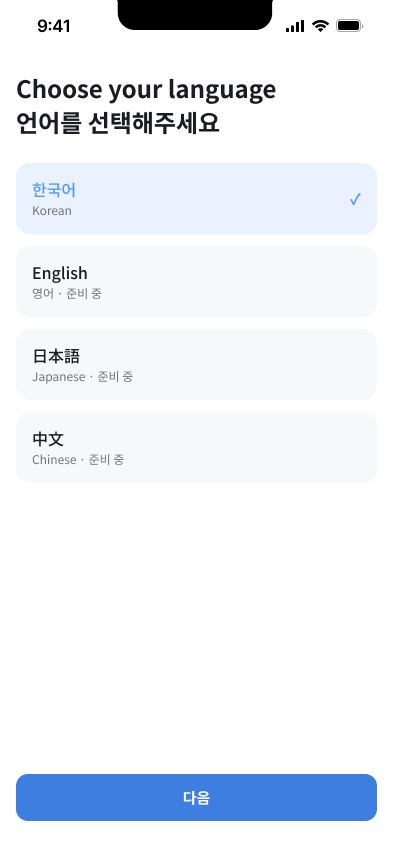
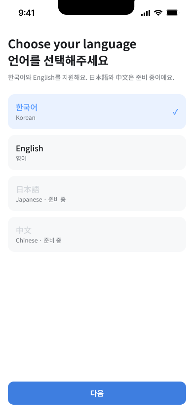
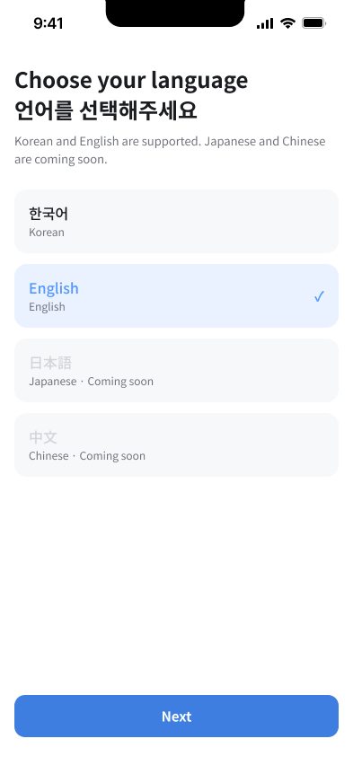

# Figma 정합성 수정 요청

- 감사일: 2026-09-05
- 상태: Open — 아래 P0 blocker와 major가 닫히기 전 Figma 전체를 구현 승인 상태로 보지 않음
- 대상: `02 UI Design`의 현재 구현 frame 52개와 `01 Components`의 최상위 component 49개
- 디자인 파일: [Nullnull UI Design](https://www.figma.com/design/C3tTNClo9JH8tb4qpQgP61/Nullnull-UI-Design?node-id=386-257&p=f)

이 문서는 공개 Figma의 실제 화면·layer를 제품 요구사항, OpenAPI, 기능 인벤토리와
대조한 change request다. 현재 frame 수 52와 component 수 49는 맞지만, 개수 일치는
구현 준비 완료를 뜻하지 않는다. Frontend 담당은 Figma를 수정하고 node/state 증거를
이 문서에 연결하며, Backend/AI 담당은 계약 의미를, 총괄 PM은 범위·문구·제출 주장을
확인한다.

2026-09-06 PR #6 검토에서 확인한 추가 gap은 FCR-010~015로 등록했다. 이 변경은
Frontend가 작업을 시작할 수 있도록 node·계약·완료 증거를 연결하는 문서 기준선이며
Figma 자체를 수정하지 않는다. 실제 frame/component 수정과 before/after 증거는
Frontend 담당자가 각 FCR을 닫을 때 제출한다.

## 수정 목록

| ID | Pri | 현재 Figma 증거 | 목표 상태 | 소유/검토 | 상태 |
| --- | --- | --- | --- | --- | --- |
| FCR-001 | P0 blocker | A-2 `388:277`의 English가 `영어 · 준비 중`으로 표시됨 | `한국어`와 `English`는 선택 가능, `日本語`·`中文`만 disabled `준비 중`; KO/EN 전환·복구 variant 추가 | FE / BE·AI·PM | Figma 수정 완료 · 검토 대기 (2026-09-07, [증거](#fcr-001-증거)) |
| FCR-002 | P0 blocker | feed `391:310`, `396:2926`과 post `398:611`에 `팔로잉`·`최신`, 검색, unread bell, 활성 `팔로우`가 보임 | P0에서는 제거가 기본. 꼭 남기면 disabled `준비 중`과 이유를 표시하고 route/API 호출 0건 | FE / PM | Figma 수정 완료 · 검토 대기 (2026-09-07, [증거](#fcr-002-증거)) |
| FCR-003 | P0 blocker | feed에 `혼잡도 낮은 순`, `지금 가기 좋아요`, `서울` chip이 활성 control처럼 보임 | `listFeed`에 filter 계약이 생기기 전 숨김. P1에서도 source·시점 비교 적격성 없는 혼합 순위 금지 | FE / BE·AI | Open |
| FCR-004 | P0 blocker | F 흐름에 setup `415:2268`, loading `415:2413`, P1 DAY preview `439:3104`, applied `417:2412`만 있고 P0 ITEM READY preview가 없음 | P0 ITEM 전용 READY frame/variant 추가: before/after, provenance, lock validation, eligible metric, `적용`/`현재 일정 유지` | FE / BE·AI·PM | Open |
| FCR-005 | P0 blocker | loading/preview에 `경로 계산`, `지도 provider 미정`; 여행 보기 `410:1738`에 `↓ 1.2km · 도보 15분`; Live `418:2523`에 `돌아가도 15분/30분`, `+8분/+5분`이 있으나 P0 route provider는 미결정 | ITEM copy를 혼잡·고정 조건 확인으로 변경. provider가 없으면 목록/timeline을 동등하게 제공하고 route 기반 시간·우회 수치·placeholder를 제거. 직선거리는 FCR-009 기준을 충족할 때만 표시 | FE / BE·AI | Open |
| FCR-006 | P0 blocker | S14 `422:2925`가 `로그인하면 일정을 저장할 수 있어요`와 활성 login affordance를 노출 | `이 기기의 익명 세션에 저장돼요`처럼 실제 보존 방식을 설명하고 login은 disabled `준비 중`; 요청 0건 | FE / BE·AI·PM | Open |
| FCR-007 | P0 blocker | S15 `423:2967`가 데이터 상태를 5개로 설명하고 `REPLAY`를 누락. `Data / StateLabel` component에는 이미 6개 variant가 있음 | component를 다시 만들지 않고 S15 설명을 `LIVE`, `FORECAST`, `REPLAY`, `QUALITATIVE`, `STALE`, `UNAVAILABLE` 6개와 관측/대상 시각 차이로 수정 | FE / BE·AI | Open |
| FCR-008 | P0 major | S11 `418:2523`에 장소명 검색이 있으나 화면-API 연결이 명시되지 않음 | `searchPlaces` → canonical 선택 → `getLivePlace`; coverage가 없으면 `UNAVAILABLE`, loading/empty/error variant 제공 | FE / BE·AI | Open |
| FCR-009 | P0 major | post/detail 거리값은 기준점·산식이 불명확해 보일 수 있음 | trip anchor/선택 장소 등 거리 기준과 source를 함께 표시. 기준이 없으면 거리값을 숨기고 unavailable reason 제공 | FE / BE·AI | Open |
| FCR-010 | P0 blocker | 최적화 setup `415:2268`에 `전체 / Day1` scope chip이 노출되고 `경복궁 하나만`이라는 고정 설명만 있으며 `targetItemId`를 고르는 control이 없음 | P0에서는 ITEM만 활성화하고 대상 TripItem을 명시적으로 선택·확인해 `CreateItemOptimizationRequest.targetItemId`로 전송. DAY/TRIP은 숨기거나 disabled `준비 중`이며 요청 0건 | FE / BE·AI | Open |
| FCR-011 | P0 blocker | feed `392:368`, post 장소 카드 `399:613`, Live `418:5199`의 `실시간 관측`에 `ⓒ한국관광공사`가 결합돼 서울 실시간 원천과 KTO 예측/관광정보가 뒤섞임 | `SEOUL_CITYDATA`는 API의 서울특별시 attribution·`officialUrl`·`licenseUrl`을 그대로 표시하고 KTO 장소 정보·예측 attribution과 시각적으로 분리 | FE / BE·AI·PM | Open |
| FCR-012 | P0 blocker | Live `418:2523`은 `Map / Base`와 marker가 보이는 화면만 있고 map capability OFF의 목록-only variant가 없음 | map OFF를 P0 기본으로 하는 목록-only default/loading/empty/error/unavailable variant를 추가. map ON은 provider·license·attribution 승인 뒤에만 열고 동일 filter/selection을 유지 | FE / BE·AI | Open |
| FCR-013 | P0 blocker | 여행 보기 `410:1738`에 계약 연결 없이 `더 여유로운 날짜가 있어요 · 비교하기`가 노출됨 | P0에서 제거하거나 `getPlaceCrowdForecast`와 temporal comparison eligibility, 표시 threshold, unavailable 상태를 기능 ID에 연결. 단순 예보 비교와 적용 가능한 최적화 제안을 구분 | FE / BE·AI·PM | Open |
| FCR-014 | P0 major | 계산 중 `415:2413`의 `취소하고 My Trip으로`가 한국어 tab 명칭과 다르고, client 이탈/timeout이 server run 취소를 뜻하는 것처럼 보임 | 취소 operation이 없는 P0에서는 `내 여행으로 돌아가기`처럼 navigation만 표현하고 run은 URL로 다시 조회할 수 있음을 안내. 실제 취소는 별도 계약·상태 전이 뒤에만 노출 | FE / BE·AI | Open |
| FCR-015 | P0 blocker | 적용 완료 `417:2412`의 되돌리기가 toast action뿐이고 적용 대상 revision·24시간 `revertUntil`·만료 상태를 지속적으로 확인할 수 없음 | `ApplyOptimizationDecision`의 전후 revision·`revertUntil`을 persistent UI로 표시하고 가능/진행/완료/`REVERT_WINDOW_EXPIRED` 상태를 제공. toast는 보조 피드백으로만 사용 | FE / BE·AI | Open |

`CON-003` 계약은 PR #9의 merge commit `1b3931c`로 `main`에 반영됐다. 따라서
FCR-010/011/015의 Backend/AI 계약 선행조건은 충족됐다. 세 FCR의 `Open` 상태는
Frontend가 실제 Figma node/variant와 before/after 증거를 아직 제출하지 않았다는
뜻이며 계약 미확정을 의미하지 않는다.

## 추가 항목 착수 연결

| FCR | 기능 ID | 계약 기준 | Frontend 착수 조건 |
| --- | --- | --- | --- |
| FCR-010 | `FR-OPT-01` | `createOptimization`, `CreateItemOptimizationRequest.targetItemId` | OpenAPI 0.2.0 생성 union으로 ITEM 대상 선택과 DAY/TRIP disabled state 구현 |
| FCR-011 | `FR-FED-01/02`, `FR-PST-01`, `FR-PLC-01`, `FR-LIV-03` | `DataProvenance.source/sourceState/attribution/officialUrl/licenseUrl` | OpenAPI example의 attribution과 URL을 그대로 사용하고 provider 문구를 hard-code하지 않음 |
| FCR-012 | `FR-LIV-01` | `queryLiveAreas`, `listLiveAreaPlaces`, map capability | map OFF 목록을 기본 acceptance로 먼저 완성 |
| FCR-013 | `FR-TRP-01`, `FR-DAT-02`, `FR-DAT-05` | `getTrip`, `getPlaceCrowdForecast`, `comparisonEligible` | 계약 연결·비교 규칙이 없으면 banner를 구현하지 않음 |
| FCR-014 | `FR-OPT-03` | `getOptimization`; cancel operation 없음 | navigation과 server run 취소를 구분한 copy/state 승인 |
| FCR-015 | `FR-OPT-09` | `ApplyOptimizationDecision`, `RevertOptimizationDecision`, `REVERT_WINDOW_EXPIRED` | OpenAPI 0.2.0 생성 union으로 persistent applied/revert/expired state와 keyboard 접근성 구현 |

## 권장 문구와 시각 규칙

- A-2 helper: `한국어와 English를 지원해요. 日本語와 中文은 준비 중이에요.`
- S14 guest: `로그인 없이 시작했어요` / `여행은 이 기기의 익명 세션에 저장돼요.`
- S14 login: `로그인 · 준비 중`을 disabled control로 제공하거나 제출 profile에서 숨긴다.
- ITEM loading: `혼잡 정보와 고정한 조건을 확인하고 있어요.`
- ITEM loading 이탈: `내 여행으로 돌아가기` — server run 취소를 의미하지 않는다.
- ITEM decision: 긍정 단일 `확인` 대신 `이 변경 적용`과 `현재 일정 유지`를 같은
  decision bar에 둔다.
- Live P0: map 없이도 검색·목록·선택·상세 진입이 완결되어야 한다.
- mixed source: provider 이름을 화면에서 고정하지 않고 응답의 검토된 attribution을
  source state와 함께 표시한다.
- 수치·색만으로 상태를 전달하지 않고 label, 기준 시각, 출처와 unavailable reason을
  함께 둔다.
- 공모전 제출 profile에서는 구현되지 않은 P1 control을 보여 주는 것보다 제거하는 것을
  기본으로 한다.

## 종료 조건

각 FCR은 다음 증거가 모두 있을 때만 `Closed`로 바꾼다.

1. 수정된 Figma node URL과 변경 전/후 screenshot
2. [기능 인벤토리](../product/FUNCTIONAL_INVENTORY.md)의 기능 ID·operationId 연결
3. KO/EN 360px, keyboard, disabled/loading/error state 확인
4. Backend/AI의 계약 검토와 총괄 PM의 범위·문구 승인
5. 실제 구현 후 Storybook/Playwright test ID

FCR-004 등 새 상태를 top-level frame으로 만들면 현재 52개 수가 늘어난다. 기존
component variant로 만들면 52개를 유지할 수 있다. 어느 방식을 택하든 숫자를 맞추기
위해 상태를 숨기지 말고 [Figma 핸드오프](./FIGMA_HANDOFF.md)와 검증 스크립트의
inventory를 같은 change set에서 갱신한다.

## FCR-001 증거

- 수정일: 2026-09-07, 수정자: Frontend (Claude Code Figma MCP)
- 상태: Figma 수정 완료. 종료 조건 1~3은 아래 증거로 충족했고, 4(Backend/AI 계약 검토·PM 문구 승인)와 5(구현 후 Storybook/Playwright test ID)는 대기 중이다.

| 항목 | 값 |
| --- | --- |
| KO 선택 frame | [`388:277` A-2 / language · P0](https://www.figma.com/design/C3tTNClo9JH8tb4qpQgP61/Nullnull-UI-Design?node-id=388-277) |
| EN 선택 variant frame | [`643:4088` A-2 / language · P0 · EN selected](https://www.figma.com/design/C3tTNClo9JH8tb4qpQgP61/Nullnull-UI-Design?node-id=643-4088) (A-3 오른쪽, x=1359) |
| 변경 전 |  |
| 변경 후 KO |  |
| 변경 후 EN |  |

변경 내용:

1. `388:290` English 부제 `영어 · 준비 중` → `영어`. English row는 한국어 row와 같은 선택 가능 스타일이다.
2. `388:294` 日本語, `388:299` 中文의 lang-main fill을 semantic variable `color/text/disabled`(→ `wf/gray-300`)에 바인딩했다. 부제의 `준비 중` label은 유지해 색만으로 상태를 전달하지 않는다.
3. title 아래 `643:4040` helper text 추가: `한국어와 English를 지원해요. 日本語와 中文은 준비 중이에요.` (`color/text/secondary`, 13px). title과 helper는 `643:4041` `head` auto-layout(gap 8)으로 묶었다.
4. `643:4088` EN selected variant: English row가 `brand/blue-soft` 배경·`brand/blue` 텍스트·check, 한국어 row는 기본 스타일. UI copy는 English(`Korean`, `English`, `Japanese · Coming soon`, `Chinese · Coming soon`, helper 영문, CTA `Next`). title은 원본과 같은 이중 언어 그대로다.
5. 구현 acceptance: KO/EN은 `updatePreferences(locale)`로 저장 후 새로고침 복구, JA/ZH row는 focus 가능하지만 `aria-disabled`이며 선택·저장·API 호출 0건. 360px에서 helper 2줄 wrap을 확인했다.

top-level frame이 1개 늘어 `02 UI Design` 구현 frame은 53개다. [Figma 핸드오프](./FIGMA_HANDOFF.md)와 `scripts/validate_docs.py`의 inventory를 같은 change set에서 53으로 갱신했다.

## FCR-002 증거

- 수정일: 2026-09-07, 수정자: Frontend (Claude Code Figma MCP)
- 상태: Figma 수정 완료. P0 기본값대로 P1 control을 **제거**했으며 disabled `준비 중`으로 남기지 않았다. 종료 조건 4(PM 범위 승인)와 5(구현 후 test ID)는 대기 중이다.

| 항목 | 값 |
| --- | --- |
| feed 여행 없음 | [`391:310`](https://www.figma.com/design/C3tTNClo9JH8tb4qpQgP61/Nullnull-UI-Design?node-id=391-310) — [변경 전](./evidence/fcr-002/before-391-310.jpg) · [변경 후](./evidence/fcr-002/after-391-310.jpg) |
| feed 활성 여행 | [`396:2926`](https://www.figma.com/design/C3tTNClo9JH8tb4qpQgP61/Nullnull-UI-Design?node-id=396-2926) — [변경 전](./evidence/fcr-002/before-396-2926.jpg) · [변경 후](./evidence/fcr-002/after-396-2926.jpg) |
| 게시물 상세 | [`398:611`](https://www.figma.com/design/C3tTNClo9JH8tb4qpQgP61/Nullnull-UI-Design?node-id=398-611) — [변경 전](./evidence/fcr-002/before-398-611.jpg) · [변경 후](./evidence/fcr-002/after-398-611.jpg) |
| 후보 저장 - 여행 선택 | [`399:658` S03-C1 / choose-trip · P0](https://www.figma.com/design/C3tTNClo9JH8tb4qpQgP61/Nullnull-UI-Design?node-id=399-658) — 변경 전 스크린샷 없음(구조는 S03-F1과 동일) · [변경 후](./evidence/fcr-002/after-399-658.jpg) |
| 후보 저장 - 저장 완료 | [`399:843` S03-C2 / saved · P0](https://www.figma.com/design/C3tTNClo9JH8tb4qpQgP61/Nullnull-UI-Design?node-id=399-843) — 변경 전 스크린샷 없음 · [변경 후](./evidence/fcr-002/after-399-843.jpg) |
| 후보 저장 - 중복 | [`399:1011` S03-C3 / duplicate · P0](https://www.figma.com/design/C3tTNClo9JH8tb4qpQgP61/Nullnull-UI-Design?node-id=399-1011) — 변경 전 스크린샷 없음 · [변경 후](./evidence/fcr-002/after-399-1011.jpg) |
| 후보 저장 - 오류 | [`399:1179` S03-C4 / error · P0 ERROR](https://www.figma.com/design/C3tTNClo9JH8tb4qpQgP61/Nullnull-UI-Design?node-id=399-1179) — 변경 전 스크린샷 없음 · [변경 후](./evidence/fcr-002/after-399-1179.jpg) |

변경 내용:

1. feed 두 frame의 NavBar에서 `btn/search`(`391:314`, `396:2930`)와 unread badge가 있는 `btn/bell`(`391:317`, `396:2932`)을 제거했다. 남은 `btn/filter`는 `FCR-003` 범위이며 그때 함께 판단한다. `nav-actions`(`391:313`, `396:2929`)는 원래 오른쪽 끝(x+w=385)에 맞춰 재배치했다.
2. `추천`·`팔로잉`·`최신` `Top tabs` row(`391:325`, `396:2938`, 40px)를 통째로 제거했다. P0 feed는 단일 목록이므로 `추천` 단독 tab도 두지 않았다. 아래 요소(Filter chips, Empty banner/Trip context, FeedPost card 4장)를 40px 위로 올렸고 TabBar·StatusBar는 그대로다.
3. 게시물 상세 author row(`399:631`)의 활성 `팔로우` button(`432:2990`)을 제거했다. row는 auto-layout이라 좋아요 count가 오른쪽 끝을 유지한다.
4. 구현 acceptance: `/feed`와 `/posts/:postId`는 검색·알림·팔로우·정렬 tab 관련 route와 API 호출이 0건이다. 카드의 `+`, 게시물 저장(`savePost`), 좋아요 등 P0 action은 유지된다.
5. 후보 저장 흐름의 배경 frame 4개(`S03-C1 / choose-trip · P0` `399:658`, `S03-C2 / saved · P0` `399:843`, `S03-C3 / duplicate · P0` `399:1011`, `S03-C4 / error · P0 ERROR` `399:1179`)는 모두 `S03-F1` feed를 복제한 배경 위에 sheet/toast를 얹은 구조라 1·2와 같은 검색·알림·tab줄 문제를 그대로 갖고 있었다. 네 화면 모두 동일하게 `btn/search`·`btn/bell`·`Top tabs` row를 제거하고 하위 콘텐츠를 40px 올렸으며 `nav-actions`를 오른쪽 끝으로 재정렬했다. `Sheet / TripPicker`, `Feedback / Toast`, `dim` 오버레이는 이동하지 않았다(원래도 배경과 독립된 절대 좌표).
   - 이 4개는 변경 전 스크린샷을 별도로 찍지 않고 바로 수정했다. 변경 전 구조는 `S03-F0`/`S03-F1`(위 1·2 before 스크린샷)과 완전히 동일한 NavBar/tab 레이아웃이었음을 `get_metadata` 원본 덤프로 확인했으며, after 스크린샷만 증거로 남긴다.
