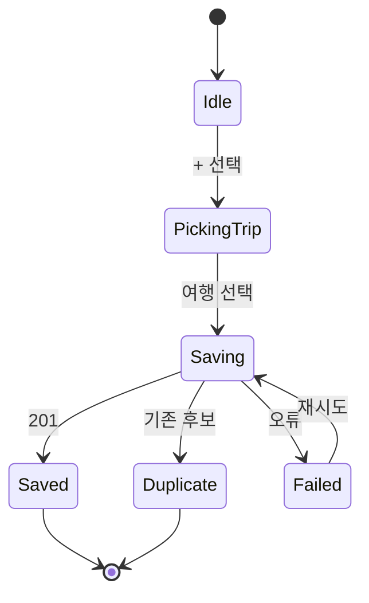

# Figma 개발 핸드오프

- 상태: Conditional — 계약 기준선은 Accepted, Figma P0 수정 요청은 Open
- 확인일: 2026-09-05
- 디자인 파일: [Nullnull UI Design](https://www.figma.com/design/C3tTNClo9JH8tb4qpQgP61/Nullnull-UI-Design?node-id=386-257&p=f&t=S1EgamFkCak0FCZy-0)
- 정본 페이지: `02 UI Design`

이 문서는 화면을 그대로 나열하는 대신 개발에 필요한 route, 상태, 도메인 변화, API
의존성과 2인의 책임을 연결한다. 2026-09-05 공개 Figma를 직접 대조한 결과 현재 구현
frame 52개와 최상위 component 49개는 확인했지만, 언어·feed·ITEM preview·guest·data
guide 등에 P0 불일치가 남아 있다. 영향 화면은
[Figma 정합성 수정 요청](./FIGMA_CHANGE_REQUESTS.md)이 닫히기 전 구현 승인 상태가
아니다. Figma의 시각적 수치와 component variant가 이 문서와 다르면 Figma를 확인하되,
도메인 의미와 API 동작은 OpenAPI/제품 요구사항을 따른다. 49개 component의 exact
layer 이름과 상세 계약은 [Component Catalog](./COMPONENT_CATALOG.md)가 정본이다.

역할 명칭은 다음과 같다.

- **Frontend**: React/PWA 라우팅, 화면 상태, 폼 검증, 접근성, generated API client와 계측을 담당한다.
- **Backend/AI**: Spring API, 도메인 규칙, DB transaction, 외부 데이터, optimizer/LLM 경계와 운영 계측을 담당한다.
- 둘 다 OpenAPI 변경과 화면-API acceptance를 같이 review한다. 임의 JSON이나 임시 mock 구조를 병행 계약으로 만들지 않는다.

## 1. Figma 구조

| 그룹 | Node | 범위 |
| --- | --- | --- |
| A | `511:3934` | 시작/언어/소개 |
| B | `511:3937` | 탐색·저장 |
| C | `511:3940` | 여행 만들기 |
| D | `511:3943` | 후보 저장 규칙 |
| E | `511:3946` | 내 여행 보기·편집 |
| F | `511:3949` | AI 최적화 |
| G | `511:3952` | Live |
| H | `511:3955` | 프로필·알림·데이터 안내 |
| I | `511:3958` | replay/error/stale 개발 참고 |

Figma page의 용도:

- `00 Wireframes`: 흐름의 초기 근거. 최신 UI와 충돌하면 정본이 아니다.
- `01 Components`: 재사용 component와 variant의 시각 정본.
- `02 UI Design`: 실제 구현 화면·우선순위·상태의 정본.

## 2. 전역 정보 구조

### Route

| Route | Screen | Priority | 진입/비고 |
| --- | --- | --- | --- |
| `/` | splash 또는 feed redirect | P0 | bootstrap 완료 후 `/feed` 또는 `/start` |
| `/language` | 언어 선택 | P0 | 최초 1회, profile에서 재진입 가능 |
| `/intro` | 서비스 소개 | P0 | skip 가능 |
| `/start` | 여행 생성 wizard | P0 | active trip이 없을 때 기본 CTA |
| `/feed` | 피드 | P0 | active trip 여부 variant |
| `/posts/:postId` | 게시물 상세 | P0 | deep link 지원 |
| `/trip/:tripId` | 내 여행 보기/편집 | P0 | query 대신 route state 최소화 |
| `/trip/:tripId/optimizations/:runId` | 최적화 preview/result | P0 | refresh 복원 가능해야 함 |
| `/live` | Live 목록/지도 | P0 | 목록 필수; 지도는 provider capability와 attribution 승인 시, replay mode 표시 |
| `/profile` | 프로필/설정 | P0 | 데이터 안내 진입 |
| `/about-data` | 데이터 안내 | P0 | source/state 의미 설명 |
| `/search` | 통합 검색 | P1 | P0은 modal/sheet 검색 사용 |
| `/notifications` | 알림 | P1 | unread deep link 포함 |
| `/nearby/:poiId` | 주변 추천 | P1 | 또는 Live inline panel |
| `/posts/new` | 게시물 작성 | P1 | 미디어 upload 포함 |

### Mobile navigation

- P0 tab: `홈`, `내 여행`, `Live`, `프로필`.
- P1에서 `검색`을 추가한다.
- 내 여행 tab은 active trip이 없으면 `/start`, 있으면 `/trip/:activeTripId`로 간다.
- sheet/dialog가 열려 있을 때 bottom tab은 focus order에서 제외하고 background를 inert 처리한다.
- browser back은 열린 sheet/dialog를 먼저 닫고, 그다음 route history를 이동한다.

## 3. 화면 인벤토리

### A. 시작

| Figma node | 화면 | Route | 상태/동작 | 데이터/API |
| --- | --- | --- | --- | --- |
| `388:257` | A-1 splash | `/` | logo, bootstrap; 장기 loading이면 retry | `createDemoSession`, `issueCsrfToken`, `getCurrentOwner`, readiness |
| `388:277` | A-2 language | `/language` | 목표: 한국어·English 선택/확정, 日本語·中文 disabled `준비 중`; 현재 English 오표기는 `FCR-001` | `updatePreferences(locale)`; bootstrap 전에는 local draft |
| `388:321` | A-3 intro | `/intro` | “한국인이 진짜 가는 곳”, 계속/건너뛰기 | local onboarding state |

Acceptance:

- bootstrap 실패가 빈 화면이 되지 않는다.
- 이미 onboarding을 마친 사용자는 splash 뒤 feed로 이동한다.
- redirect loop가 없어야 한다.
- 한국어와 English는 P0에서 실제 UI copy·날짜·숫자 표기가 변경되고, 준비 중 언어는 focus는 받되 선택/저장되지 않는다.

### B. 탐색과 후보 저장

| Figma node | 화면 | Route/overlay | 상태/동작 | 데이터/API |
| --- | --- | --- | --- | --- |
| `391:310` | S03-F0 여행 없음 feed | `/feed` | empty trip CTA, 게시물 탐색 | `GET /feed`, `GET /trips` |
| `396:2926` | S03-F1 활성 여행 feed | `/feed` | active trip context, `+` 저장 | `GET /feed?tripId=` |
| `398:611` | S03-D 게시물 상세 | `/posts/:postId` | 장소/근거/저장 action | `GET /posts/:postId` |
| `399:658` | S03-C1 여행 선택 | sheet | 대상 여행 선택, 새 여행 만들기 | `GET /trips` |
| `399:843` | S03-C2 저장 완료 | sheet/result | 후보 생성, 일정은 미변경 | `POST /trips/:id/candidates` |
| `399:1011` | S03-C3 중복 | sheet/result | 기존 후보로 이동, row 추가 안 함 | API `duplicate=true` 또는 200 existing |
| `399:1179` | S03-C4 저장 오류 | sheet/error | “일정은 바뀌지 않음”, 재시도 | Problem Details |
| `409:1595` | S06-1 저장 sheet | reusable sheet | 피드/상세 공통 | 위와 동일 |

상태 전이:



규칙:

- 중복 판단 key는 기본 `(trip_id, canonical_poi_id)`이다. post만 다르고 장소가 같아도 후보는 하나다.
- 원본 post 관계는 candidate source metadata로 추가할 수 있으나 후보 row를 중복 생성하지 않는다.
- 저장 완료 CTA는 “일정 보기”가 아니라 “후보 보기/내 여행” 의미여야 한다.
- P0에서는 현재 Figma에 보이는 `팔로잉`/`최신`, 전역 검색, unread bell, 작성자
  `팔로우`를 제거한다. 꼭 남기면 disabled `준비 중`과 이유를 제공하고 route/API를
  호출하지 않는다(`FCR-002`).
- `혼잡도 낮은 순`, `지금 가기 좋아요`, 지역 chip은 `listFeed` filter와 비교 적격성
  계약이 생기기 전 숨긴다. source가 다른 혼잡 값을 하나의 순위로 만들지 않는다
  (`FCR-003`).

### C. 여행 만들기

| Figma node | 화면 | Step | 입력/검증 | API |
| --- | --- | --- | --- | --- |
| `438:3012` | S02-1 날짜 | 1 | start/end, timezone; 역전·과도한 범위 차단 | local draft |
| `438:3108` | S02-2 관심사 | 2 | 다중 chip, 최소 0 허용 후 추천 품질 안내 | local draft |
| `438:3134` | S02-3 계획 수준 | 3 | `NOTHING`/`MUST_VISIT_ONLY`/`MOSTLY_PLANNED` | local draft |
| `438:3158` | S02-4B 필수 장소 | 4 | canonical POI 매핑, 검색/제거 | place search |
| `400:1201` | S02-4C 입력 방식 | 4 | 붙여넣기/직접 입력 선택 | 없음 |
| `401:1221` | S02-4C-A 붙여넣기 | 4 | 원문 비저장; parse 상태와 수정 제공 | import parse/remap |
| `438:3199` | S02-4C-C 직접 입력 | 4 | 날짜별 직접 장소 구성 | place search/local draft |
| `438:3259` | S02-5C 확인 | 5 | 구조화 결과 최종 확인 | `POST /trips` 또는 import confirm |
| `384:5673` | Final S02-5 추천 draft | result | P0 결정적 seed 일정 | trip detail |
| `440:3244` | S02-6 AI draft | result | P1, AI 생성임과 근거 표시 | optimization P1 |

Wizard 규칙:

- step별 입력은 sessionStorage/local state에 복구 가능하게 저장한다. 붙여넣기 원문은 persistence 대상에서 제외한다.
- 서버에는 마지막 확인 시 구조화된 값만 보낸다.
- 뒤로 이동해도 이미 입력한 값이 보존된다.
- 생성 요청에는 `Idempotency-Key`가 필요하다.
- final confirmation 전에 서버 side canonical POI와 날짜 범위를 다시 검증한다.
- 별도 제목 step은 없다. `createTrip.title`을 생략하면 서버가 session locale에 맞춰
  `새 여행`/`New trip` 기본값을 결정적으로 만들고, 나중에 편집할 수 있다.

### D/E. 내 여행 보기·편집

| Figma node | 화면 | UI state | 동작/API |
| --- | --- | --- | --- |
| `410:1738` | S07-1 보기 | view | trip, day, items, candidate count 조회 |
| `411:1837` | S07-2 편집 | edit | local edit buffer, save/cancel |
| `527:4085` | S07-2 시간 편집 | edit-time | item time/time lock 변경 |
| `412:1912` | S07-8 후보 panel | overlay | 후보 목록, 날짜 선택 후 일정화 |
| `413:2020` | S07-9 폐기 dialog | dirty-exit | 변경 폐기/계속 편집 |
| `413:2081` | S07-7 필수 방문 잠금 해제 | confirm | MUST_VISIT constraint 해제 |
| `414:2347`, `527:4537` | S07-6 교체 비교 | compare | 기존/대안 비교 후 확정 |
| `476:3409` | S07-3 장소 검색 | search | debounce, empty/error/loading |
| `479:3497` | S07-5 교체 대상 | target-picker | 교체할 item 선택 |
| `479:3816`, `527:4380` | S07-4 추가 완료 | result | 새 item 강조, version 갱신 |
| `521:3976`, `527:4695` | S07-10 날짜 이동 | move-date | 유효 날짜 선택, 순서 결정 |
| `527:3876` | S07-10b 날짜 잠금 확인 | conflict-confirm | date lock 해제 의사 확인 |

편집 transaction:

- UI는 여러 변경을 buffer할 수 있으나 저장 시 server command를 명시한다.
- `If-Match: "<tripVersion>"`로 stale write를 차단한다.
- 충돌이면 최신 trip을 다시 받아 사용자의 local change와 충돌 항목을 안내한다.
- 순서는 `(trip_date, position)`으로 결정하며 같은 날짜 position은 중복될 수 없다.
- 일정화 성공 후 원본 candidate는 `SCHEDULED`로 바꾸고 `trip_item_id`를 연결한다.
- 일정 item 삭제가 후보 복원인지 완전 제거인지는 사용자가 고르게 한다. 기본값은 후보 복원이다.
- 예약 잠금은 UI에 reservation 여부/메모가 있을 때만 노출하고, 최적화는 절대 자동 해제하지 않는다.

### F. 최적화

| Figma node | 화면 | 상태 | 동작 | API |
| --- | --- | --- | --- | --- |
| `415:2268` | S09-0 항목 설정 | setup | item/scope, 잠금, 후보 포함 OFF | `POST /trips/:id/optimizations` |
| `415:2413` | S09-1 계산 중 | loading | polling, cancel/back, timeout | `GET /optimizations/:runId` |
| `TBD` | S09-2 ITEM preview (`FCR-004`) | preview P0 | item before/after, provenance, lock validation, APPLY/KEEP | same + decision |
| `439:3104` | S09-D1 하루 preview | preview P1 | day scope before/after | same |
| `417:2412` | S09-3 적용 완료 | applied | revision, undo CTA | decision/revert |
| `417:2567` | REF S09 오류 | error reference | code별 문구/CTA | Problem Details |
| `485:3517` | REF stale | stale | `TRIP_CHANGED` 재계산 | recompute |

P0 run state:

`QUEUED → RUNNING → READY → APPLIED | KEPT | EXPIRED`, 실패 시 `FAILED`. `APPLIED` 뒤 되돌리면 decision log는 보존하고 새 trip revision을 만든다.

현재 Figma에는 `READY`의 P0 ITEM 화면이 없다. `439:3104`는 P1 DAY 범위이므로 이를
P0 증거로 대신할 수 없다. `FCR-004` node/variant가 추가되고 아래 preview 계약과
decision bar가 시각적으로 검증될 때까지 최적화 UI slice는 착수하지 않는다. P0에
route provider가 없는 동안 loading copy의 `경로 계산`과 `지도 provider 미정`을 제거하고
목록/timeline fallback을 기본으로 한다(`FCR-005`).

Figma 오류 계약:

| Code | 사용자 메시지 | 기본 CTA | HTTP 의미 |
| --- | --- | --- | --- |
| `TRIP_CHANGED` | 다른 곳에서 일정이 바뀌었어요. | 최신 일정으로 다시 계산 | 409 |
| `DATA_CHANGED` | 최신 혼잡 정보에서 개선 방향이 달라졌어요. | 다시 계산 | 409 |
| `LOCK_CONFLICT` | 고정한 일정과 충돌해 적용할 수 없어요. | 고정 조건 확인 | 422/409 |
| `ROUTE_UNAVAILABLE` | 경로를 확인하지 못했어요. | 재시도 또는 현재 일정 유지 | 503 |
| `NO_IMPROVEMENT` | 현재 일정이 조건 안에서 가장 적합해요. | 내 여행으로 돌아가기 | 422 |
| `APPLY_FAILED` | 일정은 바뀌지 않았어요. | 다시 시도 | 500/503 |

최적화 preview 계약:

- before/after 각각 item id, 날짜, 시간, position, crowd 상태를 제공한다.
- 수치 delta는 `comparisonEligible=true`일 때만 노출한다.
- 검증된 이동 영향 값이 있을 때만 혼잡 개선과 함께 표시한다. provider가 없거나
  비교 불가하면 숫자를 만들지 않고 unavailable reason을 표시한다.
- 사용자의 모든 constraint가 보존됐는지 서버가 validation summary로 응답한다.
- preview의 `inputTripVersion`, `dataFingerprint`, `expiresAt`을 apply 시 검증한다.
- apply는 한 DB transaction이며 실패 응답은 “일정 미변경”을 보장한다.

### G. Live

| Figma node | 화면 | Pri/state | 동작 | API |
| --- | --- | --- | --- | --- |
| `418:2523` | S11-1 Live | P0 | 목록 필수, map capability, 영역 선택 | `queryLiveAreas`, `listLiveAreaPlaces` |
| `419:2617` | S11-2 장소 상세 | P0 | crowd, freshness, itinerary action | `GET /live/places/:poiId` |
| `420:2821` | S11-3 대안 | P0 | relation + comparable metrics | `GET /places/:poiId/related` |
| `420:2950` | S11-N 후보 없음 | P0 empty | 비교 불가 이유/다른 필터 CTA | related result `NONE` |
| `421:2850` | S11-R replay | P0 demo | replay badge, snapshot timestamp | live APIs with `REPLAY` |
| `501:3750` | S11-4 재계획 진입 | P1 | current trip + explicit location consent | future live replan |

- S11-1의 장소 검색은 `searchPlaces`에서 canonical place를 고른 뒤 `getLivePlace`로
  coverage를 확인한다. 지원하지 않는 장소는 값을 합성하지 않고 `UNAVAILABLE`과
  다음 행동을 보여 주며 loading/empty/error state를 포함한다(`FCR-008`).
- 거리값은 trip anchor나 사용자가 선택한 기준 장소, 산식/source와 함께 표시한다.
  기준점이 없으면 값을 숨기고 unavailable reason을 제공한다(`FCR-009`).

Data state label:

| API state | UI label/처리 |
| --- | --- |
| `LIVE` | 실시간, 마지막 갱신 시각 |
| `FORECAST` | 예보, 대상 시각과 발표 시각 |
| `REPLAY` | 재현 데이터, 실제 현재값처럼 표현 금지 |
| `QUALITATIVE` | 정성 정보, 정밀 수치/차이 계산 금지 |
| `STALE` | 오래된 정보, stale 기준과 마지막 시각 |
| `UNAVAILABLE` | 데이터 없음, 안전한 대체 행동 제공 |

Candidate relation:

| 관계 | 의미 | UI |
| --- | --- | --- |
| `EXACT` | 공식/검증된 직접 연관 | 강한 근거 표기 가능 |
| `SIMILAR` | 카테고리·거리·규칙 기반 유사 | “비슷한 장소”와 이유 표시 |
| `NONE` | 유효 후보 없음 | empty state |
| `CHECKING` | 비동기 확인 중 | skeleton/loading |
| `UNKNOWN` | 근거 불충분 | 단정하지 않고 탐색 대안 제공 |

### H/I. 보조·개발 참고

| Figma node | 화면 | Priority | 구현 메모 |
| --- | --- | --- | --- |
| `422:2925` | S14 프로필 | P0 | guest 표시, login CTA, 내 여행, AI 최적화 이력, 여행별 관심사, locale, 데이터 안내, session 삭제 |
| `423:2967` | S15 데이터 안내 | P0 | 출처/상태/신뢰도/재현 의미 |
| `442:3344` | S12 알림 | P1 | item deep link, 개별 읽음, `모두 읽음`, unread count |
| `442:3370` | S10 주변 | P1 | 위치 동의·로컬 거리 계산 우선 |
| `417:2567` | S09 error reference | 개발 참조 | 실제 route로 노출하지 않음 |
| `485:3517` | stale reference | 개발 참조 | test fixture/Storybook story 제공 |

S14 P0 범위 정합성:

- 계정 로그인은 P1이다. P0 login CTA는 `준비 중`을 명시한 disabled control로 렌더링하고 route/API를 호출하지 않는다. 단순히 누르지 않는 가짜 CTA를 두지 않는다.
- 현재 Figma의 `로그인하면 일정을 저장할 수 있어요`는 사실과 다르다. 익명 session에
  저장된다는 문구로 바꾸고 활성 login affordance를 제거한다(`FCR-006`).
- `내 여행`은 `listTrips`를 사용하며 empty/loading/error와 active trip을 구분한다.
- `AI 최적화 이력`은 `listOptimizationHistory`로 run 상태, scope, 요청/완료 시각, decision만 보여 준다. 이력 목적으로 일정 before/after 본문을 별도 보존하지 않는다.
- `여행별 관심사`는 여행을 선택한 뒤 `getTrip`/`replaceTripInterests`로 수정하며 `If-Match`와 최신 ETag를 쓴다.
- `데이터 안내`는 `/about-data`로, 여행 row는 `/trip/:tripId`로 이동한다. 서버가 허용한 내부 deep link만 사용한다.

S15 P0 범위 정합성:

- 현재 Figma의 `데이터 상태 5가지`는 `REPLAY`를 누락한다. 6개 상태 `LIVE`,
  `FORECAST`, `REPLAY`, `QUALITATIVE`, `STALE`, `UNAVAILABLE`과 관측 시각/대상 시각의
  차이를 설명한다(`FCR-007`).
- 실제 readiness에 없는 source를 정상처럼 표시하지 않고 unavailable/degraded 이유를
  함께 보여 준다.

S12 P1 범위 정합성:

- `listNotifications`/`markNotificationRead`는 현재 계약을 사용한다.
- `모두 읽음`은 `markAllNotificationsRead`를 쓰며, 프론트에서 N개 개별 요청으로 희석하지 않는다.
- deep link는 내부 route allowlist를 통과해야 하며, 삭제된 대상은 안전한 fallback route와 안내를 제공한다.

## 4. 화면별 2인 delivery 책임

| 화면/Node | Frontend 책임 | Backend/AI 책임 | 공동 완료 조건 |
| --- | --- | --- | --- |
| A-1 `388:257` | bootstrap state, timeout/retry, redirect guard | session/`issueCsrfToken` bootstrap, readiness, cookie 정책 | 신규·정상·만료·새 tab session E2E |
| A-2 `388:277` | KO/EN 선택, JA/ZH disabled 표현, copy switch | locale 검증/저장, 미지원 locale 거부 | 재접속 복원과 영문 overflow QA |
| A-3 `388:321` | continue/skip, 중복 전환 방지 | onboarding preference 멱등 저장 | skip/완료·새로고침 E2E |
| Feed `391:310`, `396:2926` | trip 유무 variant, pagination, card/action state | feed cursor, active-trip projection, feedback allowlist | empty/loading/error/cursor reset |
| 게시물 `398:611` | detail/deep link, 게시물·후보 action 분리 | post/place/provenance read, ownership | 404·저장 상태 분리 |
| 후보 선택 `399:658`, `409:1595` | focus-trapped sheet, trip picker, new-trip route | trip list/active-trip, owner filter | no-trip·single·multiple 여행 |
| 후보 결과 `399:843`, `399:1011`, `399:1179` | saving/saved/duplicate/error·exact retry | candidate idempotency/unique key/Problem | 일정 version 미변경 불변식 |
| 여행 날짜·관심사·계획 `438:3012`, `438:3108`, `438:3134` | wizard draft, field validation, 뒤로가기 복구 | date/timezone/enum/관심사 최종 검증 | step 이동·refresh·경계값 QA |
| 필수 장소 `438:3158` | search/select/remove, unresolved state | `searchPlaces`, canonical mapping, seed constraint | 동명 장소·미해결 검증 |
| 입력 방식 `400:1201` | 수동/붙여넣기 분기와 draft 보존 | API 호출 없음 | 분기 전환 시 raw text 비영속 |
| 붙여넣기 `401:1221` | raw text 비영속, parse/remap UI | `parseTripImport`/`remapTripImport`, 비저장·비로그 | unresolved 수정 후에만 confirm |
| 직접 입력 `438:3199` | 날짜별 item draft/순서 편집 | place validation, create input 검증 | 범위 밖 item·중복 차단 |
| 확인·결과 `438:3259`, `384:5673` | 구조화 summary, submit lock, result route | `createTrip`/`confirmTripImport`, deterministic seed | 멱등·부분 trip 0건 |
| AI draft `440:3244` | P1 badge, 근거/확인 UI | 검증된 input 기반 제안, hallucination guard | AI 사용/미사용 명시 |
| 일정 보기·편집 `410:1738`, `411:1837`, `527:4085` | view/edit buffer, time editor, dirty state | `getTrip`/`updateTrip`/`updateTripItem`, ETag | stale merge 안내·묵시적 손실 0 |
| 후보 panel `412:1912` | status/date picker/empty state | candidate match/list, 일정화 transaction | candidate→item 원자 전이 |
| 폐기·잠금 `413:2020`, `413:2081`, `527:3876` | 결과를 명시한 confirm, focus restore | constraint 유형별 검증/해제, version check | cancel 시 변경 0·잠금 독립 |
| 교체 `414:2347`, `527:4537`, `479:3497` | target picker, before/alternative compare, confirm | related/provenance, `replaceTripItem` transaction | 비교 불가 수치 숨김 |
| 검색·추가 `476:3409`, `479:3816`, `527:4380` | debounce/결과/성공 highlight | `searchPlaces`/`addTripItem`, duplicate/position | retry·version update·focus 복귀 |
| 날짜 이동 `521:3976`, `527:4695` | 유효 날짜/순서 선택 | `updateTripItem`/`reorderTripItems`, lock/range 검증 | 날짜별 position 유일성 |
| 최적화 설정 `415:2268` | ITEM scope만 활성, lock summary, submit | `createOptimization`, snapshot/fingerprint | 승인 전 trip 미변경 |
| 계산 중 `415:2413` | polling/backoff, refresh restore, timeout/cancel UX | `getOptimization`, state machine/Retry-After | terminal state/네트워 끊김 QA |
| preview `439:3104` | before/after/delta/비교 적격성 | proposal, metrics, validation summary | fingerprint/expiry/잠금 표시 |
| 적용 `417:2412` | applied revision, undo CTA, 중복 방지 | decide/revert 원자 transaction/audit | apply/keep/revert E2E |
| 최적화 예외 `417:2567`, `485:3517` | code별 copy/CTA, 일정 미변경 표시 | 정확한 code/status, recompute guard | 6 error code fixture 전부 |
| Live 목록/지도 `418:2523` | 목록 필수, map은 provider capability, 동일 filter/selection | `queryLiveAreas`/`listLiveAreaPlaces`, freshness/source state | map OFF/list와 map ON 전환 상태 유지 |
| Live 상세 `419:2617` | crowd/freshness/action, unavailable UX | `getLivePlace`, source mapping/fallback | state·source·시각 100% 표시 |
| Live 대안 `420:2821`, `420:2950` | relation/reason/empty CTA | `listRelatedPlaces`, comparison eligibility | fake ranking/candidate 0 |
| Replay `421:2850` | replay badge/snapshot time을 상시 표시 | immutable replay dataset/readiness | 현재 Live로 오인 가능성 0 |
| Live 재계획 `501:3750` | P1 위치 동의/취소·목적 안내 | consent-bounded replan, 보존 가드 | 동의 없이 서버 위치 0건 |
| 프로필 `422:2925` | guest/준비 중 CTA, trips/history/interests/data UI | owner/trips/interests, `listOptimizationHistory` | 비로그인 P0 전 상태 QA |
| 데이터 안내 `423:2967` | 용어/출처/날짜를 읽기 쉽게 표현 | readiness/source catalog 현황 | API state 6종 copy 일치 |
| 알림 `442:3344` | P1 list/badge/개별·모두 읽음/deep link | `listNotifications`/`markNotificationRead`/`markAllNotificationsRead` | unread 멱등·deep-link allowlist |
| 주변 `442:3370` | P1 permission/denied/fallback UI | 최소 위치 처리·source 검증 | denied에서도 핵심 탐색 가능 |

### 공모전 심사 walk-through

심사 URL은 신규 익명 session에서 아래 순서가 끊기지 않아야 한다. 이는 새 Figma 화면을 추가하는 요구가 아니라 기존 화면의 제출 acceptance다.

1. A-1 `388:257` → A-2 `388:277`: 한국어 선택, 로그인 요구 없음
2. C 여행 생성 `438:3012`~`384:5673`: 일정 입력·확인과 active trip 생성
3. B Feed `391:310`/게시물 `398:611`: KTO 기반 장소와 텍스트 출처 확인
4. 후보 저장 `399:658`~`399:1179`: 특정 여행 후보로 저장되고 일정은 변하지 않음
5. D/E 내 여행 `410:1738`/`411:1837`: 후보 일정화·날짜/시간 변경
6. F 최적화 `415:2268`~`417:2412`: 변경 전후·근거 확인 후 사용자가 APPLY 또는 KEEP
7. G Live `418:2523`~`421:2850`: 기준시각과 LIVE/FORECAST/REPLAY 상태를 오인 없이 확인
8. I 데이터 안내 `423:2967`: 실제 KTO 활용, 출처, 상태 의미와 문의 안내 확인

제출 profile에서 로그인 CTA, JA/ZH, P1 알림·주변·게시물 작성·DAY/TRIP 최적화는 `준비 중`/capability OFF다. dead CTA나 클릭 가능한 가짜 기능으로 두지 않고 기능설명서의 구현 목록에서도 제외한다. 위치 permission prompt는 어떤 경로에서도 열리지 않는다.

## 5. Component 계약

Figma `01 Components`의 최상위 node 49개는 [Component Catalog](./COMPONENT_CATALOG.md)에서 이름·variant·data 소유자·접근성을 전부 추적한다. 아래는 핵심 도메인 component의 경계다.

| Component | 필수 variant/props | 금지 사항 |
| --- | --- | --- |
| `Card/Candidate` | relation, dataState, selected, actionState | 색만으로 상태 표현 |
| `Sheet/TripPicker` | loading, empty, saving, saved, duplicate, error | save 중 중복 요청 |
| `Action/DecisionBar` | apply/keep/loading/disabled | 의미가 모호한 단일 “확인” CTA |
| `Action/TripAddButton` | idle/saving/saved/duplicate/error | TripItem 즉시 생성 |
| `Form/OptimizationScope` | item/day/trip, availability | P0에서 미지원 scope 활성화 |
| `Data/MetricDelta` | before, after, unit, eligible, reason | 비교 불가 값을 0으로 표시 |
| `Data/StateLabel` | state, observedAt, targetAt, staleAt | replay/forecast 숨김 |
| `Form/LockControl` | MUST_VISIT/DATE/TIME/RESERVATION | 하나의 lock으로 합치기 |
| `Nav/Segment` | selected, labels, keyboard arrows | div click만 사용 |
| `Form/Search` | query/loading/empty/error/results | debounce 없이 요청 폭주 |
| `Action/Bottom CTA` | safe-area inset, loading/disabled | keyboard에 가려짐 |
| `Nav/TabBar` | active, badge, safe-area | overlay 뒤 focus 가능 |

KTO 데이터가 보이는 Feed card·게시물/장소 상세·후보/비교·Live·데이터 안내에는 동일한 attribution primitive를 사용한다. 기본 문구는 `출처: ⓒ한국관광공사`이며, `TourAPI`만 단독 표기하거나 허가받지 않은 CI·BI 로고를 넣지 않는다. 카드가 좁아도 상세로만 숨기지 말고 카드 또는 바로 인접한 공개 영역에서 출처를 확인할 수 있어야 한다.

Icon을 포함한 49개 node는 단일 registry/barrel export로 관리하고 Figma 이름과 코드 매핑을 catalog에 유지한다. 접근 가능한 이름은 icon 자체가 아니라 button에 제공하고 장식용 SVG는 `aria-hidden=true`로 둔다.

## 6. 모든 화면의 공통 상태

API 기반 화면은 최소한 다음 Storybook/test fixture를 가진다.

1. `default`
2. `loading` 또는 skeleton
3. `empty`
4. `error` + 재시도 가능 여부
5. `offline`/network interrupted
6. `stale` 또는 background refresh
7. 긴 한국어/영어 텍스트
8. 최소 360px와 200% text zoom

Mutation control은 `idle → submitting → success|error`가 눈에 보이고, submitting 동안 중복 실행을 막는다. toast만으로 중요한 성공/실패를 전달하지 않고 해당 영역의 persistent state를 함께 갱신한다.

## 7. 접근성 Acceptance

- sheet/dialog가 열리면 제목을 announce하고 첫 의미 있는 control로 focus가 간다.
- Escape/닫기 후 원래 trigger로 focus가 돌아온다.
- 날짜, chip, segment, carousel, reorder에 keyboard 조작이 있다.
- drag reorder에는 위/아래 이동 button과 live region 결과 안내가 있다.
- 혼잡도와 개선/악화는 text/icon을 함께 쓴다.
- map marker 정보는 동일한 list view에서 접근할 수 있다.
- loading indicator는 `aria-busy`, 오류는 적절한 live region을 사용하되 반복 announce하지 않는다.
- destructive/constraint 해제 dialog는 결과를 구체적으로 설명한다.

## 8. 반응형 규칙

- 360–767px: Figma mobile layout, bottom tab/sheet 중심.
- 768–1279px: content 최대폭, map/list split은 사용성 검증 후 활성화.
- 1280px 이상: mobile content를 무작정 늘리지 않고, 최대폭 shell 또는 2-column 보조 panel을 쓴다.
- `env(safe-area-inset-bottom)`을 bottom CTA/tab에 반영한다.
- virtual keyboard가 열려도 마지막 input과 primary CTA에 접근 가능해야 한다.
- browser 주소창 변화에 대응해 `100dvh`를 우선하고 fallback을 둔다.

## 9. FE 구현 단위

권장 feature 경계:

```text
app/             routing, providers, error boundary
features/
  onboarding/
  trip-create/
  feed/
  candidates/
  trip-editor/
  optimization/
  live/
  profile/
entities/        trip, place, post, crowd, constraint
shared/          ui, api-generated, i18n, analytics, test fixtures
```

서버 상태는 query cache, transient form/edit state는 feature-local state, URL에 필요한 선택은 route/search params로 둔다. 서버 entity를 전역 수동 store에 복제하지 않는다.

## 10. 디자인 변경 Definition of Ready

새 frame 또는 변경된 frame이 개발에 들어오려면 다음이 있어야 한다.

- P0/P1 우선순위와 route/overlay 구분
- default/loading/empty/error/success 상태
- CTA가 만드는 도메인 변화
- 긴 텍스트와 최소 viewport 확인
- 접근성 이름, focus 시작/복귀, keyboard 행동
- 데이터 state/provenance 표시 여부
- OpenAPI/ERD 영향과 migration 필요 여부
- 실제 KTO 데이터가 나타나는 위치, 출처 문구, 기준시각과 source state
- 공모전 profile에서 P1/위치/로그인 control의 disabled·OFF 상태

시각값(color/type/spacing)은 Figma variable을 export한 token으로 구현하고, 이 문서에 수치를 복사해 이중 관리하지 않는다.
