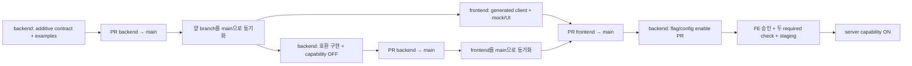

---
aliases:
  - "역할 브랜치와 Docker 통합 계약"
doc_type: reference
status: baseline
area: engineering
tags:
  - nullnull/reference
  - nullnull/engineering
---

# 역할 브랜치와 Docker 통합 계약

- 상태: Accepted for two-person delivery
- 브랜치: `frontend`, `backend`, `main`
- required checks: `docs-contract`, `docker-integration`
- 목표: 각 담당자가 독립적으로 작업하되 `main`에는 양쪽 계약과 실제 통합이 함께 성립하는 변경만 반영

역할별 상세 backlog와 완료 조건은 [Frontend 실행서](../roles/FRONTEND_PLAYBOOK.md), [Backend/AI 실행서](../roles/BACKEND_AI_PLAYBOOK.md), 공모전 추가 gate는 [준수 매트릭스](../contest/COMPETITION_COMPLIANCE_MATRIX.md)를 따른다.

## 1. 브랜치 역할

| 브랜치 | 작성 책임 | 포함 범위 | 필수 검토자 |
| --- | --- | --- | --- |
| `frontend` | Frontend 담당 | `apps/web`, UI token/component, FE test/fixture, FE가 제안하는 contract 소비 변경 | Backend/AI 담당 |
| `backend` | Backend/AI 담당 | `apps/api`, `apps/ai`, OpenAPI/event/ERD, source/optimizer, `infra`, 운영 변경 | Frontend 담당 |
| `main` | 두 사람 공동 | 배포 가능한 통합 기준선만 유지 | 작성자가 아닌 상대 1명 |

- `main` direct push, force push, branch deletion과 self-approval을 금지한다.
- 두 역할 브랜치는 재사용하는 장기 브랜치다. 별도 기능 브랜치를 기본 흐름으로 만들지 않는다.
- 사람별 WIP는 역할 브랜치의 미병합 vertical slice 1개다.
- 모든 commit은 추적 가능한 Work ID를 포함한 Conventional Commit을 사용한다.
  제품 기능은 `FR-*`, Figma 수정은 `FCR-*`, 독립 문서·계약·개발환경·거버넌스
  작업은 `IMPLEMENTATION_PLAN.md`의 `FE-*`/`BE-*`/`CON-*`/`DX-*`/`GOV-*`
  등 해당 실행 ID를 쓴다.
- PR 제목은 `feat(frontend): FR-...`, `fix(frontend): FCR-...`,
  `docs(frontend): GOV-...`처럼 역할과 Work ID를 드러낸다.
- Ticket은 같은 Work ID를 제목과 본문에 가진 GitHub issue다. 제품 기능이 아닌 작업은
  기능 ID나 Figma/API 연결을 억지로 만들지 않고 적용 없음의 이유와 검증 대상을 적는다.
- 이미 remote 역할 branch에 공개된 commit의 Work ID 누락을 뒤늦게 발견했으면
  amend/force push로 이력을 바꾸지 않는다. Ticket과 PR 제목·본문을 먼저 연결하고,
  같은 Work ID를 포함한 후속 수정 commit에 누락 사유를 기록해 상대 검토자의 승인을
  받는다. 이 예외는 새 commit의 ID 생략을 허용하지 않는다.

## 2. 한 slice의 merge 순서

### FE에 새 계약이 필요 없는 UI slice

1. Frontend가 `frontend`를 최신 `main`으로 맞춘다.
2. 승인된 OpenAPI example/mock으로 화면과 test를 구현한다.
3. `frontend → main` PR을 만들고 Backend/AI가 데이터·권한·analytics 영향을 검토한다.
4. required checks와 상대 승인이 끝나면 merge commit으로 병합한다.
5. 두 역할 브랜치를 새 `main`으로 동기화한 뒤 다음 작업을 시작한다.

### API/DB 내부 slice

1. Backend/AI가 `backend`를 최신 `main`으로 맞춘다.
2. 외부 계약을 깨지 않는 domain/DB/source 변경과 test를 구현한다.
3. `backend → main` PR을 만들고 Frontend가 public response/error/capability 영향을 검토한다.
4. Docker 통합과 migration 호환성을 통과한 뒤 merge commit으로 병합한다.

### FE/BE 교차 slice



- 계약 PR은 additive schema/example/생성 client 기반만 포함하며 기존 consumer를 깨지 않는다.
- backend가 먼저 병합돼도 새 기능은 capability OFF이고 기존 흐름은 동작해야 한다.
- FE PR은 같은 contract SHA를 사용한다. 서로 다른 SHA면 병합하지 않는다.
- server-owned capability ON은 Frontend merge만으로 추정하지 않는다. Backend/AI가
  flag/config 변경을 별도 `backend → main` PR로 만들고 FE 승인, 두 required check,
  staging acceptance 뒤 활성화한다. 긴급 차단을 위한 ON→OFF 외 console 직접 변경은
  허용하지 않는다.
- breaking 제거는 양 구현이 배포·관측된 뒤 별도 backend PR에서 한다.
- schema와 기능을 하나의 거대한 양방향 PR로 우회하지 않는다.

## 3. 동기화 규칙

자기 PR이 병합됐고 역할 브랜치에 새 commit이 없다면 fast-forward한다.

```bash
git fetch origin
git switch frontend  # backend 담당은 backend
git merge --ff-only origin/main
git push origin frontend  # backend 담당은 backend
```

다른 PR을 작업 중이라 branch가 갈라졌다면 rebase/force-push하지 않고 `origin/main`을 merge한 뒤 전체 gate를 다시 실행한다. 충돌은 작성 영역 담당자가 풀고 상대가 contract/generated diff를 재검토한다.

## 4. PR gate

모든 `frontend → main`, `backend → main` PR은 다음을 만족한다.

- base가 정확히 `main`, head가 정확히 역할 브랜치다.
- 최신 `main`과 충돌이 없고 unresolved conversation이 없다.
- 작성자가 아닌 팀원 1명이 승인한다. 새 commit 뒤 stale approval을 해제한다.
- `docs-contract`와 `docker-integration`이 성공한다.
- ruleset required status 이름은 B01 전후 정확히 `docs-contract`,
  `docker-integration` 두 개다.
- B01 뒤 web/API quality, client diff, mobile E2E, security, infra와 outbound-deny는
  `docker-integration` 내부 필수 component gate다. 하나라도 누락·skip·실패하면
  aggregator가 실패하며 별도 ruleset required 이름으로 분산하지 않는다.
- PR 본문에 Ticket, Work ID, 적용 가능한 기능 ID·Figma node/state·operationId/schema,
  migration, screenshot, contest evidence, rollout/rollback과 실행한 test를 적는다.
  적용하지 않는 항목은 공란 대신 이유를 적는다.
- incomplete P1 화면은 capability OFF/`준비 중`이며 기능설명서에 구현 완료로 기재하지 않는다.

Dependabot PR은 head 예외지만 두 팀원의 일반 역할 브랜치를 대신하지 않는다. dependency PR도 상대 승인과 전체 통합 gate를 통과한다.

## 5. Docker gate의 두 모드

### `baseline-only` — B01 이전

현재 target app이 없을 때 `scripts/integration-test.sh`는 저장소 전용 문서·OpenAPI 추적성만 검증하고 출력과 `.artifacts/integration/mode.txt`에 `baseline-only`, `status.txt`에 결과를 남긴다. 이 상태를 full integration 통과로 소개하지 않는다.

`apps/web` 또는 `apps/api`가 생겼는데 `.nullnull-target-stack`이 없으면 즉시 실패한다. 따라서 scaffold가 생긴 뒤 silent skip은 불가능하다.

### `full-docker` — B01 이후

B01 PR은 내용이 정확히 `version=1`인 `.nullnull-target-stack`과 다음을 같은 commit에
추가한다.

- `apps/api/Dockerfile`: `test`, `runtime` stage와 digest-pinned external `FROM`
- `apps/ai/Dockerfile`: `test`, `runtime` stage와 digest-pinned external `FROM`, `uv.lock` frozen
- `apps/web/Dockerfile`: `test`, `runtime`, `e2e`, `tooling` stage와
  digest-pinned external `FROM`
- web `verify:ci`, `test:e2e:integration` script
- root `api:check`, `security:scan`, `infra:check` script와 lockfile
- API `test`, `integrationTest`, `openapiContractTest`, `recommendationTest` Gradle task와 `apps/ai` `pytest`(compose `ai-quality`)
- checksum이 있는 Gradle wrapper와 web/root npm lockfile
- 검증한 PostgreSQL·egress probe·앱 base image의 immutable digest
- `scripts/verify_target_stack.py`가 요구하는 service, stage, task와 내부 network

B01 PR에서 marker를 추가하기 직전에는 verifier가 실패하는 것이 정상이다. marker와
artifact를 모두 추가한 뒤 아래 명령이 성공해야 한다.

```bash
python3 scripts/verify_target_stack.py
docker compose --project-name nullnull-pr \
  --file compose.integration.yml config --format json \
  > .artifacts/integration/compose-config.json
python3 scripts/verify_target_stack.py \
  --compose-config .artifacts/integration/compose-config.json
bash scripts/integration-test.sh
```

정적 verifier는 빈 marker, 누락 task/stage/lock/wrapper checksum, tag-only Compose
image와 tag-only external Dockerfile `FROM`을 거부한다. 정규화 Compose verifier는
필수 component service가 없거나 service가 `internal: true`가 아닌 network에 연결되면
거부한다.

그 뒤 wrapper는 다음 순서를 한 번에 실행한다.

1. marker 내용, image digest, stage/task/lock과 정규화 Compose contract 확인
2. web/API test image와 runtime image build
3. PostgreSQL health와 Flyway 포함 API test
4. FE lint/format/type/unit/build
5. generated client clean diff, offline security scan, infra synth/diff
6. internal network에서 outbound 요청이 실제 실패하는지 probe
7. web→API→PostgreSQL 기동과 readiness 대기
8. 360px 핵심 Playwright journey와 keyboard/accessibility
9. 성공/실패와 무관하게 mode/status, compose 상태·log·Playwright 결과 수집
10. container/network/volume 정리

PR Compose의 모든 runtime service는 `internal: true` network에만 연결하고
`egress-denied` probe가 외부 HTTPS 도달 실패를 입증한다. 환경 변수만으로 차단됐다고
간주하지 않는다. 외부 관광 API는 contract fixture를 사용하며 staging 별도 gate에서만
sandbox/production-approved key로 실제 KTO 호출과 attribution/call-audit 증거를
확인한다.

## 6. 최소 통합 journey

| ID | 흐름 | 실패 gate |
| --- | --- | --- |
| INT-01 | 익명 session → KO/EN → 여행 생성 | cookie/CSRF/redirect/owner 격리 |
| INT-02 | KTO 기반 feed/post → 여행 후보 저장 | 출처 누락, 중복 row, 일정 version 변경 |
| INT-03 | 후보 일정화 → 날짜/시간 편집 | ETag 충돌, 부분 transaction, keyboard 불가 |
| INT-04 | ITEM preview → APPLY/KEEP → revert | 잠금 위반, 승인 전 변경, 원복 불가 |
| INT-05 | Live/list/data guide → replay/degraded | replay를 live로 표현, map 대체 목록 없음 |
| INT-06 | 프로필 → 최적화 상태 이력 → 삭제 status | 일정 본문 이력 보존, revoke 지연 |

공모전 code freeze에서는 외부망·익명창으로 제출 URL을 열고 INT-01~04, 실제 KTO 호출/화면 출처, 오류·REPLAY 상태를 다시 확인한다.

## 7. GitHub 외부 설정

두 팀원의 실제 handle이 확정되면 다음을 GitHub ruleset에 적용하고 설정 화면 또는 export를 비공개 운영 증거로 남긴다.

- `main`: PR 필수, approval 1, code-owner review, stale approval dismiss, conversation resolution
- required checks: 정확히 `docs-contract`, `docker-integration`
- allowed PR head는 같은 repository의 `frontend`, `backend`, dependency bot
- force push와 branch deletion 차단, 관리자 우회 기본 금지
- `frontend`/`backend`: force push·삭제 차단, 두 담당자만 write
- Actions 기본 permission `contents: read`, fork PR secret/OIDC 금지
- 실행 경로의 CODEOWNERS에는 두 팀원을 함께 적어 작성자 단독 owner 때문에 gate가
  막히지 않게 하고, Primary DRI는 소유권 표에서 별도로 유지한다.

브랜치 생성·ruleset·push·PR은 로컬 문서 작성만으로 완료된 것이 아니다. 저장소 관리자가 실제 설정 후 checklist와 test PR로 검증한다.

## 11. 작업 단위

한 ticket은 가능한 한 다음을 함께 닫는다.

```text
Figma state → OpenAPI/event diff → DB/domain → API → generated client
→ UI default/loading/empty/error → tests → observability → docs
```

예: “후보 저장” slice에는 button만이 아니라 여행 picker, 201/200 duplicate, failure retry, idempotency, candidate unique constraint, analytics, E2E가 포함된다.

### Ticket Definition of Ready

- 연결된 Figma node와 P0/P1이 있다.
- 사용자 action 전/후 domain state가 적혀 있다.
- API request/response/error 초안이 있다.
- 개인정보·출처·접근성 영향이 검토됐다.
- mock/fixture와 acceptance test 예시가 있다.
- 미결정 외부 의존성이 있으면 feature flag/fallback이 정해졌다.

### Ticket Definition of Done

- OpenAPI/event/ERD가 구현과 일치한다.
- FE와 BE/AI 각각 해당 test를 통과한다.
- loading/empty/error/offline/stale 중 적용 가능한 상태가 구현됐다.
- keyboard와 360px viewport 검증을 했다.
- 로그/metric에 필요한 식별자와 실패 code가 있다.
- 새 env/secret/migration/runbook 변경이 문서화됐다.
- reviewer가 acceptance를 재현했다.

### Contract packet과 상태 전이

모든 slice는 issue 또는 PR에 다음 packet을 같은 revision으로 묶는다.

| 항목 | 작성 DRI | 상대가 확인할 내용 | 저장 위치/증거 |
| --- | --- | --- | --- |
| Figma 범위 | FE | 누락된 server state/action 여부 | node URL, 화면·variant checklist |
| 기능 ID·acceptance | 공동 | P0/P1, 정상·실패 후 domain state | 기능 인벤토리 ID와 Given/When/Then |
| OpenAPI/Problem | BE/AI | 화면이 필요한 모든 field/error/retry 정보 | OpenAPI diff와 Redocly 결과 |
| example/fixture | BE/AI | null/empty/stale/duplicate/conflict 표현 | schema-valid JSON example |
| 생성 client/MSW | FE | spec 이외 hand-written type 없음 | generated diff와 MSW handler |
| DB/불변식 | BE/AI | UI action의 실제 효과가 문구와 일치 | ERD/Flyway/transaction test |
| event/관측 | FE emit, BE/AI validate | PII 없음, 실패 code와 requestId 연결 | event schema와 dashboard query |
| acceptance evidence | 구현 DRI | 상대 담당자가 재현 가능 | test report, mobile screenshot/video |

작업 상태는 `draft → contract-ready → parallel-build → integration-ready → staging-accepted → done`으로만 이동한다.

- `contract-ready`: operationId, request/response, error, Figma state와 mock example이 review됐다.
- `parallel-build`: FE는 generated type+MSW만, BE/AI는 같은 spec+fixture로 구현한다.
- `integration-ready`: spec/generated client가 clean하고 provider contract test와 FE component test가 통과했다.
- `staging-accepted`: 상대 담당자가 실제 API로 mobile journey와 실패 분기를 재현했다.
- `done`: 문서·관측·rollback까지 닫혔다. merge만 된 상태는 done이 아니다.

계약 변경이 생기면 BE/AI는 먼저 OpenAPI/example을 갱신하고 FE는 generated client와 mock을 같은 PR 또는 연결 PR에서 갱신한다. FE가 화면 구현 중 필요한 필드를 발견하면 임시 필드를 만들지 않고 contract issue를 연다. 병렬 branch 사이의 contract SHA가 다르면 통합하지 않는다.

### Slice acceptance 작성 형식

```text
Given: session/data/trip version과 사용 중인 Figma variant
When: 사용자의 한 가지 명시적 행동
Then UI: 화면, focus, loading/empty/error, 재시도 결과
Then domain: 생성/변경/미변경 row와 version
Then contract: status, headers, operationId, Problem code
Then evidence: FE test, BE/AI test, E2E ID, metric/log(redacted)
```

특히 후보 저장, 일정 편집, 최적화는 `변경되지 않아야 하는 것`을 Then에 반드시 쓴다.

## 12. 계약 변경 프로토콜

### Additive change

1. optional response field 또는 새 endpoint를 spec에 추가한다.
2. BE/AI가 구/신 client에 호환되게 배포한다.
3. FE가 사용하기 시작한다.
4. 관측 후 required 전환이 필요하면 별도 version/change로 진행한다.

### Breaking change

- 가능하면 새 field/endpoint로 expand-and-contract한다.
- 제거 예정은 `deprecated: true`와 제거 milestone을 둔다.
- FE production 사용이 0임을 확인한 뒤 제거한다.
- 한 PR에서 backend와 frontend를 서로 깨뜨리는 순차 배포를 만들지 않는다.

### Schema migration

- app rollback이 가능한 기간 동안 구 column/read path를 유지한다.
- migration과 app deploy 순서를 PR에 명시한다.
- backup/restore 또는 downgrade가 실제로 가능한지 staging에서 검증한다.

## 12. Feature flag

외부 data나 P1 기능은 server-owned flag로 보호한다.

- 기본값 OFF, environment별 명시.
- 사용자 식별 정보를 flag key로 외부 SaaS에 보내지 않는다.
- UI는 disabled capability를 숨기거나 명확한 대체 상태를 제공한다.
- 만료일/제거 ticket 없는 영구 flag를 만들지 않는다.
- 안전 불변식(승인 전 미변경, owner 격리)을 flag로 끌 수 없다.

## 13. Claude Code 사용 방식

- 공모전 공식 FAQ는 생성형 AI와 AI 코딩 보조 도구 사용을 허용하지만, 평가 핵심은 안정적으로 구동되는 완성 서비스다. 도구 사용을 test·human review·구현 완료의 대체 증거로 삼지 않는다.
- repository root의 `CLAUDE.md`를 먼저 읽게 한다.
- 한 prompt에는 ticket, Figma node, 허용 범위, acceptance, 실행할 검증을 포함한다.
- 큰 작업은 먼저 읽기 전용 분석과 변경 계획을 받고, 승인된 범위만 구현한다.
- 생성된 migration/OpenAPI/security 코드는 사람이 반드시 검토한다.
- Claude가 바꾼 파일 목록과 실행한 test를 PR에 적는다.
- secret, production data, 비식별되지 않은 사용자 입력을 prompt/context에 넣지 않는다.
- 실패한 test를 삭제하거나 gate를 완화해 통과시키지 않는다.

권장 ticket prompt 예시는 다음과 같다.

```text
CLAUDE.md와 docs/design/FIGMA_HANDOFF.md의 S03-C1~C4,
docs/api/openapi.yaml의 addTripCandidate를 읽어라.
후보 저장 vertical slice만 구현하라. TripItem을 만들거나 trip version을
올리면 안 된다. 201/200 duplicate/오류 재시도, owner 격리, idempotency,
keyboard sheet, component/API/E2E test를 포함하라. 먼저 변경 계획과
계약 불일치를 보고하고, 승인 전에는 범위를 넓히지 마라.
```

## 13. Blocker 처리

- 30분 이상 같은 문제에 머무르면 사실, 시도, 필요한 결정을 짧게 공유한다.
- 외부 계정/쿼터/법무처럼 코드로 풀 수 없는 문제는 `DECISIONS_AND_RISKS.md`에 owner와 due condition을 적는다.
- blocker가 있는 slice를 우회 구현해 숨기지 말고, mock/replay/feature flag로 명시적 degradation을 만든다.
- WIP limit은 사람당 1개 main slice + 긴급 bug 1개다.

## 작업 전환 시 확인

작업 시작·계약 변경·인계·통합·출시 gate마다 contract SHA, 필요한 fixture, 열린 결정과 다음 acceptance를 확인한다. 개발 달력이나 정기 회의 시간을 이 문서에서 고정하지 않는다. 담당자별 WIP는 구현 slice 1개와 review 1개다. Backend와 AI는 모두 `backend` 역할 브랜치에서 개발한다.

## #10 첫 scaffold의 교차 인계 제안

[B01 기반 결정안](FOUNDATION_DECISIONS.md)의 D1~D5를 Frontend와 검토한다. backend가 최초 통합 PR을 host하고 FE 파일을 checksum/기준 SHA/작성자와 함께 인계받는 제한된 예외를 제안했다. 아직 상대 승인을 받지 않았으며 이후 일반 slice·두 required check·main merge commit 규칙은 동일하다. 최소 실제 session→CSRF→me 연결과 full Docker 검증 없이 B01을 완료 처리하지 않는다.
