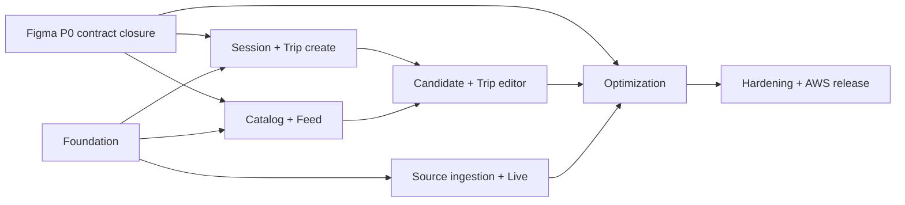

# 구현 로드맵과 백로그

- 상태: Conditional baseline; 2026-09-05 현재 구현 미착수, Figma P0 blocker Open
- 방식: P0 vertical slice 우선, P1은 P0 gate 통과 후
- 추정 단위: 1명 기준 ideal day, 외부 심사/계정 대기 제외
- 역할: Frontend 담당 1명과 Backend/AI 담당 1명이 contract packet을 기준으로 병렬 작업

## 1. Critical path

FE와 BE/AI는 각 milestone 안에서 mock/contract로 병렬 작업하되, 다음 milestone의 불변식을 임시 localStorage나 fake data로 우회하지 않는다.

### 2026-09-05 실제 상태와 capacity 판정

- 저장소에 `apps/web`, `apps/api`, `packages/api-client`, Flyway migration과 배포
  artifact가 아직 없다. 아래 일정은 진행률이 아니라 착수 계획이다.
- 기존 milestone 추정 합계는 FE 43 ideal days, BE/AI 52 ideal days,
  공동·운영 16 ideal days다. 마감까지 16 calendar days인 조건과 맞지 않으므로 전체 P0를
  같은 품질로 완성한다는 약속으로 사용하지 않는다.
- [Figma 수정 요청](../design/FIGMA_CHANGE_REQUESTS.md)의 FCR-001~015가 닫히기 전
  관련 화면 slice를 구현하지 않는다. M0 scaffold와 provider 계정 확인은 병렬로 진행할
  수 있다.
- M0 실제 velocity를 확인한 뒤 09-07에 다시 추정한다. 범위가 넘치면 자동 gate를
  낮추지 않고 아래 제출 critical slice 밖 기능을 capability OFF·비노출로 둔다.

제출 critical slice는 `익명 session·KO/EN → 여행 생성 → 실제 KTO 장소 검색/상세 →
특정 여행 후보 저장 → 후보 일정화·최소 편집/독립 lock → ITEM preview/APPLY/KEEP →
출처·상태·list fallback → 외부망 익명 E2E`다. 붙여넣기 import, 지도, 고급 편집
variant, replay 시각 polish는 이 흐름과 안전 gate가 통과한 뒤만 추가한다.

### 2026 공모전 고정 calendar

공식 제출 마감은 **2026-09-21 16:00(KST)**다. 아래 날짜는 공식 요구가 아니라 두 명의 내부 실행 계약이다. 일정이 밀리면 미완성 기능을 기능설명서에 넣지 말고 같은 날의 범위 축소 gate를 적용한다.

| 날짜 | Frontend (`frontend`) | Backend/AI (`backend`) | 공동 gate |
| --- | --- | --- | --- |
| 09/05 | FCR-001~009 반영안·P0 제출 화면 확정 | OpenAPI 정합성 수정/KTO 신청·AWS 계정 점검 | PM 감사 PR, 역할 브랜치/ruleset 준비 |
| 09/06–07 | M0 web shell·token·MSW | M0 API/PostgreSQL/Flyway·KTO gateway skeleton | `.nullnull-target-stack`, full Docker hello gate |
| 09/08–09 | 익명 onboarding·여행 생성 | session/CSRF·trip create | INT-01, 외부 URL preview |
| 09/10–11 | Feed/post/후보 저장 | KTO 검색/상세 실제 호출·candidate transaction | INT-02, call-audit·출처 연결 |
| 09/12–13 | 내 여행·후보 일정화·편집 | trip aggregate/ETag/item command | INT-03, 경쟁 상태·키보드 |
| 09/14–15 | ITEM 최적화 preview/apply/keep | 결정적 optimizer·snapshot·원자 적용 | INT-04, 승인 전 변경 0 |
| 09/16 | Live/list·데이터 안내·모든 source state | source readiness·stale/replay fallback | KTO 실제 활용·출처·기준시각 audit |
| 09/17 | 360px/KO·EN/a11y/error polish | 권한/rate/redaction/부하·AWS staging | full Docker + staging judge flow |
| 09/18 | 실제 화면 캡처·기능설명서 FE 항목 | 실제 API 목록·호출 증거·운영 항목 | 공식 양식 PDF 2인 대조, 범위 동결 |
| 09/19 | 회귀 수정만 | 회귀 수정만 | **code freeze**, backup/rollback rehearsal |
| 09/20 16:00 | 외부망·익명창 UI 확인 | KTO operation/readiness 확인 | **내부 제출 목표**, 접수·checksum 보관 |
| 09/21 16:00 | 긴급 안정화만 | 긴급 안정화만 | **공식 마감**, 15:00 이후 변경 금지 |

09/05 행의 FCR-001~009는 당시 초안 범위다. 09/06 PR #6 검토에서 FCR-010~015를
추가했으며 이후 착수·종료 gate는 FCR-001~015 전체를 기준으로 한다.

범위 축소 순서는 `P1 전부 OFF → 지도 대신 동등한 목록 → replay 보조 → 고급 최적화 설명/시각 polish`다. 익명 핵심 journey, 실제 KTO 호출·출처, 일정 무결성, 데이터 상태 표시, 보안·접근성 기본 gate는 축소하지 않는다. 09/16 종료 시 INT-01~04가 통과하지 않으면 새 기능 추가를 중단하고 배포된 완결 흐름만 남긴다.

Hard checkpoint:

| 시점 | 반드시 보일 증거 | 실패 시 즉시 조치 |
| --- | --- | --- |
| 09/06 종료 | FCR-001~015 수정 node, lint 통과 contract, 확정된 M0 scope | 영향 UI 착수 중지, PM/두 DRI 범위 재결정 |
| 09/07 종료 | full Docker web→API→PostgreSQL hello | AWS polish 중지, M0만 복구 |
| 09/10 종료 | 익명 session→trip→실제 KTO 검색/상세→candidate와 출처/call-audit | 제출 NO-GO, 다른 기능 추가 중지 |
| 09/13 종료 | candidate 일정화·ETag·lock·rollback E2E | 편집 variant/import 비노출 |
| 09/15 종료 | ITEM preview/APPLY/KEEP, 승인 전 mutation 0 | 최적화를 제출 claim에서 제거 |
| 09/18 종료 | 외부 HTTPS 익명 E2E, KO/EN, a11y, 실제 API/PDF 대조 | 기능 추가 금지, 완결된 범위만 제출 |

## 2. Milestone 요약

| Milestone | 결과 | FE | BE/AI | 공동/운영 | Gate |
| --- | --- | ---: | ---: | ---: | --- |
| M0 Foundation | 새 app/api/contract/CI/staging 뼈대 | 3d | 4d | 2d | hello slice staging |
| M1 Start & Trip | 익명 session, onboarding, 여행 생성 | 5d | 5d | 1d | 여행 생성 E2E |
| M2 Discover & Save | catalog/feed/post/후보 저장 | 6d | 6d | 1d | duplicate/error E2E |
| M3 Trip Editor | view/edit/잠금/후보 일정화 | 8d | 8d | 2d | version conflict E2E |
| M4 Data & Live | 수집·provenance·Live/replay | 7d | 10d | 2d | source degradation test |
| M5 Optimization | preview/apply/keep/revert | 8d | 12d | 3d | 안전 불변식 suite |
| M6 Release | 접근성·성능·보안·AWS production | 6d | 7d | 5d | launch checklist |

이는 약속된 달력이 아니라 범위 비교용 추정이다. 두 사람이 병렬 작업하면 순수 합계를 반으로 나누지 말고 dependency/integration 여유 20–30%를 둔다.

### Milestone 운영 순서

각 milestone은 두 사람이 다음 순서로 진행한다. 앞 단계가 끝날 때까지 상대가 기다리는 waterfall로 운영하지 않는다.

1. 공동: Figma node, 기능 ID, API operationId, 이벤트, 오류, acceptance를 `contract-ready`로 만든다.
2. FE: generated client와 schema-valid MSW fixture로 화면·접근성·E2E를 구현한다.
3. BE/AI: 같은 OpenAPI example을 provider contract test로 사용해 domain·DB·adapter를 구현한다.
4. 공동: contract SHA를 맞추고 staging에서 정상·empty·error·stale·offline 중 해당 분기를 함께 검수한다.
5. 각 역할 브랜치가 `main` PR을 만들고 상대 승인·`docs-contract`·`docker-integration` 뒤 merge commit한다.
6. 상대 담당자가 staging acceptance evidence를 승인한 뒤 milestone gate를 닫는다.

FE는 다음 milestone 화면 primitive를 준비할 수 있지만 아직 합의되지 않은 API 의미를 만들 수 없다. BE/AI는 다음 adapter를 spike할 수 있지만 승인되지 않은 source 값을 product 응답에 노출할 수 없다. 사람별 WIP는 main slice 1개와 review 1개로 제한한다.

### 화면 그룹과 완료 milestone

| Figma 그룹 | 완료 milestone | P0 결과 | 후속/P1 결과 |
| --- | --- | --- | --- |
| A 시작·언어·소개 | M1 | bootstrap, KO/EN 전환, JA/ZH 준비 중, intro/skip | POI 영문 coverage·추가 locale 확대 |
| B 탐색·저장 | M2 | feed/post/place/후보 저장 모든 상태 | 독립 검색·게시물 작성 |
| C 여행 만들기 | M1 | wizard, 직접 입력, 붙여넣기 review, 결정적 draft | AI draft 보조 |
| D/E 내 여행 | M3 | 조회·편집·후보 일정화·이동·시간·교체·잠금 | route/time-window 확장 |
| F 최적화 | M5 | item preview/apply/keep/revert/error | day/trip scope |
| G Live | M4 | list/map/detail/대안/none/replay/degraded | 위치 동의 재계획 |
| H 프로필·데이터 안내 | M1/M4/M5 | guest/login 준비 중, 여행·관심사, 삭제, 데이터 설명, 최적화 이력 | 알림 센터·정식 계정 확장 |
| I reference | 해당 기능 milestone | 자동 fixture/Storybook/test state | 새 오류/state가 생길 때 계속 확장 |

“Figma 모든 페이지 완료”는 위 P0 결과와 capability OFF인 P1 화면의 비활성/안내 상태까지 구현된 것을 뜻한다. P1 기능 자체가 활성화됐다는 뜻은 아니다.

## 3. M0 — Foundation

### 계약/공동

- `CON-001` OpenAPI lint, breaking diff, TypeScript client generation 확정 (1d)
- `CON-002` event JSON Schema validator와 sample fixture (0.5d)
- `CON-003` FCR-010/011/015의 scope별 최적화 요청, decision revision,
  서울 실시간 attribution 계약 확정 (0.5d)
- `ARC-001` monorepo directory와 dependency update 정책 확정 (0.5d)
- `QA-001` CI matrix, PR required checks, coverage report (1d)

### Frontend

- `FE-001` React/TypeScript/Vite scaffold, router, query client, i18n (1d)
- `FE-002` Figma token pipeline, Component Catalog 49종과 Storybook variant (1d)
- `FE-003` error boundary, API Problem mapper, MSW fixture (1d)
- `FE-004` PWA manifest/service-worker의 offline shell 최소 구성 (0.5d)

### Backend/AI

- `BE-001` Spring Boot/Java 21 scaffold와 module enforcement test (1d)
- `BE-002` PostgreSQL/Testcontainers/Flyway baseline (1d)
- `BE-003` Problem Details, request id, validation, logging redaction (1d)
- `BE-004` OpenAPI contract test와 generated interface 전략 (1d)

### 개발자 경험·저장소 운영

- `DX-001` Node/npm/Java/Gradle wrapper/Docker의 exact version lock과 검증 script (0.5d)
- `DX-002` local compose, deterministic seed, local-only reset guard, generated client 명령 (1d)
- `DX-003` `docs-contract` CI와 `docker-integration` baseline/full 전환,
  `verify_target_stack.py`의 marker/task/stage/digest/internal-network fail-closed gate
  (0.5d)
- `GOV-001` 실제 GitHub handle 기반 CODEOWNERS와 path review test (0.5d)
- `GOV-002` branch ruleset, required checks, merge queue/concurrency, GitHub environments checklist 검증 (0.5d)
- `GOV-003` Frontend Claude Code 시작 안내, FCR 착수 기준과 Ticket/Work ID 인계 규칙
  (0.5d)
- `REL-001` version/tag/artifact retention과 release/rollback 기록 형식 확정 (0.5d)

### Infra

- `INF-001` CDK bootstrap: VPC, staging S3/CloudFront, ECR/ECS/ALB, RDS (2d)
- `INF-002` GitHub OIDC deploy role, no static AWS key (0.5d)
- `INF-003` staging DNS/TLS/log group/alert 최소 구성 (0.5d)

Acceptance:

- web → API → DB의 작은 health/sample read가 local과 staging에서 동작한다.
- secret이 source/CI log/frontend bundle에 없다.
- 생성 client diff gate가 동작한다.
- database migration을 빈 DB에 적용할 수 있다.
- 새 clone에서 [LOCAL_DEVELOPMENT.md](./LOCAL_DEVELOPMENT.md)의 명령만으로 seed 화면을 열 수 있다.
- 모든 PR에 `docs-contract`와 `docker-integration`이 정확히 적용된다.
- 내용이 `version=1`인 `.nullnull-target-stack` 이후 앱/Docker artifact, component
  gate, immutable digest, internal network 누락은 silent skip 없이 실패한다.
- ruleset에는 stable required status 두 개만 두고 client diff, web/API quality,
  security, infra, mobile E2E와 outbound-deny는 `docker-integration` 내부에서 모두
  실행한다.
- 과거 prototype workflow는 target 저장소에 존재하지 않는다.

## 4. M1 — Session, onboarding, trip create

### Slice 1A: bootstrap

- `FE-101` A-1/A-2/A-3 route와 redirect state (2d)
- `BE-101` Owner/DemoSession, Secure cookie, CSRF, revoke/TTL (2d)
- `QA-101` expired session/refresh/multi-tab/CSRF 재발급 test (0.5d)

### Slice 1B: trip wizard

- `FE-102` S02-1/2/3 wizard, resume, validation (2d)
- `BE-102` Trip/Interest aggregate, create/idempotency/version (2d)
- `FE-103` S02-4B/C manual entry와 place search integration (1d)
- `BE-103` canonical place seed/search endpoint (1d)
- `QA-102` 날짜 경계/timezone/idempotency/owner 격리 (0.5d)

### Slice 1C: paste import

- `FE-104` browser-first Korean parser와 correction UI (2d)
- `BE-104` ephemeral parse/remap/confirm fallback, no-store/no-log (2d)
- `SEC-101` raw itinerary persistence/log deny test (0.5d)

### Slice 1D: profile/session deletion

- `FE-105` S14 profile shell: guest, disabled login `준비 중`, KO/EN, active/all trips, data 안내, 삭제 receipt/status (2d)
- `BE-105` owner preference/active trip summary와 session revoke+deletion job/status (2d)
- `FE-106` 여행 선택과 여행별 관심사 전체 교체 UI/ETag conflict (1d)
- `BE-106` profile trip projection과 `replaceTripInterests` owner/version 계약 (1d)
- `QA-103` revoke 즉시 차단, job retry/completion, backup tombstone 재적용 (1d)

Acceptance:

- 새 사용자가 가입 없이 여행을 만들고 refresh 후 다시 볼 수 있다.
- 뒤로 가기와 오류가 wizard input을 안전하게 보존한다.
- raw pasted text가 DB/log/analytics에 없다.
- 새 session의 owner/idempotency scope가 첫 mutation 전에 확정되고, 다른 tab의 token rotation이 안전하게 복구된다.
- 프로필 action은 capability와 일치하고, 삭제 202 receipt를 완료로 오인하지 않는다.
- KO/EN 앱 UI가 실제 전환되고 JA/ZH와 정식 login은 disabled `준비 중`으로 API/route를 호출하지 않는다.

## 5. M2 — Discover, post, candidate save

### Catalog/feed

- `BE-201` Place localization/external ref와 curated Post schema (2d)
- `BE-202` cursor feed/post detail/read model (2d)
- `BE-204` SavedPost의 candidate/item과 독립적인 저장/해제 (1d)
- `FE-201` S03-F0/F1 feed card states와 pagination (2d)
- `FE-202` S03-D post detail/saved post (1.5d)

### Candidate save

- `BE-203` TripCandidate/CandidateSource, unique/idempotency/owner rules (2d)
- `FE-203` S03-C1~C4, S06 sheet, saved/duplicate/error variants (2d)
- `QA-201` double tap/network retry/different post same POI tests (1d)
- `AN-201` candidate funnel events와 dashboard query (0.5d)

Acceptance:

- 201 저장과 200 duplicate가 디자인대로 구분된다.
- 어떤 저장 경로도 TripItem을 만들거나 trip version을 올리지 않는다.
- offline/slow network에서도 중복 후보가 생성되지 않는다.

## 6. M3 — Trip view/editor

### Read/view

- `BE-301` TripDetail read model, ETag, candidate page/matches (2d)
- `FE-301` S07-1 day/item/candidate count와 empty state (2d)

### Edit command

- `BE-302` item add/update/delete/reorder transaction (3d)
- `FE-302` S07-2 edit buffer, dirty-exit, save/conflict recovery (3d)
- `BE-303` candidate schedule/restore semantics (1d)
- `FE-303` S07-8 후보 panel과 schedule flow (1.5d)

### Constraint/replace

- `BE-304` 네 종류 constraint와 conflict validation (2d)
- `FE-304` lock controls, unlock/date-lock confirm (1.5d)
- `BE-305` verified replacement command (1d)
- `FE-305` search/add/replace/move date/time variants (3d)
- `BE-306` trip metadata/date range update와 범위 밖 item의 explicit conflict policy (1d)
- `FE-306` 날짜 범위 변경 시 영향 preview/cancel/명시 처리 (1d)

### Quality

- `QA-301` two-tab `TRIP_CHANGED` E2E (0.5d)
- `QA-302` keyboard reorder/focus/screen reader state (1d)
- `QA-303` transaction rollback and unique position concurrency (0.5d)

Acceptance:

- 최신 ETag 없는 mutation은 거절된다.
- 모든 잠금은 독립적이고 예약 잠금을 자동 해제하지 않는다.
- drag 없이 keyboard/button으로 동일 작업을 수행한다.
- 실패 시 부분 적용이 없다.
- 여행 날짜 축소가 범위 밖 item을 암묵적으로 삭제하거나 이동하지 않는다.

## 7. M4 — Source ingestion and Live

### Source foundation

- `BE-401` SourceRegistry/CollectorRun/SnapshotSet/CrowdSnapshot (2d)
- `BE-402` adapter timeout/retry/circuit/rate quota framework (2d)
- `BE-403` KTO 관광·혼잡 adapter와 normalization (3d)
- `BE-404` 서울 Live adapter/area-place mapping (3d)
- `OPS-401` schedule, source dashboard, 60/80/90% quota alert (1d)
- `BE-406` source 승인·license·schemaVersion·attribution과 incident quarantine 정책 (1d)

### Live UI/API

- `BE-405` live area/place/related endpoints와 comparison eligibility (2d)
- `FE-401` S11-1 list-first와 DataStateLabel, 승인 시 map capability (3d)
- `FE-402` S11-2 detail/S11-3 alternatives/S11-N empty (2d)
- `FE-403` S11-R replay mode와 degraded UI (1d)
- `FE-404` S15 데이터 안내의 source/state/freshness/confidence 설명 (1d)
- `BE-407` public source/capability guide read model (0.5d)
- `QA-401` schema drift, stale, unavailable, mixed-source comparison test (1d)

Acceptance:

- 외부 source 실패가 trip CRUD를 실패시키지 않는다.
- 모든 혼잡 표시는 state/source/time을 가진다.
- 비교 불가 data에서 delta/rank가 노출되지 않는다.
- replay가 현재 live로 오인되지 않는다.

## 8. M5 — Safe optimization

### Engine/run

- `BE-501` DB-backed job lease와 run state machine (2d)
- `BE-502` item-scope temporal candidate generator (2d)
- `BE-503` lock/date/time/route/comparison validator (2d)
- `BE-504` deterministic scoring과 evidence/proposal 저장 (2d)

### UI preview

- `FE-501` S09-0 scope/item setup, unsupported P1 state (1.5d)
- `FE-502` S09-1 loading/polling/background resume (1.5d)
- `FE-503` before/after MetricDelta, evidence, decision bar (3d)
- `FE-504` 6개 오류/stale/no improvement 상태 (2d)

### Apply/revert

- `BE-505` version/fingerprint 재검증과 atomic apply/keep (2d)
- `BE-506` immutable revision 기반 revert (1.5d)
- `FE-505` applied/undo/recompute flow (1.5d)
- `BE-507` profile용 최적화 history cursor projection(본문 추가 복제 없음) (1d)
- `FE-506` S14 최적화 이력 상태/scope/시각/decision과 상세 진입 (1d)
- `QA-501` stale race, duplicate apply, injected mid-transaction failure (1d)
- `QA-502` property-based constraint preservation test (1d)

Acceptance:

- 승인 전 trip row가 바뀌지 않는다.
- stale trip/data/lock을 정확한 code로 거절한다.
- apply failure가 “일정 미변경”을 보장한다.
- 같은 idempotency key의 apply가 한 번만 반영된다.
- revert가 과거 감사 record를 지우지 않는다.

## 9. M6 — Hardening and production release

- `FE-601` 전체 P0 responsive/long text/200% zoom pass (1.5d)
- `FE-602` Lighthouse/performance budget와 bundle 분석 (1d)
- `QA-601` full Playwright journey, offline, keyboard, axe (2d)
- `BE-601` authorization matrix/OWASP/API abuse tests (1.5d)
- `BE-602` query plan/load/connection pool tuning (1d)
- `OPS-601` RDS backup/PITR restore rehearsal (1d)
- `OPS-602` ECS rollback, CloudFront invalidation/version rollback rehearsal (1d)
- `OPS-603` WAF rate rules, alarms, log retention, budget alerts (1d)
- `OPS-604` source license/attribution/readiness final check (1d)
- `REL-601` launch checklist, owner, incident contact, go/no-go (0.5d)
- `REL-602` immutable release manifest, artifact retention, rollback target 검증 (0.5d)
- `SEC-601` security/privacy incident 연락망과 대응 SLA tabletop (0.5d)
- `OPS-605` account/stack separation, OIDC trust, deployment concurrency, drift/removal policy audit (1d)
- `CMP-601` 외부망·익명창 judge journey와 실제 KTO call-audit/화면 출처 연결 (0.5d)
- `CMP-602` 공식 기능설명서 PDF·실제 기능/API 목록·제출 URL 대조 및 접수 증거 (0.5d)

Go/no-go 기준은 `TEST_STRATEGY.md`와 `AWS_DEPLOYMENT.md`의 launch checklist를 따른다.

## 10. P1 backlog

| Epic | 핵심 결과 | 선행 조건 |
| --- | --- | --- |
| P1-Search | 독립 검색 tab, filter, recent search privacy | catalog 품질/검색 지표 |
| P1-Route | 지도·route matrix 사업자 연동 | 제공자·약관·쿼터 결정 |
| P1-DayTripOptimize | DAY/TRIP scope와 route/time window | P0 engine 안전성/route matrix |
| P1-Notifications | 알림 목록/deep link/preferences | 전달 채널·보존 정책 |
| P1-Nearby | 명시적 동의 위치 기반 추천 | 위치 DPIA/동의 UX |
| P1-CreatePost | post 작성/media upload/moderation | S3 policy/moderation 결정 |
| P1-EnglishContent | 영문 POI 명칭·설명 coverage와 번역 QA 강화 | KO/EN 앱 UI P0 완료·EngService 검토 |
| P1-Worker | SQS/분리 worker | queue delay/scale trigger 충족 |

P1을 P0 branch에 “미리” 활성화하지 않는다. API enum에 존재하더라도 server capability/readiness와 feature flag로 차단한다.

P1도 담당과 acceptance를 미리 고정한다.

- FE: `/search`, `/notifications`, `/nearby/:poiId`, `/posts/new`의 route/component/accessibility와 capability OFF state.
- BE/AI: 검색 index, 알림 저장·읽음·allowlisted deep link, 위치 동의 경계, media/moderation, route provider 계약.
- 공동: provider/개인정보/라이선스 결정을 해당 P1 착수 전에 ADR로 닫고 staging에서 opt-in flag로 검수한다.

### P1 화면 ticket seed

- `FE-P1-101` S12 알림 목록/empty/unread/read-all/allowlisted deep link
- `BE-P1-101` notification type/read/read-all/storage/retention과 삭제된 target 처리
- `FE-P1-102` S10 주변 동의/거부/철회/list와 map 대안
- `BE-P1-102` 최소화된 위치 처리, consent audit/TTL, nearby candidate query
- `FE-P1-103` 독립 검색 route/filter/recent-search privacy
- `BE-P1-103` bounded query/filter/cursor와 access-log redaction
- `FE-P1-104` 게시물 작성/media/moderation 상태
- `BE-P1-104` presigned upload, content validation, moderation lifecycle
- `FE-P1-105` S02-6 AI draft와 S09-D1 DAY preview capability
- `BE-P1-105` approved model/route matrix/evaluation/kill switch와 deterministic validator
- `FE-P1-106` profile 정식 로그인/익명 데이터 승계·복구 UI
- `BE-P1-106` account 인증/anonymous owner merge/recovery 계약

각 P1 ticket은 기능 활성화 전 capability OFF/준비 중 variant, 개인정보·provider 결정, full E2E와 rollback을 함께 닫는다.

## 11. 추적성 매트릭스

각 ticket/PR은 최소 다음 link를 가진다.

| Requirement | Artifact |
| --- | --- |
| 화면·상태 | Figma node + `FIGMA_HANDOFF.md` section |
| API | operationId 또는 schema name |
| DB | ERD table/constraint + Flyway version |
| Event | event name/schema version |
| Test | test case ID 또는 automated test path |
| 운영 | metric/alarm/runbook 항목 |
| 공모전 | 준수 requirement/evidence ID, 실제 배포 기능/API, 제출 PDF 항목 |

완료 표시는 코드 merge가 아니라 staging acceptance까지 끝났을 때만 한다.
