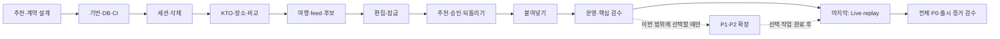

---
aliases:
  - "우선순위와 실행 순서"
doc_type: plan
status: draft
area: engineering
tags:
  - nullnull/plan
  - nullnull/engineering
---

# 우선순위와 실행 순서

Backend와 AI는 `~/Desktop/Nullnull`의 `backend` 브랜치에서 함께 개발한다. 이 문서는 **날짜·소요일 없이** 무엇을 먼저 만들고 어떤 증거 뒤 다음으로 진행하는지 정의한다. 상세 구현은 [Backend/AI 작업 카드](../roles/BACKEND_AI_PLAYBOOK.md), 화면 책임은 [소유권 매트릭스](OWNERSHIP_MATRIX.md)가 정본이다.

## 우선순위의 의미

- **P0**: 제품의 출시 필수 기능·안전성. 먼저 완성할 핵심 흐름과 뒤에 완성할 Live를 모두 포함한다.
- **P1**: 명시적으로 선택한 뒤 구현하는 기능 확장. 기본 capability OFF.
- **P2**: 계측·데이터·평가·규모 근거가 생긴 뒤 검토하는 모델/서비스 확장.

P0/P1/P2는 중요도이고 B번호는 실행 순서다. **Live의 제품 우선순위를 낮추지 않고 마지막 기능 단계 B10으로 배치한다.** 추천에 필요한 KTO·canonical 장소·forecast·비교·relation은 B03에서 먼저 만들며 서울 전용 수집·area mapping·Live API/화면은 B10까지 미룬다.

현재 전체 앱은 구현 전이다. BA 카드의 `planned`와 문서 검사 통과는 기능 완료가 아니다. 공식 제출 시각, 데이터 관측 시각, TTL, 부하 측정 시간과 운영 복구 SLA는 개발 달력이 아니므로 각 정본에 보존한다.

## 실행 지도

Obsidian에서는 [개발 순서 Canvas](../BACKEND_ROADMAP.canvas)를 열어 각 단계 문서로 이동할 수 있다. B번호는 Figma S번호와 독립적이다.

## 단계별 산출물과 진입 조건

| 단계 | 핵심 산출물 | 통과할 gate |
| --- | --- | --- |
| [B00](#b00) | 추천·계약 설계 | 계약/example/FCR 검토·전체 요구사항 연결 |
| [B01](#b01) | 실행 기반·DB·상시 CI | 실제 web→API→PostgreSQL·client 생성·full Docker |
| [B02](#b02) | 익명 세션·프로필·삭제 | owner/CSRF/다중 tab·삭제 receipt/TTL |
| [B03](#b03) | 공통 데이터·KTO·장소·비교 | 실제 KTO 연결 증거·provenance·mixed-source 차단 |
| [B04](#b04) | 여행·피드·피드백·후보 | 후보201/duplicate·SavedPost 독립·이벤트 allowlist |
| [B05](#b05) | 일정 편집·독립 잠금 | ETag 경쟁·독립 lock·일정화/reorder/replace 원자성 |
| [B06](#b06) | 승인형 추천·최적화 | preview 무변경·결정성·APPLY/KEEP·24시간 REVERT |
| [B07](#b07) | 붙여넣기 import | 원문 비영속·remap stale·confirm 멱등 생성 |
| [B08](#b08) | 보안·성능·AWS·핵심 검수 | 권한/성능·restore/rollback·외부망 핵심 journey |
| [B09](#b09) | 선택 확장 검토 | 선정 기능의 계약/ON·OFF CI·privacy·rollback |
| [B10](#b10) | Live 최종 기능 단계 | 서울/Live/list·대안·replay·전체 P0 검수 |

P0 기본 실행 경로는 `B00 → B01 → B02 → B03 → B04 → B05 → B06 → B07 → B08 → B10`이다. B09는 의무 선행 단계가 아니다. P1/P2를 이번 범위에 선정하면 B10 전에 선정 작업을 마치고, 미선정 작업은 `deferred`로 유지한다. 모델 학습 자료가 없다는 이유로 Live P0를 막지 않는다. 위치/주변은 B10의 선택 확장 BA-093이고 공모전 profile에서 OFF다. Live를 시작한 뒤 새 비Live 기능을 끼워 넣지 않고 다음 범위로 기록한다.

단계는 완료 순서를 나타낸다. 독립적인 계약/fixture 검토·FE 컴포넌트 준비는 앞서 진행할 수 있지만 구현 dependency를 건너뛰거나 미완성 capability를 노출할 수 없다. Backend와 AI를 서로 다른 브랜치/서비스로 먼저 나누지 않는다.

## B00

**추천·계약 설계**. 첫 설계. 기능/API/ERD/FCR과 safety fixture를 확정한다.

- [BA-000 · 추천 설계와 전체 계약 기준선 확정](../roles/BACKEND_AI_PLAYBOOK.md#ba-000) — P0

완료 증거: 계약/example/FCR 검토·전체 요구사항 연결.

## B01

**실행 기반·DB·상시 CI**. 실제 scaffold와 full Docker gate를 함께 만든다.

- [BA-001 · Spring 모듈 구조와 실행 도구 고정](../roles/BACKEND_AI_PLAYBOOK.md#ba-001) — P0
- [BA-002 · PostgreSQL·Flyway·트랜잭션 기반](../roles/BACKEND_AI_PLAYBOOK.md#ba-002) — P0
- [BA-003 · HTTP 공통 정책·readiness·capability](../roles/BACKEND_AI_PLAYBOOK.md#ba-003) — P0
- [BA-004 · 계약 생성·중요 기능 상시 CI 구성](../roles/BACKEND_AI_PLAYBOOK.md#ba-004) — P0
- [BA-005 · 영속 job과 수집·추천·삭제 실행 격리](../roles/BACKEND_AI_PLAYBOOK.md#ba-005) — P0
- [BA-006 · 로컬 Docker와 최소 staging 기반](../roles/BACKEND_AI_PLAYBOOK.md#ba-006) — P0

Frontend 실행 ID: `FE-001`, `FE-002`, `FE-003`, `FE-004`

완료 증거: 실제 web→API→PostgreSQL·client 생성·full Docker.

### 공동 실행 ID

BA 카드와 별개로 두 역할이 공유하는 개발환경·거버넌스·릴리스 작업이다.
[브랜치·계약 인계](BRANCH_AND_INTEGRATION.md)의 Work ID 규칙이 이 목록을 참조한다.

| ID | 작업 | 담당 |
| --- | --- | --- |
| `CON-001` | 생성 client의 generator·exact version 선택과 config(OAS 3.1 discriminator union narrowing 확인) | 공동 |
| `CON-003` | FCR-010/011/015 Frontend 인계 계약 확정 | BE/AI |
| `CON-004` | FCR-010/011/015 fixture용 additive 계약 보강(`attributionShort`, `revertAvailability`, KTO example, link host) | BE/AI |
| `CON-005` | FE mock 근거 제공 — `Problem` 등 response example과 contract fixture, 오류 계약 문구 정정 | BE/AI |
| `DX-001` | Node/npm/Java/Gradle wrapper/Docker의 exact version lock과 검증 script | 공동 |
| `DX-002` | local compose, deterministic seed, local-only reset guard, generated client 명령 | 공동 |
| `DX-003` | `docs-contract` CI와 `docker-integration` baseline/full 전환, `verify_target_stack.py`의 marker/task/stage/digest/internal-network fail-closed gate, npm audit 보고서의 build-time 생성과 host offline 판정(`security-scan`은 내보내기만 한다). 보고서 신선도는 캐시 없는 CI 빌드가 보장하며 게이트는 보고서를 나이로 거부하지 않는다 — 로컬 실행은 캐시된 레이어의 보고서를 판정할 수 있다 | BE/AI |
| `DX-004` | manifest `implementedTestIds` 경로 검증의 suite 분담 — `pytest` 행은 `ai-quality`, `gradle:*` 행은 `api-quality`(컨테이너에 없는 sibling app 경로를 해석하지 않는다) | BE/AI |
| `GOV-001` | 실제 GitHub handle 기반 CODEOWNERS와 path review test | 공동 |
| `GOV-002` | branch ruleset, required checks, merge queue/concurrency, GitHub environments checklist 검증 | 공동 |
| `GOV-003` | Frontend Claude Code 시작 안내, FCR 착수 기준과 Ticket/Work ID 인계 규칙 | FE |
| `GOV-004` | 역할별 실행 ID 정의와 Work ID 참조 무결성 유지(문서 개편으로 ID 정의가 사라지지 않게 검토) | 공동 |
| `REL-001` | version/tag/artifact retention과 release/rollback 기록 형식 확정 | BE/AI |

`BE-*`는 backend 브랜치의 문서·계약 작업에, `CON-*`는 계약 검토에 사용한다. `FE-*` 실행 ID는 아래 [Frontend 인계 순서](#frontend-인계-순서)의 매핑 표에 정의한다.

## B02

**익명 세션·프로필·삭제**. 사용자 데이터가 생기기 전에 owner와 cleanup 경계를 닫는다.

- [BA-010 · 익명 owner·session·CSRF 복구](../roles/BACKEND_AI_PLAYBOOK.md#ba-010) — P0
- [BA-011 · 프로필·locale·onboarding·active trip](../roles/BACKEND_AI_PLAYBOOK.md#ba-011) — P0
- [BA-012 · 세션 삭제 receipt·TTL·복원 후 재삭제](../roles/BACKEND_AI_PLAYBOOK.md#ba-012) — P0

Frontend 실행 ID: `FE-101`, `FE-105`

완료 증거: owner/CSRF/다중 tab·삭제 receipt/TTL.

## B03

**공통 데이터·KTO·장소·비교**. 추천에 필요한 source·relation을 Live 탭과 분리한다.

- [BA-020 · 공통 source registry·adapter·쿼터·drift](../roles/BACKEND_AI_PLAYBOOK.md#ba-020) — P0
- [BA-021 · KTO 실제 gateway와 provenance 증거](../roles/BACKEND_AI_PLAYBOOK.md#ba-021) — P0
- [BA-022 · Canonical 장소·검색·상세·콘텐츠 권리](../roles/BACKEND_AI_PLAYBOOK.md#ba-022) — P0
- [BA-023 · 혼잡 예보·시각·비교 적격성·데이터 안내](../roles/BACKEND_AI_PLAYBOOK.md#ba-023) — P0
- [BA-024 · 검증된 관련 장소와 추천 후보 검색](../roles/BACKEND_AI_PLAYBOOK.md#ba-024) — P0

Frontend 실행 ID: `FE-103`, `FE-404`

완료 증거: 실제 KTO 연결 증거·provenance·mixed-source 차단.

## B04

**여행·피드·피드백·후보**. 발견→저장을 일정 변경 없이 완결한다.

- [BA-030 · 여행 생성·목록·결정적 초기 일정](../roles/BACKEND_AI_PLAYBOOK.md#ba-030) — P0
- [BA-031 · 여행 metadata·관심사·삭제](../roles/BACKEND_AI_PLAYBOOK.md#ba-031) — P0
- [BA-032 · 고정 feed·게시물·SavedPost](../roles/BACKEND_AI_PLAYBOOK.md#ba-032) — P0
- [BA-033 · 피드백·분석 이벤트 무결성](../roles/BACKEND_AI_PLAYBOOK.md#ba-033) — P0
- [BA-034 · 여행 후보 저장·중복·dismiss](../roles/BACKEND_AI_PLAYBOOK.md#ba-034) — P0

Frontend 실행 ID: `FE-102`, `FE-106`, `FE-201`, `FE-202`, `FE-203`

완료 증거: 후보201/duplicate·SavedPost 독립·이벤트 allowlist.

## B05

**일정 편집·독립 잠금**. 원자 command와 version 충돌을 먼저 검증한다.

- [BA-040 · 일정 item 추가·이동·수정·삭제·순서](../roles/BACKEND_AI_PLAYBOOK.md#ba-040) — P0
- [BA-041 · 네 종류 독립 잠금과 동시 편집 충돌](../roles/BACKEND_AI_PLAYBOOK.md#ba-041) — P0
- [BA-042 · 후보 slot 판정·비교 후 장소 교체](../roles/BACKEND_AI_PLAYBOOK.md#ba-042) — P0

Frontend 실행 ID: `FE-301`, `FE-302`, `FE-303`, `FE-304`, `FE-305`, `FE-306`

완료 증거: ETag 경쟁·독립 lock·일정화/reorder/replace 원자성.

## B06

**승인형 추천·최적화**. ITEM preview→APPLY/KEEP→24시간 REVERT를 구현한다.

- [BA-050 · 최적화 run·snapshot·polling](../roles/BACKEND_AI_PLAYBOOK.md#ba-050) — P0
- [BA-051 · ITEM 후보 생성·검증·점수·설명](../roles/BACKEND_AI_PLAYBOOK.md#ba-051) — P0
- [BA-052 · APPLY·KEEP의 멱등 원자 결정](../roles/BACKEND_AI_PLAYBOOK.md#ba-052) — P0
- [BA-053 · 24시간 REVERT·최적화 이력](../roles/BACKEND_AI_PLAYBOOK.md#ba-053) — P0

Frontend 실행 ID: `FE-501`, `FE-502`, `FE-503`, `FE-504`, `FE-505`, `FE-506`

완료 증거: preview 무변경·결정성·APPLY/KEEP·24시간 REVERT.

## B07

**붙여넣기 import**. 핵심 일정 도메인을 재사용해 P0 import를 완결한다.

- [BA-060 · 붙여넣기 parse·remap·confirm](../roles/BACKEND_AI_PLAYBOOK.md#ba-060) — P0

Frontend 실행 ID: `FE-104`

완료 증거: 원문 비영속·remap stale·confirm 멱등 생성.

## B08

**보안·성능·AWS·핵심 검수**. 운영을 검증하고 Live 이전 중간 gate를 닫는다.

- [BA-070 · 전체 권한·privacy·부하·접근성 통합](../roles/BACKEND_AI_PLAYBOOK.md#ba-070) — P0
- [BA-071 · AWS 배포·불변 artifact·롤백](../roles/BACKEND_AI_PLAYBOOK.md#ba-071) — P0
- [BA-072 · 복원·삭제 재적용·alarm·사고 대응](../roles/BACKEND_AI_PLAYBOOK.md#ba-072) — P0
- [BA-073 · 핵심 흐름 검수와 제출 증거 기반](../roles/BACKEND_AI_PLAYBOOK.md#ba-073) — P0

Frontend 실행 ID: `FE-601`, `FE-602`

완료 증거: 권한/성능·restore/rollback·외부망 핵심 journey.

## B09

**선택 확장 검토**. P1/P2 중 이번 범위에 명시적으로 선정한 작업만 실행한다. 미선정은 deferred.

- [BA-080 · 독립 검색·feed filter와 정렬 확장](../roles/BACKEND_AI_PLAYBOOK.md#ba-080) — P1
- [BA-081 · 계정 인증·익명 승계·follow graph](../roles/BACKEND_AI_PLAYBOOK.md#ba-081) — P1
- [BA-082 · 게시물·미디어 업로드·moderation](../roles/BACKEND_AI_PLAYBOOK.md#ba-082) — P1
- [BA-083 · 경로 provider·DAY/TRIP 최적화](../roles/BACKEND_AI_PLAYBOOK.md#ba-083) — P1
- [BA-084 · 선호 해석·AI draft 보조·근거 설명](../roles/BACKEND_AI_PLAYBOOK.md#ba-084) — P1
- [BA-085 · 알림 목록·읽음·대상 유효성](../roles/BACKEND_AI_PLAYBOOK.md#ba-085) — P1
- [BA-086 · 영문 POI coverage·번역 품질](../roles/BACKEND_AI_PLAYBOOK.md#ba-086) — P1
- [BA-087 · 개인화 계측·학습·평가·실험](../roles/BACKEND_AI_PLAYBOOK.md#ba-087) — P2
- [BA-088 · worker·추천/예측 service 분리](../roles/BACKEND_AI_PLAYBOOK.md#ba-088) — P2

Frontend 실행 ID: `FE-P1-101`, `FE-P1-103`, `FE-P1-104`, `FE-P1-105`, `FE-P1-106`

완료 증거: 선정 기능의 계약/ON·OFF CI·privacy·rollback.

## B10

**Live 최종 기능 단계**. 서울 adapter→Live API/탭→replay→전체 P0 gate. 위치 확장은 별도 선택이다.

- [BA-090 · 마지막 단계: 서울 Live adapter·area 매핑](../roles/BACKEND_AI_PLAYBOOK.md#ba-090) — P0
- [BA-091 · Live 탭 API·장소 검색·대안·후보 저장](../roles/BACKEND_AI_PLAYBOOK.md#ba-091) — P0
- [BA-092 · Live replay·장애 fallback·전체 P0 최종 gate](../roles/BACKEND_AI_PLAYBOOK.md#ba-092) — P0
- [BA-093 · Live 이후 위치 동의·주변·재계획 확장](../roles/BACKEND_AI_PLAYBOOK.md#ba-093) — P1

Frontend 실행 ID: `FE-401`, `FE-402`, `FE-403`, `FE-P1-102`

완료 증거: 서울/Live/list·대안·replay·전체 P0 검수.

## Frontend 인계 순서

| 화면 묶음 | API/fixture 준비 | FE가 확인할 결과 |
| --- | --- | --- |
| A 시작·S14 프로필 기본 | B02 | bootstrap/KO·EN/disabled login/삭제 복구 |
| S02 수동 여행·B feed/save | B03~B04 | canonical 검색·확인·201/duplicate·일정 무변경 |
| S07 편집 | B05 | complete view·ETag·잠금·교체/순서·keyboard |
| S09 최적화·S14 이력 | B06 | FCR-004 preview·scope union·decision union·stale·undo |
| S02 붙여넣기 | B07 | 원문 제외 복구·remap·confirm |
| S15 데이터 안내 | B03부터, B10에 서울 추가 | 6개 state·출처·시각/null·비교 불가 |
| 선택 P1 화면 | B09, 위치는 B10 | 승인된 계약의 ON/OFF·privacy |
| S11 Live | B10 마지막 | 목록·coverage·대안·replay·출처·후보 저장 |

### Frontend 실행 ID와 화면 매핑

`FE-*`는 Frontend 역할 브랜치의 실행 ID다. [브랜치·계약 인계](BRANCH_AND_INTEGRATION.md)의 Work ID 규칙이 이 표를 참조하며, 각 ID는 위 B단계의 `Frontend 실행 ID` 줄과 같다. B번호가 순서이고 P1 ID는 B09/B10에서 선정한 경우에만 실행한다. Figma node는 [핸드오프](../design/FIGMA_HANDOFF.md)의 frame이며 화면별 UI/server 책임은 [소유권 매트릭스](OWNERSHIP_MATRIX.md)가 정본이므로 여기에 복제하지 않는다.

| ID | 단계 | 작업 | Figma node |
| --- | --- | --- | --- |
| `FE-001` | B01 | React/TypeScript/Vite scaffold, router, query client, i18n | 기반 · 화면 없음 |
| `FE-002` | B01 | Figma token pipeline, Component Catalog 49종과 Storybook variant | 기반 · 화면 없음 |
| `FE-003` | B01 | error boundary, API Problem mapper, MSW fixture | 기반 · 화면 없음 |
| `FE-004` | B01 | PWA manifest/service-worker offline shell 최소 구성 | 기반 · 화면 없음 |
| `FE-101` | B02 | A-1/A-2/A-3 route와 redirect state | `388:257`, `388:277`, `388:321` |
| `FE-105` | B02 | S14 프로필 shell: guest, disabled login `준비 중`, KO/EN, trips, 데이터 안내, 삭제 receipt/status | `422:2925` |
| `FE-103` | B03 | S02-4B/C 수동 입력과 장소 검색 integration | `438:3158`, `400:1201`, `438:3199` |
| `FE-404` | B03 | S15 데이터 안내의 source/state/freshness/confidence 설명 (서울 source는 B10에 추가) | `423:2967` |
| `FE-102` | B04 | S02-1/2/3 wizard, resume, validation, 확인·결정적 draft | `438:3012`, `438:3108`, `438:3134`, `438:3259`, `384:5673` |
| `FE-106` | B04 | 여행 선택과 여행별 관심사 전체 교체 UI/ETag conflict | `422:2925` |
| `FE-201` | B04 | S03-F0/F1 feed card states와 pagination | `391:310`, `396:2926` |
| `FE-202` | B04 | S03-D 게시물 상세/SavedPost | `398:611` |
| `FE-203` | B04 | S03-C1~C4, S06 sheet, saved/duplicate/error variant | `399:658`, `399:843`, `399:1011`, `399:1179`, `409:1595` |
| `FE-301` | B05 | S07-1 day/item/candidate 수와 empty state | `410:1738` |
| `FE-302` | B05 | S07-2 edit buffer, dirty-exit, save/conflict recovery | `411:1837`, `413:2020` |
| `FE-303` | B05 | S07-8 후보 panel과 일정화 flow | `412:1912` |
| `FE-304` | B05 | lock control, unlock/date-lock confirm | `413:2081`, `527:3876` |
| `FE-305` | B05 | 검색/추가/교체/날짜·시간 이동 variant | `527:4085`, `414:2347`, `527:4537`, `476:3409`, `479:3497`, `479:3816`, `527:4380`, `521:3976`, `527:4695` |
| `FE-306` | B05 | 날짜 범위 변경 시 영향 preview/cancel/명시 처리 | 미지정 · S07 편집 흐름 |
| `FE-501` | B06 | S09-0 scope/item setup, 미지원 P1 state | `415:2268` |
| `FE-502` | B06 | S09-1 loading/polling/background resume | `415:2413` |
| `FE-503` | B06 | before/after MetricDelta, 근거, decision bar | FCR-004 READY preview frame (병합 후 확정) |
| `FE-504` | B06 | 오류 6종·stale·no improvement 상태 | `417:2567`, `485:3517` |
| `FE-505` | B06 | applied/undo/recompute flow | `417:2412` |
| `FE-506` | B06 | S14 최적화 이력 상태/scope/시각/decision과 상세 진입 | `422:2925` |
| `FE-104` | B07 | browser-first 한국어 parser와 correction UI | `401:1221` |
| `FE-601` | B08 | 전체 P0 responsive/긴 텍스트/200% zoom pass | 전 P0 화면 |
| `FE-602` | B08 | Lighthouse/performance budget와 bundle 분석 | 전 P0 화면 |
| `FE-P1-101` | B09 | S12 알림 목록/empty/unread/read-all/allowlisted deep link | `442:3344` |
| `FE-P1-103` | B09 | 독립 검색 route/filter/recent-search privacy | 미지정 · P1 seed |
| `FE-P1-104` | B09 | 게시물 작성/media/moderation 상태 | 미지정 · P1 seed |
| `FE-P1-105` | B09 | S02-6 AI draft와 S09-D1 DAY preview capability | `440:3244`, `439:3104` |
| `FE-P1-106` | B09 | 프로필 정식 로그인/익명 데이터 승계·복구 UI | `422:2925` |
| `FE-401` | B10 | S11-1 list-first와 DataStateLabel, 승인 시 map capability | `418:2523` |
| `FE-402` | B10 | S11-2 상세/S11-3 대안/S11-N 없음 | `419:2617`, `420:2821`, `420:2950` |
| `FE-403` | B10 | S11-R replay mode와 degraded UI | `421:2850` |
| `FE-P1-102` | B10 | S10 주변과 S11-4 재계획 동의/거부/철회 | `442:3370`, `501:3750` |

시각 노드가 없는 backend/운영 작업은 기능 ID/NFR·API/schema·test로 추적하고 가짜 Figma node를 만들지 않는다. FE는 `frontend`에서 생성 client와 canonical fixture를 소비한다. 상대 검토와 통합 규칙은 [브랜치 운영](BRANCH_AND_INTEGRATION.md)을 따른다.

## 중간 검수와 최종 완료

- B01 이후 모든 main PR: `docs-contract`, `docker-integration`; 중요 기능은 항상 실행한다.
- B08: 핵심 여행 흐름·운영 준비 검수. Live 미구현 상태이므로 전체 P0 완료가 아니다.
- B10/BA-092: Live를 포함한 전체 P0와 P1 OFF state, 외부망 익명 사용, 실제 KTO·출처·위치 OFF·보안·복원/롤백을 같은 release로 재검증한다.
- 최종 제출: 공식 공지 재확인→실제 기능/API만 PDF에 기록→2인 대조→실제 접수 증거. 문서/CI만으로 접수 완료를 선언하지 않는다.

P0 일부를 제외해 제한된 시연만 만드는 결정은 제품 범위 변경으로 별도 기록한다. 붙여넣기나 Live를 미완성 상태로 두고 전체 P0를 완료 처리하지 않는다. [결정·위험](../project/DECISIONS_AND_RISKS.md)의 외부 blocker와 [공모전 기준](../contest/COMPETITION_COMPLIANCE_MATRIX.md)을 함께 확인한다.

## 기존 M 단계 이관

| 이전 단계 | 새 실행 순서 |
| --- | --- |
| M0 기반 | B00~B01 |
| M1 시작/여행/import | B02 세션 → B04 여행 → B07 import |
| M2 탐색/저장 | B03 장소 → B04 feed/후보 |
| M3 편집 | B05 |
| M4 데이터/Live | B03 공통 데이터와 B10 Live로 분리 |
| M5 최적화 | B06 |
| M6 hardening/release | B08 핵심 검수, B10 뒤 최종 검수 |

이전 M단계/BE ticket은 이관 검색용으로만 남긴다. `.nullnull-target-stack`의 기술 전환 의미는 그대로이고 날짜별 계획·공수 추정은 사용하지 않는다.
