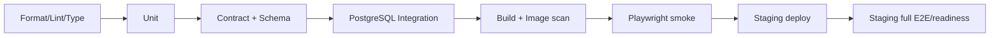

# 테스트 전략

- 목표: 빠른 피드백, 계약 일치, 추천 근거와 일정 무결성 보장
- 원칙: test pyramid + 핵심 사용자 흐름 E2E + production-like PostgreSQL
- 책임: FE 담당은 화면/component/E2E, BE/AI 담당은 contract/domain/DB/source/optimizer; 상대 담당자가 staging acceptance 확인

## 1. 품질 위험 우선순위

| 우선순위 | 위험 | 차단 test |
| --- | --- | --- |
| P0 | 승인 없이 일정 변경 | domain invariant + DB integration + E2E |
| P0 | 다른 owner data 노출 | authorization matrix integration |
| P0 | stale preview/동시 수정 덮어쓰기 | two-client concurrency test |
| P0 | 후보 저장이 일정으로 변환됨 | contract/domain/E2E |
| P0 | 혼잡 출처/시각 누락 또는 허위 비교 | schema/property/fixture test |
| P0 | apply 부분 반영 | transaction fault-injection test |
| P0 | 붙여넣기 원문/위치 로그 유출 | log capture/DB scan/telemetry schema test |
| P0 | 외부 API 장애가 전체 서비스 장애로 전파 | adapter/degradation test |
| P0 | session bootstrap/CSRF rotation 실패로 저장 불가 | multi-tab bootstrap + mutation recovery test |
| P0 | 여행 날짜 축소 뒤 범위 밖 item이 암묵 삭제 | explicit policy/validation integration + E2E |
| P0 | 삭제 receipt만 발급되고 실제 삭제가 멈춤 | deletion job state/TTL/retry/restore test |
| P0 | 프로필·active trip·locale이 화면마다 불일치 | owner preference contract + navigation E2E |
| P0 | 실제 KTO 호출 없이 mock/replay만 제출 | staging actual-call + provider history/call-audit gate |
| P0 | KTO 출처 누락·무허가 CI/BI 사용 | DOM/visual/asset-license coverage |
| P0 | 제출 profile에서 로그인/위치가 핵심 흐름을 막음 | external incognito + permission/network test |
| P0 | Figma의 언어·feed·guest·data 상태가 실제 capability와 다름 | FCR screen-manifest + dead-control/network E2E |
| P1 | 경로 제안 불가능/시간창 위반 | route/optimizer property test |

## 2. Test layer

### Frontend unit/component

- date/timezone formatter와 wizard reducer
- Problem code → translation/CTA mapping
- DataStateLabel/MetricDelta: 모든 state와 comparison false
- TripPicker: 201/200 duplicate/error/double click
- edit reducer: save/cancel/dirty/rollback
- focus trap, focus restore, keyboard reorder
- MSW 기반 default/loading/empty/error/stale/offline stories

권장 gate:

```bash
npm run lint
npm run format:check
npm run typecheck
npm run test
npm run build
```

### Backend/AI unit

- trip date/item position/constraint policy
- candidate uniqueness와 schedule transition
- parser tokenization/date inference(원문 fixture는 synthetic)
- comparison eligibility policy
- deterministic optimizer scoring/tie-break
- optimization state machine
- data fingerprint와 idempotency request hash

### Backend/AI integration

Testcontainers PostgreSQL을 사용한다. H2/SQLite 성공만으로 DB test를 대체하지 않는다.

- JPA mapping, unique/check/foreign key
- Flyway clean migration
- owner authorization query
- ETag/version race
- idempotency replay/key reuse
- candidate schedule + item + revision transaction
- apply/revert transaction과 injected failure
- job lease timeout/recovery
- source snapshot partition/index query

권장 gate:

```bash
./gradlew test
./gradlew integrationTest
./gradlew openapiContractTest
```

실제 task 이름은 scaffold PR에서 위 의미를 유지해 확정한다.

### Contract

- OpenAPI lint와 breaking diff
- generated FE client clean diff
- controller request/response validation
- Problem code enum ↔ FE mapping ↔ Figma error state
- event fixture ↔ `events.schema.json`
- external adapter fixture ↔ provider schema/normalizer

Contract fixture는 OpenAPI example과 별도의 hand-written 모델을 만들지 않는다. BE/AI 담당이 schema-valid canonical JSON을 제공하고 FE 담당이 같은 파일을 MSW/Storybook에서 import하거나 생성한다. 다음 matrix가 빠지면 `contract-ready`가 아니다.

| 응답 종류 | 필수 fixture |
| --- | --- |
| collection | populated, empty, first/next/last cursor |
| mutation | created, idempotent replay/duplicate, validation, unauthorized, conflict, rate limited |
| trip | no active trip, complete trip, each constraint, stale ETag, date-range conflict |
| async | queued, running, ready, failed, expired, retry hint |
| data | live, forecast, replay, qualitative, stale, unavailable, comparison ineligible |
| deletion | accepted receipt, queued/running/completed/failed, revoked session |
| capability | enabled, disabled, degraded와 사용자 대체 행동 |

### E2E

Playwright desktop이 아닌 mobile viewport를 기본으로 한다.

| ID | Journey | 필수 분기 |
| --- | --- | --- |
| E2E-01 | 첫 실행 → 여행 생성 | refresh resume, date validation |
| E2E-02 | feed → 여행 선택 → 후보 저장 | success, duplicate, retryable error |
| E2E-03 | 후보 → 날짜 지정 → 일정화 | version 갱신, candidate status |
| E2E-04 | 일정 edit | move/time/reorder/cancel/discard |
| E2E-05 | lock | must/date/time/reservation 독립 처리 |
| E2E-06 | ITEM optimize preview → keep | provenance/lock validation, 일정 미변경 |
| E2E-07 | ITEM optimize preview → apply → revert | before/after, explicit decision, revision |
| E2E-08 | 두 tab stale apply | `TRIP_CHANGED`, 최신 일정 복구 |
| E2E-09 | Live | live/replay/stale/unavailable/none |
| E2E-10 | session 삭제 | revoke와 owned route 차단 |
| E2E-11 | language/profile | KO/EN 선택·변경·새로고침·긴 문구, JA/ZH 준비 중/저장 차단 |
| E2E-12 | trip 날짜 변경 | 범위 밖 item 안내, 취소/명시 처리, stale conflict |
| E2E-13 | 프로필 active trip | 여행 전환/삭제 뒤 tab destination 일관성 |
| E2E-14 | 삭제 상태 | receipt 조회, 완료, 실패 재시도, 재로그인 격리 |
| E2E-15 | 프로필 여행·관심사·최적화 이력 | active/all trips, ETag conflict, history cursor/detail/empty |
| E2E-16 | P0 capability와 Figma 문구 | English 활성, unsupported feed control 0, guest 익명 저장 copy, data state 6개 |
| E2E-17 | Live 장소 검색·거리 | canonical search→coverage, UNAVAILABLE, 거리 기준/source 없음 처리 |
| E2E-CMP-01 | 외부망·익명 심사 흐름 | login 불필요, INT-01~04, 새 session/empty/error |
| E2E-CMP-02 | KTO 실제 데이터 표시 | actual call, normalized response, 출처·기준시각·state |
| E2E-CMP-03 | 공모전 위치 OFF | geolocation prompt/call·좌표 request·위치 endpoint 0건 |
| E2E-P1-01 | 알림 | empty/unread/read-all/allowlisted deep link/삭제된 target |

### Figma state coverage gate

각 Figma frame/node는 `screen-manifest`의 고유 ID에 연결하고 아래 상태 coverage를 기록한다. FE 담당이 manifest와 visual evidence를 관리하고 BE/AI 담당이 각 server-backed 상태의 canonical fixture를 승인한다.

```text
node → route/overlay → feature ID → operationId → fixture IDs
     → component/E2E test IDs → priority/capability
```

- page마다 default/loading/empty/error/offline과 해당 시 stale/replay/conflict를 표시한다.
- overlay마다 열기, Escape/back 닫기, focus trap/restore, 중복 submit 방지를 검증한다.
- mutation 화면마다 성공 뒤 domain 변화와 실패 뒤 **미변경** 상태를 함께 검증한다.
- P1 frame은 capability OFF 상태가 잘못된 dead-end가 아닌지 먼저 검증하며, 활성화 PR에서 full journey를 추가한다.
- Figma node가 교체되면 screen-manifest와 visual snapshot을 같은 PR에서 변경한다.
- `FCR-001~009`는 수정 node, before/after screenshot, 기능 ID, operationId와 test ID가
  모두 연결될 때만 닫는다.
- `COMPONENT_CATALOG.md`의 최상위 component 49종도 component-manifest에 1:1 연결하고 필수 variant·interaction·접근성 story 누락을 CI에서 검출한다.

## 3. 접근성

자동 axe만으로 완료하지 않는다.

- 360×800, 390×844, 768×1024 viewport
- keyboard-only 전체 P0 journey
- VoiceOver 또는 NVDA 최소 smoke
- 200% browser zoom, OS 큰 글자
- reduced motion, forced colors/high contrast 가능한 범위
- dialog/sheet title announce, focus trap/restore
- map과 동일 정보의 list alternative
- 색을 제거해도 state/error/selection 식별
- touch target 44px 원칙과 인접 target 간격

라우팅, 검색, modal/sheet, 일정 생성/교체/최적화 흐름 변경 PR은 해당 Playwright와 keyboard test를 함께 바꾼다.

## 4. 데이터·추천 검증

### Fixture class

| Fixture | 목적 |
| --- | --- |
| `live_fresh` | 정상 실시간 |
| `forecast_same_issue` | 유효 temporal comparison |
| `forecast_mixed_issue` | 비교 차단 |
| `spatial_same_set` | 유효 spatial comparison |
| `spatial_mixed_source` | 순위/delta 차단 |
| `replay` | demo label 보장 |
| `stale_last_known_good` | stale UI/최적화 차단 |
| `unavailable` | empty/degradation |
| `schema_drift` | adapter quarantine/readiness degraded |

실제 외부 응답 fixture는 약관상 저장 가능한 최소 subset으로 scrub하고, 수집일/source/schema version을 기록한다. 저장이 허용되지 않으면 synthetic contract fixture를 쓴다.

### Property/invariant tests

랜덤 trip을 생성해 다음을 반복 검증한다.

- item 날짜가 trip 범위 안이다.
- 날짜별 position은 연속·유일하다.
- locked constraint는 proposal/apply 뒤 동일하다.
- comparison 불가이면 crowd delta가 null이다.
- KEEP/FAILED는 trip version과 items를 바꾸지 않는다.
- APPLY는 version을 정확히 한 번 올린다.
- 같은 idempotency key는 두 번째 변경을 만들지 않는다.
- REVERT는 원래 snapshot과 의미적으로 같고 새 revision을 만든다.

## 5. 외부 adapter test

- 정상 payload와 enum의 모든 알려진 값
- missing/null/추가 field
- HTTP 429 + Retry-After
- timeout/connection reset/5xx
- 잘못된 JSON/encoding
- source 시각이 미래 또는 지나치게 오래됨
- 서로 다른 record의 observedAt skew
- quota threshold와 circuit open/half-open
- log에 API key/body가 없는지

CI는 외부 실서비스를 호출하지 않는다. scheduled staging probe만 소량 호출하고 실패가 merge를 무조건 막기보다 readiness/alert를 만든다.

## 6. Migration test

각 migration PR:

1. 빈 PostgreSQL에 latest까지 upgrade.
2. 직전 release schema/data snapshot에서 upgrade.
3. app N-1과 schema N의 호환 window 확인.
4. downgrade SQL이 있으면 실행, 없으면 documented restore/forward-fix rehearsal.
5. constraint/index와 query plan 확인.
6. large table 변경은 lock duration 측정.

## 7. 성능 budget

### Web 초기 기준

- mobile production build의 route별 JS budget을 scaffold에서 측정 후 고정한다.
- LCP p75 2.5초 이하, INP p75 200ms 이하, CLS p75 0.1 이하를 목표로 실제 field data에서 본다.
- map/large editor/optimization chart는 route 또는 interaction 단위 lazy load.
- hero/media는 responsive size, modern format, width/height 지정.

### API 초기 기준

- cached trip/feed/live read p95 500ms 이하.
- write p95 800ms 이하(외부 API 호출을 transaction/request path에서 제외).
- optimization async 완료 p95 10초 이하.
- load test는 예상 peak의 2배에서 error <1%, DB connection saturation 없음.

숫자는 staging baseline과 파일럿 측정 뒤 조정하되 안전 gate를 낮추는 근거로 쓰지 않는다.

## 8. 보안/개인정보 test

- 모든 owner resource에 A/B session 교차 접근 matrix
- CSRF missing/wrong, Origin mismatch, CORS credentials
- cookie flag 자동 검사
- mass assignment/unknown property reject
- UUID enumeration과 404 masking
- rate limit, oversized body, cursor abuse
- dependency/SBOM/container scan
- secret scan과 built frontend bundle scan
- log/DB/event에서 `rawText`, cookie, token, latitude/longitude denylist 검사
- import/session/event TTL cleanup
- deletion job의 retry/tombstone, backup restore 후 삭제 재적용
- notification/internal deep link allowlist와 open redirect 차단
- search query·raw import·정밀 위치가 CDN/ALB/APM access log에 남지 않는 구성

launch 전에 OWASP ASVS 기반 수동 review를 한 번 수행한다.

## 9. Observability acceptance

test가 단순히 status만 확인하지 않고 운영 신호도 확인한다.

- request id가 response와 structured log에 연결됨
- error code별 counter
- source freshness/quota gauge
- optimization run duration/stale/apply/keep/failure
- idempotency replay/conflict
- trip version conflict
- candidate funnel event dedup
- 민감값 redaction

## 10. CI stage



PR gate는 A–F, main deploy gate는 A–H다. flaky test는 무한 retry로 숨기지 않고 owner/ticket을 만들며 격리는 P0 safety test에 허용하지 않는다.

모든 `frontend → main`, `backend → main` PR의 ruleset stable required status는
정확히 `docs-contract`와 `docker-integration` 두 개다. M0 전
`docker-integration`은 `baseline-only`라고 명시한다. 내용이 `version=1`인
`.nullnull-target-stack` 이후에는 정적 target-stack verifier, PostgreSQL/API/web,
client diff, security, infra, outbound-deny와 Playwright를 container gate로 실행한다.
앱이 생겼는데 marker가 없거나 marker 뒤 artifact/task/digest/internal network가 빠지면
hard fail한다.

### 경로별 최소 required check

| 변경 경로/종류 | FE 담당 evidence | BE/AI 담당 evidence | 공동 gate |
| --- | --- | --- | --- |
| `apps/web/**` | lint/format/type/unit/build, 해당 story | contract client clean | mobile Playwright/axe |
| `apps/api/**` | 영향 operation의 MSW/component test | unit/integration/contract/migration | staging smoke |
| `docs/api/**`, `docs/contracts/**` | generated client와 fixture clean | lint/schema/provider contract | breaking diff 승인 |
| `infra/**` | public config/bundle 영향 확인 | synth/diff/security scan | staging deploy/rollback |
| docs only | link/Markdown/diagram source | OpenAPI/event/example lint | 정본 상충 여부 review |

실제 component gate는 `docker-integration`이 전부 fail-closed로 집계하고 ruleset에는
stable 두 이름만 연결한다. component를 별도 required status로 추가하지 않는다.
상세 설정은 [브랜치·Docker 통합 계약](./BRANCH_AND_INTEGRATION.md)과
[GITHUB_RELEASE_OPERATIONS.md](../operations/GITHUB_RELEASE_OPERATIONS.md)에 기록한다.
실행하지 않은 check를 수동으로 성공 처리하지 않는다.

## 11. 공모전 release evidence test

자동 test만으로 제출 완료를 선언하지 않는다. 2026-09-19 code freeze와 2026-09-20 내부 제출 전에 두 사람이 아래를 같은 release ID로 교차 확인한다.

- 외부 네트워크의 새 browser profile에서 HTTPS URL과 로그인 없는 핵심 journey
- 승인된 runtime key를 사용한 실제 KTO operation, provider 이력과 redacted call-audit
- 같은 response가 실제 화면에 사용되고 `출처: ⓒ한국관광공사`, 기준시각, source state가 보이는지
- `TourAPI` 단독 표기·승인 없는 CI/BI logo·secret/trace identifier 노출이 없는지
- 위치 flag OFF, browser geolocation/permission prompt/좌표 전송이 0건인지
- 공식 기능설명서 양식을 변경하지 않았고 PDF의 기능/API가 배포본과 정확히 일치하는지
- 제출 URL, PDF checksum, 접수 완료 시각/화면을 비공개 증거로 보관했는지
