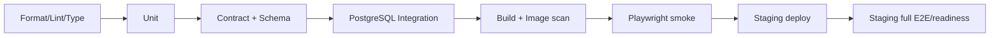
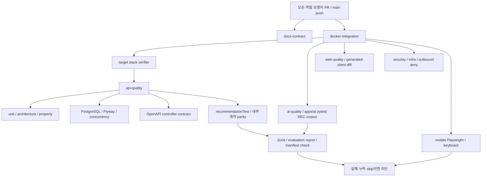

---
aliases:
  - "테스트 전략"
doc_type: reference
status: baseline
area: engineering
tags:
  - nullnull/reference
  - nullnull/engineering
---

# 테스트 전략

- 목표: 빠른 피드백, 계약 일치, 추천 근거와 일정 무결성 보장
- 원칙: test pyramid + 핵심 사용자 흐름 E2E + production-like PostgreSQL
- 책임: FE 담당은 화면/component/E2E, BE/AI 담당은 contract/domain/DB/source/optimizer와 `apps/ai` 추천 서비스; 상대 담당자가 staging acceptance 확인

## 1. 품질 위험 우선순위

| 우선순위 | 위험 | 차단 test |
| --- | --- | --- |
| P0 | 승인 없이 일정 변경 | domain invariant + DB integration + E2E |
| P0 | 다른 owner data 노출 | authorization matrix integration |
| P0 | stale preview/동시 수정 덮어쓰기 | two-client concurrency test |
| P0 | 후보 저장이 일정으로 변환됨 | contract/domain/E2E |
| P0 | 혼잡 출처/시각 누락 또는 허위 비교 | schema/property/fixture test |
| P0 | apply 부분 반영 | transaction fault-injection test |
| P0 | 붙여넣기 원문/위치 로그 유출 | log capture/DB scan/telemetry schema test |
| P0 | 외부 API 장애가 전체 서비스 장애로 전파 | adapter/degradation test |
| P0 | session bootstrap/CSRF rotation 실패로 저장 불가 | multi-tab bootstrap + mutation recovery test |
| P0 | 여행 날짜 축소 뒤 범위 밖 item이 암묵 삭제 | explicit policy/validation integration + E2E |
| P0 | 삭제 receipt만 발급되고 실제 삭제가 멈춤 | deletion job state/TTL/retry/restore test |
| P0 | 프로필·active trip·locale이 화면마다 불일치 | owner preference contract + navigation E2E |
| P0 | 실제 KTO 호출 없이 mock/replay만 제출 | staging actual-call + provider history/call-audit gate |
| P0 | KTO 출처 누락·무허가 CI/BI 사용 | DOM/visual/asset-license coverage |
| P0 | 제출 profile에서 로그인/위치가 핵심 흐름을 막음 | external incognito + permission/network test |
| P0 | Figma의 언어·feed·guest·data 상태가 실제 capability와 다름 | FCR screen-manifest + dead-control/network E2E |
| P1 | 경로 제안 불가능/시간창 위반 | route/optimizer property test |

## 2. Test layer

### Frontend unit/component

- date/timezone formatter와 wizard reducer
- Problem code → translation/CTA mapping
- DataStateLabel/MetricDelta: 모든 state와 comparison false
- TripPicker: 201/200 duplicate/error/double click
- edit reducer: save/cancel/dirty/rollback
- focus trap, focus restore, keyboard reorder
- MSW 기반 default/loading/empty/error/stale/offline stories

권장 gate:

```bash
npm run lint
npm run format:check
npm run typecheck
npm run test
npm run build
```

### Backend/AI unit

Spring(`apps/api`)과 추천 서비스(`apps/ai`, [ADR-0006](../decisions/ARCHITECTURE_DECISIONS.md#adr-0006))가 각각 unit suite를 가진다. 추천 점수·필터·선택·설명 template은 `apps/ai` pytest, Spring은 gateway·재검증·fallback·DTO parity를 검증한다.

- trip date/item position/constraint policy
- candidate uniqueness와 schedule transition
- parser tokenization/date inference(원문 fixture는 synthetic)
- comparison eligibility policy
- deterministic optimizer scoring/tie-break
- optimization state machine
- data fingerprint와 idempotency request hash

### Backend/AI integration

Testcontainers PostgreSQL을 사용한다. H2/SQLite 성공만으로 DB test를 대체하지 않는다.

- JPA mapping, unique/check/foreign key
- Flyway clean migration
- owner authorization query
- ETag/version race
- idempotency replay/key reuse
- candidate schedule + item + revision transaction
- apply/revert transaction과 injected failure
- job lease timeout/recovery
- source snapshot partition/index query

권장 gate:

```bash
# apps/api
./gradlew test
./gradlew integrationTest
./gradlew openapiContractTest
./gradlew recommendationTest      # Spring DTO ↔ apps/ai 내부 계약 parity

# apps/ai (uv 0.12.10)
uv run ruff check . && uv run ruff format --check . && uv run mypy
NULLNULL_AI_REPORT_DIR=build/reports/recommendation uv run pytest
```

실제 task 이름은 각 app README와 CI가 정본이다.

### Contract

- OpenAPI lint와 breaking diff
- generated FE client clean diff
- controller request/response validation
- Problem code enum ↔ FE mapping ↔ Figma error state
- event fixture ↔ `events.schema.json`
- external adapter fixture ↔ provider schema/normalizer

Contract fixture는 OpenAPI example과 별도의 hand-written 모델을 만들지 않는다. BE/AI 담당이 schema-valid canonical JSON을 제공하고 FE 담당이 같은 파일을 MSW/Storybook에서 import하거나 생성한다. 다음 matrix가 빠지면 `contract-ready`가 아니다.

| 응답 종류 | 필수 fixture |
| --- | --- |
| collection | populated, empty, first/next/last cursor |
| mutation | created, idempotent replay/duplicate, validation, unauthorized, conflict, rate limited |
| trip | no active trip, complete trip, each constraint, stale ETag, date-range conflict |
| async | queued, running, ready, failed, expired, retry hint |
| data | live, forecast, replay, qualitative, stale, unavailable, comparison ineligible |
| deletion | accepted receipt, queued/running/completed/failed, revoked session |
| capability | enabled, disabled, degraded와 사용자 대체 행동 |

### E2E

Playwright desktop이 아닌 mobile viewport를 기본으로 한다.

| ID | Journey | 필수 분기 |
| --- | --- | --- |
| E2E-01 | 첫 실행 → 여행 생성 | refresh resume, date validation |
| E2E-02 | feed → 여행 선택 → 후보 저장 | success, duplicate, retryable error |
| E2E-03 | 후보 → 날짜 지정 → 일정화 | version 갱신, candidate status |
| E2E-04 | 일정 edit | move/time/reorder/cancel/discard |
| E2E-05 | lock | must/date/time/reservation 독립 처리 |
| E2E-06 | ITEM optimize preview → keep | provenance/lock validation, 일정 미변경 |
| E2E-07 | ITEM optimize preview → apply → revert | before/after, explicit decision, revision |
| E2E-08 | 두 tab stale apply | `TRIP_CHANGED`, 최신 일정 복구 |
| E2E-09 | Live | live/replay/stale/unavailable/none |
| E2E-10 | session 삭제 | revoke와 owned route 차단 |
| E2E-11 | language/profile | KO/EN 선택·변경·새로고침·긴 문구, JA/ZH 준비 중/저장 차단 |
| E2E-12 | trip 날짜 변경 | 범위 밖 item 안내, 취소/명시 처리, stale conflict |
| E2E-13 | 프로필 active trip | 여행 전환/삭제 뒤 tab destination 일관성 |
| E2E-14 | 삭제 상태 | receipt 조회, 완료, 실패 재시도, 재로그인 격리 |
| E2E-15 | 프로필 여행·관심사·최적화 이력 | active/all trips, ETag conflict, history cursor/detail/empty |
| E2E-16 | P0 capability와 Figma 문구 | English 활성, unsupported feed control 0, guest 익명 저장 copy, data state 6개 |
| E2E-17 | Live 장소 검색·거리 | canonical search→coverage, UNAVAILABLE, 거리 기준/source 없음 처리 |
| E2E-CMP-01 | 외부망·익명 심사 흐름 | login 불필요, INT-01~04, 새 session/empty/error |
| E2E-CMP-02 | KTO 실제 데이터 표시 | actual call, normalized response, 출처·기준시각·state |
| E2E-CMP-03 | 공모전 위치 OFF | geolocation prompt/call·좌표 request·위치 endpoint 0건 |
| E2E-P1-01 | 알림 | empty/unread/read-all/allowlisted deep link/삭제된 target |

### Figma state coverage gate

각 Figma frame/node는 `screen-manifest`의 고유 ID에 연결하고 아래 상태 coverage를 기록한다. FE 담당이 manifest와 visual evidence를 관리하고 BE/AI 담당이 각 server-backed 상태의 canonical fixture를 승인한다.

```text
node → route/overlay → feature ID → operationId → fixture IDs
     → component/E2E test IDs → priority/capability
```

- page마다 default/loading/empty/error/offline과 해당 시 stale/replay/conflict를 표시한다.
- overlay마다 열기, Escape/back 닫기, focus trap/restore, 중복 submit 방지를 검증한다.
- mutation 화면마다 성공 뒤 domain 변화와 실패 뒤 **미변경** 상태를 함께 검증한다.
- P1 frame은 capability OFF 상태가 잘못된 dead-end가 아닌지 먼저 검증하며, 활성화 PR에서 full journey를 추가한다.
- Figma node가 교체되면 screen-manifest와 visual snapshot을 같은 PR에서 변경한다.
- `FCR-001~015`는 수정 node, before/after screenshot, 기능 ID, operationId와 test ID가
  모두 연결될 때만 닫는다.
- `COMPONENT_CATALOG.md`의 최상위 component 49종도 component-manifest에 1:1 연결하고 필수 variant·interaction·접근성 story 누락을 CI에서 검출한다.

## 3. 접근성

자동 axe만으로 완료하지 않는다.

- 360×800, 390×844, 768×1024 viewport
- keyboard-only 전체 P0 journey
- VoiceOver 또는 NVDA 최소 smoke
- 200% browser zoom, OS 큰 글자
- reduced motion, forced colors/high contrast 가능한 범위
- dialog/sheet title announce, focus trap/restore
- map과 동일 정보의 list alternative
- 색을 제거해도 state/error/selection 식별
- touch target 44px 원칙과 인접 target 간격

라우팅, 검색, modal/sheet, 일정 생성/교체/최적화 흐름 변경 PR은 해당 Playwright와 keyboard test를 함께 바꾼다.

## 4. 데이터·추천 검증

### Fixture class

| Fixture | 목적 |
| --- | --- |
| `live_fresh` | 정상 실시간 |
| `forecast_same_issue` | 유효 temporal comparison |
| `forecast_mixed_issue` | 비교 차단 |
| `spatial_same_set` | 유효 spatial comparison |
| `spatial_mixed_source` | 순위/delta 차단 |
| `replay` | demo label 보장 |
| `stale_last_known_good` | stale UI/최적화 차단 |
| `unavailable` | empty/degradation |
| `schema_drift` | adapter quarantine/readiness degraded |

실제 외부 응답 fixture는 약관상 저장 가능한 최소 subset으로 scrub하고, 수집일/source/schema version을 기록한다. 저장이 허용되지 않으면 synthetic contract fixture를 쓴다.

### Property/invariant tests

랜덤 trip을 생성해 다음을 반복 검증한다.

- item 날짜가 trip 범위 안이다.
- 날짜별 position은 연속·유일하다.
- locked constraint는 proposal/apply 뒤 동일하다.
- comparison 불가이면 crowd delta가 null이다.
- KEEP/FAILED는 trip version과 items를 바꾸지 않는다.
- APPLY는 version을 정확히 한 번 올린다.
- 같은 idempotency key는 두 번째 변경을 만들지 않는다.
- REVERT는 원래 snapshot과 의미적으로 같고 새 revision을 만든다.

## 5. 외부 adapter test

- 정상 payload와 enum의 모든 알려진 값
- missing/null/추가 field
- HTTP 429 + Retry-After
- timeout/connection reset/5xx
- 잘못된 JSON/encoding
- source 시각이 미래 또는 지나치게 오래됨
- 서로 다른 record의 observedAt skew
- quota threshold와 circuit open/half-open
- log에 API key/body가 없는지

CI는 외부 실서비스를 호출하지 않는다. scheduled staging probe만 소량 호출하고 실패가 merge를 무조건 막기보다 readiness/alert를 만든다.

## 6. Migration test

각 migration PR:

1. 빈 PostgreSQL에 latest까지 upgrade.
2. 직전 release schema/data snapshot에서 upgrade.
3. app N-1과 schema N의 호환 window 확인.
4. downgrade SQL이 있으면 실행, 없으면 documented restore/forward-fix rehearsal.
5. constraint/index와 query plan 확인.
6. large table 변경은 lock duration 측정.

## 7. 성능 budget

### Web 초기 기준

- mobile production build의 route별 JS budget을 scaffold에서 측정 후 고정한다.
- LCP p75 2.5초 이하, INP p75 200ms 이하, CLS p75 0.1 이하를 목표로 실제 field data에서 본다.
- map/large editor/optimization chart는 route 또는 interaction 단위 lazy load.
- hero/media는 responsive size, modern format, width/height 지정.

### API 초기 기준

- cached trip/feed/live read p95 500ms 이하.
- write p95 800ms 이하(외부 API 호출을 transaction/request path에서 제외).
- optimization async 완료 p95 10초 이하.
- load test는 예상 peak의 2배에서 error <1%, DB connection saturation 없음.

숫자는 staging baseline과 파일럿 측정 뒤 조정하되 안전 gate를 낮추는 근거로 쓰지 않는다.

## 8. 보안/개인정보 test

- 모든 owner resource에 A/B session 교차 접근 matrix
- CSRF missing/wrong, Origin mismatch, CORS credentials
- cookie flag 자동 검사
- mass assignment/unknown property reject
- UUID enumeration과 404 masking
- rate limit, oversized body, cursor abuse
- dependency/SBOM/container scan
- secret scan과 built frontend bundle scan
- log/DB/event에서 `rawText`, cookie, token, latitude/longitude denylist 검사
- import/session/event TTL cleanup
- deletion job의 retry/tombstone, backup restore 후 삭제 재적용
- notification/internal deep link allowlist와 open redirect 차단
- search query·raw import·정밀 위치가 CDN/ALB/APM access log에 남지 않는 구성

launch 전에 OWASP ASVS 기반 수동 review를 한 번 수행한다.

## 9. Observability acceptance

test가 단순히 status만 확인하지 않고 운영 신호도 확인한다.

- request id가 response와 structured log에 연결됨
- error code별 counter
- source freshness/quota gauge
- optimization run duration/stale/apply/keep/failure
- idempotency replay/conflict
- trip version conflict
- candidate funnel event dedup
- 민감값 redaction

## 10. CI stage



PR gate는 A–F, main deploy gate는 A–H다. flaky test는 무한 retry로 숨기지 않고 owner/ticket을 만들며 격리는 P0 safety test에 허용하지 않는다.

모든 `frontend → main`, `backend → main` PR의 ruleset stable required status는
정확히 `docs-contract`와 `docker-integration` 두 개다. B01 전
`docker-integration`은 `baseline-only`라고 명시한다. 내용이 `version=1`인
`.nullnull-target-stack` 이후에는 정적 target-stack verifier, PostgreSQL/API/web,
client diff, security, infra, outbound-deny와 Playwright를 container gate로 실행한다.
앱이 생겼는데 marker가 없거나 marker 뒤 artifact/task/digest/internal network가 빠지면
hard fail한다.

### 경로별 최소 required check

| 변경 경로/종류 | FE 담당 evidence | BE/AI 담당 evidence | 공동 gate |
| --- | --- | --- | --- |
| `apps/web/**` | lint/format/type/unit/build, 해당 story | contract client clean | mobile Playwright/axe |
| `apps/api/**` | 영향 operation의 MSW/component test | unit/integration/contract/migration | staging smoke |
| `apps/ai/**` | 설명/상태 문구 변경 시 화면 확인 | ruff/mypy/pytest, REC corpus, 내부 계약 sync, Docker test stage offline | `recommendationTest` parity, `docker-integration` 안 `ai-quality` |
| `docs/api/**`, `docs/contracts/**` | generated client와 fixture clean | lint/schema/provider contract | breaking diff 승인 |
| `infra/**` | public config/bundle 영향 확인 | synth/diff/security scan | staging deploy/rollback |
| docs only | link/Markdown/diagram source | OpenAPI/event/example lint | 정본 상충 여부 review |

실제 component gate는 `docker-integration`이 전부 fail-closed로 집계하고 ruleset에는
stable 두 이름만 연결한다. component를 별도 required status로 추가하지 않는다.
경로 filter가 있는 `api-quality`·`ai-quality` GitHub workflow는 역할 브랜치 push와
main PR에서 같은 suite를 native runner로 먼저 실행하는 조기 피드백이며 required
status가 아니다. 등록 규칙은 [AGENTS.md의 CI 검사 등록](../../AGENTS.md#ci-검사-등록)을 따른다.
상세 설정은 [브랜치·Docker 통합 계약](./BRANCH_AND_INTEGRATION.md)과
[GITHUB_RELEASE_OPERATIONS.md](../operations/GITHUB_RELEASE_OPERATIONS.md)에 기록한다.
실행하지 않은 check를 수동으로 성공 처리하지 않는다.

## 11. 공모전 release evidence test

자동 test만으로 제출 완료를 선언하지 않는다. 기능 동결과 최종 제출 전에 두 사람이 아래를 같은 release ID로 교차 확인한다.

- 외부 네트워크의 새 browser profile에서 HTTPS URL과 로그인 없는 핵심 journey
- 승인된 runtime key를 사용한 실제 KTO operation, provider 이력과 redacted call-audit
- 같은 response가 실제 화면에 사용되고 `출처: ⓒ한국관광공사`, 기준시각, source state가 보이는지
- `TourAPI` 단독 표기·승인 없는 CI/BI logo·secret/trace identifier 노출이 없는지
- 위치 flag OFF, browser geolocation/permission prompt/좌표 전송이 0건인지
- 공식 기능설명서 양식을 변경하지 않았고 PDF의 기능/API가 배포본과 정확히 일치하는지
- 제출 URL, PDF checksum, 접수 완료 시각/화면을 비공개 증거로 보관했는지

## 12. 추천 핵심 CI 상세

### REC-CI-1 · 중요한 기능은 매 PR에서 실행한다

추천의 핵심 안전 suite는 변경 경로와 무관하게 모든 `frontend → main`, `backend → main` PR과 main push에서 실행한다. source·DB·공통 mapper·clock 수정도 추천을 깨뜨릴 수 있으므로 추천 directory만 path filter로 감시하지 않는다.

대상은 추천 결정성, hard filter, 데이터 비교, owner 격리, 피드백·저장 무결성, preview 미변경, APPLY 원자성, stale/version/idempotency, 삭제·민감정보, 장애 fallback이다. 임계값·fixture·정책 설정만 바뀌어도 같은 gate를 적용한다.

현재 [docs-contract workflow](../../.github/workflows/docs-contract.yml)와 [integration workflow](../../.github/workflows/integration.yml)는 이미 main PR/push를 대상으로 한다. required status는 기존대로 정확히 `docs-contract`, `docker-integration` 두 개를 유지한다. 추천 테스트 결과는 `docker-integration`의 `api-quality`와 E2E 단계에서 집계한다.

#### 현재 검증과 구현할 검증

| 구분 | 현재 상태 | 이 문서의 의미 |
| --- | --- | --- |
| Markdown/link/OpenAPI/event 예시 | 실행 가능한 기존 검사 | 새 설계 문서도 기존 검사 범위에 포함 |
| Docker wrapper의 B01 전 모드 | `baseline-only` | 앱·추천 통합 성공이 아님 |
| `apps/api`의 Gradle suite | `test`·`integrationTest`·`openapiContractTest`·`recommendationTest` 네 개가 존재하며 `api-quality`에서 실행된다 | 남은 slice의 테스트를 같은 suite에 추가 |
| `recommendationTest` | 존재하는 task, `api-quality`가 호출한다 | 내부 계약 parity·policy pin parity를 여기서 유지 |
| GitHub ruleset 실제 활성화 | 이 작업에서 변경하지 않음 | 관리자 설정 상태와 workflow 존재를 구분 |

문서 작성만으로 추천 CI가 활성화됐다고 표시하지 않는다. B01 이전 baseline은 표시된 상태로만 성공할 수 있고, 추천 slice 구현 후 필수 suite가 없는 상태는 merge할 수 없어야 한다.

### REC-CI-2 · 실행 구조



#### 2.1 구현 PR에서 연결할 실행 명령

추천 계산과 REC safety corpus는 `apps/ai`에 있다([ADR-0006](../decisions/ARCHITECTURE_DECISIONS.md#adr-0006)). Gradle `recommendationTest`는 Spring DTO와 `apps/ai/contracts/recommendation-internal-v1.json`의 parity(필드·required·enum)를 검사하고, REC ID의 실행·`evaluation.json`은 `apps/ai` pytest가 만든다.

```bash
# apps/api: 네 suite (jvm-test-suite, failOnNoDiscoveredTests=true)
./gradlew --no-daemon \
  test integrationTest openapiContractTest recommendationTest

# apps/ai: REC corpus와 평가 보고서
NULLNULL_AI_REPORT_DIR=build/reports/recommendation uv run --frozen pytest

# 루트에서 전체 통합, 내부에서 api-quality·ai-quality·E2E를 실행
bash scripts/integration-test.sh
```

`apps/api/build.gradle.kts`의 `recommendationTest` suite와 `apps/ai/tests/recommendation/manifest.json`(`requiredTestIds`, `implementedTestIds`, fixture sha256)이 실제 wiring이다. `implementedTestIds`에 없는 required ID는 `evaluation.json`에 `missing`으로 기록되고, 해당 slice가 병합된 뒤에는 실패다.

`api-quality`와 `ai-quality` Docker stage/entrypoint가 위 명령을 `--offline`으로 실제 호출해야 한다. [target stack verifier](../../scripts/verify_target_stack.py)의 required task·stage 확인과 [integration wrapper](../../scripts/integration-test.sh)의 증거 수집도 같은 구현 PR에서 확장한다. Gradle task 선언만 있고 container가 실행하지 않으면 완료가 아니다.

#### 2.2 실행 우회 방지

- `continue-on-error`, `ignoreFailures`, `|| true`, 빈 report를 성공으로 만드는 fallback을 금지한다.
- JUnit XML(`api-test-results/`)과 평가 JSON(`recommendation-ai/evaluation.json`)을 container 밖 `.artifacts/integration/`로 전달하고 기존 always upload에 포함한다. credential·원문 입력은 artifact에 넣지 않는다.
- suite가 0건 실행됐거나, manifest에 있는 중요 test ID가 없거나, required test에 skipped/disabled가 하나라도 있으면 실패한다.
- 테스트 프로세스 취소·timeout·OOM·artifact 부재도 실패다. `always()` 업로드는 성공 처리 장치가 아니다.
- 핵심 suite는 flaky quarantine으로 제외하지 않는다. 실패를 수정하거나 해당 새 기능의 출시를 미룬다.
- 첫 실행 실패를 retry 성공으로 덮지 않는다. P0 safety suite는 retry 0을 기본으로 하고 E2E 인프라 오류는 별도 원인·최초 실패 기록을 보존한다.
- 필수 test ID와 평가 policy를 빼는 변경도 review 대상이다. coverage 숫자만 높이고 중요한 invariant test를 지워서는 안 된다.

### REC-CI-3 · 필수 테스트 매트릭스

아래 ID는 구현할 acceptance다. 모든 P0 행은 매 PR 실행 대상이며 function 이름은 구현 시 자연스럽게 조정하되 report의 ID는 보존한다.

#### 3.1 feed·관련 장소·feedback

| ID | Given / When | 반드시 확인할 결과 | 계층 |
| --- | --- | --- | --- |
| REC-FEED-01 | 같은 게시물·서로 다른 selected trip으로 조회 | post ID 순서 동일, candidateState만 해당 trip에 맞음 | contract + integration |
| REC-FEED-02 | 동일 publishedAt, limit 1/20/최댓값으로 전체 순회 | tie-break 고정, eligible snapshot ID 중복·누락 0 | property + PostgreSQL |
| REC-FEED-03 | page 1 후 새 post, HIDE·삭제·권리 철회 발생 | 새 post는 새 snapshot에만, 숨김·철회는 즉시 제외, cursor 전진 | integration |
| REC-FEED-04 | 서명 변조·다른 owner·다른 trip·만료 cursor | CURSOR_INVALID/EXPIRED, 다른 owner 콘텐츠 상태 노출 0 | security contract |
| REC-REL-01 | 한 장소가 여러 source/external ID로 유입 | canonical 1개, 모든 검증 근거 유지, 불확실 매핑 격리 | unit + fixture |
| REC-REL-02 | source 성공 빈 집합/장애/실제 처리 중 | NONE/UNKNOWN/CHECKING 구분, 가짜 후보 0 | contract |
| REC-REL-03 | 관계는 유효하지만 mixed crowd source | 관련성 순위 유지, 더 한적함 수치 주장 없음 | property |
| REC-FBK-01 | 같은 key·body 반복, 같은 key·다른 body | 효과 1회 / IDEMPOTENCY_KEY_REUSED | PostgreSQL |
| REC-FBK-02 | minute bucket 중복·시각 변조·폭주 | 중복 수렴, 검토된 시각 한도와 429 적용 | integration |
| REC-FBK-03 | owner B가 A의 ID/세션 상태를 조작, CSRF 없음 | owner 격리, 거절, 다른 owner 숨김 상태 변화 0 | security |
| REC-FBK-04 | LIKE/DISLIKE 순서 역전 도착·HIDE 뒤 LIKE | 서버 수신 순서 준수, HIDE 유지, 일정/저장 변화 0 | integration |

#### 3.2 데이터·slot·점수

| ID | Given / When | 반드시 확인할 결과 | 계층 |
| --- | --- | --- | --- |
| REC-DATA-01 | 모든 6 SourceState·4 Freshness 조합 중 허용/금지 fixture | state·nullable·observed/target/fetched 의미 보존 | schema + property |
| REC-DATA-02 | 같은 POI·issue·metric vs 다른 issue | 유효 pair만 delta, 나머지 null과 reason | property |
| REC-DATA-03 | 다른 POI KTO index, AREA 서울과 PLACE KTO | 공통 순위·수치 delta 계산 0 | golden + property |
| REC-DATA-04 | missing confidence, 미래 observedAt, skew, stale, incident | 추측 보정 0, 필요한 근거 부족은 UNKNOWN/차단 | adapter + property |
| REC-DATA-05 | source schema drift/429/timeout/5xx/잘못된 enum | quarantine·degraded, trip read/edit 유지 | adapter fault injection |
| REC-DATA-06 | output의 provenance·license·attribution 추적 | 필요한 metadata 손실 0, REPLAY가 LIVE로 변환되지 않음 | contract |
| REC-SLOT-01 | 날짜/시간/예약/필수 방문 lock을 독립·조합 입력 | 잠금 보존, 자동 해제 0, 겹치는 slot 제외 | property |
| REC-SLOT-02 | unknown 영업·duration·route, 일 단위 forecast | 검증되지 않은 eligible/time 생성 0 | golden |
| REC-SLOT-03 | timezone 경계·자정·여행 밖 날짜·시간 역전 | 서버 timezone와 무관한 결과, 잘못된 날짜 거절 | unit + property |
| REC-OPT-01 | 동일 snapshot/정책/clock, 입력 순서·batch 크기 변경 | 후보별 점수 동일, 최종 tie-break 동일 | property |
| REC-OPT-02 | 점수 예시 A~E, threshold 경계와 NaN/Infinity | B>A, C/D/E 제외, 비유한값 성공 0 | unit + golden |
| REC-OPT-03 | P0 scope DAY/TRIP 또는 includeCandidates=true | capability 검증 실패, job·일정 변경 0 | contract + integration |
| REC-OPT-04 | 고득점 후보가 lock·휴무·route 위반 | 점수 무관하게 제외, 안전 필터 우회 0 | property |
| REC-OPT-05 | 유효 후보는 있으나 개선 없음 vs source 부족 | NO_IMPROVEMENT와 DATA_CHANGED/ROUTE_UNAVAILABLE 구분 | contract |

property test는 고정 seed 목록과 실패 시 재현 seed를 기록한다. 초기 제안은 주요 정책별 1,000개의 generated case다. 임계점 `now==staleAt`, `now==expiresAt`, 최소 개선 폭 바로 아래/같음/위, TIME tolerance 경계를 별도 명시적 case로 둔다. 순수 점수의 독립성과 집합 기반 재정렬의 결정성을 혼동하지 않는다.

#### 3.3 transaction·보안·장애

| ID | Given / When | 반드시 확인할 결과 | 계층 |
| --- | --- | --- | --- |
| REC-INT-01 | 후보 저장 success/duplicate/실패를 반복 | 후보 row 정책 준수, TripItem·constraint·version 미변경 | PostgreSQL + E2E-02 |
| REC-INT-02 | preview/KEEP/FAILED/EXPIRED 실행 | trip snapshot hash·version 동일 | PostgreSQL + E2E-06 |
| REC-INT-03 | APPLY commit 뒤 response 유실, 같은 key retry | decision/revision 1회, 원래 응답 수렴 | fault injection + E2E-07 |
| REC-INT-04 | 두 클라이언트가 같은 version으로 편집/APPLY 동시 실행 | 하나만 성공, 다른 요청 TRIP_CHANGED, 덮어쓰기 0 | latch/barrier DB test + E2E-08 |
| REC-INT-05 | item 쓰기 뒤 decision/revision 단계에 강제 실패 | 전체 rollback, 부분 일정 0 | PostgreSQL fault injection |
| REC-INT-06 | APPLY 후 편집/만료/중복 REVERT | 후속 편집 보존, 허용 REVERT만 새 revision 1회 | integration + E2E-07 |
| REC-SEC-01 | owner A/B의 trip/candidate/run/proposal/cursor 교차 접근 | 모든 접근·mutation에 owner 검증, 404 masking | authorization matrix |
| REC-SEC-02 | synthetic rawText·token·좌표 canary 주입 | log/DB/event/artifact에 금지 값 0 | privacy scan |
| REC-SEC-03 | 삭제와 snapshot 생성/worker 완료 경합, restore 후 tombstone | revoke 이후 조회 차단, 삭제 data 재생성 0 | PostgreSQL + restore test |
| REC-JOB-01 | worker crash·lease 만료·오래된 worker 지연 완료 | 현재 lease만 완료 commit, proposal 중복 0 | integration |
| REC-JOB-02 | source incident·policy 철회와 APPLY 경합 | 정해진 transaction 순서, 철회 후 신규 적용 차단 | integration |
| REC-LLM-01 | 모델 timeout·잘못된 ID·추가 수치·prompt injection | 검증 template 복구, 근거 외 claim·mutation 0 | fake adapter + golden |
| REC-ARCH-01 | domain에서 repository/HTTP/LLM 접근, cross-module JPA import | 의존 규칙 위반 시 실패 | architecture test |

P0 LLM 기능이 OFF여도 결정적 template와 OFF 경로는 검증한다. 가짜 모델 adapter로 실패를 재현하며 PR에서 실제 모델 API를 호출하지 않는다.

Spring 쪽에서 이미 구현한 REC ID와 실행 위치는 다음과 같다. 나머지 행은 해당 slice 구현 PR에서 같은 방식으로 채운다.

| ID | 실행 suite | test |
| --- | --- | --- |
| REC-ARCH-01 | `apps/api` Gradle `test` | `io.nullnull.ArchitectureRulesTest` |
| REC-JOB-01 | `apps/api` Gradle `integrationTest` | `io.nullnull.operations.JobLeaseIT.anExpiredLeaseCannotCommitAfterAnotherWorkerRetookTheJob`(= `BA-005-T2`), `JobQueueIT.aUnitOfWorkThatOutlivesItsLeaseRollsBackInsteadOfRunningTheJobTwice`(commit 직전 lease 재확인), `JobQueueIT.anAbandonedJobStopsAtTheCeilingAndBecomesADeadLetter`(재인수 상한), `JobAbandonedLeaseIT.anAbandonedJobReachesTheCeilingAndBecomesADeadLetter`(hang한 worker의 abandoned sweep과 dead letter), `JobCrashRetryIT.aCrashedAttemptIsRetakenAndOnlyTheCeilingEndsTheJob`(attempt가 남은 crash는 sweep이 아니라 재인수) |

DB 테스트는 실제 PostgreSQL을 쓴다. 격리된 Gradle integrationTest는 Testcontainers로, Docker gate 내부는 기존 integration 계약의 PostgreSQL service로 같은 의미의 테스트를 실행할 수 있다. 어느 경로든 H2/SQLite로 대체하거나 DB 연결 실패 시 테스트를 skip하면 실패다. CI DB mode와 실제 PostgreSQL 버전을 report에 남긴다.

#### 3.4 Frontend 연결

추천 결과 표시·순서·sheet·검색·일정 변경·최적화에 영향을 주는 구현 PR은 관련 Playwright와 키보드 검사를 함께 추가한다.

- E2E-02/03: feed → picker → 후보 → 날짜 지정. 후보 저장 단계에서 일정 미변경을 API와 화면 양쪽에서 확인한다.
- E2E-06/07/08: preview → KEEP, APPLY → REVERT, 두 tab stale. before/after·출처·실패 후 미변경을 확인한다.
- E2E-09/16: LIVE/FORECAST/REPLAY/QUALITATIVE/STALE/UNAVAILABLE, unsupported P0 control의 network 요청 0.
- mobile 360×800/390×844, KO/EN에서 sheet focus trap·Escape·복귀·중복 submit 방지.
- comparison false에서 delta를 0으로 대체하거나 `덜 붐빔`으로 표시하지 않는 DOM assertion.

자동 axe 결과만으로 keyboard 검증을 대체하지 않는다. 실제 Figma node가 없는 새 preview를 임의 screenshot으로 승인하지 않는다.

### REC-CI-4 · fixture와 평가 데이터

#### 4.1 구현할 파일 구조

```text
apps/ai/tests/recommendation/          # REC corpus (Python); apps/api/src/recommendationTest는 parity만
  manifest.json
  fixtures/
    no-trip-no-history.json
    duplicate-canonical-place.json
    feed-equal-published-at.json
    feedback-replay-out-of-order.json
    temporal-same-issue.json
    temporal-mixed-issue.json
    spatial-mixed-source.json
    stale-incident-missing.json
    locked-reservation-and-time.json
    unknown-hours-and-route.json
    deterministic-score-boundaries.json
  expectations/
    policy-v1.json
  evaluation/
    rules-p0.json
    judged-contexts.json
```

`manifest.json`은 존재하고 fixture 파일은 각 slice에서 추가한다. Java `LockChecksTest`·`ProposalRevalidatorTest`는 같은 fixture 파일을 읽어 이중 구현 drift를 막는다. 실제 사용자 일정·위치·쿠키·provider key·허가 없는 원본 payload를 넣지 않는다. sourceState와 별개로 fixture manifest에 `dataOrigin=SYNTHETIC`을 명시한다. 공개 API의 6개 SourceState에 SYNTHETIC enum을 새로 넣는 것은 아니다.

manifest의 `implementedTestIds` 경로 실재 검증은 두 suite가 나눠 소유한다(DX-004). `suite: pytest` 행은 `apps/ai`의 `test_manifest.py`가 `apps/ai` 기준으로, `suite: gradle:*` 행은 `apps/api`의 `recommendationTest` `ManifestTestPathParityTest`가 저장소 루트 기준으로 검증한다. `apps/ai` 이미지에는 `apps/api`가 없으므로 그쪽에서 sibling app 경로를 해석하면 파일 존재와 무관하게 항상 실패한다. 양쪽 모두 대상 행이 0건이면 실패하도록 하한을 두어, 분담이 곧 skip이 되지 않게 한다.

manifest 필수 정보는 fixtureVersion, SHA-256, policyVersion, fixedClock, timezone, randomSeeds, schema/normalization/taxonomyVersion, source registry version, required test IDs, evaluationMode다. expected 결과에는 선택·탈락 ID, 탈락 사유, 점수·contribution, null field, 예상 상태 전이를 적는다.

golden은 단순 구현 복제가 되면 안 된다. independent hand calculation, 업무 불변식, 입력 변형 관계로 기대값을 정한다. fixture 변경과 threshold 완화로 회귀를 숨기지 않도록 이전 정책 결과도 같은 corpus에서 다시 계산한다.

#### 4.2 안전성과 품질의 pass/fail

| 지표 | 정의 | 초기 gate 제안 | 적용 |
| --- | --- | --- | --- |
| hard violation | 반환/적용 결과의 권한·잠금·영업·route 위반 수 | 0건 | P0 매 PR |
| unsupported comparison | 적격성 없는 수치 비교·claim 수 | 0건 | P0 매 PR |
| unauthorized mutation | preview/read/KEEP에서 일정 변경 수 | 0건 | P0 매 PR |
| deterministic mismatch | 같은 입력의 candidate score/정렬 차이 | 0건 | P0 매 PR |
| required provenance coverage | 필수 출처 필드의 schema·의미 유효 건 / 대상 건 | 100% | P0 매 PR |
| feasible slot precision | 검증된 정답 제약을 만족한 반환 slot / 반환 slot | 100%; 비어야 하는 fixture 별도 | P0 매 PR |
| positive fixture coverage | 적격 개선안이 명시된 fixture 중 1개 이상 반환한 비율 | 100% | P0 매 PR |
| candidate Recall@100 | 정답 relevant 집합 중 retrieval top100에 포함된 비율 | macro ≥0.95 | judged corpus 확보 후 정책 승격 |
| NDCG@10 | 0~3 relevance gain으로 계산한 순위 품질 | baseline 대비 상대 감소 ≤1% | judged corpus 확보 후 정책 승격 |
| segment 품질 | cold-start/관심사 없음/지역/source 부족 별 macro NDCG | segment별 상대 감소 ≤3% | P2 승격 |
| 지연 | 동일 runner·고정 fixture 부하의 warm p95 | cached endpoint ≤500ms, baseline 대비 증가 ≤20% | 측정 runner 고정 후 성능 gate |

숫자는 초기 설계값이다. 실측 없는 정확도 약속이 아니다. 정책 검토 전에 평가 데이터의 목적·크기·정답 작성자를 기록한다. 모든 결과를 빈 배열로 반환하면 안전성은 통과할 수 있으므로 positive fixture coverage를 반드시 함께 검사한다.

Recall/NDCG corpus는 구현자와 다른 검토자가 relevance 0~3을 확인한 최소 30 context로 시작하고 실제 다양성을 늘린다. synthetic 안전 fixture의 기대 순위를 사람이 좋아할 정답 순위라고 취급하지 않는다. 정답 없는 context는 NDCG를 1로 처리하지 않고 제외 수·이유를 보고한다. baseline NDCG=0이면 상대 변화율을 계산하지 않고 절대값과 사전 정의한 최소 성능으로 검토한다.

P0 `RULES_P0` 모드에서는 모든 안전·positive fixture가 필수다. judged corpus가 없으면 품질 지표는 `NOT_EVALUATED`로 남기고 개인화 품질 개선을 주장하지 않는다. `LEARNED_P2` 모드는 정답 데이터·학습 lineage·holdout·segment가 없으면 실패한다. 학습 기능을 켠 채 RULES_P0 모드로 통과하는 것은 금지한다.

coverage 비율의 분모가 0이면 100%로 기록하지 않는다. 실행해야 하는 fixture 집합의 분모 0은 테스트 구성 오류로 실패한다. property/golden 예외 case의 빈 결과는 별도 명시적 assertion으로 검증한다.

### REC-CI-5 · 성능·실험·실제 provider 검증 주기

| 주기 | 실행 | 실패 처리 |
| --- | --- | --- |
| 매 PR/main | 모든 P0 중요 suite, PostgreSQL, contract, 작은 고정 corpus, mobile smoke | docker-integration 실패 |
| 정책 변경 PR | 이전·새 정책 동시 평가, candidate cap·N+1·복잡도 검사 | 회귀 또는 보고서 부재 시 실패 |
| nightly 목표 | 고정 runner의 큰 corpus·부하·장시간 lease/recovery | 담당 알림, 미해결 회귀는 release 차단 |
| staging scheduled probe | 최소 승인된 KTO 호출, schema/freshness/quota | readiness degraded·알림, 일시 외부 장애를 모든 PR 실패로 전파하지 않음 |
| release | 핵심 E2E, 실제 KTO call-audit와 출처, 삭제·rollback | 제출/배포 gate 차단 |
| P2 모델 승격 | REC-ML-01~04: point-in-time join, label/window, holdout/segment, artifact/rollback | 하나라도 미검증이면 모델 OFF |

nightly와 staging probe는 이 문서에서 새로 스케줄 등록한 작업이 아니다. 구현 시 workflow를 추가하되 P0 safety를 nightly로만 이동하지 않는다.

큰 부하 예시 제안은 공개 post 10,000개, request 후보 300개, 동시 요청 20, warm-up 30초 후 120초 측정이다. 단일 수치만으로 성능을 단정하지 않고 runner CPU/memory·DB·commit·정책·fixture hash·오류율을 함께 남긴다. 공유 runner의 벽시계 노이즈는 nightly 고정 환경으로 판단하고 PR에서는 query count·candidate cap·단위 계산 상한도 검증한다.

PR runtime은 outbound-deny 환경에서 synthetic/stub을 사용한다. image/dependency 다운로드는 기존 Docker build 경계에 따른다. X 실서비스·LLM·KTO key를 PR에 넣지 않는다. 실제 KTO 호출은 승인된 staging runtime secret으로만 하고 배포 SHA와 공개 provenanceId·화면 사용을 연결한다.

### REC-CI-6 · 리포트와 merge 기준

구현할 artifact 예시는 다음과 같다.

```text
.artifacts/integration/
  mode.txt
  status.txt
  api-test-results/          Gradle JUnit XML (네 suite)
  recommendation/            apps/api recommendationTest 보고서
  recommendation-ai/
    manifest.json
    evaluation.json
    comparison.md
    failed-case-ids.json
  playwright/
```

`evaluation.json`에는 codeSha, policyVersion/hash, fixtureVersion/hash, evaluationMode, fixedClock, seed, PostgreSQL/runner 정보, 시작/종료 시각, 실행/실패/skip 수, 필수 ID 누락, 안전성 수치, 품질 baseline/new, 평가하지 않은 지표와 이유를 넣는다. 운영 사용자 raw feature·자유 텍스트·키·session token을 넣지 않는다.

merge 조건:

1. stable required status 두 개가 실제 head에서 성공했다.
2. target stack 이후 mode가 `full-docker`이고 추천 slice 구현 후에는 recommendation report도 존재한다.
3. P0 required test 실패·누락·skip이 0이며 positive fixture도 통과했다.
4. 공개 계약 변경은 generated client와 canonical example·FE state test가 같은 schema hash를 사용한다.
5. 정책/fixture 변경이면 변경 이유·baseline 비교·영향 기능 ID를 Backend/AI가 설명하고 Frontend가 검토했다.
6. DB 변경이면 빈 DB/직전 schema upgrade·삭제·rollback 호환성을 검증했다.

최초 gate 연결 PR은 안전한 fault fixture 또는 검증용 임시 변경으로 `comparisonEligible` 검사 제거, preview의 item 쓰기, report 누락, suite skip을 각각 발생시켜 **CI가 실제 실패하는지** 확인한다. 임시 결함은 최종 코드에 남기지 않는다. 이후 mutation testing은 중요 순수 정책부터 별도 비용을 측정해 추가한다.

### REC-CI-7 · 구현 순서

| 작업 | 기존 milestone 연결 | 산출물과 완료 조건 |
| --- | --- | --- |
| CI-R0 | B01 foundation | source sets, task, fixture manifest validator, artifact mount, api-quality 연결; 누락 시 실패 확인 |
| CI-R1 | B04 feed/candidate | REC-FEED/REL/FBK/INT-01, no-trip·cursor·feedback DB fixtures |
| CI-R2 | B03 공통 source/comparison, B10 Live fixture 추가 | REC-DATA/SLOT, state·mixed-source·영업/route unknown fixtures |
| CI-R3 | B06 optimizer | REC-OPT/INT/JOB, score golden·transaction·동시성·full preview E2E |
| CI-R4 | B08/최종 검수 hardening | privacy·restore·성능 runner·실제 KTO release evidence |
| CI-ML | P2 | REC-ML-01~04, 데이터 lineage·offline/online 승격 정책 |

각 slice에서 그 slice의 테스트를 함께 작성한다. 제품 구현을 끝낸 뒤 테스트를 마지막 milestone에 몰아넣지 않는다. 모든 P0 suite가 모인 뒤에도 기존 중요 테스트는 매 PR에 계속 실행한다.

## 13. 전체 Backend/AI 작업의 상시 검증

추천 외에도 [45개 작업 카드](../roles/BACKEND_AI_PLAYBOOK.md)의 BA-xxx-Tn acceptance를 구현 PR에서 실제 test 경로·report에 연결한다. 아래 suite는 만들어진 기능을 path filter 없이 모든 main PR에서 실행한다.

| suite | 필수 범위 | 주 실행 계층 | 누락 방지 |
| --- | --- | --- | --- |
| identity-safety | session/CSRF/owner·삭제 receipt·TTL | API+PostgreSQL+E2E | 모든 owner operation matrix |
| trip-integrity | 후보 미변경·version·typed lock·원자 item/replace | unit/property+PostgreSQL | 동시성 barrier와 중간 fault |
| data-truth | provenance·비교·source drift/incident·권리 | contract/property+stub | 6-state/비교 pair coverage |
| recommendation-safety | 순수 결정성·constraint·preview·APPLY/KEEP/REVERT | `apps/ai` pytest(ai-quality)+recommendationTest parity+DB | REC 필수 ID 실행·skip0, `evaluation.json` 존재 |
| privacy-ingest | import 원문·event allowlist·cursor·log·삭제 | integration+canary | DB/log/artifact의 실제 canary scan |
| release-boundary | capability·secret·egress·infra·client 호환 | Compose component+E2E | marker 뒤 silent skip 금지 |
| live-safety | coverage·AREA/PLACE·replay·후보 미변경 | B10 뒤 contract+DB+E2E | 마지막 구현 후에도 매 PR 필수 |

B01 scaffold에서는 실제 구현한 기반 suite와 모든 미지원 capability OFF를 검증한다. 각 후속 slice는 해당 ON-path test와 required ID를 같은 PR에서 추가한다. 아직 존재하지 않는 전체 제품 테스트를 실행했다고 쓰지 않는다. 전체 P0 release는 모든 P0 BA/REC/E2E ID를 요구하고 P1/P2는 활성 scope에 해당할 때 ON-path를 요구한다. 항상 실행하는 기본 보안·미변경·OFF suite를 scope 선택으로 뺄 수 없다.

현재 문서 CI는 전체 기능/API의 계획 배정, DAG, Live 마지막, task-card ID·메타데이터, Obsidian link/canvas/frontmatter와 API의 24시간 되돌리기 계약을 검사한다. 이는 **계획 누락 방지**이며 앱 기능 CI 구현을 대체하지 않는다. 검증기 자체에는 누락 API/기능·중복·cycle·Live 순서 변경·깨진 링크·report 없는 verified 상태의 부정 테스트를 둔다.

외부망 실제 KTO·AWS restore·alarm 수신·수동 screen reader·공식 접수는 실행 환경/사람 증거가 필요한 release gate다. 합성 PR test와 실제 증거를 별도 결과로 남긴다. 운영 수집 주기·nightly 성능 평가는 운영 검증 주기이며 날짜별 개발 일정이 아니다.

### BA-010 세션 안전 검사

`backend-plan.json`의 BA-010-T1~T3는 `integrationTest`의 `SessionSafetyIT`·`SessionTimeIT`와 `openapiContractTest`의 `SessionContractTest`가 실행한다. `test`의 `SessionPropertiesTest`는 cookie profile·Domain·duration 설정을 검사한다. `FlywayMigrationIT`는 빈 DB와 V004→V005의 기존 행·column 보존을 검증한다. 실제 PostgreSQL을 사용한다.

- owner A/B/C는 cookie에서 유도하며 같은/타 session CSRF, Origin의 scheme/host/port, 중복 자격 증명, 다중 탭 LRU·동시 발급을 검사한다.
- injected clock으로 first touch, throttle, idle/absolute·CSRF 만료의 등호 경계, orphan 및 revoked retention을 검사한다. DB `now()`를 테스트 clock으로 대신 쓰지 않는다.
- `apps/web/e2e/session.spec.ts`는 `API_INTERNAL_BASE_URL`의 실제 API를 직접 호출하는 Playwright transport 검사다. Compose 내부 HTTP에서는 Secure cookie를 명시 전달한다. 브라우저 Secure cookie 수락이나 아직 없는 세션 UI를 검증했다고 쓰지 않는다. 기존 `shell.spec.ts`의 keyboard/focus 검사는 계속 실행한다.
- report: `apps/api/build/test-results/{test,integrationTest,openapiContractTest}/*.xml`; 전체 gate의 복사본은 `.artifacts/integration/api-test-results/`와 `.artifacts/integration/test-results/`다. 전체 owner resource matrix와 삭제 receipt는 후속 slice 범위다.

### BA-004 보고서 집계와 CI 실패 증명

`check_test_reports.py`는 `--junit-dir`, `--evaluation`, `--backend-plan`, `--manifest`를 각각 선택 입력으로 받는다. 입력 없이 실행하면 실패한다. plan/manifest에서 요구하는 Gradle ID는 제공한 JUnit 없이는 충족되지 않는다.

- JUnit root 아래 `test`, `integrationTest`, `openapiContractTest`, `recommendationTest` 각각 XML과 실제 testcase가 필요하다. XML summary와 testcase의 failure/error/skipped를 모두 검사하고 실패 후 재시도 기록도 거부한다.
- `integration-ready`/`verified` 카드의 모든 `tests[].id`가 testcase `name`의 완전한 ID 토큰으로 있어야 한다. suite 이름·stdout·주석·접두사가 같은 다른 ID는 증거가 아니다. manifest의 `gradle:<suite>` ID는 지정 suite에서만 인정한다. pytest coverage는 ai-quality/evaluation이 담당한다.
- Gradle test worker의 Spring context cache는 1개로 제한한다. 기본 cache에 누적된 Hikari pool이 Compose의 단일 PostgreSQL 연결을 고갈시킨 실제 실패(SQLSTATE 53300)를 방지한다. app pool 크기와 worker budget은 바꾸지 않는다. cache eviction이 이전 context와 pool을 닫는다.
- `--run-start` 파일을 producer 직전에 touch하고 JUnit/evaluation의 수정 시각과 비교한다. native API workflow는 실패 시에도 집계를 실행하며, Compose wrapper는 volume으로 전달된 API/AI report 뒤 집계한다. 네 Gradle task에는 각각 `--rerun`을 붙인다. 이 검사는 남아 있는 오래된 보고서를 거부하지만 testcase 단언의 정확성이나 모든 비테스트 command 오류를 증명하지는 않는다. 원래 command exit 전파도 유지한다.
- `docs-contract`는 `test_check_test_reports.py`의 `ReportTests`, `WrapperExecutionTests`, `WorkflowWiringTests`를 실행한다. 실제 Bash wrapper에 실패/error/skip·suite report 누락·`|| true`와 stale report를 주입하는 검사는 BA-004-T1/T2의 로컬 재현이다. Docker test double의 성공을 실제 Compose 격리 증거(BA-004-T3)로 쓰지 않는다.
- PR의 OpenAPI breaking diff는 `origin/main:docs/api/openapi.yaml`과 checkout된 계약을 비교한다. [oasdiff action](https://github.com/oasdiff/oasdiff-action/tree/9c0494cfee8b8fcc9fb383ed2d5d3fbdae169b93/breaking) v0.1.15 SHA와 WARN 실패 기준을 고정한다. spec upload와 PR comment는 끈다. push/workflow_dispatch에는 비교하지 않는다.

### 자원 간 멱등 key 재사용 검증

동일 owner와 route template에서 같은 key/body를 서로 다른 trip/item/run ID에 보낸다. 두 번째 요청은 `IDEMPOTENCY_KEY_REUSED`이고 다른 자원의 기존 응답을 반환하거나 mutation을 수행하지 않아야 한다. 완료된 동일 request identity의 재시도만 원래 응답을 재생한다. BA-002/034/052의 DB acceptance에 포함한다.
