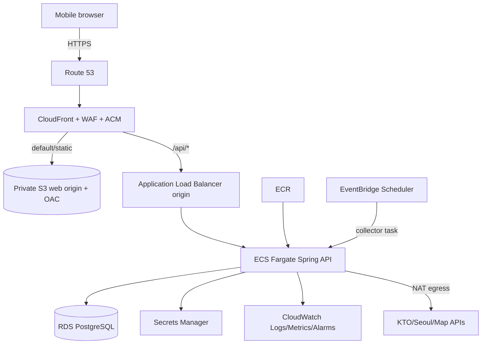

# AWS 배포 아키텍처와 런북

- 상태: Accepted baseline; 실제 계정/도메인/예산 확정 전 값은 placeholder
- 기본 region: `ap-northeast-2` (서울)
- IaC: AWS CDK v2 TypeScript
- 환경: local / staging / production

실제 AWS account ID, domain, GitHub handle, alarm destination은 repository에 기록하지 않고 승인된 parameter store/GitHub environment 설정으로 주입한다. 단, 어떤 account/stack/role이 사용되는지는 release manifest에 비밀값 없이 식별 가능해야 한다.

## 1. 목표 구조



### Account와 stack 경계

선호안은 production을 별도 AWS account로 격리하는 것이다. 조직/예산상 즉시 분리가 불가능하면 staging/production IAM role, VPC, KMS, secret prefix와 CDK stack을 완전히 분리하고 production 분리 계획을 결정 대장에 남긴다.

| Environment | AWS account | Stack prefix | 배포 주체 | 데이터 |
| --- | --- | --- | --- | --- |
| local | 없음 | 없음 | 개발자 | synthetic only |
| staging | non-production account 권장 | `nullnull-stg-*` | main workflow OIDC | 비식별 seed/replay, 제한 실연동 |
| production | dedicated account 권장 | `nullnull-prd-*` | protected environment OIDC | 최소 production data |

CDK stack은 blast radius와 배포 순서를 기준으로 나눈다.

| Stack | 주요 resource | 선행 | Removal policy |
| --- | --- | --- | --- |
| `Foundation` | hosted zone reference, KMS, shared audit/OIDC | 없음 | production retain |
| `Network` | VPC/subnet/SG/endpoint/NAT | Foundation | production retain |
| `Data` | RDS/subnet group/secret | Network | snapshot+retain |
| `Api` | ECR/ECS/ALB/scheduler/log/alarm | Network, Data | service destroy 가능, logs 정책 보존 |
| `WebEdge` | S3/CloudFront/WAF/ACM | Foundation, Api | bucket/version retain |
| `Observability` | dashboard/SNS/budget/anomaly | 전 stack | audit retention 우선 |

stack 사이 runtime lookup을 남발하지 않고 environment manifest/SSM output을 명시한다. 한 stack의 실패가 DB나 web rollback target까지 삭제하지 않도록 stateful resource를 분리한다.

CloudFront를 하나의 public entry로 사용한다. S3 bucket은 공개하지 않고 Origin Access Control(OAC)로 CloudFront만 접근한다. AWS는 S3 origin에 OAC와 signed request 사용을 권장한다. [CloudFront OAC 공식 문서](https://docs.aws.amazon.com/AmazonCloudFront/latest/DeveloperGuide/private-content-restricting-access-to-s3.html)

ECS Fargate service에는 HTTP/HTTPS layer routing이 가능한 Application Load Balancer를 사용한다. AWS도 ECS web traffic에 ALB 사용을 권장한다. [ECS service load balancing](https://docs.aws.amazon.com/AmazonECS/latest/developerguide/service-load-balancing.html), [Fargate 시작 가이드](https://docs.aws.amazon.com/AmazonECS/latest/developerguide/getting-started-fargate.html)

## 2. Network

### Production VPC

- 최소 2개 AZ.
- public subnet: NAT gateway만. CloudFront VPC origin을 쓰지 못하는 fallback에서만 internet-facing ALB.
- private app subnet: ECS task, outbound external API access.
- isolated DB subnet: RDS, public access 금지.
- security group:
  - CloudFront/VPC origin → ALB 443
  - ALB → ECS application port
  - ECS → RDS 5432
  - 그 외 inbound 기본 거부

선호안은 CloudFront VPC origin으로 private ALB를 연결해 origin을 public internet에서 제거하는 것이다. 해당 기능과 CDK 지원을 실제 계정에서 staging 검증한 뒤 확정한다. AWS 문서는 VPC origin으로 private subnet의 ALB를 CloudFront 단일 진입점 뒤에 둘 수 있다고 설명한다. [CloudFront VPC origin](https://docs.aws.amazon.com/AmazonCloudFront/latest/DeveloperGuide/private-content-vpc-origins.html)

Fallback은 internet-facing ALB inbound를 CloudFront managed prefix list로 제한하고, CloudFront가 추가한 secret origin header를 ALB rule에서 확인한다. 이 경우 direct origin 차단 test를 release gate에 추가한다.

### Egress

- production: AZ 장애 격리가 필요하면 AZ별 NAT gateway.
- staging: 비용 절감을 위해 NAT 1개를 허용하되 production parity 차이를 문서화.
- ECR/S3/CloudWatch/Secrets Manager VPC endpoint는 NAT traffic과 비용 측정 뒤 추가.
- 외부 API는 HTTPS 443만 허용하되 domain 기반 egress 제어가 필요하면 별도 proxy/firewall ADR을 연다.

## 3. Frontend 배포

### S3

- private bucket, Block Public Access 전부 활성화.
- bucket versioning 활성화.
- SSE-S3 또는 조직 정책에 따른 KMS encryption.
- object ownership은 bucket owner enforced, ACL 사용 금지.
- lifecycle로 오래된 noncurrent version 정리(rollback 기간보다 길게).

### CloudFront behavior

| Path | Origin | Cache |
| --- | --- | --- |
| `/assets/*`와 hash file | S3 | `public, max-age=31536000, immutable` |
| `/index.html`, manifest, service worker | S3 | no-cache/짧은 TTL |
| client route | S3 `/index.html` rewrite | API path에는 적용 금지 |
| `/api/*` | ALB | cache disabled, cookie/CSRF/required headers 전달 |

- viewer protocol은 Redirect HTTP to HTTPS 또는 HTTPS only. [CloudFront HTTPS/S3 공식 문서](https://docs.aws.amazon.com/AmazonCloudFront/latest/DeveloperGuide/using-https-cloudfront-to-s3-origin.html)
- SPA rewrite는 default behavior에만 적용해 API 404/401을 `index.html`로 바꾸지 않는다.
- deploy는 hash asset 먼저 upload → index/manifest upload → 필요한 path만 invalidation 순서다.
- service worker update는 오래된 API client를 무기한 고정하지 않도록 version/update prompt를 검증한다.
- 장소 검색과 Live viewport는 side-effect 없는 POST body 요청이며 `/api/*`에서 cache하지 않는다. CDN/ALB/APM/application log에 검색어·viewport body/query를 기록하지 않는지 staging access-log inspection으로 검증한다.

## 4. API 배포

### Container

- multi-stage build, JRE runtime only.
- non-root user, read-only root filesystem 가능한 구성.
- image tag는 git SHA, `latest`로 배포하지 않는다.
- base image digest를 pin하고 dependency/container scan을 수행한다.
- `/api/v1/health/live`, `/api/v1/health/ready`를 구분한다.
- JVM memory는 task memory를 인식하는 container option과 OOM/restart alarm을 검증한다.

### ECS service

- staging desired count 1, production 최소 2(예산/가용성 승인 후).
- Fargate task는 private app subnet에 둔다.
- deployment circuit breaker와 automatic rollback.
- health check grace period는 실제 startup/migration 시간으로 측정한다.
- rolling deploy 기본 `minimumHealthyPercent=100`, `maximumPercent=200`.
- autoscaling: CPU/Memory + ALB request count를 staging load test 후 설정.
- session은 DB-backed이므로 sticky session에 의존하지 않는다.

### Collector/worker

- 정기 외부 수집: EventBridge Scheduler가 one-off ECS task를 실행하는 방식을 우선한다.
- optimization: 초기에는 API service 내 DB-backed worker/lease. 두 task가 동시에 실행돼도 row lease로 한 번만 처리한다.
- worker 부하가 API latency를 방해하면 같은 image의 별도 ECS service로 분리하고 SQS 도입 여부를 ADR로 결정한다.

## 5. RDS PostgreSQL

### 기본 설정

- DB subnet group은 isolated subnet만.
- public access false.
- storage encryption과 TLS connection required.
- automated backup/PITR 활성화, production retention 시작값 14일.
- deletion protection production ON.
- performance insights/enhanced monitoring은 비용 검토 후 production ON.
- application role은 schema migration role과 분리하고 최소 권한을 부여한다.

RDS encryption은 storage뿐 아니라 logs, automated backups, read replicas, snapshots도 포함한다. [RDS 암호화 공식 문서](https://docs.aws.amazon.com/AmazonRDS/latest/UserGuide/Overview.Encryption.html)

### Availability profile

| 환경 | DB | API | 목적 |
| --- | --- | --- | --- |
| local | Docker PostgreSQL | local process | 개발 |
| staging | 작은 Single-AZ RDS | task 1 | 통합/비용 절감 |
| production launch | Multi-AZ 권장 | task 2+ | 실제 사용자/공모전 시연 안정성 |

Multi-AZ production 여부는 예상 트래픽이 아니라 허용 downtime과 예산으로 결정한다. Multi-AZ cluster는 자동 backup, encryption, deletion protection 등의 설정을 제공한다. [RDS Multi-AZ 공식 문서](https://docs.aws.amazon.com/AmazonRDS/latest/UserGuide/create-multi-az-db-cluster.html)

### Migration

1. CI에서 snapshot upgrade 검증.
2. production deploy 전에 one-off ECS migration task 실행.
3. migration task는 advisory lock으로 단일 실행.
4. additive/compatible migration만 먼저 적용.
5. 성공 후 ECS service를 새 image로 rolling deploy.
6. migration 실패 시 application deploy 중단. 이미 적용된 destructive DDL을 자동 역실행하지 않는다.

## 6. DNS/TLS/edge security

- Route 53 hosted zone과 ACM certificate를 CDK로 참조/생성한다.
- CloudFront certificate는 AWS 요구 region에 두는 CDK stack으로 관리한다.
- TLS 1.2 이상 policy.
- WAF managed core rules + known bad inputs + rate-based rule.
- login/session/import/optimization mutation은 더 낮은 application rate limit을 둔다.
- WAF count mode로 staging 관찰 후 production block으로 전환한다.
- AWS는 rate-based rule을 request flood의 1차 방어로 설명한다. [AWS WAF rate protection](https://docs.aws.amazon.com/waf/latest/developerguide/ddos-app-layer-web-ACL-and-rbr.html)
- security headers: HSTS, CSP, Referrer-Policy, X-Content-Type-Options, Permissions-Policy.
- CSP에서 허용할 image/map/script origin은 선택한 사업자 확정 후 최소화한다.

## 7. Secret과 IAM

- GitHub Actions는 OIDC로 환경별 deploy role을 assume하고 장기 AWS access key를 저장하지 않는다.
- ECS task execution role과 application task role을 분리한다.
- task role은 필요한 secret ARN, log, 지정 bucket/queue만 허용한다.
- DB credential와 외부 API key는 Secrets Manager에 둔다.
- ECS task definition에는 secret ARN reference만 있고 실제 값이 없다.
- frontend `VITE_*`에는 공개 가능한 값만 둔다.
- Secrets Manager는 credential/API key의 lifecycle과 automatic rotation을 지원한다. [Secrets Manager 소개](https://docs.aws.amazon.com/secretsmanager/latest/userguide/intro.html), [rotation](https://docs.aws.amazon.com/secretsmanager/latest/userguide/rotating-secrets.html)

### GitHub OIDC trust

- staging/production deploy role을 분리하고 role chaining으로 production 권한을 넓히지 않는다.
- trust policy는 정확한 GitHub organization/repository와 environment subject를 조건으로 제한한다.
- pull request/fork/ref wildcard는 production role을 assume할 수 없다.
- workflow는 `id-token: write`, 필요한 `contents: read` 등 job별 최소 permission만 가진다.
- production role은 GitHub `production` environment 승인 뒤 tag/ref 보호 조건을 통과해야 한다.
- OIDC audience, CloudTrail AssumeRole event와 session name에 run ID/release version을 남긴다.
- account ID와 role ARN은 GitHub environment variable로 관리하고 secret key는 만들지 않는다.

## 8. CI/CD

```mermaid
flowchart LR
    PR[Pull request] --> Q[lint/type/unit/contract/integration/E2E]
    Q --> M[main merge]
    M --> B[web build + API image + SBOM]
    B --> S[staging deploy]
    S --> V[smoke/full E2E/readiness]
    V --> A[production approval]
    A --> D[DB compatible migration]
    D --> API[API rolling deploy]
    API --> WEB[web versioned deploy]
    WEB --> P[synthetic journey + alarms]
```



GitHub environments:

- `staging`: main merge 자동.
- `production`: 두 팀원 중 배포자가 요청하고 상대가 승인.
- workflow permission은 최소화하고 fork PR에는 secret/deploy 권한을 주지 않는다.
- IaC diff를 PR artifact로 남기고 destructive change는 별도 승인한다.

`frontend → main`, `backend → main` PR은 stable `docs-contract`와 `docker-integration`을 통과한다. M0 뒤 `docker-integration`은 PostgreSQL, API, web, mobile E2E를 같은 Compose network에서 실행하며 외부 source는 fixture로 차단한다. 실제 KTO 호출은 secret이 있는 staging/submission environment에서 별도 승인형 smoke로 검증한다.

Deployment concurrency:

- staging: environment당 실행 1개. 새 main run이 대기 중인 오래된 **build**를 취소할 수 있지만 진행 중인 migration/deploy를 강제 취소하지 않는다.
- production: 실행 1개, `cancel-in-progress=false`. 승인 이후 새 release가 와도 기존 배포·관찰·rollback 결정을 끝낸다.
- migration: DB/environment당 advisory lock과 workflow concurrency를 모두 사용한다.
- collector deploy와 application deploy가 task definition을 서로 덮지 않도록 service/task family를 구분한다.
- CloudFront invalidation은 web artifact 전환 성공 뒤 한 run만 수행한다.

Artifact:

- API image digest와 SBOM
- web artifact checksum
- OpenAPI/event schema hash
- Flyway migration list/checksum
- CDK synth/diff
- test report와 release notes

모든 artifact는 release version, git SHA, source contract hash, build run ID로 연결한다. 세부 retention과 tag 정책은 [GITHUB_RELEASE_OPERATIONS.md](./GITHUB_RELEASE_OPERATIONS.md)를 따른다.

## 9. Observability와 alert

CloudWatch Container Insights는 ECS/Fargate의 container metric/log를 수집하고 restart failure 등의 진단 정보를 제공한다. [Container Insights 공식 문서](https://docs.aws.amazon.com/AmazonCloudWatch/latest/monitoring/ContainerInsights.html)

### Structured log

```json
{
  "timestamp": "2026-09-04T00:00:00Z",
  "level": "INFO",
  "service": "nullnull-api",
  "environment": "production",
  "requestId": "req_...",
  "traceId": "...",
  "route": "/api/v1/trips/{tripId}",
  "status": 200,
  "durationMs": 84
}
```

cookie, Authorization, CSRF, raw itinerary, request/response body, exact location은 로그 금지다.

### 초기 alarm

| Alarm | 조건 초안 | 행동 |
| --- | --- | --- |
| API 5xx | 5분 2% 초과 + 최소 요청수 | rollback/incident 확인 |
| API p95 | 10분 1초 초과 | DB/source/CPU 진단 |
| unhealthy task | healthy target < desired | deploy 중지/rollback |
| task restart/OOM | 10분 내 반복 | memory/heap dump 없는 안전 진단 |
| DB connection | max 80% | pool/leak/scale 확인 |
| DB storage | 20% 미만 | scale/storage action |
| source freshness | source SLO 초과 | stale/degraded 활성화 |
| source quota | 60/80/90% | cache/throttle/기능 축소 |
| optimization queue | p95 30초 초과 | worker scale/분리 검토 |
| WAF block spike | baseline 대비 급증 | 공격/오탐 점검 |
| billing | 월 budget 50/80/100% | resource/cost review |

Alarm routing은 `warning`, `action`, `critical/security` channel을 분리한다. 실제 수신 채널과 연락처는 AWS/GitHub의 보호된 설정에 두고 repository에는 role key만 기록한다.

| Alarm class | Primary | Secondary/승격 | Ack 목표 | 기본 행동 |
| --- | --- | --- | --- | --- |
| web/client release | FE_DRI | BE_AI_DRI | critical 15분 | web rollback/flag |
| API/DB/source/optimizer | BE_AI_DRI | FE_DRI | critical 15분 | API rollback/degrade |
| security/privacy | incident lead(먼저 확인한 사람) | 상대 담당자 즉시 | 15분 | 변경 동결, 노출 차단, 증거 보존 |
| billing/staging waste | BE_AI_DRI | FE_DRI | 영업일 1일 | schedule/size/log 검토 |

production 전에 실제 test alarm을 두 사람 모두 수신하고 acknowledgment 경로를 검증한다. 응답 SLA와 severity별 절차는 [INCIDENT_RESPONSE.md](./INCIDENT_RESPONSE.md)를 따른다. 연락처가 `TBD`이면 production go/no-go는 실패다.

## 10. Backup/restore

- RDS automated backup/PITR, production deletion protection.
- release 전 중요한 migration은 manual snapshot을 생성하고 expiration tag를 붙인다.
- S3 versioning으로 web artifact rollback.
- ECR lifecycle은 최근 production/release image를 보존한다.
- CDK state/source와 deploy metadata는 Git에 있으나 secret은 없다.

분기마다 또는 production 전 최소 1회:

1. staging용 새 RDS instance로 point-in-time restore.
2. migration을 적용하고 record count/핵심 journey 확인.
3. RTO/RPO 실제 시간을 기록.
4. restore DB를 명시적으로 폐기하고 비용을 확인.

초기 목표: RPO 15분 이하, RTO 2시간 이하. 실제 rehearsal 결과로 수정한다.

### Stateful removal과 artifact retention

- production RDS, S3 web version bucket, audit log bucket은 CDK `RETAIN`; RDS replace/delete에는 final snapshot을 요구한다.
- staging RDS/S3도 기본 `SNAPSHOT`/version retention이며 expiry tag가 있는 ephemeral preview만 `DESTROY`를 허용한다.
- secret은 stack rollback 때문에 자동 삭제하지 않는다. 폐기 시 recovery window와 owner 승인을 둔다.
- CloudWatch log group은 명시 retention을 설정하고 stack 기본값에 의존하지 않는다.
- ECR lifecycle은 untagged image를 정리하되 현재/직전 production과 모든 release tag digest를 보호한다.
- CloudFront/S3 rollback 기간보다 noncurrent object lifecycle을 짧게 설정하지 않는다.

destroy/diff에 stateful replacement 또는 broad IAM change가 보이면 workflow를 자동 중단하고 두 사람의 별도 승인을 요구한다.

### Drift 점검

- production 전과 월 1회 CDK/CloudFormation drift detection을 실행한다.
- security group, IAM/OIDC trust, WAF, RDS deletion protection, backup, S3 public access는 critical drift다.
- critical drift는 다음 deploy 전에 코드와 실제 상태를 일치시키고 원인을 기록한다.
- 긴급 console 변경은 incident ID, 수행자, 만료 시점과 후속 IaC PR을 남긴다.
- 자동 drift 수정은 하지 않는다. stateful/resource replacement 가능성을 사람이 검토한다.

## 11. 배포 런북

### 정상 배포 전

- main CI green, OpenAPI/generated client clean.
- migration이 additive/compatible이고 staging에서 검증됨.
- demo readiness와 외부 quota 정상.
- CloudWatch/WAF/budget alarm 정상.
- rollback 대상 API image digest와 web version 확인.
- 배포자/관찰자 역할 지정.
- 공모전 release이면 익명 외부망, 실제 KTO operation/call-audit/출처, 위치 OFF, 공식 기능설명서 정합성 확인.

### 배포

1. release tag 생성.
2. one-off migration task 실행·완료 확인.
3. ECS 새 task definition rolling deploy.
4. readiness, target health, error/latency 확인.
5. web artifact upload 후 index 전환.
6. E2E-01/02/03/06/07/09 synthetic smoke.
7. 30분 집중 관찰 후 release 종료 기록.

공모전 제출 후보는 같은 immutable release에서 `실제 KTO call → provenance response → 화면 텍스트 출처`를 재현한다. call-audit에는 source operation·시각·결과·count·release/provenance 식별자만 두고 key, 전체 URL query, provider 원문 body, 사용자 입력을 제외한다.

### Rollback

- API regression: ECS service를 직전 task definition/image digest로 되돌린다.
- web regression: 직전 version의 index와 asset manifest를 복원한다.
- migration: 직전 app이 새 schema와 호환되도록 설계한다. 데이터 손실 가능 DDL은 자동 down하지 않고 snapshot restore/forward fix를 incident lead가 선택한다.
- source 문제: source feature flag/circuit를 끄고 stale/replay/unavailable로 degrade한다.

## 12. Incident 최소 절차

1. 사용자 영향과 안전 불변식(일정 무단 변경/데이터 노출)을 먼저 확인한다.
2. severity와 incident lead를 정한다.
3. 변경 중지, 필요 시 즉시 rollback/degradation.
4. requestId/metric/trace로 범위를 좁히고 민감 data를 공유하지 않는다.
5. 복구 확인 후 timeline, root cause, 재발 방지 owner/due를 기록한다.
6. 개인정보 또는 다른 owner 노출 가능성이 있으면 로그 보존/접근을 제한하고 법적 통지 절차를 별도 검토한다.

## 13. 비용 통제

- environment/resource에 `Project`, `Environment`, `Owner`, `ManagedBy`, `Expiry` tag.
- staging ECS desired count와 비업무 시간 운영 여부를 결정하되 외부 수집 검증 시간을 보존한다.
- RDS instance/storage, NAT data, CloudWatch log ingestion, WAF, ALB가 초기 고정비의 주요 후보다.
- log retention과 metric cardinality를 제한한다.
- source 원본과 오래된 snapshot은 약관/TTL에 따라 partition lifecycle 적용.
- AWS Budget와 Cost Anomaly Detection을 production 전 설정.
- 실제 가격은 region과 시점에 따라 달라지므로 문서에 금액을 고정하지 않고 AWS calculator 결과를 release decision에 첨부한다.

### Staging 비용 guardrail

M0에서 월 staging 비용 상한과 예산 owner를 실제 금액으로 결정 대장에 기록한다. 값이 확정되기 전 staging을 무제한 상시 운영하지 않는다.

- Budget 50%: 추세 확인과 anomalous resource/tag 누락 점검.
- Budget 80%: 신규 비용 resource 배포 중지, NAT/log/RDS/ECS 사용 검토.
- Budget 100%: 공동 승인 없는 scale-up/preview 환경 금지, 핵심 demo 시간을 제외한 schedule-down 검토.
- staging ECS desired count 0/1 schedule은 수집·통합 시간과 충돌하지 않게 명시한다.
- RDS stop 가능 기간/제약을 확인하고 자동 start로 비용이 재개되는 점을 monitor한다.
- PR preview 인프라는 기본 생성하지 않는다. 만들면 `Owner`, `Expiry`, max TTL과 cleanup alarm이 필수다.
- 비용 최적화 때문에 production backup, encryption, deletion protection, safety alarm을 끄지 않는다.

## 14. Production launch checklist

- [ ] 실제 domain과 ACM validation 완료
- [ ] CloudFront → private S3 OAC, public access 차단 확인
- [ ] CloudFront → ALB origin direct access 차단 확인
- [ ] WAF count 결과 검토 후 block rule 승인
- [ ] production RDS encryption, backup, deletion protection, restore rehearsal
- [ ] task role 최소 권한과 secret rotation owner
- [ ] CORS/cookie/CSRF 실제 domain test
- [ ] migration/app rollback rehearsal
- [ ] source attribution/terms/quota 확인
- [ ] logs와 built JS의 secret/PII scan
- [ ] full mobile E2E/accessibility/performance gate
- [ ] alarms, budget, incident contact의 실제 수신 test
- [ ] 데이터 삭제 요청과 session revoke test
- [ ] staging/production account 또는 격리 예외 ADR, stack prefix와 role 검증
- [ ] GitHub OIDC subject/audience/ref/environment trust test
- [ ] actual CODEOWNERS handle, branch ruleset와 required check/bypass test
- [ ] production deploy/migration concurrency와 `cancel-in-progress=false` 확인
- [ ] stateful resource removal policy/final snapshot과 drift report 검토
- [ ] staging 월 비용 상한·owner·50/80/100% 실제 수신 test
- [ ] release manifest/artifact retention/직전 rollback digest 확인
- [ ] security/privacy incident tabletop과 severity SLA 확인
- [ ] 외부망·익명창에서 제출 URL과 핵심 judge journey 완료
- [ ] 실제 KTO 호출·provider 이력·redacted call-audit·화면 `출처: ⓒ한국관광공사` 연결
- [ ] `TourAPI` 단독 표기·승인 없는 CI/BI logo·browser/PDF/log secret 0건
- [ ] 공모전 profile의 위치 capability/geolocation prompt/좌표 전송 0건
- [ ] 공식 기능설명서 양식/PDF와 실제 기능·API 목록 일치, 제출본 checksum·접수 완료 증거 보관
