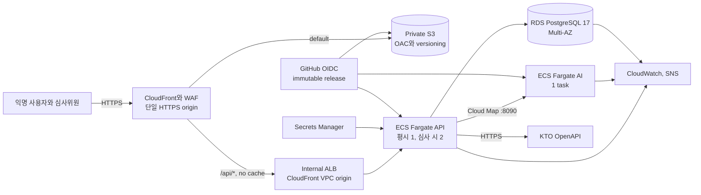

---
aliases:
  - "staging 배포 실행 계약"
doc_type: decision
status: accepted
area: operations
tags:
  - nullnull/decision
  - nullnull/operations
---

# Staging 배포 실행 계약

- 결정일: `2026-09-14`
- region: `ap-northeast-2` (서울)
- 환경: staging 하나만 운영, production 없음
- 총비용 상한: **USD 200**
- 종료일: **2026-10-25**
- 공개 주소: CloudFront 기본 HTTPS domain, custom domain 없음
- AWS: 오너 개인 계정, MFA와 CLI SSO 사용
- KTO: 운영 key를 runtime secret으로만 주입
- alarm: primary 확정, secondary와 실제 수신/tabletop은 미완료
- 연결: [BA-006](../roles/BACKEND_AI_PLAYBOOK.md#ba-006) · [BA-071](../roles/BACKEND_AI_PLAYBOOK.md#ba-071) · [BA-072](../roles/BACKEND_AI_PLAYBOOK.md#ba-072) · [BA-073](../roles/BACKEND_AI_PLAYBOOK.md#ba-073)

이 문서는 staging의 **승인된 설계와 실행 경계**다. 문서와 스크립트를 추가한 것만으로 AWS resource가 생성되거나 acceptance가 통과한 것은 아니다. 실제 resource ARN, 배포 URL, alarm confirmation, restore 측정값과 release manifest가 있어야 각 카드를 완료로 올릴 수 있다.

개인 이메일과 account ID는 Git에 기록하지 않는다. primary 주소는 ignored local 설정의 `NULLNULL_ALARM_PRIMARY_EMAIL`과 GitHub/AWS 보호 설정으로만 전달한다. 스크립트는 값의 존재만 검사하고 출력하지 않는다.

> 2026-09-15 오너 결정: 총비용 USD 200을 유지하고 운영 기간은 조정할 수 있다. 가동은 plan마다 최대 14일이고 최종 종료 한계는 2026-10-25이며 자동 연장하지 않는다(operator가 plan에서 강제한다). 삭제 원장은 아직 구현되지 않았다. 오너 결정 A-039(2026-09-19)로 공개 edge는 원장 없이, FE 로그인 흉내 화면이 들어간 release에서 연다. 심사 기간(2026-10-25까지)에는 DB snapshot 복원을 하지 않고, 복원이 필요하면 edge를 먼저 닫는다(§10·§11).

## 1. 확정 아키텍처



### 왜 이 구조인가

1. `__Host-` session cookie와 Origin/CSRF 검증 때문에 web과 API는 CloudFront 한 origin으로 묶는다.
2. CloudFront VPC origin과 internal ALB로 direct ALB 접근을 구조적으로 제거한다. 지원이 실제 계정에서 실패할 때만 internet-facing ALB + CloudFront managed prefix list + 회전 가능한 origin header로 fallback한다.
3. API와 AI는 독립 service다. AI 장애는 API readiness의 `DEGRADED`이고 DB 장애만 ALB target을 `NOT_READY`로 내린다.
4. 상태를 가진 가장 큰 단일 장애점은 DB이므로 staging도 RDS Multi-AZ를 사용한다.
5. NAT gateway와 다수 interface endpoint는 42일 예산에서 제외한다. ECS task는 public subnet에서 public IP를 사용하되 inbound를 열지 않고 security group 간 통신만 허용한다.

## 2. VPC와 security group

두 AZ에 세 subnet tier를 만든다.

| Tier | Resource | Route/접근 |
| --- | --- | --- |
| `edge-private` | internal ALB | public route 없음, CloudFront origin-facing prefix list(`pl-22a6434b`)에서 `80`만 inbound |
| `egress-public` | api/ai Fargate task | IGW outbound, public IP, 인터넷 inbound 0건 |
| `data-isolated` | RDS subnet group | public route 없음, public access false |

허용 경로는 다음 네 개뿐이다.

- CloudFront VPC origin(origin-facing prefix list) → ALB `80` — ALB가 internal이라 VPC origin 경로로만 닿는다
- ALB SG → API SG `8080`
- API SG → AI SG `8090`
- API SG → RDS SG `5432`

CloudFront viewer는 HTTPS only다. custom domain이 없으므로 CloudFront 기본 인증서를 사용한다. VPC 내부 origin 구간은 HTTP를 허용하되 public internet을 통과하지 않는다. API/AI task의 outbound는 HTTPS와 DNS를 허용하고, 애플리케이션의 provider host allowlist를 함께 검증한다.

ALB access log는 기본 OFF다. 켜야 하면 query string, cookie, CSRF, cursor와 사용자 원문이 남지 않는 별도 redaction 설계를 먼저 승인한다. [A-035](../project/DECISIONS_AND_RISKS.md)의 cursor 허용은 이 조건에 의존한다.

## 3. AWS stack과 output 계약

CDK v2 TypeScript 구현은 stateful replacement와 배포 순서를 분리하기 위해 다음 stack 이름과 output key를 유지한다. 스크립트는 이 계약만 읽고 resource 이름을 추측하지 않는다.

| Stack | 주요 resource | 필수 output |
| --- | --- | --- |
| `NullnullStgFoundation` | ECR, release/evidence bucket, lock table, KTO·verifier secret, GitHub OIDC publish/deploy role(기존 OIDC provider 참조) | `DeployRoleName`, `PublishRoleName`, `ReleaseBucketName`, `KtoSecretArn` |
| `NullnullStgNetwork` | VPC, subnet, SG(ALB는 CloudFront origin-facing prefix list만) | `VpcId` |
| `NullnullStgData` | RDS Multi-AZ, DB secret | `DatabaseIdentifier`, `DatabaseSubnetGroupName`, `DatabaseSecurityGroupId` |
| `NullnullStgPlatform` | ECS cluster, internal ALB, Cloud Map, log group | `ClusterName`, `AppSubnetIds`, `ApiSecurityGroupId`, `MigrationSecurityGroupId`, `MigrationLogGroupName` |
| `NullnullStgMigration` | release digest를 담는 migration·ops task definition(앱 경로), 예보·detail 재적재 schedule | `MigrationTaskDefinitionArn`, `MigrationContainerName`, `OpsTaskDefinitionArn`, `ForecastScheduleName`, `DetailScheduleName` |
| `NullnullStgServices` | api/ai task definition과 service | `ApiServiceName`, `AiServiceName`, `InternalAlbArn` |
| `NullnullStgWebEdge` | private S3, OAC, CloudFront VPC origin(HTTP:80), WAF, API gate | `PublicUrl`, `DistributionId`, `WebBucketName` |
| `NullnullStgObservability` | alarms, `ops.alarm`·예보 metric filter, SNS(Budget 없음 — 조직 SCP가 `budgets:*`를 거부) | `AlarmTopicArn` |

release digest를 담는 것은 `Migration`·`WebEdge`·`Services`뿐이다. 보호 stack(`Foundation`·`Network`·`Data`·`Platform`·`GlobalWaf`·`Observability`)의 template이 바뀌거나 migration 목록이 바뀌면 infra 변경으로 분류되어 `staging-infra` 승인 경로를 탄다.

모든 resource에는 `Project=Nullnull`, `Environment=staging`, `ManagedBy=CDK`, `Expiry=2026-10-25` tag를 붙인다. RDS와 release/evidence bucket은 stack destroy와 분리하고 RDS는 final snapshot 없이는 제거하지 않는다.

## 4. Runtime 크기와 가용성

| 구성 | 기본 | 심사/리허설 | 제한 |
| --- | --- | --- | --- |
| API | Fargate `0.5 vCPU / 1 GB`, desired 1 | desired 2 | regular Fargate, max 2, Spot 금지 |
| AI | Fargate `0.25 vCPU / 0.5 GB`, desired 1 | 동일 | 외부 ingress와 DB 권한 없음 |
| RDS | PostgreSQL 17, `db.t4g.micro`, Multi-AZ, gp3 20 GiB | 동일 | public false, encrypted, deletion protection |

- API Hikari는 `maximumPoolSize=12`, `minimumIdle=2`로 시작한다. 두 API task일 때 DB connection/메모리 alarm으로 검증한다.
- ECS rolling update는 `minimumHealthyPercent=100`, `maximumPercent=200`, deployment circuit breaker와 rollback을 켠다.
- ALB health check는 `/api/v1/health/ready`, API container health는 live+ready, AI container health는 `/internal/v1/health/ready`를 사용한다.
- API desired count 2는 심사 집중 기간과 배포 관찰 창에만 유지한다. 일정이 확정되기 전에는 수동 승인 scale-up만 허용한다.
- RDS backup retention은 14일, tombstone retention은 21일이다. maintenance와 backup window는 심사 시간대를 피하고 운영 기간에는 auto minor upgrade를 끈다.

## 5. Edge와 WAF

| Behavior | Origin | 정책 |
| --- | --- | --- |
| hash asset | private S3/OAC | 1년 immutable |
| `index.html`, manifest, service worker | private S3/OAC | no-cache 또는 짧은 TTL |
| client route | private S3/OAC | default behavior의 viewer-request rewrite만 사용 |
| `/api/*` | internal ALB VPC origin | cache disabled, 모든 HTTP method와 필수 cookie/header/query 전달 |

전역 custom error response로 SPA를 처리하지 않는다. 그러면 API의 401/403/404가 `index.html`로 바뀔 수 있다.

WAF는 CloudFront에 연결한다.

- `/api/*` IP rate rule은 BLOCK. 한도는 staging 측정 후 확정하며 심사 공유 NAT에서 오탐이 나지 않아야 한다.
- AWS managed common rule set은 처음 24시간 COUNT로 관찰한다.
- KTO 탐색/붙여넣기/optimizer 정상 요청이 차단되지 않는 항목만 BLOCK으로 승격한다.
- edge 429가 OpenAPI의 `Problem` shape가 아니면 client 재시도 계약과 맞지 않으므로 BA-073 제출 동선에서는 오탐 방지 한도를 우선한다.

## 6. IAM, OIDC와 secret

계정은 하나지만 역할은 책임별로 나눈다.

| Role | 허용 범위 |
| --- | --- |
| GitHub deploy role | staging CDK stack과 release artifact 배포만 |
| ECS execution role | ECR pull, 지정 log group, 지정 secret reference |
| API task role | 필요한 secret ARN과 AWS API만; CDK/IAM 권한 없음 |
| AI task role | 기본 AWS API 권한 없음 |
| migration task role | DB 연결에 필요한 runtime secret만; service update 권한 없음 |

GitHub OIDC trust는 다음 subject와 audience의 exact match다. 이 저장소는 immutable subject(owner·repository numeric ID 포함)를 쓰므로 이름만 있는 `repo:yutakdv/Nullnull:…` 형식은 발급되지 않으며 신뢰하지 않는다. 정본은 `infra/github-oidc.json` 하나이고 role과 validator가 같이 읽는다.

```text
deploy role  sub = repo:yutakdv@98016178/Nullnull@1348534580:environment:staging
                   repo:yutakdv@98016178/Nullnull@1348534580:environment:staging-infra
publish role sub = repo:yutakdv@98016178/Nullnull@1348534580:environment:staging-build
aud = sts.amazonaws.com
```

branch/ref wildcard, PR, fork와 다른 environment subject는 assume할 수 없어야 한다. deploy job만 `id-token: write`를 가진다.

main에 들어간 코드는 `staging` environment로 deploy role을 쓸 수 있으므로(app release가 사람 승인 없이 도는 조건), 그 경로의 **상한**을 AWS 권한으로 닫는다. workflow의 분류는 편의이고 경계가 아니다.

- **CDK deploy role**(`infra/bootstrap/nnstg-bootstrap.yaml`): CloudFormation 쓰기는 `NullnullStg*` stack에만 하고, resource import(`cloudformation:ImportResourceTypes`)와 toolkit stack 자체 변경을 거부한다. 2026-09-19 두 region에 적용했고 deploy role 정책과 execution role의 policy 3개를 읽기 전용으로 확인했다. 같은 날 variant를 참조하도록 다시 적용해 두 region의 live template이 이 파일과 구조가 같고 stack의 `BootstrapVariant`도 이 template 값이다(표준 template의 `cdk bootstrap`은 `--force` 없이는 CLI가 거부한다). 표준 template은 계정의 **모든** stack을 그 stack에 저장된 role로 바꾸거나 지울 수 있다. 이 파일은 pinned CLI의 template에 `infra/bootstrap/customize.mjs`의 편집만 더한 것이며 `infra/test/bootstrap.test.ts`가 그 동일성을 고정한다.
- **CloudFormation execution policy**(`infra/iam/cfn-execution*.json` 세 개. IAM이 managed policy 하나를 6,144자로 제한해서 나눴고, execution role에 셋이 함께 붙는다): 서울·us-east-1 밖 요청 거부, IAM 쓰기는 `NullnullStg*`·`nullnull-stg-github-*` role만(손으로 만든 `nullnull-stg-operator` 제외), `Project=Nullnull` 태그가 없는 자원의 변경·삭제 거부, 태그는 생성 시에만 붙일 수 있어 남의 자원을 Nullnull로 재태그해 가드를 통과할 수 없다. 스냅샷 공유·복원·복사, 인스턴스·볼륨, traffic mirroring, VPC peering은 조건 없이 거부한다.
- **GitHub role과 app role**은 CDK의 deploy·file-publishing role만 assume한다. lookup role은 계정 전체 `ReadOnlyAccess`(다른 프로젝트의 S3 object 포함)라서 닿지 않게 했다(boundary와 deploy role 정책 양쪽).
- **operator role**은 사람(오너)의 role이며 `cdk-nnstg-*` role에 정책을 쓸 수 있어 사실상 계정 관리자와 같다. local 전용이고 MFA 조건은 걸지 않았다.
- **IAM으로 막지 못하는 잔여**: ECS service·ALB·CloudFront VPC origin을 **다른 프로젝트의 subnet**에 두는 것은 해당 API에 subnet 조건 키가 없거나(ELB·VPC origin) 아직 우리 subnet ID가 없어서(ECS `ecs:subnet`) 막지 못한다. 2026-09-19 조회 기준 서울 계정에는 기본 VPC만 있고 인스턴스·RDS·ALB·CloudFront가 없다. Network stack이 생긴 뒤 `ecs:subnet`을 우리 subnet으로 고정하는 것이 후속이다.
- **사람 게이트(오너 결정 2026-09-19, (a) auto-merge 제외)**: deploy role은 reviewer 없는 `staging`도 신뢰하므로, main에 병합된 코드는 `staging-infra` job을 거치지 않고 `--kind infra` 실행까지 할 수 있다. 그래서 AWS·CD 경로(`.github/workflows/staging-*`, `.github/workflows/auto-merge.yml`, `.github/actions/**`, `infra/**`, `scripts/aws/**`)를 바꾸는 PR은 auto-merge하지 않고 오너가 직접 merge한다. `auto-merge.yml`은 `pull_request_target`으로 main에 있는 판본이 돌아 PR이 자기 게이트를 지울 수 없고, PR 코드는 checkout하지 않는다. 남는 자동 경로(두 collaborator 브랜치와 dependabot의 나머지 PR, fork PR은 대상 아님)로 들어온 app 코드의 상한은 위 권한 경계다. 그 안에서 Nullnull 자원 남용·Nullnull secret 읽기·비용 발생은 가능하다. required check workflow 자체를 바꾸는 PR은 이 게이트 밖이다.
- **trust 지속성**: CloudFormation이 GitHub role의 trust를 관리하므로(Foundation), 위 경로로 trust에 외부 주체가 추가되면 커밋을 되돌려도 남는다. `staging-smoke.sh`가 매 배포 두 role의 trust를 정확한 subject 집합으로 검사해 **탐지**하지만 막지는 않는다.
- CloudFormation이 role을 넘길 수 있는 서비스는 합성된 trust와 같은 `ecs-tasks`·`lambda`뿐이다.

Secrets Manager에는 최소 DB credential, `KTO_SERVICE_KEY`, `NULLNULL_CURSOR_SECRET`, `NULLNULL_DELETION_TOKEN_SECRET`을 둔다. secret 값은 CDK context, task environment, frontend `VITE_*`, release manifest, image layer, log와 GitHub artifact에 들어가지 않는다.

## 7. Immutable release와 migration

release manifest는 한 번 build한 산출물을 식별한다.

```json
{
  "releaseVersion": "v0.1.0-rc.1",
  "gitSha": "40-character-sha",
  "apiImageDigest": "sha256:...",
  "aiImageDigest": "sha256:...",
  "aiCatalogVersion": "KTO_KOR_SERVICE_2:4",
  "webArtifactSha256": "sha256:...",
  "openApiSha256": "sha256:...",
  "eventSchemaSha256": "sha256:...",
  "flywayChecksums": ["V001:..."],
  "cdkAssemblySha256": "sha256:...",
  "buildRunId": "github-run-id",
  "approvedByRoles": ["BE_AI_DRI", "FE_DRI"]
}
```

`latest` tag나 staging에서 다시 build한 artifact는 배포하지 않는다. 정상 배포 순서는 다음과 같다.

1. manifest와 test/evidence를 검증한다.
2. infra 변경이면 `Foundation → Network → GlobalWaf → Data → Platform → Observability`를 배포한다. 앱 전용 release는 이 단계를 건너뛰고 보호 stack이 그대로인지 다시 확인한다.
3. `Migration` stack을 배포하고 같은 API image digest의 one-off migration task를 실행한다.
4. migration은 DynamoDB 배포 잠금·workflow concurrency 1과 PostgreSQL advisory lock을 모두 획득한다.
5. service task에는 `SPRING_FLYWAY_ENABLED=false`; migration task에만 true다.
6. migration 성공 뒤 `WebEdge → Services`를 배포한다(Services가 배포 domain을 참조한다).
7. 외부 CloudFront URL smoke와 30분 관찰을 수행한다.
8. 현재 manifest와 직전 rollback manifest를 evidence bucket에 보존한다.

두 workflow가 동시에 시작해도 진행 중 migration/deploy는 취소하지 않는다. GitHub environment concurrency는 1, `cancel-in-progress=false`다.

승인 경로는 `classify`가 정한다. live template과 새 template을 release 자신의 표지(task definition image의 `@sha256:` 꼬리와 `APP_RELEASE_VERSION`, web bundle key)만 가려서 비교하고, 그 밖의 차이나 migration 집합 변경이 하나라도 있으면 `infra`다. `infra`의 reviewer가 승인하는 것은 plan job summary에 찍힌 diff(정규화한 template과 migration 목록, 12자리 숫자는 가림)이고, 분류 시점의 **원본** live template hash가 실행 직전과 다르면 실행을 거부한다. 분류 뒤 app release가 하나라도 배포됐다면 digest만 바뀌어도 그 승인은 무효다.

잠금은 첫 AWS 쓰기 전에 실패하면 풀고, 쓰기가 시작된 뒤 실패하면 남긴다. 남은 잠금은 CloudFormation·ECS 종료를 확인한 뒤 local operator가 `unlock`으로만 푼다(§11). 그동안 auto deploy는 잠금 획득에서 시끄럽게 멈춘다.

reviewer를 기다리는 `deploy-infra`는 concurrency group을 잡고 있으므로, 승인하거나 거절하기 전까지 뒤의 release는 대기한다(GitHub는 미응답 승인을 30일 뒤 만료한다). 실패한 job만 다시 돌려도 된다: plan과 artifact 이름은 job output으로 전달돼 그것을 만든 attempt의 것을 쓴다.

## 8. Rollback

- API/AI: 직전 manifest의 image digest/task definition으로 되돌린다.
- web: 직전 manifest의 web artifact checksum과 versioned S3 object를 다시 활성화한다.
- DB: destructive down migration을 자동 실행하지 않는다. 직전 binary가 확장된 schema와 호환되지 않으면 forward fix 또는 격리 restore를 incident lead가 선택한다.
- source: KTO 이상이면 catalog/source capability를 닫고 `STALE`/`UNAVAILABLE`을 사실대로 표시한다.

rollback도 manifest validator, 승인 hash와 smoke를 통과해야 한다. DB/Data stack은 rollback 스크립트의 대상이 아니다. rollback은 기록된 release의 assembly를 그대로 쓰고 `Migration`·`WebEdge`·`Services`만 배포한다. 그 세 template이 live와 release 표지만 다를 때만 app 경로(`staging`)로 가고, overlay release로 돌아가거나 더 새로운 schema를 수용하거나(`accept_newer_schema`) 리뷰된 template 변경을 되돌리는 rollback은 `staging-infra` reviewer를 거친다.

## 9. Alarm, 비용과 종료

primary 이메일은 확정됐지만 Git에는 쓰지 않는다. local operator는 ignored `.env.aws-staging.local`의 `NULLNULL_ALARM_PRIMARY_EMAIL`을 사용하고, CI는 GitHub `staging` environment의 보호된 변수/secret을 사용한다. secondary가 없으면 인프라 bootstrap은 가능하지만 `release-ready`와 BA-072-T3는 실패다.

| Signal | 기준/행동 |
| --- | --- |
| API/ALB | healthy host 0, 5xx 증가, p95 지연 → rollback 판단 |
| ECS | desired/running 불일치, 반복 restart/OOM, CPU/memory 70/85% |
| RDS | CPU, connection 80%, free storage 20%, failover event |
| jobs/source | dead letter, queue 지연, KTO freshness/quota/security event |
| billing | 조직 SCP가 Budgets·Cost Explorer를 거부하므로 자동 신호가 없다. 오너가 조직 청구 화면에서 확인한다 |

### `ops.alarm`과 예보 재적재 alarm

`OpsAlarm`은 BA-072부터 `ops.alarm name=<NAME>` 한 줄을 남기고 그 javadoc은 *"a metric filter matches the quoted phrase"* 라고 적고 있었다. **그 filter가 없었다.** 어휘는 있고 배선이 없었으므로 그 줄들은 아무에게도 닿지 않았고, 닿지 않는 것과 사건이 없는 것은 CloudWatch에서 같아 보인다. 이제 다섯 이름 각각에 metric filter 하나와 alarm 하나가 있다(`ApiLogs`, namespace `Nullnull/Staging`). 이름을 합치지 않은 이유는 대응이 다섯 다 다르기 때문이다.

예보 재적재는 세 alarm으로 본다. **먼저 보는 것은 실패가 아니라 성공의 부재다**: `RunTask`는 task가 배치되면 돌아오고 exit code를 읽지 않으므로, schedule이 돌았다는 사실은 재적재가 됐다는 뜻이 아니다.

| Alarm | 무엇을 보는가 | 창 |
| --- | --- | --- |
| `ForecastRefreshMissing` | `KTO_DEMO_REFRESH_DONE mode=forecast … failed=0` 줄이 **없다** | 1시간 창 18개. 마지막 성공 뒤 **18~19시간**에 울린다(창이 시계에 붙어 있어 정렬만큼 1시간 흔들린다). 예보 set이 stale이 되는 PT24H보다 **최소 5시간 앞**이다 |
| `DemoRefreshFailed` | `KTO demo refresh failed:` 줄이 **있다** | 5분 창 1개. 예보·detail **두 mode 공용**이다(문구에 mode가 없다) |
| `ForecastRefreshEmpty` | **INT-04 장소(경복궁 126508)** 예보 evidence 줄의 `coverage=0` | 5분 창 1개. provider가 빈 답을 주면 run은 `REFRESHED`·`failed=0`이라 앞의 두 alarm이 못 본다. 다른 장소의 `coverage=0`은 KTO가 그곳을 예보하지 않는다는 뜻일 수 있어 사고로 세지 않는다 |

부재를 보는 쪽이 schedule 비활성·만료, role의 `ecs:RunTask` 상실, 기동 실패, 로그를 남기기 전에 죽은 run을 **전부** 덮는다. 다만 이 alarm은 **schedule이 아니라 재적재를 잰다** — operator로 손으로 돌린 예보도 같은 줄을 찍으므로 성공으로 센다. 화면이 보는 것이 신선도이므로 그게 맞는 기준이지만, schedule이 사라진 것(예: A-044 이전 release로 rollback)을 손 실행이 가릴 수 있다.

**배포 직후 `ForecastRefreshMissing`은 한 번 울린다.** 새 alarm에는 이력이 없어 만들어지기 전 창들이 missing이고 missing을 breaching으로 읽기 때문이다(AWS에서 실측하지는 않았다 — 적대적 검토가 주장했고 반증되지 않았다). 조용히 만드는 설정은 schedule이 조용히 멈출 때도 조용하므로 막지 않는다. 오너 시트 3-2의 수동 예보가 몇 분 안에 OK로 돌린다.

모든 alarm은 기존 `AlarmTopicArn` topic으로 발행한다. **수신자는 `staging-alarm-subscribe.sh`가 정한다**(A-037). 구독을 돌리지 않으면 이 alarm들은 발화하고도 아무에게도 닿지 않는다.

### 예보·detail 재적재 schedule (A-044)

심사 기간 내내 두 schedule이 돈다. **그래서 KTO 승인 변수 둘이 각 schedule 안에서 상시 승인이다**: `staging_operator.py`는 호출자 환경의 승인 변수와 `--owner-approval` 기록을 둘 다 요구하지만(*"Neither alone runs"*) schedule에는 호출자가 없다. 오너가 상시 형태를 승인했고(A-044, detail 쪽은 2026-09-20 오너 확인), 값은 schedule 정의 안에 그대로 보인다. task definition에는 들어가지 않으므로 operator의 gate는 그대로다.

| schedule | 주기 | 승인 변수 | 왜 필요한가 |
| --- | --- | --- | --- |
| `nullnull-stg-forecast-refresh` | 12시간 | `NULLNULL_KTO_FORECAST_SMOKE_APPROVED` | 예보 set은 PT24H에 stale. 주기는 `KtoDemoRefresh.FORECAST_RENEW_BEFORE`(12시간)와 같다 |
| `nullnull-stg-detail-refresh` | 5일 | `NULLNULL_KTO_SMOKE_APPROVED` | 예보 요청은 detail snapshot에서 만들어지고 그 수명은 `V007`의 604800초(7일)다. 끊기면 예보가 `NO_VERIFIED_KTO_MAPPING`으로 매번 실패한다. 5일 + `DETAIL_RENEW_BEFORE` 2일 = 7일 |

KTO 호출은 예보 하루 4건(장소 2 × 2회), detail 5일에 2건이다. 등록된 quota는 source당 하루 1000건(`V007`의 `perDay`)이라 0.5% 미만이다.

**무인 호출의 위험 하나를 그대로 적는다**: provider 응답이 validator에 거절되면 그 source의 최신 collector run이 `QUARANTINED`가 되고, 그 뒤 모든 호출이 `SOURCE_QUARANTINED`로 막힌다(`KtoPlaceDetailGateway.requireHealthySource`). 사람이 돌릴 때와 같은 동작이지만 새벽에 일어날 수 있고, 해제 도구는 없다. `DemoRefreshFailed`가 그때 울린다.

`staging_operator.py`는 ops task를 **local 전용**으로 못박으므로(`ops-tasks-are-local-only`) schedule은 그 operator를 거치지 않고 ECS `RunTask`를 직접 부른다. 같은 task definition·image·revision을 쓰되 operator가 하던 것 중 빠지는 것이 있다.

| operator가 하던 것 | schedule에서 | 메우는 것 |
| --- | --- | --- |
| release binding | **있다** | schedule이 app stack(`Migration`) 안에 있어 배포가 target을 새 revision으로 다시 가리킨다. 고정 ARN이면 조용히 어긋나므로 infra test가 두 schedule 모두 `Ref`인지 검사한다 |
| 배포 lock(DynamoDB) | **없다** | **메우지 못한다.** 배포와 schedule 실행이 겹칠 수 있다. 특히 `Migration` stack이 schedule을 새 revision으로 다시 가리킨 뒤 Flyway가 돌기 전 몇 분 동안 tick이 들어오면 **새 image가 옛 schema에 붙는다**(ops task는 Flyway가 꺼져 있고 Hibernate `validate`만 남는다). 그 run은 실패하고 `DemoRefreshFailed`가 울리며 다음 tick은 정상이다. schedule은 lock을 잡지 않으므로 실패해도 lock을 남기지 않는다 |
| `NULLNULL_OPERATIONS_TARGET` 사전 대조 | **부분** | schedule이 같은 endpoint로 값을 만들고, task 안 `OperationsContext`가 자기 datasource와 대조해 다르면 연결 전에 거절한다. RDS에 먼저 물어보는 operator의 사전 검사만 없다 |
| 로그 allowlist 증거 수집 | **없다** | **메우지 못한다.** 줄은 CloudWatch에 남고 operator가 하던 선별·증거 파일이 없다. ops main들은 이미 allowlist 모양으로만 찍는다 |
| task 종료까지 대기와 판정 | **없다** | 위 alarm들이 대신한다. 부재 alarm이 "돌지 않았다"와 "돌고 죽었다"를 함께 덮는다 |

종료는 각 schedule 자신의 `EndDate`이고 값은 `staging_operator.py`의 `EXPIRY`(2026-10-25T14:59:59Z = KST 23:59:59)와 같다. 두 파일이 서로를 못 보므로 `scripts/tests/test_ops_alarm_metric_filters.py`가 대조한다.

비용 대응은 다음과 같이 고정한다.

- `$100`: tag 누락과 예상 밖 resource 점검
- `$150`: 비필수 resource와 log 확대 중지
- `$160`: 신규 비용 증가 변경 동결
- `$180`: 심사 기간 밖 API 두 번째 task 제거, retention 재점검
- `$195`: evidence/final snapshot 준비 후 비상 종료 판단
- `2026-10-25`: final snapshot과 evidence export 뒤 비상태 resource 제거

이 계정에서는 AWS Budgets를 만들 수 없다(Organizations SCP). 위 금액 단계는 오너가 청구 화면을 보고 판단하며, 현재 단가로 다시 계산한 추정은 [infra/cost-basis.md](../../infra/cost-basis.md)에 있다. 자동으로 RDS/S3를 지우지 않는다.

### 42일 비용 계획

| 항목 | 계획치 USD |
| --- | ---: |
| API Fargate 1 | 28.6 |
| AI Fargate 1 | 14.3 |
| RDS Multi-AZ compute | 51.4 |
| RDS gp3 20 GiB | 7.3 |
| internal ALB와 1 LCU 여유 | 30.7 |
| ECS public IPv4 2개 | 10.1 |
| WAF ACL와 최소 규칙 | 9.8 |
| 심사 기간 API 추가 7일 | 5.6 |
| CloudWatch, Secrets, ECR, S3, CloudFront 등 | 10~20 |
| **합계** | **168~178** |

운영 계획값은 `$180`, 비상 여유는 `$20`이다. 세금과 비정상적인 대규모 egress는 별도 위험이다.

## 10. Backup/restore와 삭제 재적용

BA-072 완료 전 다음 rehearsal을 실제 AWS에서 한 번 수행한다.

1. staging RDS의 삭제 전 시점으로 새 격리 DB를 PITR 복원한다.
2. restore DB는 public route/ALB/CloudFront와 연결하지 않는다.
3. 현재 compatible migration을 적용한다.
4. `TombstoneReapplier`를 포함한 검증 task를 실행한다.
5. 삭제 receipt의 owner 데이터가 API 공개 표면에 재노출되지 않았음을 쿼리와 integration test로 확인한다.
6. 측정한 RPO/RTO, task ARN, snapshot/restore identifier와 redacted 결과를 evidence에 기록한다.
7. verifier 승인 후 restore DB를 final snapshot 없이 명시적으로 제거할지 결정한다. 자동 cleanup은 금지한다.

목표는 RPO 15분 이하, RTO 2시간 이하다. 실측값이 목표를 넘으면 문서를 고치는 것이 아니라 원인과 개선을 기록한다.

삭제 원장(미구현). DB snapshot을 복원해도 이미 접수한 삭제가 되감기지 않게 하는 장치다. A-039 전에는 공개 edge를 여는 조건이었다. 지금은 복원을 하지 않는 동안에만 원장 없이 연다. 위 PITR을 포함해 복원이 필요하면 `staging_operator.py edge --state closed`로 먼저 닫는다.

- 복원 대상 RDS 밖의 private·암호화·versioned S3에 둔다. 삭제 대상 식별자·범위·순서·보존 기한만 담고, API 응답·log·evidence에는 식별자를 내지 않는다. runtime writer는 원장을 지울 수 없고 verifier는 읽기만 한다.
- 삭제 요청은 DB에 revoke/pending을 기록하고 원장에 내구성 있게 쓴 뒤에야 202 receipt를 준다. 원장 기록은 DB transaction 밖에서 하고, 실패는 멱등하게 재시도하며 성공으로 위장하지 않는다.
- 복원 순서는 migration → 원장 import/revoke → eraser replay → 재노출 거부 검증이다. source DB가 없어져도 원장만으로 접수된 삭제 전체를 재현할 수 있어야 하고, 완전성을 입증하지 못하면 공개하지 않는다.
- 원장 보존 기간은 복원 가능한 snapshot의 최장 보존 종료 + 7일 이상이다.

## 11. Script 실행 계약

AWS script는 `scripts/aws/`에 있다. 기본값은 read-only plan이고 실제 변경은 `--execute`가 있어야 한다. 아래 블록은 bash 기준이다. 대화형 zsh는 기본으로 `#`를 주석으로 읽지 않아, 명령 뒤의 주석이 인자로 넘어간다. 붙여 넣기 전에 `setopt interactivecomments`를 켠다.

```bash
export AWS_PROFILE=nullnull-staging NULLNULL_AWS_AUTH=profile NULLNULL_AWS_ACCOUNT_ID=<account>

python3 scripts/aws/staging-iam.py                                   # IAM 정책·operator role 계획(정책을 바꿀 때마다)
# A-044 배포 순서: `infra/iam/cfn-execution.json`이 scheduler 권한을 얻었으므로, 예보 schedule이 든 release를
# 배포하기 전에 위 스크립트를 plan→execute로 한 번 더 돌린다. 건너뛰면 CloudFormation이 schedule을 만들 권한이
# 없어 Migration stack이 AccessDenied로 rollback한다. 그 순서를 검사하는 게이트는 없고, 이 줄이 유일한 기록이다.
# CDK toolkit(서울·us-east-1). 이 template으로만 실행한다. live stack의 BootstrapVariant가 이 template의 값이라
# (SSM parameter 설명이 그 값을 참조해야 CloudFormation이 parameter만 바뀐 update를 no-op으로 버리지 않는다)
# --force 없는 표준 `cdk bootstrap`은 CLI가 variant 불일치로 거부한다. --force는 그 거부를 끄므로 표준 template에
# 붙이면 deploy role 제한이 사라진다.
infra/node_modules/.bin/cdk bootstrap aws://<account>/ap-northeast-2 aws://<account>/us-east-1 \
  --template infra/bootstrap/nnstg-bootstrap.yaml --qualifier nnstg --toolkit-stack-name NullnullStgCDKToolkit \
  --cloudformation-execution-policies arn:aws:iam::<account>:policy/NullnullStgCfnExecution \
  --cloudformation-execution-policies arn:aws:iam::<account>:policy/NullnullStgCfnExecutionNetworkGuards \
  --cloudformation-execution-policies arn:aws:iam::<account>:policy/NullnullStgCfnExecutionServiceGuards --termination-protection \
  --tags Project=Nullnull --tags Environment=staging --tags ManagedBy=CDK --tags Expiry=2026-10-25
python3 scripts/aws/staging_operator.py bootstrap --estimated-total 80 --cost-basis infra/cost-basis.md
python3 scripts/aws/staging_operator.py secrets                       # KTO key: apps/api/.env.local → Secrets Manager
python3 scripts/aws/prepare-release.py --web-dir apps/web/dist --api-image-digest <d> --ai-image-digest <d> \
  --release-version v0.1.0-rc.N --build-run-id <id> --out .artifacts/releases/release.json
# release·rollback plan에는 verifier token이 필요하다(값은 Secrets Manager nullnull-stg/verifier-token, 출력 금지).
python3 scripts/aws/staging_operator.py deploy --manifest .artifacts/releases/release.json --web-dir apps/web/dist \
  --estimated-total 80 --cost-basis infra/cost-basis.md
python3 scripts/aws/staging_operator.py classify --plan <plan.json> --approved-plan-sha256 <sha>   # kind·diff
python3 scripts/aws/staging_operator.py deploy --plan <plan.json> --approved-plan-sha256 <sha> --execute --kind infra
bash scripts/aws/staging-smoke.sh                                      # NULLNULL_VERIFIER_TOKEN 이 있으면 API 경로도 본다
python3 scripts/aws/staging_operator.py rollback --previous-plan <plan.json> --previous-plan-sha256 <sha>
python3 scripts/aws/staging_operator.py classify --plan <rollback-plan.json> --approved-plan-sha256 <sha>
python3 scripts/aws/staging_operator.py rollback --plan <rollback-plan.json> --approved-plan-sha256 <sha> --execute --kind app
python3 scripts/aws/staging_operator.py unlock --owner <lockOwner>     # break-glass, local 전용
# ops task(local 전용). 승인 변수와 쓰기 대상 DB는 호출자 환경에서만 읽는다. target이 RDS가 보고하는 DB와 다르면
# task를 띄우기 전에 거부하고 기대값을 출력한다.
NULLNULL_KTO_SMOKE_APPROVED=true NULLNULL_OPERATIONS_TARGET=postgresql://<rds-endpoint>:5432/nullnull \
  python3 scripts/aws/staging_operator.py task --task kto-smoke --content-id <id> --content-type-id <type> \
  --owner-approval '<누가·어디서 승인했는지>'
# 영업시간(local 전용). staging placeId로 고친 plan 파일을 커밋하지 않고 넘긴다. 승인값 없이 먼저 돌리면
# plan_sha256을 찍고 AWS 호출 없이 멈추므로, 파일을 확인한 뒤 그 값을 승인으로 붙여 다시 실행한다.
NULLNULL_OPERATIONS_TARGET=postgresql://<rds-endpoint>:5432/nullnull \
  python3 scripts/aws/staging_operator.py task --task curate-hours --plan-file <plan.json> \
  --approved-plan-sha256 <plan_sha256> --owner-approval '<누가·어디서 승인했는지>'
# 큐레이션 게시물(local 전용, #183). 커밋된 ops/curated-posts.json을 그대로 넘긴다(staging placeId와 표지 URL이 들어 있다).
# 표지는 이 명령이 올리지 않는다: release plan이 docs/contest/covers의 jpg를 assembly에 넣고 WebEdge가 /covers/로 서빙한다.
NULLNULL_OPERATIONS_TARGET=postgresql://<rds-endpoint>:5432/nullnull \
  python3 scripts/aws/staging_operator.py task --task curate-posts --plan-file ops/curated-posts.json \
  --approved-plan-sha256 <plan_sha256> --owner-approval '<누가·어디서 승인했는지>'
# BA-006-T2 secret 스캔(local 전용). 기록된 모든 release의 assembly(web bundle 포함)·배포된 두 image·보존 중인 로그에서
# KTO key와 verifier token을 찾는다(원문·URL 인코딩·JSON escape·base64). docker가 필요하다. 값은 출력·기록하지 않는다.
python3 scripts/aws/staging_operator.py secret-scan
# KTO 호출 목록(local 전용, CMP-KTO-006·BA-073-T3). 배포된 release의 call-audit을 읽어, check_submission_inventory.py의
# --inventory가 읽는 파일로 남긴다. KTO를 부르지 않으므로 승인 변수가 없다. release는 입력이 아니라 배포된 release다.
NULLNULL_OPERATIONS_TARGET=postgresql://<rds-endpoint>:5432/nullnull \
  python3 scripts/aws/staging_operator.py task --task kto-call-inventory
# verifier token(Secrets Manager nullnull-stg/verifier-token)은 history에 남지 않게 읽는다. 아래 flows와 edge open이 쓴다.
read -rs NULLNULL_VERIFIER_TOKEN && export NULLNULL_VERIFIER_TOKEN
# INT-04 확인(verifier 경로). 먼저 날짜 쌍을 찾고, 예보 적재 뒤 24시간 안에 돌린다. edge를 연 뒤에는 --expect-edge open.
node scripts/aws/staging-flows.mjs --url https://<cloudfront-domain> --survey
node scripts/aws/staging-flows.mjs --url https://<cloudfront-domain> --optimize-item --item-day <D1> --better-day <D2>
# 공개 edge(local 전용, 오너 결정 A-039). 배포된 release의 plan(deployed/current.json의 planSha256)으로 WebEdge만 다시
# 배포한다. plan 디렉터리는 release bucket의 releases/<planSha256>/plan.tgz를 내려받아 푼다. --execute 없이 먼저 본다.
python3 scripts/aws/staging_operator.py edge --state open --plan <풀어 둔 plan.json> --approved-plan-sha256 <planSha256> --execute
python3 scripts/aws/staging_operator.py edge --state closed --plan <풀어 둔 plan.json> --approved-plan-sha256 <planSha256> --execute
```

- `--kind infra` 실행은 같은 plan 디렉터리의 `classify` 결과(`classification.json`)가 있어야 하고, 분류 뒤 live stack이 하나라도 바뀌었으면 거부한다. `--kind app`은 실행 직전에 다시 분류해 차이가 있으면 거부한다.

- plan은 로컬 합성만 한다. execute는 승인한 plan SHA-256·assembly·release·비용 근거·toolchain hash를 다시 검사한다.
- 배포는 DynamoDB 잠금을 쓰고, 실패·결과 미확정이면 잠금을 유지한다(`unlock`은 CloudFormation/ECS 종료 상태를 확인한 뒤에만).
- GitHub Actions에서는 `.github/workflows/staging-release.yml`(수동·reconciler 대상)과 `staging-reconcile.yml`(`vars.STAGING_AUTO_DEPLOY=true`일 때만)이 같은 operator를 OIDC 임시 자격 증명으로 실행한다.
- alarm subscription과 synthetic test는 별도 스크립트이며 이메일 값을 출력하지 않는다.
- restore drill은 plan이 기본이며 `--execute` 뒤에도 restore DB를 자동 삭제하거나 공개 연결하지 않는다.
- `infra/`가 없거나 output contract가 다르면 script는 fail-closed한다.
- `kto-smoke`는 항상 KTO를 새로 부르고 `called=true` 줄로만 CMP-KTO-003 report를 쓴다. `deployed/current.json`의 release와 ops 정의(image digest, `APP_RELEASE_VERSION`)가 다르면 task를 띄우기 전에 거부한다(`ops-image-not-the-deployed-release`·`ops-definition-not-the-deployed-release`). 실행된 image도 다시 본다(`executed-image-mismatch`). 저장본을 돌려받은 실행은 task가 `KTO smoke failed: CACHED_SNAPSHOT`으로 끝나 `task-failed`가 되고, `ops_log`에 `KTO_SMOKE_CACHED … called=false` 줄이 남으며, 배포 잠금이 유지된다(`unlock` 필요). `kto-smoke-did-not-call`은 `called=true`가 아닌 OK 줄에 대한 방어다. **거절된 호출은 `KTO_KOR_SERVICE_2` source를 격리하고 해제 도구가 없다** — release가 확정된 뒤 한 번, 마지막 호출이 통과한 장소로 돈다.
- `curate-hours`는 승인한 plan 바이트를 gzip+base64로 task override에 싣는다. override는 `describe-tasks`와 CloudTrail에 남으므로 plan에 민감한 값을 넣지 않는다. task가 출력한 sha가 승인값과 같을 때만 성공이고, 그 바이트는 release bucket `evidence/curation/<release>/<sha>.json`에 남는다.
- `curate-posts`도 같은 경로다. task를 띄우기 **전에** plan의 표지마다 배포된 `PublicUrl/covers/` 아래 주소인지 보고(`cover-not-on-the-deployed-edge`), 그 주소를 실제로 받아 바이트의 sha256이 `cover.checksum`과 같은지 본다(`cover-not-served-as-approved`, 성공이면 `covers_verified=<n>`). 성공은 sha 줄, 실패 줄 없음, **plan의 게시물 id마다 결과 줄이 정확히 하나**, 그리고 `curated_posts_published=<PUBLISHED 줄 수> of <게시물 수>`다 — 합계만으로는 `9999 of 5`도 통과했다. 다시 돌려 이미 있는 게시물은 `ALREADY_PRESENT`이고 그래도 성공이다(`0 of 5`). **두 전제가 있다**: 표지를 서빙하는 release(WebEdge의 `CuratedCovers` 배포)가 먼저 배포돼 있어야 게시물의 표지가 404가 되지 않고, `CuratedPostImportMain`이 inline plan을 읽는 release의 image에서만 task가 돈다 — 그 전 release에서는 main이 파일 경로만 알아서 task 안에서 실패한다. 이미 게시된 게시물은 다시 import해도 바뀌지 않으므로(`ALREADY_PRESENT`) 표지 URL을 고치려면 그 게시물을 먼저 지워야 한다.
- 표지 사진이 바뀐 release는 **infra 분류**다. web bundle과 달리 표지 배포의 `SourceObjectKeys`는 분류에서 가리지 않는다: 게시된 글이 표지의 URL과 checksum을 들고 있어서, 같은 이름으로 사진을 바꾸면 이미 게시된 글이 깨지고 그 변경은 검토 diff에 보여야 한다. 사진을 바꿀 때는 새 파일 이름으로 둔다.
- `secret-scan`은 BA-006-T2(*"frontend bundle·image layer·log에 secret이 없다"*)를 실제 값으로 잰다. **bundle**: release bucket에 기록된 **모든** release의 assembly를 받아 기록된 hash로 확인하고, 각각에서 그 release의 `webArtifactSha256`과 같은 asset 디렉터리를 찾는다 — web 배포가 `prune: false`라 옛 release의 파일도 여전히 서빙되기 때문이다. 현재 release가 기록에 없거나 bundle을 못 찾으면 판정 없이 멈춘다. **image**: ECR에서 digest로 받아, 파일 이름이 아니라 바이트(magic)로 zip·gzip·bzip2·xz·zstd를 알아보고 재귀로 푼다(containerd store는 layer를 압축된 채 저장하고, jar 항목은 deflate라 풀지 않으면 아무것도 못 찾는다). 깊이·크기 한도를 넘거나 열 수 없는 blob은 세어서 판정을 부분으로 만든다. ECR 로그인은 스캔 전용 임시 `DOCKER_CONFIG`에만 남고 끝나면 logout한다. **로그**: 그룹 이름은 task definition의 `awslogs-group`에서 읽는다(`logs:DescribeLogGroups`는 operator에 없다). ops·migration은 `Migration` stack output의 배포 ARN으로, api·ai는 family의 최신 ACTIVE revision으로 읽는다(`ecs:DescribeServices`가 없다. 로그 그룹은 Platform 것이라 revision과 무관하다). 기본은 **보존 기간 전체**다 — `deployedAt`은 task가 떠서 기동 로그를 찍은 뒤에 기록되므로 거기서부터 읽으면 기동·migration 로그가 빠진다(`--since`로 좁히면 evidence에 적힌다). **값**: KTO key는 원문과 함께 `URLEncoder` 형태(대·소문자 hex), JSON escape, base64로도 찾는다 — 앱이 `serviceKey=`에 인코딩해 보내므로 로그에 URL이 새면 원문이 아니다. 결과는 release bucket `evidence/secret-exposure/<release>/<시각>.json`에 값 없이 남고 `secret_exposure=clean|clean-partial|leaked`를 찍는다. 누출이면 non-zero다.
- **판정이 `clean-partial`인 이유는 evidence의 `partialBecause`에 적힌다.** task definition이 주입하는 secret 중 스캔하지 않은 것(`taskSecretsNotScanned` — 실제 staging에서는 DB 비밀번호·cursor·deletion secret이라 **판정은 늘 `clean-partial`이다**), image를 건너뛴 경우(`--without-images`), 열지 못한 blob이다. operator가 그 secret을 읽을 수 없고, 노트북으로 읽어 오는 것 자체가 노출이다(`infra/iam/operator.json`은 크기 한도에 닿아 있다). BA-006-T2를 `clean-partial`로 닫을지는 카드 판단이다. `logs:FilterLogEvents`가 실제 계정에서 되는지는 아직 재지 않았다(정책에는 있다).
- `kto-call-inventory`는 `KtoCallInventoryMain`을 배포된 release의 ops 정의로 돌린다(`kto-smoke`처럼 `deployed/current.json`의 release와 image·`APP_RELEASE_VERSION`이 같아야 뜬다). `NULLNULL_INVENTORY_RELEASE`는 배포 잠금 안에서 그 release로 정해진다 — 다른 release의 목록은 그 release를 적은 ledger와 대조해도 통과하므로 입력으로 받지 않는다. task의 `kto_inventory`·`kto_operation` 줄을 **접두어 없이 그대로** `.artifacts/aws/evidence/kto-inventory-<release>-<시각>.txt`에 쓰고 release bucket `evidence/kto-inventory/<release>/`에도 남긴다(`kto_inventory_file=<경로> … counts_as_evidence=…`). 그 파일이 `check_submission_inventory.py --inventory`의 입력이다. header가 없거나 다른 release이거나(`inventory-not-for-the-deployed-release`), 마지막 `operations=N`이 읽어 온 `kto_operation` 줄 수와 다르면(`inventory-incomplete`) 아무것도 남기지 않는다. `counts_as_evidence`는 판정하지 않고 그대로 옮긴다 — 그 판정은 검사기가 한다. call-audit은 release **이름**으로 묶이는데 그 이름은 유일하지 않을 수 있다(CI 이름은 workflow run 번호라 재실행하면 같은 이름으로 다시 빌드하고, 손으로 만든 manifest는 아무 이름이나 쓴다). 그래서 task를 띄우기 전에 release bucket의 배포 기록을 모두 읽어, 같은 이름이 다른 git sha·image로 기록돼 있으면 거절한다(`release-version-reused-by-another-artifact`). 같은 manifest를 새 plan으로 다시 기록하는 rollback은 같은 산출물이라 통과한다. **목록은 뽑은 시각까지의 호출이다**: 같은 release가 그 뒤에 새 종류의 KTO API를 부르면 옛 파일은 그것을 모른다. 그래서 기능설명서를 동결하기 직전에 다시 뽑고, 접수 뒤에 한 번 더 뽑아 operation 집합이 같은지 본다.
- ops task의 로그는 이제 `get-log-events`를 끝까지 넘겨 읽는다. 한 페이지(500건)만 읽으면 기동 로그가 긴 task에서 맨 끝에 찍히는 결과 줄이 잘린다. 끝은 CloudWatch가 같은 token을 돌려줄 때이고, 200페이지 안에 그러지 않으면 다 읽었다고 치지 않고 `task-log-not-fully-read`로 멈춘다.
- `docs/contest/covers/`의 **모든 jpg가 공개로 배포된다.** plan 단계가 그 폴더의 jpg를 전부 assembly에 넣고 `prune: false`라 한 번 올라간 사진은 지워지지 않는다. 게시물이 쓰지 않는 사진을 두지 않는다(`scripts/tests/test_curated_post_covers.py`가 사진 목록과 게시물의 표지 목록이 같음을 확인한다).
- `edge`는 A-039의 전제를 운영자가 지킬 때만 쓴다. 전제는 둘이다. 배포된 release에 FE 로그인 흉내 화면이 들어 있어야 하고, 열려 있는 동안에는 DB 복원을 하지 않는다(복원 전에 닫는다). 명령은 이 전제를 검사하지 않는다.
- `edge`는 배포된 release 자신의 승인 plan과 assembly로 WebEdge만 다시 배포하고 `TrafficEnabled`만 바꾼다. release 확인은 배포 잠금 안에서 한다. plan이 `deployed/current.json`의 `planSha256`이 아니거나 WebEdge stack이 진행 중이면 거부한다. hash 검사는 모두 하지만 시간 검사는 하지 않는다. 24시간 신선도와 plan의 `expiresAt` 가동 창을 보지 않고(심사 기간에 다시 열 수 있어야 한다) staging 종료 한계만 본다. 비용 plan도 다시 평가하지 않는다. `infra/package-lock.json`이 release의 것과 같은 checkout에서, `npm --prefix infra ci`를 한 뒤 돌린다(`toolchain-changed`).
- 열기 전에는 CD가 배포 뒤 돌리는 `staging-smoke.sh`와 verifier 경로 `staging-flows.mjs`가 통과해야 한다. 배포 뒤에는 verifier 없이 `/api/v1/health/live`가 `200 application/json`(열림) 또는 `503 application/problem+json`(닫힘)이 될 때까지 확인한다. ALB의 `503 text/html`은 닫힘이 아니다. 이미 그 상태면 다시 배포하지 않고 확인만 한다.
- **모든 deploy·rollback은 edge를 다시 닫는다.** 공개가 필요한 release마다 다시 연다. 이 명령은 AWS에서 아직 한 번도 돌지 않았다. 첫 사용은 `--execute` 없이 계획부터 본다.
- edge를 연 뒤 `staging-flows.mjs`는 `--expect-edge open`으로 돌린다. 기본값(closed)은 CD가 새 release에 기대하는 상태다.
- `staging-flows.mjs`의 `--survey`와 `--optimize-item`은 opt-in이라 CD(`--url`만 넘김)의 요청과 verdict는 그대로다. 전제가 없으면 `NOT-RUN`과 `staging_flows=incomplete`(exit 3, pass 아님)이고, 전제를 갖춘 한 곳짜리 여행이 낼 수 없는 결과만 `FAIL`이다.

## 12. Acceptance와 evidence

| ID | 실제 증거 |
| --- | --- |
| `BA-006-T1` | full Docker report와 egress-denied probe |
| `BA-006-T2` | frontend bundle, image layer, log secret scan report |
| `BA-006-T3` | exact OIDC trust validator와 wrong subject AssumeRole 거부 기록 |
| `BA-071-T1` | `staging-smoke.sh`의 `alb_internal=true`·`s3_private=true`·`rds_private_multi_az=true`(OIDC 거부는 `BA-006-T3`이다) |
| `BA-071-T2` | local/GitHub deploy lock과 DB advisory lock 동시 실행 test(재현 절차는 카드에 있다) |
| `BA-071-T3` | release manifest digest 검사(operator)와 manifest로 성공한 release run |
| `BA-071-T4` | 이전 release로 rollback한 뒤의 외부 smoke(rollback task definition, current/previous manifest) |
| `BA-072-T1` | 격리 PITR restore에서 tombstone 재적용 후 owner 비노출 report |
| `BA-072-T2` | 부분 삭제/lease/receipt incident exercise |
| `BA-072-T3` | primary/secondary 실제 alarm 수신과 비용/쿼터 tabletop |
| `BA-073-T1` | 새 browser profile, 외부망, anonymous HTTPS journey |
| `BA-073-T2` | 제출 release의 actual-call 증거에 `check_actual_call_evidence.py --require-verified`를 돌린 기록 |
| `BA-073-T4` | `BA-073-T4`를 단 testcase가 게이트 report에 수집된 기록. 지금은 FE-603-T4(`attribution-coverage.test.ts`, vitest)만 있고 vitest report는 집계되지 않는다(부분) |
| `BA-073-T5` | `BA-073-T5`를 단 E2E testcase가 게이트 report에 수집된 기록. 지금은 FE-603-T1(`location-off.spec.ts`) 제목에 그 ID가 없다(부분) |
| `BA-073-T3` | 같은 release의 ledger·readiness·KTO inventory에 `check_submission_inventory.py`를 돌린 출력(diff 0) |

`BA-073`은 기능 선행 카드가 끝나기 전에는 harness만 준비한다. mock-only, 문서-only, 로컬-only 결과로 완료 처리하지 않는다.

## 13. 최종 검수자 체크리스트

최종 검수자는 다음 항목을 독립적으로 확인한다.

- [ ] `$200`, `2026-10-25`, 서울 region이 CDK·operator·비용 근거(`infra/cost-basis.md`)에 동일하다.
- [ ] primary contact 값이 Git diff, CDK assembly, release artifact와 log에 없다.
- [ ] secondary가 없으면 release-ready 검사가 실패한다.
- [ ] public entry는 CloudFront 하나이며 S3/ALB/RDS direct access가 거부된다.
- [ ] API와 AI가 별도 digest/service이고 AI 장애가 API target 제거로 전파되지 않는다.
- [ ] API service에서 Flyway가 꺼지고 migration task에만 켜진다.
- [ ] 같은 release manifest를 deploy와 rollback이 모두 검증한다.
- [ ] `--execute`와 reviewed diff hash 없이는 AWS 변경 명령이 실행되지 않는다.
- [ ] restore drill이 public traffic과 분리되고 tombstone 재적용 실패 시 닫힌다.
- [ ] 실행하지 않은 AWS 검증은 pass로 기록되지 않는다.
