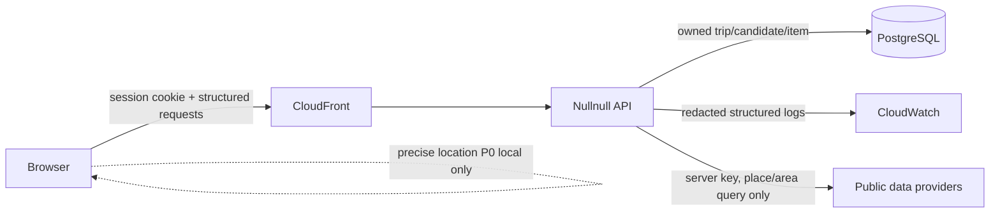

# 개인정보·데이터 최소화 요구사항

- 상태: Technical baseline; 공개 개인정보처리방침은 법률/운영 검토 필요
- 적용: P0 anonymous mobile web, P1 account/location/UGC 추가 시 재검토
- 원칙: 수집하지 않는 것이 가장 강한 보호다

이 문서는 법률 자문이나 최종 대외 문구가 아니다. 구현자가 임의로 수집 범위를 넓히지 않도록 목적, 위치, 보존, 삭제, 로그를 기술 계약으로 고정한다.

## 1. 데이터 흐름

외부 관광 API에는 사용자 session, 일정 전체, 메모, 정밀 위치를 보내지 않는다. server가 필요한 place/area/date 식별자만 요청한다.

## 2. 데이터 인벤토리

| 데이터 | 목적 | P0 수집 위치 | 필수 여부 | 기본 보존 | 외부 공유 |
| --- | --- | --- | --- | --- | --- |
| anonymous owner ID | 여행 소유권 격리 | server | 필수 | session/data 삭제까지 | 없음 |
| session token | 인증 | HttpOnly cookie, hash는 DB | 필수 | 마지막 활동 후 30일 | 없음 |
| locale/timezone | 표시/날짜 계산 | browser+DB | 필수 | owner와 동일 | 없음 |
| onboarding state | redirect/UX | browser+DB | 선택 | owner와 동일 | 없음 |
| active trip ID | 화면 복구 | DB | 선택 | owner와 동일 | 없음 |
| 여행 날짜/제목/관심사 | 일정 기능 | DB | 기능 사용 시 | 사용자 삭제까지 | 외부 provider에 전체 공유 안 함 |
| 후보/일정/잠금 | 저장·편집·최적화 | DB | 기능 사용 시 | 사용자 삭제까지 | 필요한 place/date 단위만 server adapter |
| 일정 메모 | 사용자 편의 | DB | 선택 | 사용자 삭제까지 | analytics/log/provider 금지 |
| 붙여넣기 원문 | 순간 parse | browser 우선, server memory fallback | 선택 | 요청 종료 즉시 폐기 | 없음 |
| 구조화 import draft | 사용자의 매핑 수정 | DB | 붙여넣기 시 | 최대 24시간 | 없음 |
| 정밀 위치 | P1 nearby/replan | P0 server 수집 안 함 | P0 없음 | P0 없음 | P0 없음 |
| analytics event | funnel/오류 개선 | DB 또는 first-party sink | 선택/정책 검토 | raw 90일 | P0 third-party 없음 |
| feed feedback | feed 품질/숨김 상태 | DB | 상호작용 시 | raw 90일 | 없음 |
| notification | P1 상태 안내 | DB | P1 | 90일 또는 read 후 30일 | push 도입 전 없음 |
| deletion receipt/status token | 삭제 진행 확인 | browser memory/hash DB | 삭제 시 | 7일 | 없음 |
| deletion tombstone | backup 복원 후 재삭제 | DB | 삭제 시 | backup 최대 보존+7일 | 없음 |
| request/trace ID | 장애 대응 | log | 필수 | 30일 기본 | 운영 도구 |
| IP/User-Agent | security/edge 운영 | edge/access log 최소화 | 자동 발생 | 가장 짧은 운영 기간 | AWS processor |
| 외부 source snapshot | 추천 근거 | DB | 기능에 필요 | source 약관/TTL | 사용자 data 아님 |

보존 값은 기술 상한 초안이다. 최종 공개 정책이 더 짧으면 공개 정책을 따른다.

## 3. P0 금지 데이터

- raw itinerary 본문을 DB/cache/log/error/analytics/trace에 기록
- browser GPS latitude/longitude를 API로 전송
- session cookie/CSRF/token/API key를 console/error monitoring에 기록
- 자유 텍스트 메모나 검색어를 analytics properties로 전송
- 검색어 또는 device exact viewport를 URL/query/access log에 포함
- owner ID를 광고/third-party analytics identifier로 사용
- 외부 source에 trip 전체/owner/session을 전달
- 사용자 행동으로 민감 특성·건강·종교·정치 성향을 추론
- replay/demo 데이터에 실제 사용자의 일정이나 위치를 포함

## 4. Session과 cookie

- 이름: `__Host-nullnull_session`.
- `Secure`, `HttpOnly`, `SameSite=Lax`, `Path=/`, Domain attribute 없음.
- DB에는 token 원문이 아니라 강한 hash만 저장한다.
- session fixation을 막기 위해 privilege/account 전환 시 rotate한다.
- idle/absolute expiry를 두고 revoke를 지원한다.
- CSRF token은 browser memory에만 보관하고 mutation에 header로 보낸다.
- refresh/new tab은 valid cookie로 `POST /session/csrf`를 호출한다. 발급 token은 tab별 독립 만료이며 새 token이 다른 tab token을 폐기하지 않는다. DB에는 hash만, session당 미만료 5개까지만 둔다.
- 최초 `POST /demo/sessions`는 owner 생성 전 일반 idempotency record를 만들지 않는다. valid cookie retry는 같은 owner로 수렴하고 cookie 없이 중단된 bootstrap record는 15분 안에 제거한다.
- essential session cookie 외 non-essential cookie를 P0에 추가하지 않는다.

대외 cookie 문구에는 이름, 목적, 만료, essential 여부를 정확히 반영한다.

## 5. 일정 붙여넣기

### Browser-first

- parser bundle이 원문을 local memory에서 구조화한다.
- 새로고침 복구 대상으로 raw text를 localStorage/IndexedDB에 넣지 않는다.
- error telemetry에는 parser stage/error code만 보낸다.

### Server fallback

- 사용자가 원문 전송 전 비저장 처리와 목적을 확인할 수 있어야 한다.
- endpoint `Cache-Control: no-store`.
- reverse proxy/application/APM body capture 제외.
- raw string을 persistence entity나 exception message에 넣지 않는다.
- response가 raw text를 echo하지 않는다.
- 구조화 draft에는 짧은 unresolved token만 두고 24시간 내 삭제한다.

자동 test는 고유 canary text를 보내 DB/log/event 검색 결과가 0인지 확인한다.

## 6. 위치

### 공모전 제출 profile

- `FEATURE_NEARBY_LOCATION=OFF`를 environment와 readiness에서 확인한다.
- browser geolocation API를 호출하거나 permission prompt를 띄우지 않는다.
- 사용자는 지역·장소를 직접 선택하고 Live는 area/list 탐색으로 제공한다.
- API, edge log, analytics, error monitoring에 좌표 field가 0건이어야 한다.
- 향후 위치 기능은 공모전 배포와 분리하고 아래 P1 gate 및 위치정보지원센터 사전 검토를 거친다.

### P0

- Browser Geolocation을 사용하더라도 좌표는 local distance/filter에만 쓴다.
- permission을 page load에 요청하지 않고 사용자가 “내 주변”을 실행할 때 요청한다.
- 거절해도 area/list/manual search를 사용할 수 있다.
- service worker/background에서 위치를 수집하지 않는다.
- Live API에 viewport가 필요하면 browser에서 소수점 3자리로 반올림하고 각 축 최소 0.01도인 coarse bounds만 read-only POST body로 보낸다. body는 저장/analytics/access log에서 제외한다.

### P1 server location 전송 gate

다음을 모두 닫기 전 feature flag를 켜지 않는다.

- 목적과 사용자 benefit
- 필요한 최소 정밀도(가능하면 격자/area)
- foreground 1회인지 지속 수집인지
- 명시적 consent와 철회
- 보존 기간(가능하면 request 종료 즉시)
- 외부 route provider 전달 항목
- 삭제/접근/log redaction
- privacy threat review와 API/event schema

## 7. Analytics

- `events.schema.json`의 이름/필드 allowlist만 받는다.
- eventId로 retry dedup한다.
- URL은 route template을 사용하고 query/search text를 제거한다.
- client event는 sessionId/ownerId를 보내지 않는다. API가 인증 cookie에서 내부 session/owner FK를 bind하므로 다른 ID를 가장할 수 없다.
- event property에 unknown/free text가 있으면 reject한다.
- 개별 사용자 scoring/광고 profile에 사용하지 않는다.
- 원본 event는 90일 후 집계/삭제하고 집계는 재식별 가능성이 낮은 threshold를 검토한다.
- analytics 실패가 제품 기능 실패를 만들지 않는다.
- S14 P0 최적화 이력은 status/scope/time/decision/trip·run ID만 다루고 itinerary/proposal 내용을 복제하지 않는다.

Third-party analytics를 도입하려면 processor, 저장 region, cookie, DPA, opt-out, field allowlist를 별도 ADR로 검토한다.

## 8. 로그·관측

허용:

- requestId, traceId
- route template, method, status, duration
- error code, retryable
- source code, collector run, count/freshness
- irreversible owner hash(필요한 기간/환경만)

금지:

- request/response body 전체
- cookie/Authorization/CSRF/query secret
- trip title/note/raw import/search query
- exact coordinate/address와 결합된 owner
- 외부 API response 원문

production debug logging은 time-bound flag와 승인 없이는 활성화하지 않는다. 로그 export/download도 접근 감사 대상이다.

## 9. 소유권·접근·삭제

- 모든 user-domain query는 session owner를 scope로 포함한다.
- 다른 owner resource는 404로 처리한다.
- 운영자용 broad data endpoint를 P0 public API에 만들지 않는다.
- support가 requestId로 조사하더라도 필요한 최소 record만 조회한다.
- session 삭제 시 즉시 revoke하고 새 API 접근을 막는다.
- 같은 transaction에서 모든 CSRF token revoke, deletion request, restore tombstone, leased job을 생성한다. receipt의 one-purpose status token은 memory에만 두고 DB에는 hash만 저장한다.
- DELETE 응답 유실은 revoked cookie와 동일 Idempotency-Key로 24시간 동안 동일 receipt만 재생한다. status token은 receipt ID/expiry의 결정적 서명으로 다시 만들고 plaintext를 저장하지 않으며, revoked cookie는 다른 endpoint에서 항상 401이다.
- session이 이미 revoke되므로 삭제 상태 endpoint는 `X-Deletion-Status-Token`만 받고 진행 상태 외 domain data를 반환하지 않는다. token은 7일 만료이며 URL/query/log에 넣지 않는다.
- owned trip/candidate/item/import/event/feedback/notification 삭제 job은 ACCEPTED→RUNNING→COMPLETED/PARTIAL_FAILED/FAILED 상태, attempt, failure code, alert를 둔다.
- tombstone은 최대 backup 보존보다 7일 이상 길게 유지한다. restore 환경은 public traffic 전에 tombstone의 owner/delete-before를 재적용하고 완료 검증 후에만 열린다.
- 완료 상태나 최적화 이력을 위해 사용자 일정/proposal snapshot을 별도로 복제하지 않는다. 기존 trip cascade와 backup/tombstone 정책만 따른다.

계정 기능이 생기면 접근/정정/export/삭제, anonymous→account migration, account recovery를 별도 설계한다.

## 10. 대외 문서 전에 확정할 항목

- 운영 주체의 정확한 명칭/연락처
- 처리 목적과 법적 근거
- 각 데이터의 최종 보유·이용 기간
- AWS와 선택 외부 processor/국외 이전 여부
- cookie/analytics 동의 방식
- 사용자 권리 요청 절차와 인증 방법
- 미성년자 대상 여부
- 개인정보 처리방침 변경 통지 방식
- incident 통지/신고 절차

이 정보는 기술팀이 추측하지 않고 서비스 운영 주체가 결정한다.

## 11. Privacy acceptance

- [ ] network inspector에서 P0 GPS 전송 0
- [ ] raw import canary가 DB/log/event/APM에 0
- [ ] built JS/config에 secret 0
- [ ] owner A/B authorization matrix 전부 통과
- [ ] session revoke 직후 보호 route 차단
- [ ] refresh/new-tab/two-tab CSRF token 독립성 및 hash-only 저장
- [ ] search/coarse viewport canary가 URL/access log/APM/analytics에 0
- [ ] TTL cleanup과 backup restore 후 deletion 재적용 test
- [ ] deletion status token은 header-only, hash-only, 상태 외 응답 0
- [ ] analytics fixture가 schema를 통과하고 unknown field는 거절
- [ ] S15 데이터 안내와 공개 정책이 실제 source/state/보존과 일치
- [ ] 최종 개인정보처리방침 검토자와 날짜 기록
- [ ] 공모전 release config에서 위치 flag OFF, geolocation 호출/permission prompt 0건
- [ ] 제출 기능설명서·screenshot·call-audit에 key/token/request 원문·개인 위치 0건
