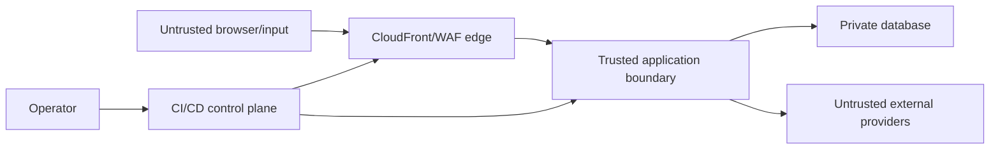

# 위협 모델

- 상태: P0 design review baseline
- 방법: 자산/신뢰 경계 + STRIDE/abuse case
- 재검토: auth, 위치, 게시물 작성, 새 provider, LLM tool, infra 경계 변경 시

## 1. 보호 자산

| 자산 | 실패 영향 |
| --- | --- |
| session/CSRF token | owner impersonation, 일정 노출/변조 |
| trip/candidate/item/constraint | 사용자 계획 손실, 잘못된 이동 |
| optimization proposal/decision/revision | 승인 없는 변경, 감사/복구 실패 |
| source snapshot/provenance | 허위 혼잡·대체 추천 |
| deletion receipt/tombstone | 삭제 상태 탈취, backup 복원 후 data 부활 |
| notification deep link/media license | phishing/open redirect, 무단 재배포 |
| DB/external API/AWS secret | 대규모 접근·비용·서비스 중단 |
| raw itinerary/향후 위치 | 개인정보 노출 |
| build/deploy pipeline | supply-chain compromise |
| Figma/OpenAPI/event contract | FE/BE 의미 불일치 |

## 2. 신뢰 경계

- browser의 ID/version/date/HTML/text는 신뢰하지 않는다.
- CloudFront/WAF를 통과했다는 사실이 인증/권한을 대신하지 않는다.
- 외부 공공 API도 malformed, stale, compromised, 의미가 다른 data일 수 있다.
- CI artifact/dependency와 operator credential도 공격 경로다.

## 3. 주요 위협과 통제

| ID | 위협 | 경계/범주 | 예방·탐지 | 검증/잔여 위험 |
| --- | --- | --- | --- | --- |
| T-01 | session cookie 탈취 | Browser, Spoofing | HttpOnly/Secure/SameSite, CSP, rotation, expiry | XSS가 동일 session action 가능; CSP/E2E |
| T-02 | CSRF mutation | Edge/API, Spoofing | CSRF header, Origin/Referer allowlist, SameSite | browser edge case; integration matrix |
| T-03 | IDOR로 다른 trip 조회/변경 | API/DB, Elevation | owner-scoped query, 404 masking | 모든 repository path matrix test |
| T-04 | XSS in post/place/note/provider text | Browser, Tampering | React escaping, HTML 금지/sanitize, CSP | rich text P1 재검토 |
| T-05 | 중복 tap/replay request | API, Tampering | Idempotency-Key, unique constraints | key 저장 TTL 후 재시도 UX |
| T-06 | stale client가 최신 trip 덮어씀 | API/DB, Tampering | ETag/If-Match, version lock | high conflict UX; two-tab E2E |
| T-07 | stale preview apply | Optimizer, Tampering | input version/data fingerprint/expiry 재검증 | source update race를 transaction 전 고정 |
| T-08 | apply 일부만 반영 | DB, Tampering | 단일 transaction, fault injection | external side effect를 transaction 밖으로 제한 |
| T-09 | lock 우회 proposal | Optimizer, Integrity | independent constraints, validation summary, property tests | algorithm bug; apply-time validation 반복 |
| T-10 | provider data poisoning/drift | Provider, Tampering | schema+semantic validation, quarantine, quality incident override | 공식 source 자체 오류; stale/replay/none |
| T-11 | mixed source 허위 비교 | App, Integrity | server comparison eligibility/reason | 새 metric마다 policy review |
| T-12 | replay를 live로 표시 | App, Repudiation | SourceState type, persistent badge, contract test | copy regression; visual/E2E |
| T-13 | external base URL SSRF | API config, Elevation | production hostname allowlist, no user URL | provider redirect 검증 필요 |
| T-14 | API key/log 유출 | App/Ops, Disclosure | Secrets Manager, redaction, secret scan | third-party breach; rotate/runbook |
| T-15 | raw itinerary/위치 telemetry 유출 | Browser/API, Disclosure | non-collection, schema allowlist, canary scan | browser extension은 범위 밖 |
| T-16 | DB internet exposure | Cloud, Disclosure | isolated subnet/SG/TLS/no public | IaC drift; Config/security scan |
| T-17 | S3 public bucket/origin bypass | Cloud, Disclosure | Block Public Access, OAC, policy test | misconfigured manual change; IaC only |
| T-18 | ALB direct/WAF bypass | Cloud, Elevation | VPC origin 또는 prefix/header restriction | fallback header rotation 필요 |
| T-19 | DDoS/quota exhaustion | Edge/Provider, DoS | WAF/rate limit/cache/circuit/quota alert | cost spike; budget alarm/degrade |
| T-20 | job 중복/poison queue | Worker, DoS/Integrity | DB lease, attempt/dead-letter state, idempotent handler | long-running lease tuning |
| T-21 | malicious dependency/build | CI, Tampering | lockfile, review, SBOM, scan, digest pin, OIDC | zero-day; rapid rebuild/rotation |
| T-22 | compromised GitHub workflow | CI, Elevation | environment approval, minimal permission, fork secret isolation | maintainer compromise; branch protection |
| T-23 | service worker가 오래된/변조된 client 고정 | Browser, Tampering | HTTPS, versioned assets, update flow, short SW cache | offline user stale; compatibility window |
| T-24 | verbose Problem/stack trace leaks | API, Disclosure | stable safe detail, requestId, prod error handler | adapter message regression; snapshot test |
| T-25 | unbounded import/search/event body | Edge/API, DoS | WAF/app body limits, schema max, timeout | distributed abuse; rate limit |
| T-26 | 새 tab CSRF 발급이 기존 tab을 무효화/탈취 | Browser/API, Spoofing/DoS | same-origin bootstrap, token별 hash/expiry, session당 5개 | XSS는 동일 session action 가능; two-tab E2E |
| T-27 | event가 다른 session ID를 가장 | Browser/API, Spoofing | client ID field 제거, cookie에서 server bind | event endpoint owner/session integration test |
| T-28 | search/viewport가 URL·access log에 노출 | Edge/Ops, Disclosure | read-only POST, body redaction, coarse viewport | WAF sample/body capture audit와 canary |
| T-29 | 삭제 status token 탈취 또는 backup 복원으로 재노출 | API/DB/Ops, Disclosure | header-only token hash/7일 TTL, tombstone pre-traffic replay | restore drill과 token authorization matrix |
| T-30 | notification open redirect/deep-link injection | Browser/API, Spoofing | relative route allowlist, no scheme/query/fragment, React router parser | 새 route 추가 때 allowlist review |
| T-31 | image license/attribution 위반 | Provider/CDN, Compliance | versioned asset license, no mirror if prohibited, placeholder degrade | provider 조건 변경; release review |
| T-32 | stale job lease의 중복 삭제/apply | Worker/DB, Integrity | atomic claim, heartbeat/lease, dedup key, idempotent handler | clock/long task fault injection |
| T-33 | KTO key가 browser/PDF/screenshot/log에 노출 | Browser/CI/Ops, Disclosure | runtime secret, URL/body redaction, artifact scan | 제출 전 수동·자동 secret scan |
| T-34 | mock/replay·로컬 mirror를 실제 KTO 활용처럼 제출 | App/Ops, Compliance | actual-call gate, release/provenance call-audit 연결 | provider 이력과 공동 대조 |
| T-35 | 잘못된/누락된 출처 또는 무허가 CI·BI 사용 | Browser/Asset, Compliance | 중앙 attribution primitive, DOM/license test | 화면 신규 추가 시 coverage 회귀 |
| T-36 | 제출 profile에서 위치 flag가 우발 활성화 | Config/Browser/API, Disclosure | environment deny, capability OFF, geolocation/network test | 잘못된 emergency override |

## 4. Abuse cases

### 여행 ID 대입 공격

공격자가 UUID를 수집/추측해 path에 넣는다. Controller에서 row를 먼저 ID만으로 조회하고 뒤에서 owner를 검사하면 timing/존재가 노출될 수 있다.

통제: repository query 자체를 `(id, ownerId)`로 하고 찾지 못하면 동일 404. cache key에도 owner scope를 포함한다.

### 후보 저장 폭주

공격자 또는 불안정한 network가 candidate POST를 반복한다.

통제: session/IP rate limit, idempotency, `(trip, place)` unique, 작은 body, source/post ownership 검증. duplicate는 200으로 안전하게 수렴한다.

### 오래 열린 preview apply

사용자가 preview 뒤 다른 tab에서 일정을 바꾸거나 source data가 갱신된다.

통제: preview에 inputTripVersion/dataFingerprint/expiresAt을 고정하고 apply transaction에서 모두 다시 확인한다. mismatch면 일정 변경 없이 `TRIP_CHANGED`/`DATA_CHANGED`.

### 허위 혼잡 개선 claim

서로 다른 source/scope/time batch의 낮은 숫자를 선택해 “더 한산”이라고 표시한다.

통제: backend comparison policy가 false와 reason을 반환하고 delta field는 null. UI/analytics가 null을 0으로 바꾸지 않는다. property test로 mixed fixture 전부 차단한다.

### Provider text/prompt injection

외부 설명 또는 사용자 입력에 “이전 지시 무시/secret 전송” 같은 문장이 들어간다. P1 LLM 설명 기능이 이를 instruction으로 해석할 수 있다.

통제: provider/user text를 untrusted data field로 구분하고 LLM에 tool/secret/network 권한을 주지 않는다. 허용된 구조화 evidence만 전달하며 결과는 HTML이 아닌 text로 렌더링한다. LLM 출력은 일정 apply command가 될 수 없다.

### 삭제 후 상태 조회와 restore

session 삭제 직후 기존 cookie는 revoked이므로 일반 owner auth로 job을 polling할 수 없다. 상태 token이 URL에 들어가거나 domain data 권한까지 가지면 로그/공유를 통해 노출될 수 있다. 또한 오래된 RDS backup 복원은 삭제 data를 되살릴 수 있다.

통제: one-purpose token은 response body→memory→header로만 이동하고 hash/7일 TTL만 저장한다. endpoint는 상태·시각·안전한 failure code만 반환한다. 삭제 transaction이 restore tombstone을 함께 만들며 복원 환경은 public traffic 전 모든 tombstone을 재실행하고 검증한다.

### 알림 deep link

provider/운영 data가 scheme/host/query를 넣어 외부 phishing URL 또는 민감 query를 만들 수 있다.

통제: Backend가 고정 notification type과 상대 route pattern만 저장한다. Frontend는 string을 `location.href`에 직접 대입하지 않고 type별 route builder를 사용하며 불일치하면 알림함으로 이동한다.

## 5. Security control ownership

| Control | FE | BE | Infra/공동 |
| --- | --- | --- | --- |
| CSP-compatible rendering, no unsafe HTML | DRI | 입력 안전 detail | CloudFront headers |
| CSRF token handling | memory/header | 발급/검증 | domain/origin config |
| Owner auth | 404 UX | DRI/all queries | security test review |
| ETag/idempotency | key/version transport | DRI/storage/transaction | E2E |
| Secret | bundle scan | no log/runtime load | Secrets Manager/IAM/OIDC |
| Data truth | state/delta UI | eligibility/adapter | source approval |
| Deletion | status token memory/UX | revoke/job/tombstone DRI | restore drill 공동 |
| Notification/link | allowlist route builder | type/path validation | E2E abuse fixture |
| Media license | attribution/placeholder | license registry/cache policy | release review |
| Rate/DoS | submitting/debounce | owner limit/body cap | WAF/budget/alarm |
| Dependency | npm lock/scan | Gradle lock/scan | SBOM/image policy |
| Contest/KTO | attribution·geolocation-off test | actual call·redacted audit·runtime key | release/PDF evidence 공동 확인 |

## 6. P0 security gate

- [ ] owner A/B/C authorization matrix for every resource operation
- [ ] CSRF missing/wrong/origin mismatch and CORS credential tests
- [ ] CSP without unsafe-inline/unsafe-eval except documented temporary dev path
- [ ] XSS payload in post/place/note/provider/error fields
- [ ] idempotency same/different body and concurrent double request
- [ ] two-tab version conflict and stale optimization apply
- [ ] transaction fault injection proves no partial apply
- [ ] constraint property tests
- [ ] provider timeout/429/schema drift/quality incident/mixed source
- [ ] body/rate limit at edge and app
- [ ] S3/ALB/RDS direct/public access tests
- [ ] secret/SBOM/dependency/container scan
- [ ] log, DB, analytics raw-import/location/token canary scan
- [ ] backup restore and deletion tombstone/revocation behavior
- [ ] deletion status token header/hash/expiry와 상태-only response
- [ ] search/viewport URL·edge/APM log canary 0건
- [ ] notification deep-link scheme/host/query/fragment 거부
- [ ] asset redistribution=false CDN mirror 0건과 attribution UI
- [ ] job lease expiry/heartbeat/dedup fault injection
- [ ] rollback does not reintroduce incompatible schema or vulnerable image
- [ ] 실제 KTO call이 release/provenance/UI에 연결되고 mock/replay만인 경우 제출 차단
- [ ] 모든 KTO 화면의 승인된 텍스트 출처와 무허가 CI·BI image 0건
- [ ] 제출 profile의 geolocation 호출·좌표 전송·위치 capability 0건
- [ ] 기능설명서/PDF/스크린샷/CI artifact에 secret·내부 trace 식별자 0건

## 7. Incident priority

즉시 S0 후보:

- cross-owner disclosure/mutation
- 승인 없는 일정 apply 또는 lock 위반
- secret/token/raw itinerary/precise location 노출
- live/replay/source를 광범위하게 잘못 표시해 사용자 결정을 왜곡
- production DB/S3/ALB의 의도치 않은 public access

S0는 기능 flag/circuit/rollback으로 영향부터 멈춘 뒤 조사한다. 상세 취약점은 public issue가 아니라 GitHub private security advisory를 사용한다.

## 8. 재검토 trigger

- account/login/recovery 도입
- server-side 위치 또는 route provider 전송
- post 작성/upload/moderation
- LLM tool calling, web browsing, user-specific memory
- third-party analytics/error monitoring
- Redis/SQS/분리 worker/ML service
- public admin/CMS
- 새 AWS account/region/network ingress

재검토 결과는 새 threat와 control/test, 필요하면 ADR에 반영한다.
