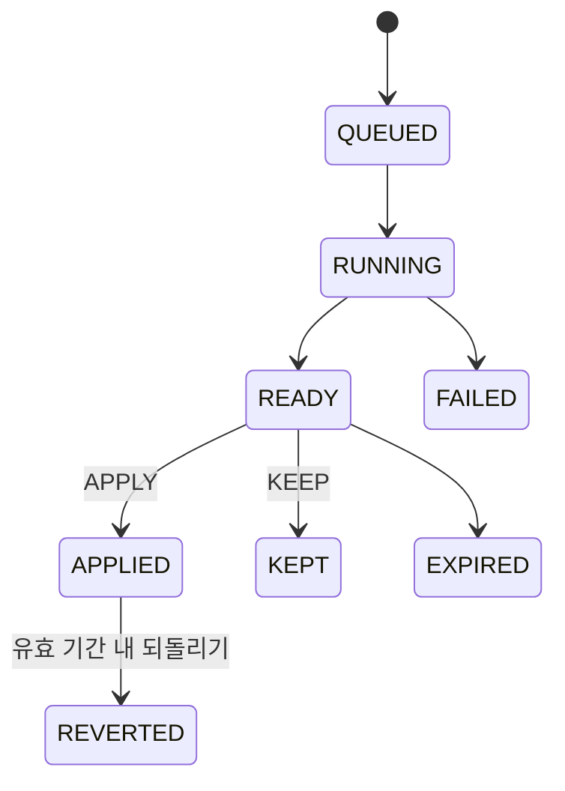
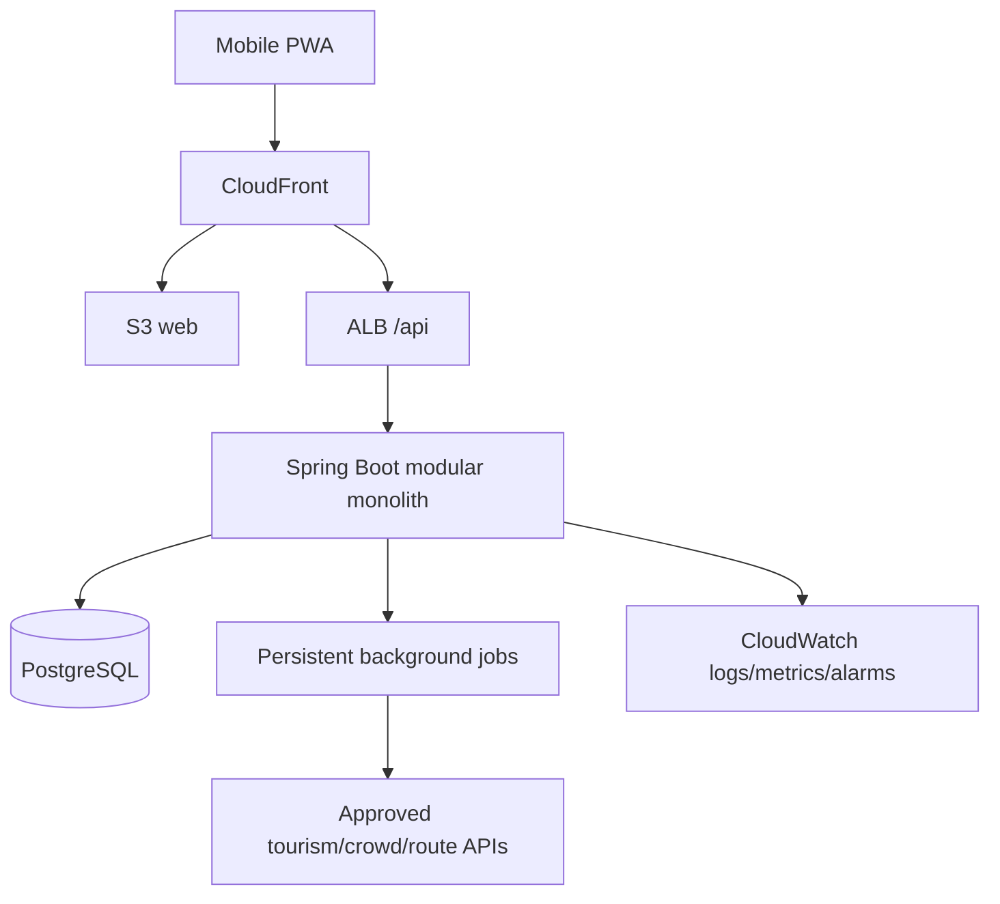

# 널널(Nullnull) 모바일 웹앱 통합 기획안

> 2026 관광데이터 활용 공모전 `②-2 웹·앱 구현 부문` — 내부 가정 `지정과제 2`, 오버투어리즘 완화를 위한 분산 여행 플래너. exact 부문·과제명은 제출 화면 대조 후 확정한다.

| 항목 | 내용 |
| --- | --- |
| 문서 버전 | v8.0 |
| 기준일 | 2026-09-05 |
| 제품 형태 | 모바일 우선 PWA |
| 팀 구성 | Frontend 1명, Backend/AI 1명 |
| 디자인 기준 | Figma `02 UI Design` 현재 화면 52개, `01 Components` 최상위 컴포넌트 49개; ITEM READY preview 등 FCR Open |
| 개발 상태 | 기능 코드 미착수; 문서·계약 기준선 조건부 승인 |

이 문서는 서비스 목적, 공모전 제안, 출시 범위와 개발 순서를 설명한다. 현재
go/no-go와 발견된 gap은 [PM 정합성 감사](docs/project/PM_CONSISTENCY_AUDIT.md), 화면별
acceptance와 수정 대상은 [Figma 개발 핸드오프](docs/design/FIGMA_HANDOFF.md)와
[Figma 수정 요청](docs/design/FIGMA_CHANGE_REQUESTS.md), 기능과 API 추적성은
[기능 인벤토리](docs/product/FUNCTIONAL_INVENTORY.md), 실제 request/response는
[OpenAPI](docs/api/openapi.yaml)가 정본이다.

## 공모전 제출 계약

[2026 공식 공지 요약](docs/contest/2026-관광데이터-활용-공모전-공지-심사기준.md)에서 확인한 외부 요구와 팀 내부 운영 결정을 구분한다.

| 구분 | 확정 내용 |
| --- | --- |
| 공식 마감 | 2026-09-21 16:00(KST), 이후 수정 불가 |
| 팀 내부 일정 | 09-18 기능/PDF 동결, 09-19 code freeze, 09-20 16:00 제출 목표, 09-21 15:00 변경 종료 |
| 제출 식별값 | 예상 부문은 `②-2 웹·앱 구현 부문`; 서비스 개요·부문/유형·지정과제는 공식 제출 화면의 exact label을 09-18과 제출 직전에 대조해 확정 |
| 제출 형태 | 외부 HTTPS 웹 URL, 핵심 기능 `로그인 불필요`, 공식 기능설명서 양식의 PDF |
| 필수 데이터 | 최종 서비스가 한국관광공사 OpenAPI를 실제 호출·사용하고 제출 인증키의 호출 이력을 확인할 수 있어야 함 |
| 제출 금지 표현 | file/replay/mock-only를 실제 OpenAPI 활용으로 소개, 미구현/P1 기능 기재, replay를 live로 표현 |
| 출처 | KTO 화면에 `출처: ⓒ한국관광공사` 또는 승인된 동등 문구, `TourAPI` 단독·무허가 CI/BI logo 금지 |
| 위치 | 제출 profile에서 위치 기능 OFF, geolocation prompt와 개인 위치 서버 전송 없음 |

이 문서의 기능 문장은 구현 목표와 계약이며 현재 구현 완료를 뜻하지 않는다. 기능설명서에는 최종 배포 URL에서 실제 동작하는 기능과 실제 호출 API만 적는다. 요구사항별 담당·증거·차단 조건은 [공모전 준수 매트릭스](docs/contest/COMPETITION_COMPLIANCE_MATRIX.md), 제출 당일 절차는 [제출 runbook](docs/contest/SUBMISSION_RUNBOOK.md)을 따른다.

## 1. 한 문장 제안

널널은 여행자가 피드와 Live에서 발견한 장소를 **특정 여행의 후보**로 모으고, 출처가 확인된 혼잡·시간·경로 근거를 이용해 더 한산한 변경안을 비교한 뒤 **직접 적용**하는 여행 플래너다.

단순히 덜 알려진 장소를 나열하지 않는다. 사용자의 실제 일정과 필수 조건을 보존하면서, 같은 장소의 더 나은 시간 또는 비교 가능한 대체 장소로 수요를 분산시키는 것이 핵심이다.

## 2. 문제 정의와 기회

### 사용자 문제

- SNS·블로그에서 찾은 장소가 여러 앱에 흩어지고 실제 여행 일정으로 이어지지 않는다.
- 혼잡 회피 추천은 어느 시각·어느 출처의 값인지, 서로 비교해도 되는 값인지 알기 어렵다.
- 자동 생성 일정은 예약, 필수 방문, 날짜·시간 조건을 무시하거나 사용자 승인 없이 기존 계획을 바꿀 수 있다.
- 여행 중에는 좁은 모바일 화면과 불안정한 네트워크에서 현재 상태와 대안을 빠르게 판단해야 한다.

### 관광 생태계 문제

- 인기 명소와 특정 시간대에 수요가 집중되면서 방문 만족도와 지역 수용성이 함께 낮아진다.
- 분산 효과를 만들려면 “새 장소 추천”뿐 아니라 방문 시간 이동, 일정 반영, 사용자 선택까지 하나의 흐름으로 연결해야 한다.
- 실시간·예보·재현 데이터를 구분하지 않으면 신뢰를 잃고 잘못된 의사결정을 유도한다.

### 해결 기회

한국관광공사 관광 POI를 기준 장소 식별자로 사용하고, 공식·승인된 혼잡/도시 데이터와 결정적 일정 검증을 결합한다. LLM은 선호 해석과 근거 설명을 돕되 사실 판정과 일정 적용 권한을 갖지 않는다.

## 3. 목표 사용자와 사용 맥락

| 사용자 | 핵심 상황 | 원하는 결과 |
| --- | --- | --- |
| 여행 전 탐색자 | 피드에서 여러 장소를 발견 | 일정 확정 전 여행별 후보로 빠르게 모으기 |
| 일정 계획자 | 날짜·예약·필수 장소가 섞인 일정 편집 | 조건을 잃지 않고 직접 계획하거나 가져오기 |
| 여행 중 사용자 | 혼잡한 현장에서 대안 탐색 | 데이터 상태를 이해하고 더 나은 장소/시간 선택 |
| 서비스 운영자 | 외부 데이터·최적화·배포 상태 확인 | 거짓 live 없이 안전하게 degrade·replay·rollback |

P0은 가입 없는 익명 세션으로 진입 장벽을 낮춘다. 계정 로그인과 복구는 P1이며, 그 전까지 프로필의 로그인 CTA는 동작하지 않는 `준비 중` 상태다.

## 4. 제품 목표와 성공 기준

### 제품 목표

1. 발견한 장소를 여행 후보로 저장하는 마찰을 줄인다.
2. 후보를 날짜·시간이 있는 확정 일정으로 안전하게 전환한다.
3. 동일 장소의 시간 이동 또는 비교 가능한 대체 장소를 근거와 함께 제안한다.
4. 예약·필수 방문·날짜·시간 잠금을 지킨다.
5. 사용자가 승인하기 전과 실패한 뒤에는 일정을 절대 바꾸지 않는다.
6. 실제 관측, 예보, 재현, 정성 정보, 지연, 데이터 없음을 명확히 표시한다.

### P0 출시 게이트

| 지표/게이트 | 정의 | P0 기준 |
| --- | --- | --- |
| 승인 없는 일정 변경 | `APPLY` 없이 trip revision이 바뀐 사건 | 0건 |
| 부분 적용 | 최적화·가져오기·후보 일정화 transaction 일부만 반영 | 0건 |
| 출처 완전성 | 혼잡·대안 응답에 필수 provenance 포함 | 100% |
| 핵심 흐름 | 생성→후보→일정→preview→apply E2E | CI 통과 |
| 소유권 격리 | 다른 owner 자원 읽기·변경 | 허용 0건 |
| 개인정보 denylist | 원문 일정·정밀 위치·cookie/token 로그 | 0건 |
| 접근성 | keyboard-only 핵심 흐름, 이름·focus·대체 목록 | release gate 통과 |
| KTO 실제 활용 | 배포 release의 call-audit와 서비스 화면 연결 | 제출 API별 100% |
| 공모전 접근 | 외부망·새 익명 session에서 로그인 없이 judge flow | 100% |
| 공모전 위치 | geolocation prompt/좌표 전송 | 0건 |

승인율이나 분산 전환율은 출시 전에 임의 숫자를 만들지 않는다. 파일럿에서 기준선을 측정한 뒤 목표를 결정한다.

## 5. 제품 불변식

- `SavedPost`, `TripCandidate`, `TripItem`은 목적과 생명주기가 다른 자원이다.
- `+` 버튼은 날짜·시간 없는 후보만 만들며 여행 일정 version을 올리지 않는다.
- 후보를 일정화할 때만 날짜·position을 확정하고 `TripItem`을 원자적으로 만든다.
- `MUST_VISIT`, `DATE`, `TIME`, `RESERVATION` 잠금은 독립적이며 optimizer가 자동 해제하지 않는다.
- AI/optimizer는 immutable preview를 만들고 `APPLY` 전에 trip을 수정하지 않는다.
- `KEEP`, 실패, 만료, stale preview는 trip을 수정하지 않는다.
- 수정·적용·되돌리기는 owner, ETag/If-Match, idempotency와 transaction을 검증한다.
- 비교 가능하지 않은 수치를 0으로 채우거나 개선폭·순위로 표현하지 않는다.
- LLM은 POI, 운영 시간, 좌표, 혼잡, 경로 가능성과 적용 가능성의 최종 판정자가 아니다.

## 6. Figma 기반 전체 기능 범위

Figma는 `00 Wireframes`, `01 Components`, `02 UI Design`의 3개 페이지로 구성된다. 구현 기준은 `02 UI Design`이며 A–I 9개 그룹과 52개 구현 화면을 기능 ID로 추적한다. 시각 재사용 단위 49개는 [컴포넌트 카탈로그](docs/design/COMPONENT_CATALOG.md)에 props, 상태, 접근성, API 의존성과 함께 기록한다.

### A. 시작·언어·소개

- splash에서 session, owner preference와 readiness를 bootstrap하고 실패 시 재시도한다.
- 한국어와 영어는 P0에서 실제 선택·저장·새로고침 복구를 지원한다.
- 일본어와 중국어는 선택 불가 `준비 중`으로 표시하며 지원되는 것처럼 가장하지 않는다.
- intro는 계속/건너뛰기가 가능하고 완료 상태를 보존한다.
- onboarding 완료 후 redirect loop 없이 피드 또는 활성 여행으로 진입한다.

### B. 피드·게시물·후보 저장

- 여행이 없는 피드와 활성 여행이 있는 피드를 각각 제공한다.
- 게시물 상세는 canonical 장소와 데이터 상태, 후보 저장 행동을 연결한다.
- `+`에서 저장할 여행을 고르고, 여행이 없으면 새 여행 생성으로 이동한다.
- 성공, 같은 여행·장소 중복, 저장 오류를 서로 다른 persistent 상태로 보여 준다.
- 중복 저장은 기존 후보를 반환하고 row를 추가하지 않는다.
- 게시물 북마크와 여행 후보 저장은 별개로 동작한다.
- P0에는 계약이 없는 `팔로잉`/`최신`, 전역 검색, 알림, 작성자 팔로우와 혼잡·시점·지역
  filter를 활성 control로 노출하지 않는다.
- P1 독립 검색 탭과 게시물 작성은 검색 품질·moderation·미디어 권리 검토 후 연다.

### C. 여행 만들기·일정 가져오기

1. 시작일, 종료일, timezone을 입력한다.
2. 관심사를 여러 개 선택하거나 건너뛴다.
3. 계획 수준을 `아직 없음`, `필수 장소만`, `대부분 계획됨` 중에서 고른다.
4. 필수 방문 장소를 canonical POI 검색으로 연결한다.
5. 직접 입력 또는 일정 텍스트 붙여넣기를 고른다.
6. 붙여넣기 결과의 날짜·시간·장소 불확실성을 사용자가 remap한다.
7. 구조화된 최종 결과와 잠금을 확인한 뒤 한 번에 여행을 생성한다.

wizard 입력은 refresh/back 뒤 복구하되 붙여넣은 원문은 local/session persistence, 서버, log, analytics에 남기지 않는다. 서버에는 사용자가 확인한 구조화 항목만 전송한다. import draft에는 version/ETag를 사용해 remap과 confirm 경합을 막는다.

여행 제목은 별도 step이 없으므로 선택값이다. 생략하면 server가 session locale에 맞춰
`새 여행`/`New trip` 기본 제목을 결정적으로 만들며, 관심사 0개도 생성 가능하되 추천
품질 안내를 표시한다.

### D/E. 내 여행·후보·직접 편집

- 날짜별 확정 일정과 여행별 후보 수를 조회한다.
- 보기/편집을 분리하고 편집 중 이탈하면 저장되지 않은 변경 폐기를 확인한다.
- 검색 장소 추가, 후보 일정화, 시간·duration 수정, 같은/다른 날짜 순서 이동을 지원한다.
- 일정 삭제 시 후보로 복원할지 완전히 제거할지 명시적으로 선택한다.
- 장소 교체 전 기존/대안을 출처·혼잡·거리와 함께 비교하고 확인 뒤 원자 적용한다.
- 날짜·시간·필수 방문·예약 잠금을 각각 설정/해제하며 위험한 해제는 결과를 설명하는 dialog를 거친다.
- 모든 일정 mutation은 최신 ETag를 요구한다. 충돌 시 로컬 변경을 조용히 덮지 않고 최신 상태와 충돌 항목을 안내한다.

### F. AI 일정 최적화

P0은 한 일정 항목(`ITEM`)을 더 한산한 시간/날짜로 조정하는 범위부터 시작한다. `DAY`, `TRIP`, 후보 포함은 경로 matrix와 검증이 준비된 P1 capability다.

- 계산 중에는 새로고침 복원, polling backoff, 취소/이탈을 안전하게 처리한다.
- preview는 before/after의 날짜, 시간, duration, 순서, 메모, 제약과 crowd 영향을
  충분히 담는다. route 영향은 검증된 provider 값이 있을 때만 표시하고, P0 provider가
  없으면 목록/timeline과 unavailable reason으로 대체한다.
- `comparisonEligible=true`인 같은 척도에서만 개선 수치를 보여 준다.
- 적용 직전 owner, trip version, data fingerprint, preview expiry, 잠금을 다시 검증한다.
- 적용은 한 transaction이고 실패 문구는 “일정은 바뀌지 않음”을 보장한다.
- 적용 뒤 제한 시간 안에 되돌리면 이전 snapshot을 검증해 새 revision으로 복원한다.
- 주요 오류는 일정 변경, 데이터 변경, 잠금 충돌, 경로 불가, 개선안 없음, 적용 실패로 나눠 각 CTA를 제공한다.

### G. Live·대체 장소

- 영역 목록 view를 항상 제공한다. 지도는 provider·license·attribution 승인이 끝난
  환경에서만 capability로 열고 목록과 동일한 필터·선택을 유지한다.
- 영역의 장소, 장소 상세, 대체 장소와 여행 후보 저장을 연결한다.
- 대체 관계는 `EXACT`, `SIMILAR`, `NONE`, `CHECKING`, `UNKNOWN`을 구분하고 근거를 표시한다.
- 유효 후보가 없으면 가짜 후보를 만들지 않고 필터 변경이나 기존 일정 유지 행동을 제공한다.
- demo replay에는 재현 badge와 snapshot 시각을 표시하고 현재 실시간처럼 표현하지 않는다.
- P0은 정밀 위치를 서버에 보내지 않는다. P1 주변/재계획은 명시적 동의와 privacy review 이후 연다.

### H. 프로필·알림·데이터 안내

P0 프로필은 guest 상태, 비활성 로그인 안내, 내 여행 목록, 여행별 관심사 관리, AI 최적화 이력, 언어 설정, 데이터 안내와 삭제 요청을 제공한다.

- 최적화 이력은 실행 상태·시각·대상 여행 링크만 제공한다.
- 이력 표시를 위해 일정 내용 snapshot을 별도로 장기 보관하지 않는다.
- 삭제 요청은 session을 즉시 revoke하고 idempotent status에서 진행 상황을 확인한다.
- 데이터 안내는 실제 관측 `LIVE`, 공식 예보 `FORECAST`, 재현 `REPLAY`, 정성 안내
  `QUALITATIVE`, 업데이트 지연 `STALE`, 데이터 없음 `UNAVAILABLE`의 6개 상태와
  관측/대상 시각 차이를 설명한다.
- P1 알림은 unread, 안전한 deep link, 개별 읽음과 `모두 읽음`을 지원한다.

### I. 오류·stale 개발 reference

Figma의 error/replay/stale reference는 별도 사용자 route가 아니라 Storybook fixture, contract example과 E2E 상태로 구현한다. 각 API 화면은 default, loading, empty, error, offline, stale/background-refresh를 검토한다.

## 7. 데이터 진실성과 관광데이터 활용

### 사용자에게 보이는 상태

| 내부 상태 | 사용자 의미 | 금지 표현 |
| --- | --- | --- |
| `LIVE` | 실제 관측과 마지막 갱신 시각 | 출처·시각 없는 “현재” |
| `FORECAST` | 대상 시각과 발표/수집 시각이 있는 예보 | 관측값처럼 표현 |
| `REPLAY` | 특정 시점의 재현 데이터 | 실제 live badge |
| `QUALITATIVE` | 예보 범위 밖 정성 안내 | 임의 정밀 수치·개선폭 |
| `STALE` | freshness 기준을 넘긴 마지막 값 | 최신처럼 정렬·추천 |
| `UNAVAILABLE` | 현재 사용할 수 있는 데이터 없음 | 0이나 보통으로 대체 |

예보 제공자가 실제 관측 시각을 주지 않으면 `observedAt`은 `null`이다. `targetAt`과 `fetchedAt`을 보존하며 수집 시각을 관측 시각으로 꾸미지 않는다.

### 출처와 provenance

모든 외부 데이터는 source, observed/target/fetched/effective/expiry 시각, freshness, confidence, license/attribution, schema/normalization version, collector run과 snapshot set을 보존한다. 신규 provider는 다음을 먼저 승인한다.

- 공식 URL과 API/콘텐츠 이용 조건
- production approval 상태와 credential owner
- quota/rate limit, 갱신 주기, cache/보존 정책
- metric의 단위·범위·비교 가능 조건
- attribution 문구, 이미지 라이선스·만료
- schema drift, timeout, 429, outage 시 degradation

실제 provider와 현황은 [외부 데이터 Source Catalog](docs/data/SOURCE_CATALOG.md)가 정본이다. 승인이 끝나지 않은 source는 mock/replay만 사용하고 live capability는 기본 OFF다.

공모전 제출에는 KTO source가 예외 없이 실제로 연동돼야 한다. Backend gateway는 운영키를 runtime secret으로 사용하고 operation·시각·결과·release/provenance를 redacted call-audit로 남긴다. 전체 URL query, key, provider 원문 응답은 기록하지 않는다. read-through/TTL cache는 quota 보호에 사용할 수 있지만 file/전체 local mirror/replay만으로 필수 활용을 대신하지 않는다. 장기·전체 저장이 불가피하면 구현 전 공식 문의와 별도 승인 증거가 필요하다.

## 8. 추천·최적화·AI 원칙

### 결정적 계층

서버가 canonical POI, 날짜 범위, 이동 가능성, source freshness, 비교 자격, 모든 잠금과 version을 검증한다. optimizer는 이 유효 후보 안에서 혼잡 개선, 이동 비용, 사용자 선호의 trade-off를 계산하고 재현 가능한 설명 근거를 남긴다.

### LLM 허용 범위

- 자연어 관심사를 구조화된 선호 후보로 해석
- 이미 검증된 데이터와 규칙을 사용자 친화적 문장으로 설명
- 불확실할 때 질문 또는 선택지를 제안

### LLM 금지 범위

- 존재하지 않는 장소·영업시간·혼잡 수치 생성
- 좌표·경로·예약 가능성의 최종 판정
- 비교 불가능한 source의 순위화
- 사용자의 잠금 해제 또는 일정 직접 적용
- 원문 일정이나 위치를 provider log에 장기 노출

LLM 장애가 발생해도 직접 일정 편집과 결정적 최적화가 가능한 구조를 유지한다.

## 9. 시스템·API·데이터 모델

### 목표 구조

- Frontend: React, TypeScript, Vite PWA, feature-oriented modules, 생성 API client
- Backend/AI: Java 21, Spring Boot 모듈형 모놀리스, deterministic optimizer/validator
- Database: PostgreSQL, Flyway, Testcontainers
- 계약: OpenAPI 3.1, 이벤트 JSON Schema
- 배포: AWS CDK, S3/CloudFront, ALB/ECS Fargate, RDS PostgreSQL

### 핵심 데이터 경계

- identity: owner, demo session, preference, deletion request/tombstone
- catalog/social: place, localized text, source asset, post, saved post, feed feedback
- trip: trip, interest, candidate, item, typed constraint, revision
- import: versioned ephemeral draft와 구조화 항목
- crowd/live: source registry, collector run, snapshot set, snapshot, comparison result
- optimization: run, snapshot-set link, proposal/change, decision, revert snapshot, background job
- product messaging: notification/read state와 허용된 deep link
- analytics: 서버가 session에서 유도한 가명 식별자와 allowlisted event

정확한 cardinality, 상태 전이와 보존은 [ERD](docs/architecture/ERD.md)를 따른다.

### API 원칙

- 동일 origin `/api/v1`, Secure/HttpOnly session cookie, CSRF/Origin 검증
- owner는 cookie session에서 유도하며 request body의 owner/session ID를 신뢰하지 않음
- mutation은 ETag/If-Match와 Idempotency-Key를 요구하는 범위를 명시
- Problem Details에 stable code, requestId, retryable, 안전한 CTA 근거 포함
- 모든 응답에 `X-Request-ID`, rate limit에 `Retry-After`
- cursor는 opaque/signed이고 filter·sort·expiry에 결합
- search/viewport와 owner 응답은 `no-store`, 로그에는 원문 query·정밀 좌표를 남기지 않음
- 비동기 실패는 HTTP preflight 오류와 run `FAILED`를 구분

## 10. 개인정보·보안

### 최소 수집

| 데이터 | P0 처리 | 기본 보존 |
| --- | --- | --- |
| 익명 session | 난수 cookie, 즉시 revoke 가능 | 마지막 활동 후 30일 이내 |
| 여행·후보·일정 | owner에 귀속 | 사용자 삭제 요청에 따라 제거 |
| 일정 붙여넣기 원문 | client memory 우선, 비저장·비로그 | 요청 종료 즉시 폐기 |
| 정밀 위치 | 서버 수집 안 함 | 없음 |
| analytics | allowlist, 서버 유도 가명 key | 90일 이내 집계/삭제 |
| 오류 로그 | requestId와 안전한 metadata | 30일 기본 |

삭제는 접수 즉시 session을 철회하고 job status, retry/dead-letter, 삭제 manifest를 남긴다. backup을 복구하면 tombstone을 재적용해 삭제 데이터가 서비스에 되살아나지 않게 한다.

주요 보안 gate는 owner authorization matrix, CSRF/CORS, rate limit, input bound, SSRF/URL allowlist, secret scan, 개인정보 denylist, dependency/image scan이다. 세부 위협과 대응은 [위협 모델](docs/security/THREAT_MODEL.md), [개인정보 요구사항](docs/security/PRIVACY_REQUIREMENTS.md), [SECURITY](SECURITY.md)를 따른다.

## 11. 접근성·모바일 품질

- 360px을 최소 기준으로 하고 768px/1280px에서도 의미 있는 최대폭을 유지한다.
- bottom CTA와 tab은 safe-area, `100dvh`, virtual keyboard에 대응한다.
- 모든 interactive control에 accessible name과 보이는 focus가 있다.
- sheet/dialog는 제목 announce, focus trap, Escape, trigger focus 복귀를 지원한다.
- drag/reorder에는 button/keyboard 대안과 live region 결과가 있다.
- 혼잡·잠금·선택·오류를 색만으로 전달하지 않는다.
- 지도 정보에는 동일한 필터의 목록 대안이 있다.
- 한국어·영어 긴 문구, 200% text zoom, reduced motion을 검증한다.

## 12. 2인 팀 역할 분담

| 영역 | Frontend 담당 | Backend/AI 담당 | 상대 검토 |
| --- | --- | --- | --- |
| 제품/Figma | route, 화면 state, component, 접근성 | 상태 변화·capability·실패 의미 확인 | 기능 ID와 acceptance 공동 승인 |
| API 계약 | 필요한 view model/example 검토, 생성 client 소비 | OpenAPI/example/error 제안·contract test | FE가 화면 구현 가능성을 승인 |
| 데이터 | client cache/form/URL state | domain, ERD, migration, transaction | FE는 표시/삭제 영향, BE는 수집 경계 검토 |
| AI/외부 데이터 | 근거·상태·disabled UX | source adapter, optimizer, LLM guardrail | 비교 표현과 안전 failure 공동 검증 |
| 품질 | unit, Storybook, Playwright, axe, Web Vitals | unit, PostgreSQL integration, property/contract/load | 핵심 E2E와 staging smoke 공동 |
| 운영 | web build, CSP client 영향, release UX | CDK, AWS, secret, DB, alert, rollback | production 승인과 사후 확인 공동 |

두 사람 모두 WIP 1개를 기본으로 한다. Frontend는 장기 `frontend`, Backend/AI는 장기 `backend` 브랜치에서 작업해 각각 `main`에 PR을 만든다. contract 변경은 Backend/AI가 초안을 작성하고 Frontend가 example과 오류 상태를 승인한다. FE는 승인 example mock, BE/AI는 같은 example의 contract test로 병렬 진행한다. 상대 승인과 `docs-contract`·`docker-integration` 뒤 merge commit하고 양 역할 브랜치를 새 `main`으로 동기화한다. merge 전 handoff에는 기능 ID, Figma node, operationId/schema, 성공·실패 상태, 미결정, 실행한 검증을 포함한다.

총괄 PM은 별도의 세 번째 구현자가 아니라 scope·priority·사용자 문구·공모전 claim과
최종 go/no-go의 governance 승인자다. FE의 접근성·시각 품질, BE/AI의 보안·데이터·도메인
무결성 veto와 필수 상대 review를 PM 승인으로 대체할 수 없다.

공식 FAQ에 따라 Claude Code 같은 AI 코딩 보조 도구는 제한·감점 없이 사용할 수 있다. 다만 도구 활용 자체는 가점이나 완성도 증거가 아니므로 기능 ID별 diff, 상대 담당자 검토, 계약·보안·통합 test 결과를 개발 증거로 남긴다. prompt와 transcript에는 secret·실제 사용자 입력·provider 원문을 넣지 않는다.

## 13. 구현 로드맵

공식 마감에서 역산한 일자별 담당은 [구현 계획](docs/engineering/IMPLEMENTATION_PLAN.md)이
정본이다. 09/05 기준 기존 추정은 FE 43일, BE/AI 52일로 남은 16 calendar days에
전체 P0를 담을 수 없다. 내부 순서는 `Figma P0 계약 종료 → M0 → 익명 여행 → KTO
Feed/후보 → 일정 편집 → ITEM 최적화 → Live/데이터 안내 → hardening/AWS/PDF`다.
09/16까지 핵심 INT-01~04가 통과하지 않으면 새 기능을 중단하고 P1·지도·import·고급
variant를 먼저 축소하되 실제 KTO 활용과 안전 불변식은 축소하지 않는다. 아래
milestone은 의존 순서와 exit gate다.

| 단계 | 사용자 결과 | Frontend | Backend/AI | Exit gate |
| --- | --- | --- | --- | --- |
| M0 기반 | 동일한 mock/API 계약으로 앱이 뜸 | `apps/web`, token, router, MSW, generated client | `apps/api`, DB/Flyway, session skeleton, OpenAPI test | local one-command, docs CI, staging hello |
| M1 시작 | 언어·소개 후 안전하게 진입 | splash/language/intro/profile shell | bootstrap/owner/preference/CSRF | ko/en 복구, session security test |
| M2 발견·생성 | 여행 생성 후 장소를 후보로 저장 | wizard, feed, post, save sheet | trip/import/feed/candidate domain/API | 중복·retry·원문 비저장 E2E |
| M3 일정 | 후보를 일정화하고 직접 편집 | trip view/edit, locks, compare | item/constraint/revision transaction | ETag·keyboard·rollback test |
| M4 데이터 | Live와 대안을 진실한 상태로 확인 | list-first/detail/guide, 승인 시 map | source registry, collector, snapshot, relation | provenance 100%, drift/degrade test |
| M5 최적화 | preview를 비교·적용·되돌림 | setup/loading/preview/error/history | persistent run, validator, decision/revert | lock/property/atomicity E2E |
| M6 출시 | staging에서 관측·복구 가능한 서비스 | PWA/performance/a11y hardening | CDK, RDS restore, alarms, deletion job | go/no-go, rollback/incident rehearsal |

P1 계정, 검색 탭, 알림, 주변, 게시물 작성, DAY/TRIP 최적화는 P0 safety gate와 provider 승인 후 별도 vertical slice로 연다.

## 14. 개발·테스트·검토 방식

각 vertical slice는 다음 순서로 완료한다.

1. 기능 ID와 Figma node/state를 issue에 연결한다.
2. OpenAPI/event example, ERD/transition을 구현 전에 갱신한다.
3. FE mock과 BE contract test를 같은 example에서 만든다.
4. happy path와 empty/error/stale/offline/concurrency를 구현한다.
5. 가장 좁은 unit에서 PostgreSQL integration, Playwright 핵심 흐름까지 검증한다.
6. 개인정보·출처·접근성·관측·rollback 영향을 PR에 기록한다.
7. 두 담당자가 staging에서 사용자 결과를 확인한다.
8. 담당 역할 브랜치에서 `main` PR을 만들고 상대 승인과 문서·Docker gate를 통과한다.

문서 계약 자체도 Markdown, 로컬 링크, OpenAPI, `$ref`, operationId, 이벤트 JSON Schema와 Figma/component inventory를 CI에서 검증한다.

## 15. AWS 배포·운영 계획

### 환경

- local: mock/replay와 disposable PostgreSQL
- dev: 자동 배포 가능한 개발 통합 환경
- staging: production과 같은 경계에서 migration, smoke, restore, rollback 검증
- production: 수동 승인, protected environment, 예산·가용성 승인 후 생성

### 배포 흐름

1. GitHub OIDC로 단기 AWS role을 사용한다. 장기 access key를 secret으로 두지 않는다.
2. CDK synth/diff와 보안 검사를 통과한다.
3. 호환 가능한 migration을 먼저 적용한다.
4. API canary/rolling 배포와 readiness를 확인한다.
5. hash된 web asset을 올리고 CloudFront release pointer를 전환한다.
6. 핵심 journey, 오류율, latency, source freshness를 확인한다.
7. 실패 시 이전 image/web release로 rollback하고 DB는 forward-fix/restore 기준을 따른다.

CloudWatch에는 owner/session 원문 없이 requestId 기반 구조화 로그, API/optimizer/source/deletion 지표와 경보를 둔다. 실제 account, region, domain, budget, OIDC role과 alarm destination은 staging 전 결정 대장에서 닫는다.

## 16. 차별화와 공모전 평가 대응

### 1차 기능심사 100점

| 공식 항목 | 배점 | Nullnull 구현·제출 증거 |
| --- | ---: | --- |
| 서비스 구현성 | 30 | 외부 URL에서 일정 입력 → KTO Feed → 후보 → My Trip → ITEM preview/apply가 로그인 없이 완결, Docker/staging E2E |
| 서비스 기획력 | 30 | SNS 노출이 만드는 시간·공간 집중을 후보-일정-승인형 분산으로 바꾸는 논리, 독립 잠금과 before/after |
| 데이터 활용 적절성 | 20 | 실제 KTO OpenAPI call-audit, 배포 화면 사용, 텍스트 출처·기준시각·source state, 실제 operation 목록 |
| 서비스 발전성 | 20 | 서울 검증 후 전국·다국어·지역 협업 확장, P1을 capability/계약으로 안전하게 분리한 계획 |

### 최종 발표심사 100점

| 공식 항목 | 배점 | 준비 증거 |
| --- | ---: | --- |
| 서비스 적정성 | 30 | 문제→데이터→개입→사용자 선택의 명확한 흐름과 지정과제 일치 |
| 서비스 완성도 | 30 | 실제 기능, 데이터 활용, 안정성·degradation·rollback 결과 |
| 서비스 실용성 | 25 | 모바일 편의성, 익명 접근, 후보와 기존 일정 보존, 지속 운영 계획 |
| 발표 점수 | 15 | 실제 URL 중심 시연, 검증된 수치만 사용, 발표시간은 최종 안내 후 확정 |

시연은 실제 KTO 호출 경로를 우선 사용하고 외부 장애 때만 고정 replay manifest로 가용성을 보조한다. replay badge와 기준시각을 숨기지 않으며 replay를 실제 KTO 호출 증거나 live 관측처럼 설명하지 않는다.

## 17. 주요 위험과 안전한 기본값

| 위험 | 안전한 기본값 |
| --- | --- |
| provider 승인·quota 지연 | mock/replay, capability OFF, 직접 편집 유지 |
| 지도/route provider 미확정 | 목록 UX 우선, 경로 기반 DAY/TRIP 최적화 OFF |
| Figma 변경 | 기능 ID/node diff 후 계약·test 영향 PR |
| Figma와 계약 불일치 | `FCR-001~009` 종료 전 영향 slice 착수 금지, dead control 비노출 |
| 2인 review 병목 | 작은 slice, WIP 1, example 기반 병렬 작업 |
| source schema drift | quarantine/degraded, last-known-good의 stale 표시 |
| preview stale/부분 적용 | version/fingerprint/transaction, 재계산 CTA |
| 비용 초과 | dev/staging sizing, budget alarm, production go/no-go |
| 이미지·콘텐츠 권리 불명 | 미노출 또는 승인 자산 대체, asset ledger |
| 계정/다국어 범위 과대 | 로그인·ja·zh disabled `준비 중`, ko/en만 P0 |
| 공식 마감·양식 누락 | 09-20 내부 제출, 공식 PDF 양식 보존, 2인 checklist·접수 증거 |
| KTO 호출 이력 부족 | 09-10 조기 실제 연동, call-audit와 provider 이력 대조, 없으면 제출 go 금지 |
| 출처/CI·BI 위반 | 중앙 텍스트 attribution, DOM·asset audit, 승인 없는 logo 금지 |
| 위치정보 신고 위험 | 공모전 profile 위치 OFF, permission/network test, 향후 별도 사전 검토 |

실제 외부 선택이 필요한 domain, provider, 약관, AWS 비용, GitHub handle, 보존 정책, 라이선스는 [결정·위험 대장](docs/project/DECISIONS_AND_RISKS.md)에 DRI·필요 시점·완료 증거와 함께 관리한다.

## 18. 코드 착수 전 완료물

- 감사: [PM 정합성 감사](docs/project/PM_CONSISTENCY_AUDIT.md), [Figma 수정 요청](docs/design/FIGMA_CHANGE_REQUESTS.md). 수정 요청은 아직 Open이며 완료물 목록은 존재 여부를 뜻하지 승인 완료를 뜻하지 않는다.
- 제품: [PRODUCT_SPEC](docs/product/PRODUCT_SPEC.md), [FUNCTIONAL_INVENTORY](docs/product/FUNCTIONAL_INVENTORY.md)
- 디자인: [FIGMA_HANDOFF](docs/design/FIGMA_HANDOFF.md), [COMPONENT_CATALOG](docs/design/COMPONENT_CATALOG.md)
- 계약: [OpenAPI](docs/api/openapi.yaml), [API 규칙](docs/api/README.md), [이벤트 Schema](docs/contracts/events.schema.json)
- 시스템·데이터: [SYSTEM_ARCHITECTURE](docs/architecture/SYSTEM_ARCHITECTURE.md), [ERD](docs/architecture/ERD.md), [SOURCE_CATALOG](docs/data/SOURCE_CATALOG.md)
- 실행: [IMPLEMENTATION_PLAN](docs/engineering/IMPLEMENTATION_PLAN.md), [OWNERSHIP_MATRIX](docs/engineering/OWNERSHIP_MATRIX.md), [WORKFLOW](docs/engineering/WORKFLOW.md), [LOCAL_DEVELOPMENT](docs/engineering/LOCAL_DEVELOPMENT.md), [TEST_STRATEGY](docs/engineering/TEST_STRATEGY.md)
- 역할/브랜치: [FRONTEND_PLAYBOOK](docs/roles/FRONTEND_PLAYBOOK.md), [BACKEND_AI_PLAYBOOK](docs/roles/BACKEND_AI_PLAYBOOK.md), [BRANCH_AND_INTEGRATION](docs/engineering/BRANCH_AND_INTEGRATION.md)
- 공모전: [공식 공지 요약](docs/contest/2026-관광데이터-활용-공모전-공지-심사기준.md), [준수 매트릭스](docs/contest/COMPETITION_COMPLIANCE_MATRIX.md), [증거 원장 template](docs/contest/EVIDENCE_LEDGER_TEMPLATE.md), [제출 runbook](docs/contest/SUBMISSION_RUNBOOK.md)
- 보안·운영: [PRIVACY_REQUIREMENTS](docs/security/PRIVACY_REQUIREMENTS.md), [THREAT_MODEL](docs/security/THREAT_MODEL.md), [AWS_DEPLOYMENT](docs/operations/AWS_DEPLOYMENT.md), [GITHUB_RELEASE_OPERATIONS](docs/operations/GITHUB_RELEASE_OPERATIONS.md), [INCIDENT_RESPONSE](docs/operations/INCIDENT_RESPONSE.md)
- 저장소 협업: [README](README.md), [CLAUDE](CLAUDE.md), [AGENTS](AGENTS.md), [CONTRIBUTING](CONTRIBUTING.md), GitHub issue/PR template와 문서 계약 CI

이 기준선 이후에는 새 기능을 문서 밖에서 추가하지 않는다. 변경은 기능 ID와 정본 계약을 먼저 갱신하고, 두 담당자의 handshake와 자동 검증을 거쳐 vertical slice로 전달한다.
